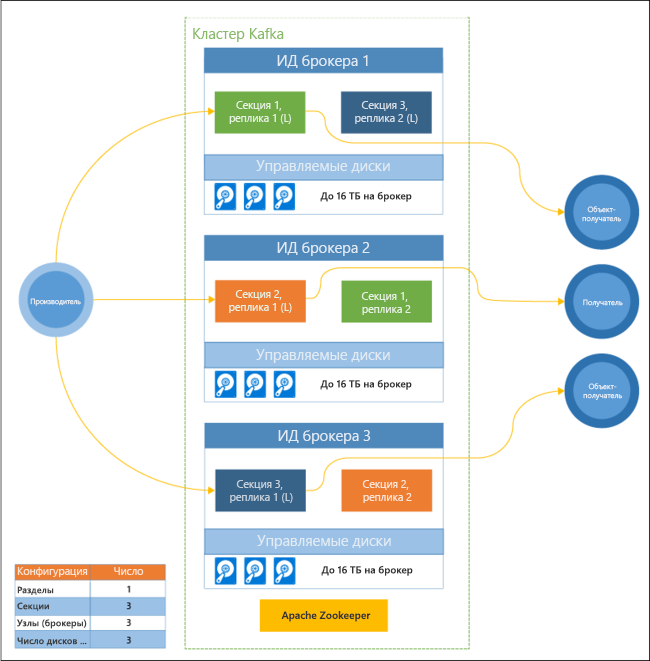

# Что такое Apache Kafka в HDInsight?

[Apache Kafka](https://kafka.apache.org) — это распределенная платформа потоковой передачи с открытым исходным кодом, которую можно использовать для создания конвейеров и приложений потоковой передачи данных в режиме реального времени. Kafka также предоставляет функцию брокера сообщений, подобную очереди сообщений, с помощью которой можно выполнять публикацию и подписываться на именованные потоки данных. 

Ниже приведены характеристики Kafka в HDInsight.

* Это управляемая служба, которая упрощает процесс настройки. Она создает конфигурацию, проверенную и поддерживаемую корпорацией Майкрософт.

* Корпорация Майкрософт предоставляет соглашение об уровне обслуживания (SLA), гарантирующее 99,9 % время непрерывной работы Kafka. Дополнительные сведения см. в документе [Соглашение об уровне обслуживания для HDInsight](https://azure.microsoft.com/support/legal/sla/hdinsight/v1_0/).

* В качестве резервного хранилища для Kafka используются управляемые диски Azure. Управляемые диски могут обеспечить до 16 ТБ хранилища для каждого брокера Kafka. См. сведения о [настройке числа управляемых дисков и повышении степени масштабируемости для Apache Kafka в HDInsight](apache-kafka-scalability.md).

    См. дополнительные сведения об [управляемых дисках Azure](../../virtual-machines/windows/managed-disks-overview.md).

* Служба Kafka была разработана для одномерной стойки. Azure разделяет стойку на два измерения — домены обновления (UD) и домены сбоя (FD). Корпорация Майкрософт предоставляет инструменты, которые могут выполнять перераспределение секций и реплик Kafka в доменах обновления и доменах сбоя. 

    Дополнительные сведения см. в статье [Обеспечение высокого уровня доступности данных с помощью Apache Kafka в HDInsight](apache-kafka-high-availability.md).

* HDInsight позволяет изменить количество рабочих узлов (в которых размещается брокер Kafka) после создания кластера. Масштабирование можно выполнить на портале Azure, в Azure PowerShell и других интерфейсах управления Azure. Для Kafka выполните повторную балансировку реплик секций после масштабирования. Балансировка секций позволяет Kafka пользоваться преимуществами нового количества рабочих узлов.

    Дополнительные сведения см. в статье [Обеспечение высокого уровня доступности данных с помощью Apache Kafka в HDInsight](apache-kafka-high-availability.md).

* Журналы Azure Monitor можно использовать для мониторинга Kafka в HDInsight. В журналах Azure Monitor представлена информация об уровне виртуальной машины (например, метрики диска и сетевой карты, а также метрики JMX от Kafka).

    Дополнительные сведения см. в статье [Анализ журналов для Apache Kafka в HDInsight](apache-kafka-log-analytics-operations-management.md).

### Архитектура Apache Kafka в HDInsight

На приведенной ниже схеме показана стандартная конфигурация Kafka, в которой предусмотрены группы потребителей, секционирование и репликация, чтобы обеспечить параллельное считывание событий и отказоустойчивость.

Apache ZooKeeper управляет состоянием кластера Kafka. Служба Zookeeper предназначена для параллельных надежных транзакций с низкой задержкой. 

В Kafka записи (данные) хранятся в **разделах**. Записи создаются **производителями**, а используются **потребителями**. Производители отправляют записи в **брокеры** Kafka. Каждый рабочий узел в кластере HDInsight — это брокер Kafka. 

Разделы позволяют распределить записи между брокерами. При считывании записей можно использовать один потребитель на секцию, чтобы обеспечить параллельную обработку данных.

Репликация используется для дублирования секций между узлами, чтобы обеспечить защиту от сбоев узлов (брокеров). Секция, обозначенная на схеме буквой *(L)*, является ведущей (leader) в определенном разделе. Трафик производителя направляется в ведущую секцию каждого узла в зависимости от состояния, которым управляет ZooKeeper.

## Для чего использовать Apache Kafka в HDInsight?

Ниже приведены распространенные задачи и шаблоны, которые могут быть выполнены с помощью Kafka в HDInsight.

* **Репликация данных Kafka.** Kafka предоставляет программу MirrorMaker, которая производит репликацию данных между кластерами Kafka.

    Сведения об использовании MirrorMaker см. в статье [Репликация разделов Apache Kafka с помощью Kafka в HDInsight и MirrorMaker](apache-kafka-mirroring.md).

* **Модель обмена сообщениями по схеме "публикация — подписка"**. Kafka предоставляет API производителя для публикации записей в разделе Kafka. При подписке на раздел используется API пользователя.

    Дополнительные сведения см. в статье [Краткое руководство по созданию Apache Kafka в кластере HDInsight](apache-kafka-get-started.md).

* **Потоковая обработка**. Kafka часто используется с Apache Storm или Spark для потоковой обработки в режиме реального времени. В Kafka 0.10.0.0 (HDInsight 3.5 и 3.6) представлен API для потоковой передачи, позволяющий создавать соответствующие решения без использования Storm или Spark.

    Дополнительные сведения см. в статье [Краткое руководство по созданию Apache Kafka в кластере HDInsight](apache-kafka-get-started.md).

* **Горизонтальное масштабирование.** В Kafka потоки разделяются между узлами в кластере HDInsight. Процессы пользователя можно связать с отдельными секциями для обеспечения балансировки нагрузки при использовании записей.

    Дополнительные сведения см. в статье [Краткое руководство по созданию Apache Kafka в кластере HDInsight](apache-kafka-get-started.md).

* **Порядок доставки.** В каждой секции записи сохраняются в потоке в том порядке, в котором они были получены. Достаточно связать один процесс пользователя с секцией — и записи будут обрабатываться в определенном порядке.

    Дополнительные сведения см. в статье [Краткое руководство по созданию Apache Kafka в кластере HDInsight](apache-kafka-get-started.md).

## Варианты использования

* **Обмен сообщениями**. Благодаря поддержке модели обмена сообщениями по схеме "публикация — подписка" Kafka часто используется как брокер сообщений.

* **Отслеживание действий**. Kafka предоставляет возможность ведения журнала записей в определенном порядке, поэтому Kafka можно использовать для отслеживания и повторного создания действий. Например, действий пользователя на веб-сайте или в приложении.

* **Агрегирование**. С помощью потоковой обработки можно объединить информацию из разных потоков для ее централизации в качестве оперативных данных.

* **Преобразование.** С помощью потоковой обработки можно объединять и дополнять данные из нескольких входных разделов в один или несколько выходных разделов.

## Дополнительная информация

Ниже приведены ссылки на статьи об использовании Apache Kafka в HDInsight.

* [Краткое руководство. Создание Apache Kafka в кластере HDInsight](apache-kafka-get-started.md)

* [Руководство. Использование Apache Spark с Apache Kafka в HDInsight](../hdinsight-apache-spark-with-kafka.md)

* [Руководство. Использование Apache Storm с Apache Kafka в HDInsight](../hdinsight-apache-storm-with-kafka.md)
