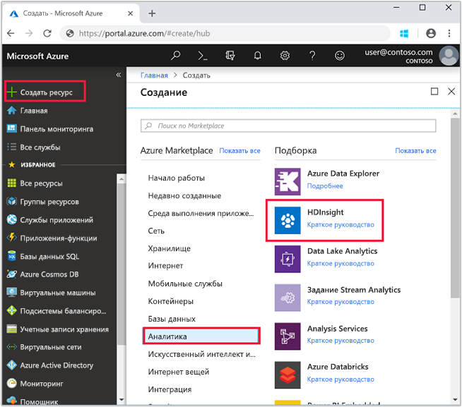
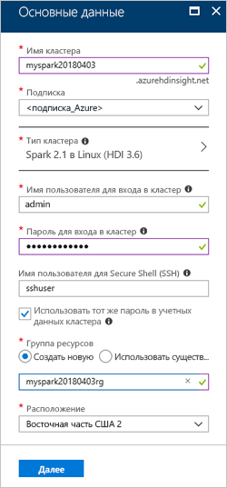
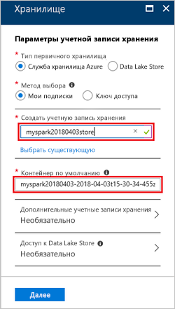

# <a name="quickstart-create-a-spark-cluster-in-hdinsight-using-the-azure-portal"></a>Краткое руководство по созданию кластера Spark в HDInsight с помощью портала Azure
Узнайте, как создать кластер Apache Spark в Azure HDInsight и как выполнять SQL-запросы Spark к таблицам Hive. Apache Spark обеспечивает быстрый анализ данных и кластерные вычисления, используя обработку в памяти. Сведения о Spark в HDInsight см. в [этой статье](apache-spark-overview.md).

В этом кратком руководстве для создания кластера Spark в HDInsight используется портал Azure. Этот кластер использует Azure Storage Blob в качестве системы хранения данных кластера.

> [!IMPORTANT]
> Счета за кластеры HDInsight выставляются пропорционально за минуту независимо от их использования. Обязательно удалите кластер, когда завершите его использование. Дополнительные сведения см. в разделе [Очистка ресурсов](#clean-up-resources) этой статьи.

Если у вас еще нет подписки Azure, [создайте бесплатную учетную запись Azure](https://azure.microsoft.com/free/), прежде чем начинать работу.

## <a name="create-an-hdinsight-spark-cluster"></a>Создание кластера HDInsight Spark

1. На портале Azure выберите **Создать ресурс** > **Данные и аналитика** > **HDInsight**. 

    
2. В разделе **Основные сведения** укажите следующие значения.
     
    |Свойство  |ОПИСАНИЕ  |
    |---------|---------|
    |**Имя кластера**     | Введите имя кластера Spark в HDInsight. В данном кратком руководстве используется кластер **myspark20180403**.|
    |**Подписка**     | Из раскрывающегося списка выберите подписку Azure, используемую для этого кластера. В данном кратком руководстве используется **&lt;подписка Azure**. |
    |**Тип кластера**| Разверните элемент, а затем выберите тип кластера **Spark** и укажите версию кластера Spark. <br/>  |
    |**Имя пользователя для входа в кластер**| Введите имя пользователя для входа в кластер.  Имя по умолчанию — *admin*. Эта учетная запись будет использована для входа в Jupyter Notebook позже в данном кратком руководстве. |
    |**Пароль для входа в кластер**| Введите пароль для входа в кластер. |
    |**Имя пользователя для Secure Shell (SSH)**| Введите имя пользователя SSH. В данном кратком руководстве используется имя пользователя SSH **sshuser**. По умолчанию эта учетная запись использует тот же пароль, что и учетная запись *для входа в кластер*. |
    |**Группа ресурсов**     | Укажите, следует ли создать новую группу ресурсов или использовать имеющуюся. Группа ресурсов — это контейнер, содержащий связанные ресурсы для решения Azure. В данном кратком руководстве используется группа ресурсов **myspark20180403rg**. |
    |**Местоположение.**     | Выберите расположение группы ресурсов. В шаблоне используется это расположение для создания кластера и его хранения по умолчанию. В данном кратком руководстве используется расположение **Восточная часть США 2**. |

    

    Щелкните **Далее**, чтобы перейти на страницу **Хранилище**.
3. На странице **Хранилище** укажите следующие значения.

    - **Выберите учетную запись хранения**: выберите **Создать**, а затем укажите имя новой учетной записи хранения. В данном кратком руководстве используется учетная запись хранения **myspark20180403store**.

    

    > [!NOTE] 
    > На приведенном снимке экрана показан параметр **Выбрать существующий**. С помощью ссылки можно выбрать параметр **Создать** или **Выбрать существующий**.

    **Контейнер по умолчанию** использует имя по умолчанию.  При необходимости его можно изменить.

    Щелкните **Далее**, чтобы перейти на страницу **Сводка**. 


3. На странице **Сводка** щелкните **Создать**. Процесс создания кластеров занимает около 20 минут. Прежде чем перейти к следующему сеансу, вы должны создать кластер.

Если при создании кластера HDInsight возникают проблемы, возможно, у вас нет необходимых разрешений. Дополнительные сведения см. в разделе [Требования к контролю доступа](../hdinsight-administer-use-portal-linux.md#create-clusters).

## <a name="create-a-jupyter-notebook"></a>Создание записной книжки Jupyter

Jupyter Notebook — это интерактивная среда Notebook, которая поддерживает различные языки программирования. Notebook позволяет работать с данными, объединять код с текстом Markdown и выполнять простые визуализации. 

1. Откройте [портал Azure](https://portal.azure.com).
2. Выберите **Кластеры HDInsight**, а затем выберите созданный кластер.

    

3. На портале щелкните **Панели мониторинга кластера**, а затем — **Записная книжка Jupyter**. При появлении запроса введите учетные данные для входа в кластер.

   

4. Щелкните **Создать** > **PySpark**, чтобы создать элемент Notebook. 

   

   Будет создана и открыта записная книжка с именем Untitled (Untitled.pynb).


## <a name="run-spark-sql-statements"></a>Выполнение инструкций SQL Spark

SQL — это наиболее распространенный и широко используемый язык для создания запросов и определения данных. Spark SQL работает как расширение Apache Spark для обработки структурированных данных с использованием знакомого синтаксиса SQL.

1. Убедитесь, что ядро готово. Ядро будет готово, когда в записной книжке появится пустой круг рядом с именем ядра. Заполненный круг означает, что ядро занято.

    

    При первом запуске записной книжки некоторые задачи ядро выполняет в фоновом режиме. Дождитесь готовности ядра. 
2. Вставьте указанный ниже код в пустую ячейку и нажмите сочетание клавиш **SHIFT + ВВОД**, чтобы выполнить код. Эта команда выводит список таблиц Hive в кластере:

    ```PySpark
    %%sql
    SHOW TABLES
    ```
    При использовании записной книжки Jupyter с кластером HDInsight Spark вы получаете предустановку `sqlContext`, которую можно применять для выполнения запросов Hive с помощью Spark SQL. `%%sql` указывает записной книжке Jupyter использовать предустановку `sqlContext` для выполнения запроса Hive. Запрос извлекает первые 10 строк из таблицы Hive (**hivesampletable**), которая по умолчанию входит в состав всех кластеров HDInsight. Для получения результатов может понадобиться около 30 секунд. Он возвращает примерно такие выходные данные: 

    

    При каждом выполнении запроса в Jupyter в заголовке окна веб-браузера будет отображаться состояние **(Занято)**, а также название записной книжки. Кроме того, рядом с надписью **PySpark** в верхнем правом углу окна будет показан закрашенный кружок.
    
2. Выполните другой запрос, чтобы вывести данные из таблицы `hivesampletable`.

    ```PySpark
    %%sql
    SELECT * FROM hivesampletable LIMIT 10
    ```
    
    Экран обновится, и отобразятся выходные данные запроса.

    

2. Для этого в меню **File** (Файл) элемента Notebook выберите **Close and Halt** (Закрыть и остановить). При завершении работы записной книжки освобождаются кластерные ресурсы.

## <a name="clean-up-resources"></a>Очистка ресурсов
HDInsight сохраняет ваши данные в службе хранилища Azure или Azure Data Lake Store, что позволяет безопасно удалить неиспользуемый кластер. Плата за кластеры HDInsight взимается, даже когда они не используются. Поскольку стоимость кластера во много раз превышает стоимость хранилища, экономически целесообразно удалять неиспользуемые кластеры. Если вы планируете сразу приступить руководству, указанному в разделе [Дальнейшие действия](#next-steps), то можете оставить кластер.

Вернитесь на портал Azure и выберите **Удалить**.


Кроме того, можно выбрать имя группы ресурсов, чтобы открыть страницу группы ресурсов, а затем щелкнуть **Удалить группу ресурсов**. Вместе с группой ресурсов вы также удалите кластер Spark в HDInsight и учетную запись хранения по умолчанию.

## <a name="next-steps"></a>Дополнительная информация 

В этом кратком руководстве вы узнали, как создать кластер Spark в HDInsight и выполнить базовый SQL-запрос Spark. Из следующего руководства вы узнаете, как с помощью кластера Spark в HDInsight выполнять интерактивные запросы, используя пример данных.

> [!div class="nextstepaction"]
>[Выполнение интерактивных запросов в кластерах Spark в HDInsight](./apache-spark-load-data-run-query.md)
