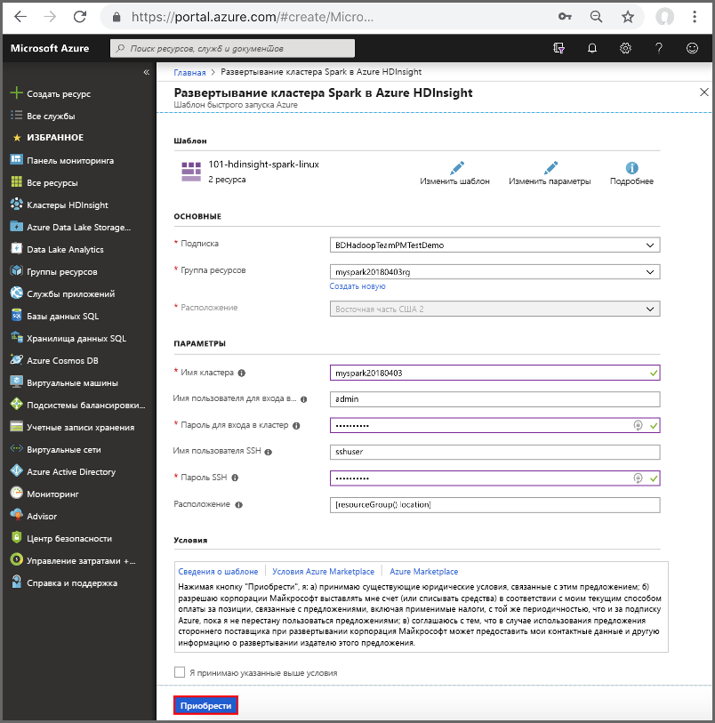
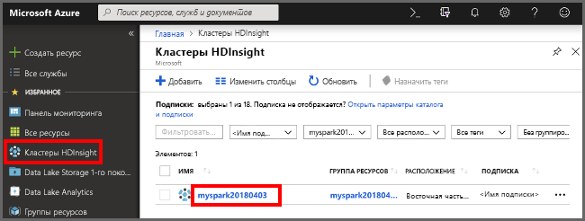

# <a name="quickstart-create-a-spark-cluster-in-hdinsight-using-template"></a>Краткое руководство по созданию кластера Spark в HDInsight с помощью шаблона

Узнайте, как создать кластер Apache Spark в Azure HDInsight и как выполнять SQL-запросы Spark к таблицам Hive. Apache Spark обеспечивает быстрый анализ данных и кластерные вычисления, используя обработку в памяти. Сведения о Spark в HDInsight см. в [этой статье](apache-spark-overview.md).

В этом кратком руководстве для создания кластера Spark в HDInsight используется шаблон Resource Manager. Этот кластер использует Azure Storage Blob в качестве системы хранения данных кластера. Дополнительные сведения об использовании Data Lake Storage Gen2 см. в статье [Краткое руководство по установке кластеров в HDInsight](../../storage/data-lake-storage/quickstart-create-connect-hdi-cluster.md).

> [!IMPORTANT]
> Счета за кластеры HDInsight выставляются пропорционально за минуту независимо от их использования. Обязательно удалите кластер, когда завершите его использование. Дополнительные сведения см. в разделе [Очистка ресурсов](#clean-up-resources) этой статьи.

Если у вас еще нет подписки Azure, [создайте бесплатную учетную запись Azure](https://azure.microsoft.com/free/), прежде чем начинать работу.

## <a name="create-an-hdinsight-spark-cluster"></a>Создание кластера HDInsight Spark

Создайте кластер Spark в HDInsight, используя шаблон Azure Resource Manager. Шаблон можно найти на сайте [GitHub](https://azure.microsoft.com/resources/templates/101-hdinsight-spark-linux/). 

1. Щелкните следующую ссылку, чтобы открыть шаблон на портале Azure на новой вкладке браузера.         

    <a href="https://portal.azure.com/#create/Microsoft.Template/uri/https%3A%2F%2Fraw.githubusercontent.com%2FAzure%2Fazure-quickstart-templates%2Fmaster%2F101-hdinsight-spark-linux%2Fazuredeploy.json" target="_blank">Развертывание в Azure</a>

2. Введите следующие значения.

    | Свойство | Значение |
    |---|---|
    |**Подписка**|Выберите подписку Azure для создания этого кластера. В данном кратком руководстве используется **&lt;подписка Azure**. |
    | **Группа ресурсов**|Создайте группу ресурсов или выберите существующую. Она используется для управления ресурсами Azure для ваших проектов. В данном кратком руководстве используется новая группа ресурсов **myspark20180403rg**.|
    | **Местоположение.**|Выберите расположение группы ресурсов. В шаблоне используется это расположение для создания кластера и его хранения по умолчанию. В данном кратком руководстве используется расположение **Восточная часть США 2**.|
    | **Имя кластера**|Введите имя создаваемого кластера HDInsight. В данном кратком руководстве используется новый кластер **myspark20180403**.|
    | **Cluster login name and password** (Имя для входа и пароль для кластера)|Имя для входа по умолчанию — admin. Выберите пароль для учетной записи входа в кластер. В данном кратком руководстве используется имя для входа **admin**.|
    | **Имя пользователя SSH и пароль**|Выберите пароль пользователя SSH. В данном кратком руководстве используется имя пользователя SSH **sshuser**.|

    

3. Установите флажки **Я принимаю указанные выше условия** и **Закрепить на панели мониторинга**, а затем нажмите кнопку **Приобрести**. Вы увидите новый элемент под названием **Развертывание для развертывания шаблона**. Процесс создания кластеров занимает около 20 минут. Прежде чем перейти к следующему сеансу, вы должны создать кластер.

Если при создании кластера HDInsight возникают проблемы, возможно, у вас нет необходимых разрешений. Дополнительные сведения см. в разделе [Требования к контролю доступа](../hdinsight-administer-use-portal-linux.md#create-clusters).

## <a name="install-intellijeclipse-for-spark-application"></a>Установка IntelliJ/Eclipse для приложения Spark
Подключаемый модуль из набора средств Azure для IntelliJ или Eclipse позволяет разрабатывать приложения Spark на языке Scala и отправлять их в кластер Azure HDInsight Spark непосредственно из интегрированной среды разработки (IDE) IntelliJ или Eclipse. Дополнительные сведения см. в статьях [Создание приложений Spark для кластера HDInsight с помощью набора средств Azure для IntelliJ](./apache-spark-intellij-tool-plugin.md) и [Создание приложений Spark для кластера HDInsight с помощью набора средств Azure для Eclipse](./apache-spark-eclipse-tool-plugin.md).

## <a name="install-vscode-for-pysparkhive-applications"></a>Установка VS Code для приложений Hive и pySpark
Сведения об использовании средств Azure HDInsight для Visual Studio Code (VS Code) для создания и отправки пакетных заданий Hive, интерактивных запросов Hive, пакета pySpark и интерактивных сценариев pySpark. Средства Azure HDInsight можно устанавливать на всех платформах, поддерживаемых VS Code. К ним относятся Windows, Linux и macOS. Дополнительные сведения см. в статье [Использование средств Azure HDInsight для Visual Studio Code](../hdinsight-for-vscode.md).

## <a name="create-a-jupyter-notebook"></a>Создание записной книжки Jupyter

Jupyter Notebook — это интерактивная среда Notebook, которая поддерживает различные языки программирования. Notebook позволяет работать с данными, объединять код с текстом Markdown и выполнять простые визуализации. 

1. Откройте [портал Azure](https://portal.azure.com).
2. Выберите **Кластеры HDInsight**, а затем выберите созданный кластер.

    

3. На портале щелкните **Панели мониторинга кластера**, а затем — **Записная книжка Jupyter**. При появлении запроса введите учетные данные для входа в кластер.

   

4. Щелкните **Создать** > **PySpark**, чтобы создать элемент Notebook. 

   

   Будет создана и открыта записная книжка с именем Untitled (Untitled.pynb).


## <a name="run-spark-sql-statements"></a>Выполнение инструкций SQL Spark

SQL — это наиболее распространенный и широко используемый язык для создания запросов и определения данных. Spark SQL работает как расширение Apache Spark для обработки структурированных данных с использованием знакомого синтаксиса SQL.

1. Убедитесь, что ядро готово. Ядро будет готово, когда в записной книжке появится пустой круг рядом с именем ядра. Заполненный круг означает, что ядро занято.

    

    При первом запуске записной книжки некоторые задачи ядро выполняет в фоновом режиме. Дождитесь готовности ядра. 
2. Вставьте указанный ниже код в пустую ячейку и нажмите сочетание клавиш **SHIFT + ВВОД**, чтобы выполнить код. Эта команда выводит список таблиц Hive в кластере:

    ```PySpark
    %%sql
    SHOW TABLES
    ```
    При использовании записной книжки Jupyter с кластером HDInsight Spark вы получаете предустановку `sqlContext`, которую можно применять для выполнения запросов Hive с помощью Spark SQL. `%%sql` указывает записной книжке Jupyter использовать предустановку `sqlContext` для выполнения запроса Hive. Запрос извлекает первые 10 строк из таблицы Hive (**hivesampletable**), которая по умолчанию входит в состав всех кластеров HDInsight. Для получения результатов может понадобиться около 30 секунд. Он возвращает примерно такие выходные данные: 

    

    При каждом выполнении запроса в Jupyter в заголовке окна веб-браузера будет отображаться состояние **(Занято)**, а также название записной книжки. Кроме того, рядом с надписью **PySpark** в верхнем правом углу окна будет показан закрашенный кружок.
    
2. Выполните другой запрос, чтобы вывести данные из таблицы `hivesampletable`.

    ```PySpark
    %%sql
    SELECT * FROM hivesampletable LIMIT 10
    ```
    
    Экран обновится, и отобразятся выходные данные запроса.

    

2. Для этого в меню **File** (Файл) элемента Notebook выберите **Close and Halt** (Закрыть и остановить). При завершении работы записной книжки освобождаются кластерные ресурсы.

## <a name="clean-up-resources"></a>Очистка ресурсов
HDInsight сохраняет ваши данные в службе хранилища Azure или Azure Data Lake Store, что позволяет безопасно удалить неиспользуемый кластер. Плата за кластеры HDInsight взимается, даже когда они не используются. Поскольку стоимость кластера во много раз превышает стоимость хранилища, экономически целесообразно удалять неиспользуемые кластеры. Если вы планируете сразу приступить руководству, указанному в разделе [Дальнейшие действия](#next-steps), то можете оставить кластер.

Вернитесь на портал Azure и выберите **Удалить**.


Кроме того, можно выбрать имя группы ресурсов, чтобы открыть страницу группы ресурсов, а затем щелкнуть **Удалить группу ресурсов**. Вместе с группой ресурсов вы также удалите кластер Spark в HDInsight и учетную запись хранения по умолчанию.

## <a name="next-steps"></a>Дальнейшие действия 

В этом кратком руководстве вы узнали, как создать кластер Spark в HDInsight и выполнить базовый SQL-запрос Spark. Из следующего руководства вы узнаете, как с помощью кластера Spark в HDInsight выполнять интерактивные запросы, используя пример данных.

> [!div class="nextstepaction"]
>[Выполнение интерактивных запросов в кластерах Spark в HDInsight](./apache-spark-load-data-run-query.md)


