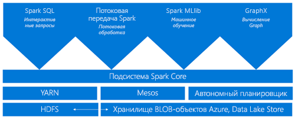
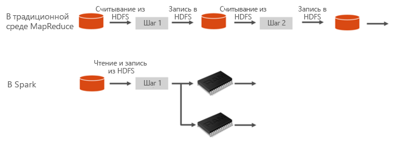
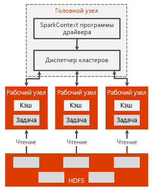

# Общие сведения о Spark в HDInsight

В этой статье предоставляются общие сведения о Spark в HDInsight. <a href="http://spark.apache.org/" target="_blank">Apache Spark</a> — это платформа параллельной обработки с открытым исходным кодом, которая поддерживает обработку в памяти, чтобы повысить производительность приложений для анализа данных большого размера. Кластер Spark в HDInsight совместим со службой хранилища Azure (WASB) и с Azure Data Lake Store. Таким образом, хранящиеся в Azure данные можно без труда обработать при помощи кластера Spark.

[!INCLUDE [hdinsight-price-change](../../../includes/hdinsight-enhancements.md)]

При создании кластера Spark в HDInsight создание вычислительных ресурсов Azure следует выполнять после установки и настройки Spark. Создание кластера Spark в HDInsight займет не более 10 минут. Данные для обработки находятся в службе хранилища Azure или Azure Data Lake Store. Дополнительные сведения см. в статье [Использование HDFS-совместимой службы хранилища с Hadoop в HDInsight](../hdinsight-hadoop-use-blob-storage.md).

## Сравнение Spark и традиционной модели MapReduce

В чем причина скорости Spark? Каковы архитектурные различия между Apache Spark и традиционной моделью MapReduce? Чем объясняется более высокая производительность Spark при совместном использовании данных?

Spark предоставляет примитивы для кластерных вычислений в памяти. Задание Spark может загрузить данные, поместить их в кэш в памяти и запрашивать их гораздо быстрее, чем дисковые системы. Spark также интегрируется в язык программирования Scala, что дает возможность управлять распределенными наборами данных, такими как локальные коллекции. Нет необходимости структурировать обмен данными как операции сопоставления и редукции.

В Spark обмен данными между операциями выполняется быстрее, поскольку данные находятся в памяти. В Hadoop обмен данными происходит через HDFS, поэтому обработка занимает больше времени.

## Apache Spark в Azure HDInsight
Кластеры Spark в HDInsight предлагают полностью управляемую службу Spark. Преимущества создания кластера Spark в HDInsight приведены здесь.

| Функция | ОПИСАНИЕ |
| --- | --- |
| Простота создания кластеров Spark |Создание кластера Spark в HDInsight с помощью портала Azure, Azure PowerShell или пакета SDK .NET HDInsight занимает всего несколько минут. См. инструкции по [началу работы с кластером Spark в HDInsight](apache-spark-jupyter-spark-sql.md). |
| Простота использования |Кластер Spark в HDInsight включает записные книжки Jupyter и Zeppelin. Их можно использовать для интерактивной обработки и визуализации данных.|
| Интерфейсы API REST |Кластеры Spark в HDInsight включают [Livy](https://github.com/cloudera/hue/tree/master/apps/spark/java#welcome-to-livy-the-rest-spark-server), сервер заданий Spark на основе API REST, который позволяет пользователям удаленно отправлять задания и отслеживать их. |
| Поддержка хранилища озера данных Azure | Кластер Spark в HDInsight можно настроить таким образом, чтобы Azure Data Lake Store использовалось как в качестве дополнительного, так и в качестве основного хранилища (только с кластерами HDInsight версии 3.5). Дополнительные сведения о Data Lake Store см. в [обзоре Azure Data Lake Store](../../data-lake-store/data-lake-store-overview.md). |
| Интеграция со службами Azure |Кластер Spark в HDInsight поставляется с соединителем для концентраторов событий Azure. Клиенты могут создавать приложения потоковой передачи с помощью концентраторов событий (в дополнение к системе [Kafka](http://kafka.apache.org/), которая уже входит в состав Spark). |
| Поддержка R Server | В кластере HDInsight Spark можно настроить R Server для выполнения распределенных вычислений в среде R со скоростью, заявленной для кластера Spark. Дополнительные сведения см. в статье [Приступая к работе с R Server в HDInsight](../r-server/r-server-get-started.md). |
| Интеграция со сторонними IDE | HDInsight предоставляет подключаемые модули для IDE, например IntelliJ IDEA и Eclipse, которые вы можете использовать для создания и отправки приложений в кластер Spark в HDInsight. Дополнительные сведения см. в статьях [Создание приложений Spark для кластера HDInsight с помощью набора средств Azure для IntelliJ](apache-spark-intellij-tool-plugin.md) и [Создание приложений Spark для кластера HDInsight с помощью набора средств Azure для Eclipse](apache-spark-eclipse-tool-plugin.md).|
| Параллельные запросы |Кластеры Spark в HDInsight поддерживают параллельные запросы. Благодаря этому несколько запросов от одного пользователя или несколько запросов от разных пользователей и из различных приложений могут использовать одни и те же ресурсы кластера. |
| Кэширование на накопители SSD |Можно выбрать кэширование данных в памяти или на накопители SSD, подключенные к узлам кластера. Кэширование в память обеспечивает наилучшую производительность, однако может оказаться ресурсоемким; кэширование на накопители SSD предоставляет возможность повысить производительность запросов без необходимости создания кластера такого размера, который необходим для размещения всего набора данных в памяти. |
| Интеграция со средствами бизнес-аналитики |В состав кластеров Spark для HDInsight входят соединители для средств бизнес-аналитики, таких как [Power BI](http://www.powerbi.com/) и [Tableau](http://www.tableau.com/products/desktop) для анализа данных. |
| Предварительно загруженные библиотеки Anaconda |Кластеры Spark в HDInsight поставляются с предустановленными библиотеками Anaconda. [Anaconda](http://docs.continuum.io/anaconda/) содержит порядка 200 библиотек для машинного обучения, анализа данных, визуализации и т. д. |
| Масштабируемость |Количество узлов указывается во время создания кластера. Тем не менее рабочая нагрузка может меняться, и тогда возникает необходимость увеличить или уменьшить размер кластера. Все кластеры HDInsight позволяют изменять количество узлов в кластере. Кроме того, кластеры Spark можно удалить без потери данных, так как все данные хранятся в службе хранилища Azure или Data Lake Store. |
| Круглосуточная и ежедневная поддержка |Для кластеров Spark в HDInsight предоставляется круглосуточная и ежедневная поддержка корпоративного уровня и соглашения об уровне обслуживания, гарантирующие время 99,9 % бесперебойной работы. |

## Архитектура кластера Spark

Архитектура кластера Spark и принцип его работы:

Главный узел Spark в головном узле управляет несколькими приложениями. Они сопоставляются с драйвером Spark. Главный узел Spark управляет каждым приложением различными способами. Можно развернуть Spark на базе диспетчера кластеров Mesos, YARN или Spark, который выделяет для приложения ресурсы рабочего узла. В HDInsight Spark выполняется с использованием диспетчера кластеров YARN. Ресурсами кластера в HDInsight управляет главный узел Spark. Это означает, что главный узел Spark имеет данные о доступности или недоступности ресурсов (например, памяти) в рабочем узле.

Драйвер выполняет основную функцию пользователя и осуществляет различные параллельные операции на рабочих узлах. Затем драйвер собирает результаты операций. Рабочие узлы считывают данные из распределенной файловой системы Hadoop (HDFS) и записывают их в нее. Кроме того, рабочие узлы помещают преобразованные данные в кэш в памяти как устойчивые распределенные наборы данных (RDD).

Как только в главном узле Spark создается приложение, главный узел выделяет для него ресурсы и создает операцию выполнения, вызываемую драйвером Spark. Драйвер Spark также создает SparkContext и начинает создание RDD. Метаданные RDD хранятся в драйвере Spark.

Драйвер Spark подключается к главному узлу Spark и отвечает за преобразование приложения в ориентированный граф (DAG) для отдельных задач, которые выполняются в рамках процесса исполнителя в рабочих узлах. Каждое приложение получает отдельные процессы исполнителя, которые остаются активными во время выполнения приложения и обрабатывают задачи в нескольких потоках.

## Каковы примеры использования Spark в HDInsight?
Ниже представлены сценарии для использования кластеров Spark в HDInsight.

### Интерактивный анализ данных и бизнес-аналитика
[Учебник](apache-spark-use-bi-tools.md)

Apache Spark в HDInsight хранит данные в службе хранилища Azure или Azure Data Lake Store. Бизнес-эксперты и лица, ответственные за принятие решений, могут анализировать и создавать отчеты на основе этих данных, а также создавать интерактивные отчеты из проанализированных данных с помощью средств Microsoft Power BI. Аналитики могут использовать неструктурированные или полуструктурированные данные в хранилище кластеров, определить схему для данных с помощью записных книжек, а затем создать модели данных с помощью средств Microsoft Power BI. Кластеры Spark в HDInsight также поддерживают ряд средств бизнес-аналитики сторонних разработчиков, такие как Tableau. Поэтому Spark является идеальной платформой для аналитиков, бизнес-экспертов и лиц, ответственных за принятие решений.

### Машинное обучение Spark
[Ознакомьтесь с руководством по прогнозированию температуры в зданиях с помощью данных системы кондиционирования](apache-spark-ipython-notebook-machine-learning.md)

[Учебник. Прогнозирование результатов контроля качества пищевых продуктов](apache-spark-machine-learning-mllib-ipython.md)

В состав Apache Spark входит [MLlib](http://spark.apache.org/mllib/), библиотека машинного обучения, созданная на основе Spark, которую вы можете использовать из кластера Spark в HDInsight. Кластер Spark в HDInsight также включает библиотеку Anaconda, распространяемую Python и содержащую различные пакеты для машинного обучения. Все это дополнено встроенной поддержкой записных книжек Jupyter и Zeppelin — в итоге вы получаете в свое распоряжение первоклассную среду для создания приложений машинного обучения.

### Потоковая передача и анализ данных в режиме реального времени в Spark
[Учебник](apache-spark-eventhub-streaming.md)

Кластеры Spark в HDInsight обладают широкой поддержкой для создания решений для аналитики в режиме реального времени. Поскольку в состав Spark уже входят соединители для приема данных из различных источников, таких как Flume, Kafka, Twitter, ZeroMQ или сокеты TCP, Spark в HDInsight позволяет реализовать первоклассную поддержку для приема данных из концентраторов событий Azure. Концентраторы событий — это наиболее часто используемые службы очередей в Azure. Встроенная поддержка концентраторов событий делает кластеры Spark в HDInsight идеальной платформой для создания конвейеров аналитики в режиме реального времени.

## Какие компоненты входят в состав кластера Spark?
Кластеры Spark в HDInsight включают следующие компоненты, доступные в кластерах по умолчанию.

* [Ядро Spark](https://spark.apache.org/docs/1.5.1/). Включает ядро Spark, Spark SQL, потоковые API-интерфейсы Spark, GraphX и MLlib.
* [Anaconda](http://docs.continuum.io/anaconda/)
* [Livy](https://github.com/cloudera/hue/tree/master/apps/spark/java#welcome-to-livy-the-rest-spark-server)
* [Записная книжка Jupyter](https://jupyter.org)
* [Записная книжка Zeppelin](http://zeppelin-project.org/)

Кроме того, кластеры Spark в HDInsight включают [драйвер ODBC](http://go.microsoft.com/fwlink/?LinkId=616229) для подключения к кластерам Spark в HDInsight из таких средств бизнес-аналитики, как Microsoft Power BI и Tableau.

## С чего начать?
Начните с создания кластера Spark в HDInsight. Дополнительные сведения см. в статье [Начало работы. Создание кластера Apache Spark в Azure HDInsight и выполнение интерактивных запросов с помощью SQL Spark](apache-spark-jupyter-spark-sql.md). 

## Дальнейшие действия
### Сценарии
* [Использование Spark со средствами бизнес-аналитики. Выполнение интерактивного анализа данных с использованием Spark в HDInsight с помощью средств бизнес-аналитики](apache-spark-use-bi-tools.md)
* [Использование Spark с машинным обучением. Использование Spark в HDInsight для анализа температуры в здании на основе данных системы кондиционирования](apache-spark-ipython-notebook-machine-learning.md)
* [Использование Spark с машинным обучением. Использование Spark в HDInsight для прогнозирования результатов контроля качества пищевых продуктов](apache-spark-machine-learning-mllib-ipython.md)
* [Потоковая передача Spark. Использование Spark в HDInsight для сборки приложений потоковой передачи данных в режиме реального времени](apache-spark-eventhub-streaming.md)
* [Анализ журнала веб-сайта с использованием Spark в HDInsight](apache-spark-custom-library-website-log-analysis.md)

### Создание и запуск приложений
* [Создание автономного приложения с использованием Scala](apache-spark-create-standalone-application.md)
* [Удаленный запуск заданий с помощью Livy в кластере Spark](apache-spark-livy-rest-interface.md)

### Средства и расширения
* [Использование подключаемого модуля средств HDInsight для IntelliJ IDEA для создания и отправки приложений Spark Scala](apache-spark-intellij-tool-plugin.md)
* [Удаленная отладка приложений Spark в кластере HDInsight Spark Linux с помощью подключаемого модуля средств HDInsight для IntelliJ IDEA](apache-spark-intellij-tool-plugin-debug-jobs-remotely.md)
* [Использование записных книжек Zeppelin с кластером Spark в HDInsight](apache-spark-zeppelin-notebook.md)
* [Ядра, доступные для записной книжки Jupyter в кластере Spark в HDInsight](apache-spark-jupyter-notebook-kernels.md)
* [Использование внешних пакетов с записными книжками Jupyter](apache-spark-jupyter-notebook-use-external-packages.md)
* [Установка записной книжки Jupyter на компьютере и ее подключение к кластеру Apache Spark в Azure HDInsight (предварительная версия)](apache-spark-jupyter-notebook-install-locally.md)

### Управление ресурсами
* [Управление ресурсами кластера Apache Spark в Azure HDInsight](apache-spark-resource-manager.md)
* [Отслеживание и отладка заданий в кластере Apache Spark в HDInsight на платформе Linux](apache-spark-job-debugging.md)
* [Известные проблемы в работе кластера Apache Spark в HDInsight](apache-spark-known-issues.md).
