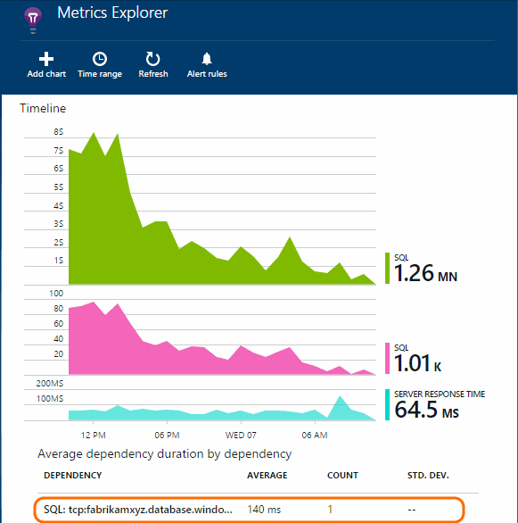

<properties 
	pageTitle="Мониторинг производительности приложений" 
	description="Диаграммы, время загрузки и ответа, сведения о зависимостях и настроить оповещения на производительность." 
	services="azure-portal"
    documentationCenter="na"
	authors="alancameronwills" 
	manager="keboyd"/>

<tags 
	ms.service="azure-portal" 
	ms.workload="na" 
	ms.tgt_pltfrm="na" 
	ms.devlang="na" 
	ms.topic="article" 
	ms.date="04/28/2015" 
	ms.author="awills"/>

# Мониторинг производительности приложений

На[Портал Azure](http://portal.azure.com)можно выполнить настройку наблюдения для сбора статистические данные и сведения о зависимостях приложения в веб-приложений или виртуальных машин.

Благодаря использованию *расширений* Azure поддерживает мониторинг производительности приложений.*APM*\), используя*расширения.*. Эти расширения устанавливаются в приложение. Они позволяют собирать данные и отправлять отчеты в службы мониторинга.

## Добавление расширения

1. Щелкните **Обзор** и выберите веб-приложение или виртуальную машину для инструментирования.

2. Щелкните ссылку.**Мониторинг приложений**плитки в группе**Мониторинг**.

3. Выберите поставщик расширений, которую вы хотите использовать, такие как**Application Insights**или**New Relic**.

Или, если вы используете виртуальной машины:

## Обзор кода

Используйте приложение для создания некоторых телеметрии некоторое время.

1. Затем в веб-приложении или в колонке виртуальной машины отобразится установленное расширение.
2. Щелкните строку, которая представляет приложение, чтобы перейти к этому поставщику.

Можно также использовать**Обзор**Чтобы перейти прямо к Application Insights компонента или New Relic учетной записью, которая использовалась.

После получения для Application Insights в выноске, например, вы можете:-Откройте производительности:

- Детализация для просмотра отдельных запросов:

- Ниже приведен пример, показывающий количество времени, затраченное в зависимости SQL, включая число вызовов SQL и связанную статистику, например Средняя продолжительность и стандартное отклонение. 

 

### Дополнительные требования к приложениям определенных типов

New Relic автоматически устанавливается без дополнительных средств, но Application Insights имеет одно дополнительное требование.

В ответ на запрос для входа в систему, используются учетные данные учетной записи Azure.

## Дальнейшие действия

* [Мониторинг показателей работоспособности службы](insights-how-to-customize-monitoring.md)Проверка того, что веб-служба доступна и отвечает на запросы.
* [Включение наблюдения и диагностики](insights-how-to-use-diagnostics.md)Чтобы собирать подробные показатели высокой частотой в службе.
* [Получение уведомлений об оповещениях](insights-receive-alert-notifications.md)Каждый раз, когда происходят события или метрики cross пороговое значение.
* Использовать[Application Insights приложений JavaScript и веб-страниц](app-insights-web-track-usage.md)Для получения аналитики клиента о браузеров, посетите веб-страницу.
* [Наблюдение за доступностью и скоростью реагирования веб-сайта](app-insights-monitor-web-app-availability.md)с помощью Application Insights, можно выяснить, если страница не работает.
