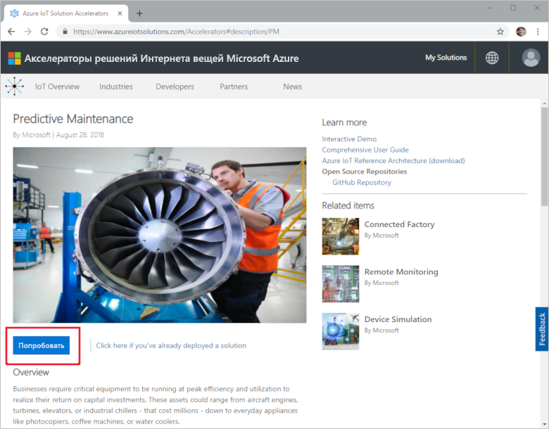
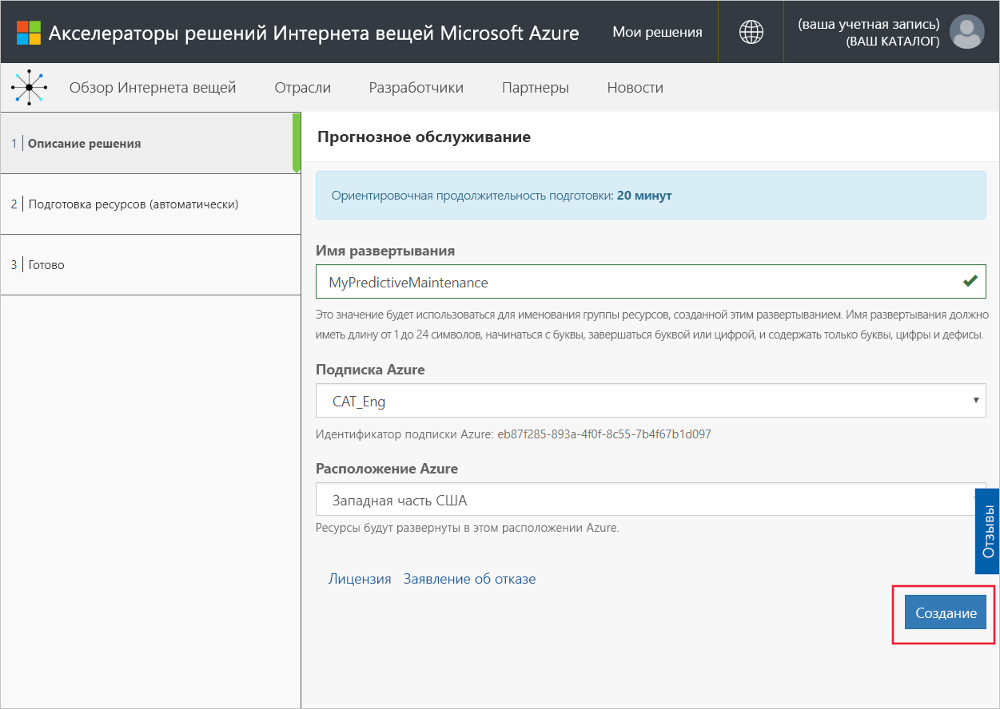
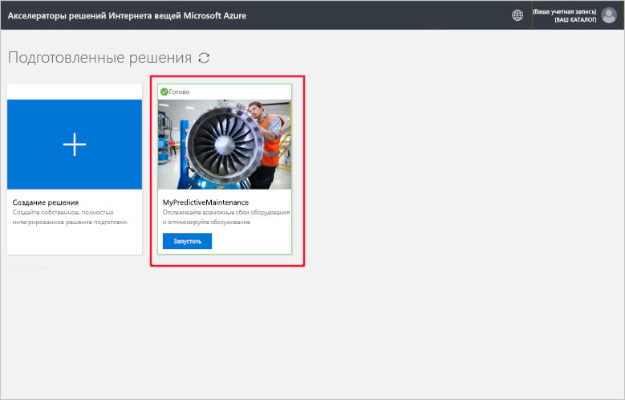
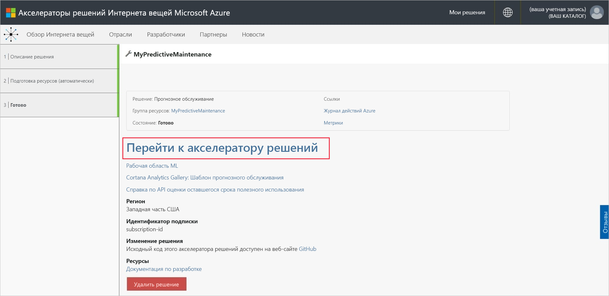
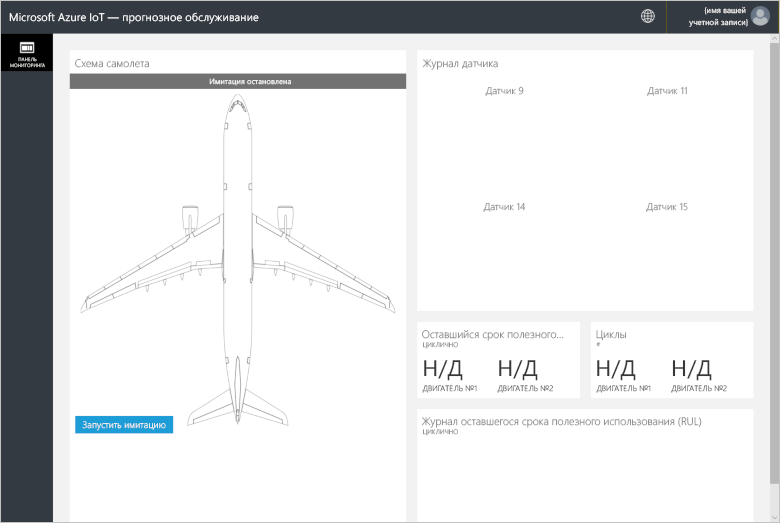
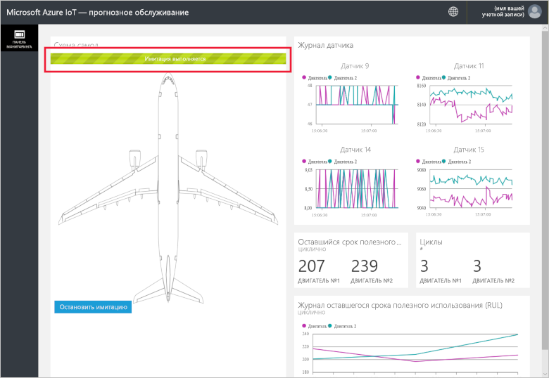
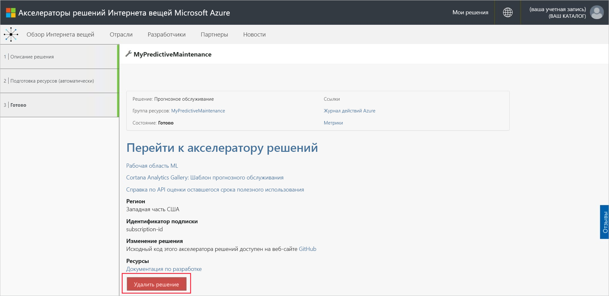

# Краткое руководство. Использование облачных решений для анализа прогнозного обслуживания на подключенных устройствах

В этом кратком руководстве показано, как развернуть акселератор решения для прогнозного обслуживания Интернета вещей в Azure для запуска имитации облачного решения прогнозного обслуживания. После развертывания акселератора решения используйте страницу решения **Панель мониторинга**, чтобы выполнить анализ прогнозного обслуживания, используя данные имитации самолетного двигателя. Это решение можно использовать в качестве отправной точки для собственной реализации или как средство обучения.

В рамках этой имитации компания Fabrikam является региональной авиалинией, задача которой — хорошее впечатление клиентов и приемлемые цены. Одной из причин задержки рейсов являются проблемы обслуживания, в частности, особенно сложной задачей является обслуживание двигателей самолетов. Компания Fabrikam должна избегать сбоя двигателя во время полета любой ценой, поэтому она регулярно выполняет проверку двигателей и придерживается программы запланированного обслуживания. Однако износ двигателей самолетов не всегда одинаков. В некоторых случаях выполняется ненужное обслуживание двигателей. Что более важно, возникают проблемы, которые могут задержать самолет на земле до проведения обслуживания. Это приводит к дорогостоящим задержкам, особенно если самолет находится там, где недоступны нужные специалисты или запасные части.

Самолеты компании Fabrikam снабжены датчиками, которые отслеживают состояние двигателей во время полета. С этих датчиков Fabrikam годами собирает данные о функционировании и сбоях двигателей. С помощью этих сведений специалисты Fabrikam по анализу и обработке данных разработали модель, которая прогнозирует остаточный срок эксплуатации (RUL — Remaining Useful Life) двигателя самолета. В модели используется корреляция между данными четырех датчиков двигателя и износом двигателя (что в конечном счете и приводит к сбою). Компания Fabrikam продолжает проводить регулярные проверки безопасности, но теперь она может использовать модели для вычисления RUL каждого двигателя после каждого рейса. Fabrikam теперь может прогнозировать будущие точки сбоя и планировать обслуживание, что минимизирует время нахождения самолета на земле. Этот процесс не только снижает эксплуатационные расходы, но и обеспечивает безопасность пассажиров и экипажа.

Для работы с этим кратким руководством вам потребуется действующая подписка Azure.

Если у вас еще нет подписки Azure, [создайте бесплатную учетную запись Azure](https://azure.microsoft.com/free/?WT.mc_id=A261C142F), прежде чем начинать работу.

## Развертывание решения

Когда вы будете развертывать акселератор решения в подписке Azure, необходимо указать некоторые параметры конфигурации.

Перейдите к [акселераторам решений Microsoft Azure IoT](https://www.azureiotsolutions.com) и войдите с помощью своей учетной записи Azure.

Щелкните плитку **Predictive Maintenance** (Прогнозное обслуживание). На странице **Predictive Maintenance** (Прогнозное обслуживание) щелкните **Try Now** (Попробовать сейчас).

На странице **Create Predictive Maintenance solution** (Создание решения прогнозного обслуживания) введите уникальное **имя решения** для акселератора решения прогнозного обслуживания. В этом кратком руководстве используется **MyPredictiveMaintenance**.

Выберите **подписку** и **регион**, которые необходимо использовать для развертывания акселератора решений. Вы можете выбрать ближайший к вам регион. В этом кратком руководстве используется **Visual Studio Enterprise** и **Восточная часть США**. Вы должны быть [глобальным администратором или пользователем](iot-accelerators-permissions.md) в подписке.

Щелкните **Создать**, чтобы начать развертывание. Этот процесс занимает по крайней мере пять минут:

## Вход в решение

После развертывания в подписке Azure появится зеленая галочка и надпись **Готово** на плитке решения. Теперь вы можете войти на панель мониторинга акселератора решения для прогнозного обслуживания.

На странице **Подготовленные решения** выберите новый акселератор решения для прогнозного обслуживания.

 Вы можете просмотреть сведения об акселераторе решения на отобразившейся странице. Чтобы просмотреть акселератор решения для прогнозного обслуживания, выберите **Go to your solution accelerator** (Перейти к акселератору решений).

Щелкните **Accept** (Принять), чтобы принять запрос на разрешения, и в браузере отобразится панель мониторинга решения для прогнозного обслуживания:

Щелкните **Запустить имитацию**, чтобы начать моделирование. На панели мониторинга отобразится журнал датчика, оставшийся срок полезного использования, циклы и журнал оставшегося срока полезного использования.

Когда значение оставшегося срока полезного использования станет меньше 160 (произвольное пороговое значение, выбранное для демонстрационных целей), на портале решения рядом с этим значением появится символ предупреждения. Кроме того, цвет двигателя на портале решения изменится на желтый. Как можно заметить, значения оставшегося срока полезного использования имеют общую тенденцию к уменьшению, но при этом наблюдаются скачки вверх и вниз. Это происходит из-за различной продолжительности циклов и точности модели.

Полное моделирование, которое включает 148 циклов, занимает около 35 минут. Пороговое значение остаточного срока эксплуатации, равное 160, достигается примерно через 5 минут, а порог для обоих двигателей достигается примерно через 8 минут.

В процессе моделирования обрабатывается весь набор данных со 148 циклами. В результате можно получить окончательные значения остаточного срока эксплуатации и количества выполненных циклов.

Моделирование можно остановить в любой момент, но, если нажать кнопку **Запустить моделирование** , процесс перезапустится с самого начала.

## Очистка ресурсов

Если вы планируете продолжить изучение, не удаляйте развернутый акселератор решения для прогнозного обслуживания.

Если акселератор решений больше не нужен, удалите его на странице [Подготовленные решения](https://www.azureiotsolutions.com/Accelerators#dashboard). Для этого выберите его, а затем щелкните **Удалить решение**:

## Дополнительная информация

В этом кратком руководстве вы развернули акселератор решения для прогнозного обслуживания и запустили имитацию.

Дополнительные сведения об акселераторе решения и имитации самолетных двигателей см. в следующей статье.

> [!div class="nextstepaction"]
> [Общие сведения об акселераторе решений для диагностического обслуживания](iot-accelerators-predictive-walkthrough.md)
