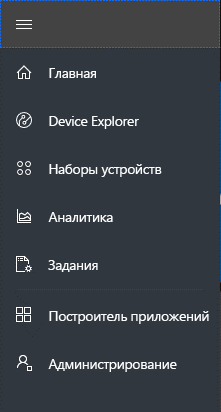
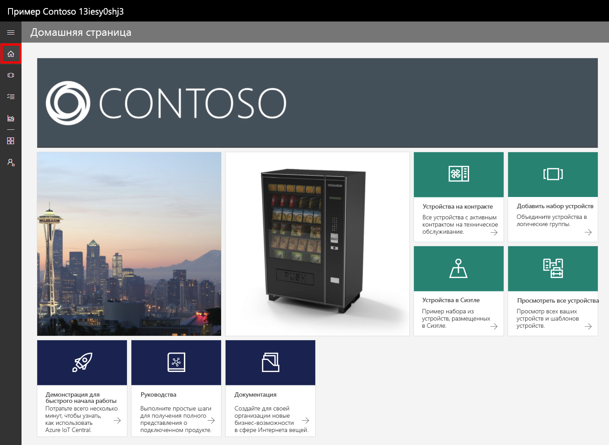
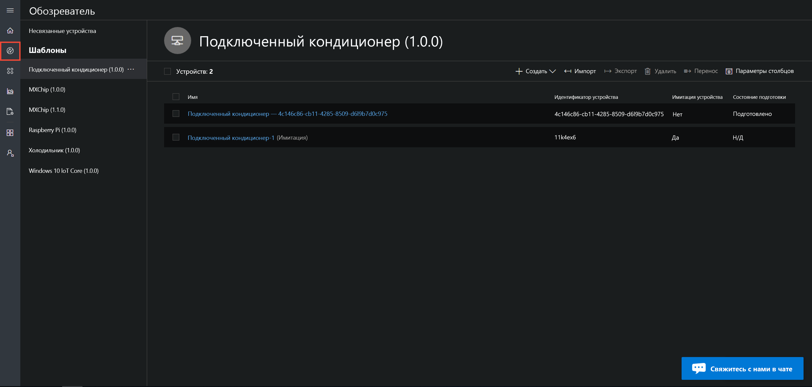
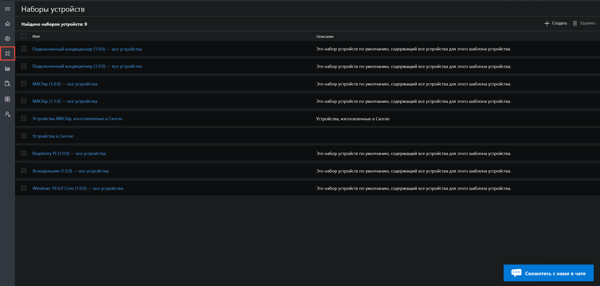
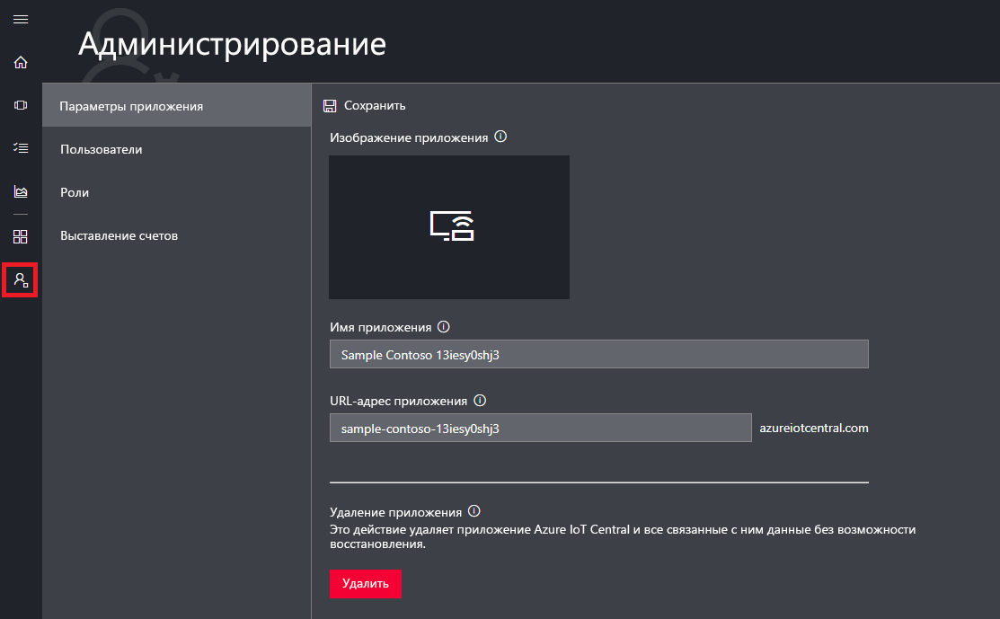

# Общие сведения о пользовательском интерфейсе Azure IoT Central

В этой статье содержатся сведения о пользовательском интерфейсе Microsoft Azure IoT Central. С помощью пользовательского интерфейса можно создавать и использовать решение Azure IoT Central и их подключенные устройства, а также управлять ими.

С помощью пользовательского интерфейса Azure IoT Central _сборщики_  могут определить свое решение Azure IoT Central. Этот интерфейс позволяет выполнять следующие задачи:

- определение типов устройств, подключающихся к решению.
- настройка правил и действий устройств;
- настройка пользовательского интерфейса для _операторов_, использующих решение.

С помощью пользовательского интерфейса Azure IoT Central _оператор_ может управлять решением Azure IoT Central. Этот интерфейс позволяет выполнять следующие задачи:

- мониторинг устройств;
- настройка устройств;
- устранение проблем и неполадок с устройствами;
- подготавливать новые устройства;

## Использование меню навигации слева

Меню навигации слева позволяет получать доступ к различным разделам приложения.

| Меню | ОПИСАНИЕ |
| ---- | ----------- |
|  | <ul><li>При нажатии кнопки **Домашняя страница** откроется главная страница приложения. Как сборщик вы можете настроить домашнюю страницу для операторов.</li><li>При нажатии кнопки **Device Explorer** откроется список шаблонов устройств, заданных в приложении, а также смоделированных и реальных устройств, связанных с каждым шаблоном. Средство **Device Explorer** позволяет операторам управлять подключенными устройствами.</li><li>Кнопка **Device Sets** (Наборы устройств) позволяет просматривать и создавать наборы устройств. Оператор может создать наборы устройств в качестве логической коллекции устройств, указанных в запросе.</li><li>При нажатии кнопки **Аналитика** отобразятся аналитические сведения, полученные из данных телеметрии устройств и их наборов. Как оператор вы можете создавать настраиваемые представления на основе данных устройства для получения аналитических сведений из приложения.</li><li>При нажатии кнопки **Application Builder** (Конструктор приложений) отображаются инструменты, используемые конструктором, такие как **Create Device Template** (Создание шаблона устройства).</li><li>При нажатии кнопки **Администрирование** открываются страницы администрирования приложений, на которых администраторы могут полностью управлять параметрами, пользователями и ролями приложения.</li></ul> |

## Поиск, справка и поддержка

На каждой странице сверху отображается меню.

- Чтобы найти устройства и шаблоны устройств, щелкните значок **Поиск**.
- Чтобы получить справку и поддержку, выберите раскрывающийся список **Справка** с перечнем ресурсов.
- Чтобы управлять руководствами, менять темы пользовательского интерфейса или выйти из приложения, щелкните значок **Учетная запись**.

Вы можете выбирать между светлой или темной темой пользовательского интерфейса.

## главная страница

Главная страница — это первая страница, отображаемая при входе в приложение Azure IoT Central. Как сборщик вы можете настроить ее для других пользователей приложения путем добавления плиток. Дополнительные сведения см. в руководстве [Customize the Azure IoT Central operator's view](tutorial-customize-operator.md) (Настройка представления оператора Azure IoT Central).

## Обозреватель устройств

На странице обозревателя отображаются _устройства_ и _шаблоны устройств_ в приложении Azure IoT Central.

* Шаблон определяет тип устройства, которое можно подключить к приложению. Дополнительные сведения см. в статье [Define a new device type in your Azure IoT Central application](tutorial-define-device-type.md) (Определение типа нового устройства в приложении Azure IoT Central).
* В устройстве могут использоваться два типа приложений: реальные и смоделированные. Дополнительные сведения см. в статье [Add a real device to your Azure IoT Central application](tutorial-add-device.md) (Добавление нового устройства в приложение Azure IoT Central).

## Наборы устройств

На странице _Device Sets_ (Наборы устройств) отображаются наборы, созданные сборщиком. Набор устройств — это коллекция связанных устройств. Сборщик определяет запрос для идентификации устройств, входящих в набор. Наборы устройств используются при настройке аналитики в приложении. Дополнительные сведения см. в статье [Use device sets in your Azure IoT Central application](howto-use-device-sets.md) (Использование наборов устройств в приложении Azure IoT Central).

## Analytics

На странице аналитики отображаются диаграммы, с помощью которых можно определить поведение устройств, подключенных к приложению. На ней оператор может отслеживать и анализировать проблемы с подключенными устройствами. Сборщик может определять диаграммы, отображаемые на этой странице. Дополнительные сведения см. в статье [How to use analytics to analyze your device data](howto-create-analytics.md) (Анализ данных устройства с помощью аналитики).

## Конструктор приложений

Страница конструктора приложений содержит ссылки на инструменты, используемые при создании приложения Azure IoT Central, например создание шаблонов устройств и настройка главной страницы. Дополнительные сведения см. в статье [Define a new device type in your Azure IoT Central application](tutorial-define-device-type.md) (Определение типа нового устройства в приложении Azure IoT Central).

## Администрирование

Страница администрирования содержит ссылки на инструменты, используемые администратором, такие как определение пользователей и ролей в приложении. Дополнительные сведения см. в статье [How to administer your application](howto-administer.md) (Как управлять приложением).

## Дополнительная информация

Теперь, когда вы ознакомились с общими сведениями об Azure IoT Central и макетом пользовательского интерфейса, рекомендуем приступить к изучению краткого руководства [Create an Azure IoT Central application](quick-deploy-iot-central.md) (Создание приложения Azure IoT Central).