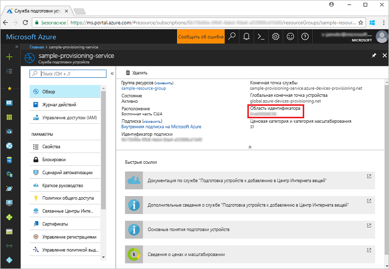

# <a name="create-and-provision-a-simulated-tpm-device-using-c-device-sdk-for-iot-hub-device-provisioning-service"></a>Создание и подготовка имитированного устройства доверенного платформенного модуля с помощью пакета SDK службы устройства C# для службы подготовки устройств Центра Интернета вещей

[!INCLUDE [iot-dps-selector-quick-create-simulated-device-tpm](../../includes/iot-dps-selector-quick-create-simulated-device-tpm.md)]

В этом руководстве показано, как создать пример имитированного устройства TPM с помощью пакета SDK службы устройства C# для Центра Интернета вещей на компьютере разработки под управлением ОС Windows и как подключить имитированное устройство к службе подготовки устройств и Центру Интернета вещей. В примере кода в качестве [аппаратного модуля безопасности](https://azure.microsoft.com/blog/azure-iot-supports-new-security-hardware-to-strengthen-iot-security/) устройства используется симулятор доверенного платформенного модуля (TPM) Windows. 

Прежде чем продолжить, выполните инструкции по [настройке службы подготовки устройств Центра Интернета вещей на портале Azure](./quick-setup-auto-provision.md).

<a id="setupdevbox"></a>
## <a name="prepare-the-development-environment"></a>Подготовка среды разработки 

1. Установите на компьютере [пакет SDK для .Net Core](https://www.microsoft.com/net/download/windows). 

1. Установите на компьютер систему `git` и добавьте ее в переменные среды, доступные в командном окне. Последнюю версию средств `git` для установки, которая включает **Git Bash**, приложение командной строки для взаимодействия с локальным репозиторием Git, можно найти на [этой странице](https://git-scm.com/download/). 

4. Откройте окно командной строки или Git Bash. Клонируйте репозиторий GitHub с пакетом SDK для C# для Центра Интернета вещей Azure:
    
    ```cmd
    git clone --recursive https://github.com/Azure/azure-iot-sdk-csharp.git
    ```

## <a name="provision-the-simulated-device"></a>Подготовка имитированного устройства


1. Войдите на портал Azure. Нажмите кнопку **All resources** (Все ресурсы) в меню слева и откройте службу подготовки устройств. В колонке **Обзор** запишите значение параметра **_Область идентификатора_**.

     


2. В окне командной строки замените каталоги на каталог проекта в примере подготовки устройства TPM.

    ```cmd
    cd .\azure-iot-sdk-csharp\provisioning\device\samples\ProvisioningDeviceClientTpm
    ```

2. Введите следующую команду, чтобы создать и запустить пример подготавливаемого устройства TPM. Замените значение `<IDScope>` значением области идентификатора для службы подготовки. 

    ```cmd
    dotnet run <IDScope>
    ```

1. В командном окне отображается **_ключ подтверждения_**, **_идентификатор регистрации_** и предполагаемый **_идентификатор устройства_**, необходимые для регистрации устройства. Запишите эти значения. 
   > [!NOTE]
   > Не путайте окно, содержащее выходные данные команды, с окном, которое содержит выходные данные из симулятора TPM. Возможно, потребуется щелкнуть командное окно, чтобы перевести его на передний план.

     


4. На портале Azure в колонке сводки для службы подготовки устройств выберите **Управление регистрациями**. Выберите вкладку **Индивидуальные регистрации** и нажмите кнопку **Добавить** сверху. 

5. В разделе **Добавление элемента списка регистрации** введите следующее:
    - Выберите **доверенный платформенный модуль (TPM)** как *механизм* аттестации удостоверения.
    - Введите *идентификатор регистрации* и *ключ подтверждения* для вашего устройства с модулем TPM. 
    - При необходимости выберите Центр Интернета вещей, связанный с вашей службой подготовки.
    - Укажите уникальный идентификатор устройства. Можете ввести идентификатор устройства, предложенный в выходных данных примера, или указать собственный. Если вводите свой идентификатор, убедитесь, что при назначении имени устройства не используются конфиденциальные данные. 
    - Обновите **начальное состояние двойника устройства**, используя требуемую начальную конфигурацию для устройства.
    - Затем нажмите кнопку **Сохранить**. 

      

   После успешной регистрации *идентификатор регистрации* устройства отобразится в списке под вкладкой *Отдельные регистрации*. 

6. Нажмите клавишу ВВОД в командном окне (где отображается **_ключ подтверждения_**, **_идентификатор регистрации_** и предполагаемый **_идентификатор устройства_**), чтобы зарегистрировать имитированное устройство. Обратите внимание на сообщения, которые имитируют загрузку устройства и его подключение к службе подготовки устройств для получения информации Центра Интернета вещей. 

1. Убедитесь, что устройство подготовлено. После успешной подготовки имитированного устройства для Центра Интернета вещей, подключенного к службе подготовки, идентификатор устройства отобразится в колонке **устройств Центра Интернета вещей**. 

     

    Если в записи регистрации для своего устройства вы изменили значение по умолчанию для *начального состояния двойника устройства*, требуемое состояние двойника будет извлечено из концентратора с последующим выполнением соответствующих действий. См. [общие сведения о двойниках устройств и их использовании в Центре Интернета вещей](../iot-hub/iot-hub-devguide-device-twins.md).


## <a name="clean-up-resources"></a>Очистка ресурсов

Если вы планируете продолжить работу с примером клиентского устройства, не удаляйте ресурсы, созданные в ходе работы с этим руководством. Если вы не планируете продолжать работу, следуйте инструкциям ниже, чтобы удалить все созданные ресурсы.

1. Закройте окно выходных данных примера клиентского устройства на компьютере.
1. Закройте окно симулятора доверенного платформенного модуля на компьютере.
1. В меню слева на портале Azure щелкните **Все ресурсы** и откройте службу подготовки устройств. В верхней части колонки **Все ресурсы** щелкните **Удалить**.  
1. В меню слева на портале Azure нажмите кнопку **Все ресурсы** и выберите свой Центр Интернета вещей. В верхней части колонки **Все ресурсы** щелкните **Удалить**.  

## <a name="next-steps"></a>Дополнительная информация

Вы создали имитированное устройство доверенного платформенного модуля на компьютере и подготовили его для Центра Интернета вещей с помощью службы подготовки устройств Центра Интернета вещей. Чтобы узнать, как программными средствами зарегистрировать устройство TPM, изучите краткое руководство по программной регистрации устройств TPM. 

> [!div class="nextstepaction"]
> [Краткое руководство по Azure. Регистрация устройств доверенного платформенного модуля в службе подготовки устройств Центра Интернета вещей](quick-enroll-device-tpm-csharp.md)
