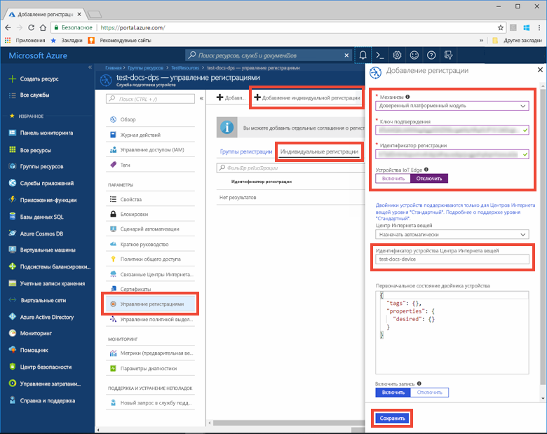
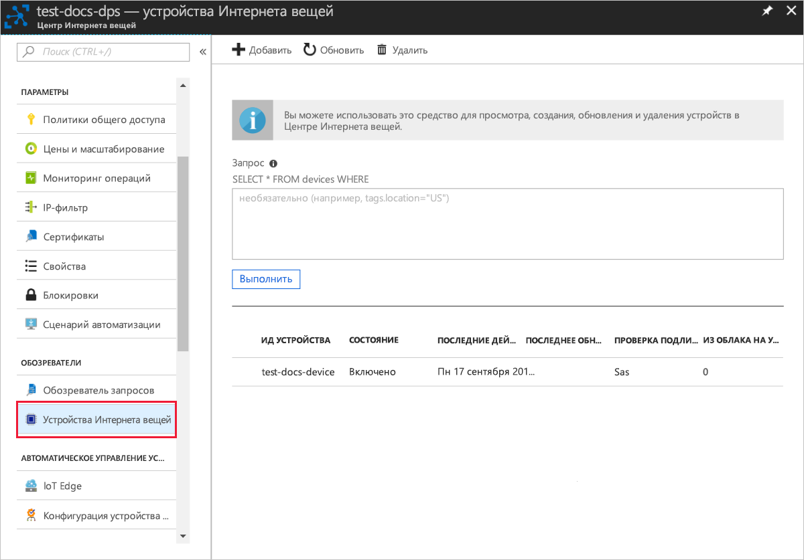

# <a name="create-and-provision-a-simulated-tpm-device-using-nodejs-device-sdk-for-iot-hub-device-provisioning-service"></a>Создание и подготовка имитированного устройства TPM с помощью пакета SDK устройств для Node.js для службы "Подготовка устройств к добавлению в Центр Интернета вещей"

[!INCLUDE [iot-dps-selector-quick-create-simulated-device-tpm](../../includes/iot-dps-selector-quick-create-simulated-device-tpm.md)]

В этом руководстве показано, как создать виртуальное устройство на компьютере разработки под управлением ОС Windows, запустить симулятор доверенного платформенного модуля Windows в качестве [аппаратного модуля безопасности](https://azure.microsoft.com/blog/azure-iot-supports-new-security-hardware-to-strengthen-iot-security/) устройства, а также как с помощью примера кода подключить виртуальное устройство к службе подготовки устройств и Центру Интернета вещей. 

Прежде чем продолжить, выполните инструкции по [настройке службы подготовки устройств Центра Интернета вещей на портале Azure](./quick-setup-auto-provision.md).

[!INCLUDE [IoT DPS basic](../../includes/iot-dps-basic.md)]

## <a name="prepare-the-environment"></a>Подготовка среды 

1. Убедитесь, что на вашем компьютере установлена платформа [Node.js 4.0 или более поздней версии](https://nodejs.org).

1. Установите на компьютер систему `git` и добавьте ее в переменные среды, доступные в командном окне. Последнюю версию средств `git` для установки, которая включает **Git Bash**, приложение командной строки для взаимодействия с локальным репозиторием Git, можно найти на [этой странице](https://git-scm.com/download/). 


## <a name="simulate-a-tpm-device"></a>Имитация устройства TPM

1. Откройте окно командной строки или Git Bash. Клонируйте репозиторий GitHub `azure-utpm-c`:
    
    ```cmd/sh
    git clone https://github.com/Azure/azure-utpm-c.git
    ```

1. Перейдите к корневой папке GitHub и запустите симулятор [доверенного платформенного модуля](https://docs.microsoft.com/windows/device-security/tpm/trusted-platform-module-overview) (TPM). Он ожидает передачи данных через сокет на портах 2321 и 2322. Не закрывайте командное окно. Симулятор должен работать, пока вы не выполните все инструкции из этого руководства: 

    ```cmd/sh
    .\azure-utpm-c\tools\tpm_simulator\Simulator.exe
    ```

1. Создайте пустую папку с именем **registerdevice**. В папке **registerdevice** создайте файл package.json, используя следующую команду в командной строке. Ответьте на все вопросы, заданные `npm`, или примите значения по умолчанию, если они вам подходят:
   
    ```cmd/sh
    npm init
    ```

1. Установите следующие основные пакеты:

    ```cmd/sh
    npm install node-gyp -g
    npm install ffi -g
    ```

    > [!NOTE]
    > При установке указанных выше пакетов могут возникнуть некоторые известные проблемы. Чтобы устранить их, выполните команду `npm install --global --production windows-build-tools` с помощью командной строки в режиме **Запуск от имени администратора**, а затем выполните `SET VCTargetsPath=C:\Program Files (x86)\MSBuild\Microsoft.Cpp\v4.0\V140`, заменив путь на путь к текущей установленной версии, и повторно выполните указанные выше команды установки.
    >

1. Установите следующие пакеты, содержащие компоненты, которые используются во время регистрации:

    - клиент безопасности, который работает с доверенным платформенным модулем: `azure-iot-security-tpm`;
    - транспортный протокол для подключения устройства к службе подготовки устройств: `azure-iot-provisioning-device-http` или `azure-iot-provisioning-device-amqp`;
    - клиент, использующий транспортный протокол и клиент безопасности: `azure-iot-provisioning-device`.

    После регистрации устройства для подключения можно использовать обычные клиенсткие пакеты устройства Центра Интернета вещей, указав учетные данные, предоставленные во время регистрации. Вам потребуется:

    - клиент устройства: `azure-iot-device`;
    - транспортный протокол: любой из `azure-iot-device-amqp`, `azure-iot-device-mqtt` или `azure-iot-device-http`;
    - установленный клиент безопасности: `azure-iot-security-tpm`.

    > [!NOTE]
    > В примерах ниже используются транспортные протоколы `azure-iot-provisioning-device-http` и `azure-iot-device-mqtt`.
    > 

    Все эти пакеты можно установить одновременно, выполнив следующую команду в командной строке в папке **registereddevice**:

        ```cmd/sh
        npm install --save azure-iot-device azure-iot-device-mqtt azure-iot-security-tpm azure-iot-provisioning-device-http azure-iot-provisioning-device
        ```

1. В текстовом редакторе создайте файл **ExtractDevice.js** в папке **registerdevice**.

1. Добавьте следующие инструкции `require` в начало файла **ExtractDevice.js**:
   
    ```
    'use strict';

    var tpmSecurity = require('azure-iot-security-tpm');
    var tssJs = require("tss.js");

    var myTpm = new tpmSecurity.TpmSecurityClient(undefined, new tssJs.Tpm(true));
    ```

1. Добавьте следующую функцию, чтобы реализовать метод:
   
    ```
    myTpm.getEndorsementKey(function(err, endorsementKey) {
      if (err) {
        console.log('The error returned from get key is: ' + err);
      } else {
        console.log('the endorsement key is: ' + endorsementKey.toString('base64'));
        myTpm.getRegistrationId((getRegistrationIdError, registrationId) => {
          if (getRegistrationIdError) {
            console.log('The error returned from get registration id is: ' + getRegistrationIdError);
          } else {
            console.log('The Registration Id is: ' + registrationId);
            process.exit();
          }
        });
      }
    });
    ```

1. Сохраните файл **ExtractDevice.js** и закройте его. Запустите пример:

    ```cmd/sh
    node ExtractDevice.js
    ```

1. Окно выходных данных отображает **_ключ подтверждения_** и **_идентификатор регистрации_**, необходимые для регистрации устройства. Запишите эти значения. 


## <a name="create-a-device-entry"></a>Создание записи устройства

1. Войдите на портал Azure, нажмите кнопку **Все ресурсы** в меню слева и откройте службу подготовки устройств.

1. В колонке сводки службы подготовки устройств выберите **Управление регистрациями**. На вкладке **Отдельные регистрации** и нажмите кнопку **Добавить** сверху. 

1. В разделе **Добавление записи в список регистрации**, введите следующее:
    - Выберите **доверенный платформенный модуль (TPM)** как *механизм* аттестации удостоверения.
    - Введите *идентификатор регистрации* и *ключ подтверждения* для вашего устройства с модулем TPM.
    - При необходимости можно указать следующие сведения:
        - Выберите Центр Интернета вещей, связанный с вашей службой подготовки.
        - Укажите уникальный идентификатор устройства. Убедитесь, что при назначении имен устройства не используются конфиденциальные данные.
        - Обновите **начальное состояние двойника устройства**, используя требуемую начальную конфигурацию для устройства.
    - Затем нажмите кнопку **Сохранить**. 

      

   После успешной регистрации *идентификатор регистрации* устройства отобразится в списке под вкладкой *Индивидуальные регистрации*. 


## <a name="register-the-device"></a>Регистрация устройства

1. На портале Azure выберите колонку **Обзор** службы подготовки устройств и запишите значения для **_глобальной конечной точки устройства_** и **_области идентификатора_**.

     

1. В текстовом редакторе создайте файл **RegisterDevice.js** в папке **registerdevice**.

1. Добавьте следующие инструкции `require` в начало файла **RegisterDevice.js**:
   
    ```
    'use strict';

    var ProvisioningTransport = require('azure-iot-provisioning-device-http').Http;
    var iotHubTransport = require('azure-iot-device-mqtt').Mqtt;
    var Client = require('azure-iot-device').Client;
    var Message = require('azure-iot-device').Message;
    var tpmSecurity = require('azure-iot-security-tpm');
    var ProvisioningDeviceClient = require('azure-iot-provisioning-device').ProvisioningDeviceClient;
    ```

    > [!NOTE]
    > **Пакет SDK Центра Интернета вещей Azure для Node.js** поддерживает дополнительные протоколы, такие как _AMQP_, _AMQP WS_ и _MQTT WS_.  Дополнительные примеры на Node.js см. в разделе [для пакета SDK службы подготовки устройств](https://github.com/Azure/azure-iot-sdk-node/tree/master/provisioning/device/samples).
    > 

1. Добавьте переменные **globalDeviceEndpoint** и **idScope** и используйте их для создания экземпляра **ProvisioningDeviceClient**. Замените **{globalDeviceEndpoint}** и **{idScope}** значениями **_глобальной конечной точки устройства_** и **_идентификатором области_** из **шага 1**:
   
    ```
    var provisioningHost = '{globalDeviceEndpoint}';
    var idScope = '{idScope}';

    var tssJs = require("tss.js");
    var securityClient = new tpmSecurity.TpmSecurityClient('', new tssJs.Tpm(true));
    // if using non-simulated device, replace the above line with following:
    //var securityClient = new tpmSecurity.TpmSecurityClient();

    var provisioningClient = ProvisioningDeviceClient.create(provisioningHost, idScope, new ProvisioningTransport(), securityClient);
    ```

1. Добавьте следующую функцию, чтобы реализовать метод на устройстве:
   
    ```
    provisioningClient.register(function(err, result) {
      if (err) {
        console.log("error registering device: " + err);
      } else {
        console.log('registration succeeded');
        console.log('assigned hub=' + result.registrationState.assignedHub);
        console.log('deviceId=' + result.registrationState.deviceId);
        var tpmAuthenticationProvider = tpmSecurity.TpmAuthenticationProvider.fromTpmSecurityClient(result.registrationState.deviceId, result.registrationState.assignedHub, securityClient);
        var hubClient = Client.fromAuthenticationProvider(tpmAuthenticationProvider, iotHubTransport);

        var connectCallback = function (err) {
          if (err) {
            console.error('Could not connect: ' + err.message);
          } else {
            console.log('Client connected');
            var message = new Message('Hello world');
            hubClient.sendEvent(message, printResultFor('send'));
          }
        };

        hubClient.open(connectCallback);

        function printResultFor(op) {
          return function printResult(err, res) {
            if (err) console.log(op + ' error: ' + err.toString());
            if (res) console.log(op + ' status: ' + res.constructor.name);
            process.exit(1);
          };
        }
      }
    });
    ```

1. Сохраните файл **RegisterDevice.js** и закройте его. Запустите пример:

    ```cmd/sh
    node RegisterDevice.js
    ```

1. Обратите внимание на сообщения, которые имитируют загрузку устройства и его подключение к службе подготовки устройств для получения информации Центра Интернета вещей. После подготовки имитированного устройства для Центра Интернета вещей, подключенного к службе подготовки, идентификатор устройства отобразится в колонке **устройств Центра Интернета вещей**. 

     

    Если в записи регистрации для своего устройства вы изменили значение по умолчанию для *начального состояния двойника устройства*, требуемое состояние двойника будет извлечено из концентратора с последующим выполнением соответствующих действий. См. [общие сведения о двойниках устройств и их использовании в Центре Интернета вещей](../iot-hub/iot-hub-devguide-device-twins.md).


## <a name="clean-up-resources"></a>Очистка ресурсов

Если вы планируете продолжить работу с примером клиентского устройства, не удаляйте ресурсы, созданные в ходе работы с этим руководством. Если вы не планируете продолжать работу, следуйте инструкциям ниже, чтобы удалить все созданные ресурсы.

1. Закройте окно выходных данных примера клиентского устройства на компьютере.
1. Закройте окно симулятора доверенного платформенного модуля на компьютере.
1. В меню слева на портале Azure щелкните **Все ресурсы** и откройте службу подготовки устройств. Откройте колонку **Управление регистрациями** для службы, затем откройте вкладку **Индивидуальные регистрации**. Выберите *идентификатор регистрации* устройства, которое вы зарегистрировали в процессе работы с этим руководством, и нажмите кнопку **Удалить** вверху. 
1. В меню слева на портале Azure нажмите кнопку **Все ресурсы** и выберите свой Центр Интернета вещей. Откройте колонку **Устройства Интернета вещей** для нужного концентратора, выберите *идентификатор устройства*, зарегистрированного в процессе работы с руководством, и нажмите кнопку **Удалить** вверху.


## <a name="next-steps"></a>Дополнительная информация

Вы создали имитированное устройство доверенного платформенного модуля на компьютере и подготовили его для Центра Интернета вещей с помощью службы подготовки устройств Центра Интернета вещей. Чтобы узнать, как программными средствами зарегистрировать устройство TPM, изучите краткое руководство по программной регистрации устройств TPM. 

> [!div class="nextstepaction"]
> [Краткое руководство по Azure. Регистрация устройств доверенного платформенного модуля в службе подготовки устройств Центра Интернета вещей](quick-enroll-device-tpm-node.md)
