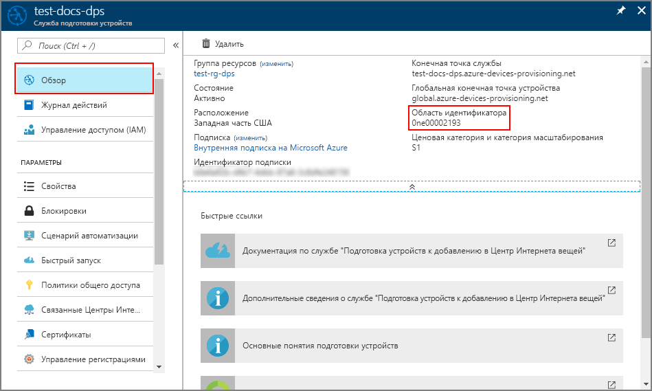

# <a name="create-and-provision-a-simulated-device-using-iot-hub-device-provisioning-service-preview"></a>Создание и подготовка виртуального устройства с помощью службы подготовки устройств Центра Интернета вещей (предварительная версия)

В этом руководстве показано, как создать виртуальное устройство на компьютере разработки под управлением ОС Windows, запустить симулятор доверенного платформенного модуля Windows в качестве [аппаратного модуля безопасности](https://azure.microsoft.com/blog/azure-iot-supports-new-security-hardware-to-strengthen-iot-security/) устройства, а также как с помощью примера кода подключить виртуальное устройство к службе подготовки устройств и Центру Интернета вещей. 

Прежде чем продолжить, выполните инструкции по [настройке службы подготовки устройств Центра Интернета вещей на портале Azure](./quick-setup-auto-provision.md).

<a id="setupdevbox"></a>
## <a name="prepare-the-development-environment"></a>Подготовка среды разработки 

1. Установите на компьютер Visual Studio 2015 или [Visual Studio 2017](https://www.visualstudio.com/vs/). 

2. Скачайте и установите [систему сборки CMake](https://cmake.org/download/).

3. Установите на компьютер систему `git` и добавьте ее в переменные среды, доступные в командном окне. Последнюю версию средств `git` для установки, которая включает **Git Bash**, приложение командной строки для взаимодействия с локальным репозиторием Git, можно найти на [этой странице](https://git-scm.com/download/). 

4. Откройте окно командной строки или Git Bash. Клонируйте репозиторий GitHub для примера кода виртуального устройства:
    
    ```cmd/sh
    git clone https://github.com/Azure/azure-iot-sdk-c.git --recursive
    ```

5. Создайте папку в локальной копии этого репозитория GitHub для процесса сборки CMake. 

    ```cmd/sh
    cd azure-iot-device-auth
    mkdir cmake
    cd cmake
    ```

6. В этом примере кода используется симулятор доверенного платформенного модуля Windows. Выполните следующую команду, чтобы включить аутентификацию маркера подписанного URL-адреса. Эта команда также создает решение Visual Studio для виртуального устройства.

    ```cmd/sh
    cmake -Ddps_auth_type=tpm_simulator ..
    ```

7. В отдельной командной строке перейдите к корневой папке GitHub и запустите симулятор [доверенного платформенного модуля](https://docs.microsoft.com/windows/device-security/tpm/trusted-platform-module-overview). Он ожидает передачи данных через сокет на портах 2321 и 2322. Не закрывайте командное окно. Симулятор должен работать, пока вы не выполните все инструкции из этого руководства. 

    ```cmd/sh
    .\azure-iot-device-auth\dps_client\deps\utpm\tools\tpm_simulator\Simulator.exe
    ```

## <a name="create-a-device-enrollment-entry-in-the-device-provisioning-service"></a>Создание записи регистрации устройства в службе подготовки устройств

1. Откройте решение `azure_iot_sdks.sln`, созданное в папке *cmake*, и соберите его в Visual Studio.

2. Щелкните проект **tpm_device_provision** правой кнопкой мыши и выберите параметр **Назначить запускаемым проектом**. Запустите решение. Окно выходных данных отображает **_ключ подтверждения_** и **_идентификатор регистрации_**, необходимые для регистрации устройства. Запишите эти значения. 

3. Войдите на портал Azure, нажмите кнопку **Все ресурсы** в меню слева и откройте службу подготовки устройств.

4. В колонке сводки службы подготовки устройств выберите **Управление регистрациями**. На вкладке **Отдельные регистрации** и нажмите кнопку **Добавить** сверху. Выберите в качестве *механизма* аттестации удостоверения **доверенный платформенный модуль** и введите *идентификатор регистрации* и *ключ подтверждения* в соответствующие поля. Затем нажмите кнопку **Сохранить**. 

      

   После успешной регистрации *идентификатор регистрации* устройства отобразится в списке под вкладкой *Отдельные регистрации*. 

<a id="firstbootsequence"></a>
## <a name="simulate-first-boot-sequence-for-the-device"></a>Имитация последовательности первой загрузки для устройства

1. На портале Azure выберите колонку **Обзор** службы подготовки устройств и запишите значения для **_глобальной конечной точки устройства_** и **_области идентификатора_**.

     

2. На своем компьютере в Visual Studio выберите пример проекта с именем **dps_client_sample** и откройте файл **dps_client_sample.c**.

3. Присвойте значение _области идентификатора_ переменной `dps_scope_id`. Обратите внимание, что значение переменной `dps_uri` совпадает со значением _глобальной конечной точки устройства_. 

    ```c
    static const char* dps_uri = "global.azure-devices-provisioning.net";
    static const char* dps_scope_id = "[DPS Id Scope]";
    ```

4. Щелкните проект **dps_client_sample** правой кнопкой мыши и выберите параметр **Назначить запускаемым проектом**. Запустите пример. Обратите внимание на сообщения, которые имитируют загрузку устройства и его подключение к службе подготовки устройств для получения информации Центра Интернета вещей. После успешной подготовки виртуального устройства для Центра Интернета вещей, подключенного к службе подготовки, идентификатор устройства отобразится в колонке Центра **Обозреватель устройств**. 

     


## <a name="clean-up-resources"></a>Очистка ресурсов

Если вы планируете продолжить работу с примером клиентского устройства, не удаляйте ресурсы, созданные в ходе работы с этим руководством. Если вы не планируете продолжать работу, следуйте инструкциям ниже, чтобы удалить все созданные ресурсы.

1. Закройте окно выходных данных примера клиентского устройства на компьютере.
1. Закройте окно симулятора доверенного платформенного модуля на компьютере.
1. В меню слева на портале Azure нажмите кнопку **Все ресурсы** и откройте службу подготовки устройств. В верхней части колонки **Все ресурсы** нажмите кнопку **Удалить**.  
1. В меню слева на портале Azure нажмите кнопку **Все ресурсы** и выберите свой Центр Интернета вещей. В верхней части колонки **Все ресурсы** нажмите кнопку **Удалить**.  

## <a name="next-steps"></a>Дальнейшие действия

Вы создали виртуальное устройство доверенного платформенного модуля на компьютере и подготовили его для Центра Интернета вещей с помощью службы подготовки устройств Центра Интернета вещей Azure. Дополнительные сведения о подготовке устройств см. в руководстве по настройке службы подготовки устройств на портале Azure. 

> [!div class="nextstepaction"]
> [Руководства по службе подготовки устройств для Центра Интернета вещей Azure](./tutorial-set-up-cloud.md)

