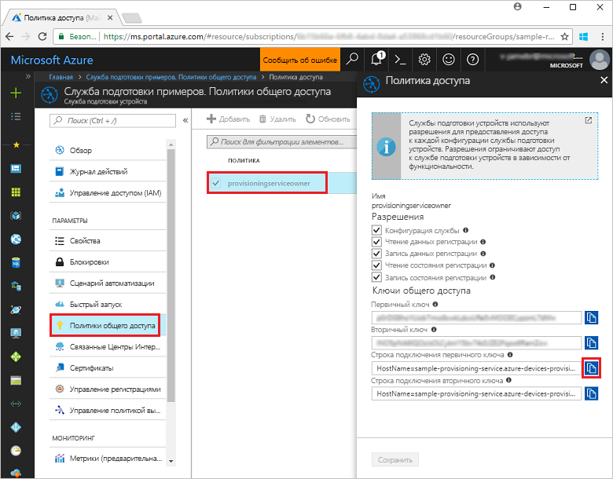
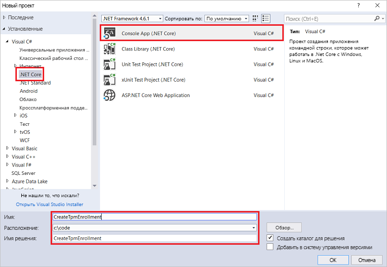
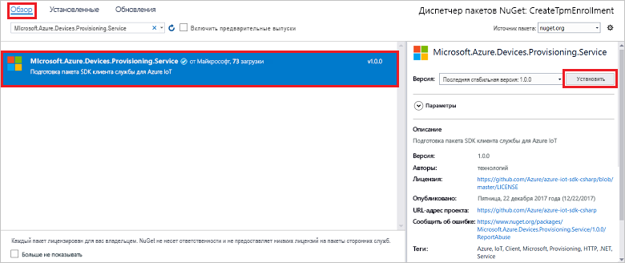
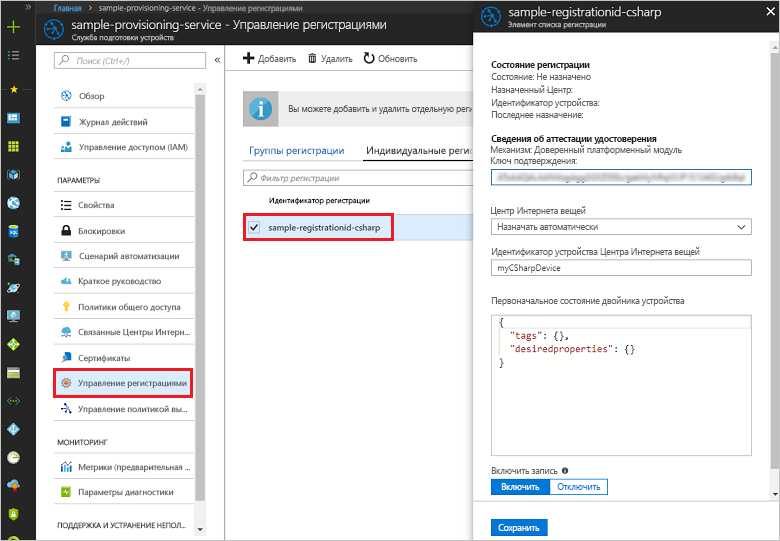

# <a name="enroll-tpm-device-to-iot-hub-device-provisioning-service-using-c-service-sdk"></a>Регистрация устройств TPM в службе "Подготовка устройств к добавлению в Центр Интернета вещей" пакета SDK для служб C#
> [!div class="op_single_selector"]
> * [Java](quick-enroll-device-tpm-java.md)
> * [C#](quick-enroll-device-tpm-csharp.md)
> * [Node.js](quick-enroll-device-tpm-node.md)

В этой статье показано, как программными средствами создать отдельную регистрацию устройства TPM в службе "Подготовка устройств к добавлению в Центр Интернета вещей" с помощью [пакета SDK для служб C#](https://github.com/Azure/azure-iot-sdk-csharp) и примера приложения C# .NET Core. С помощью этой записи отдельной регистрации вы можете по мере необходимости регистрировать имитированные устройства TPM в службе подготовки. В этой статье описана работа с компьютером под управлением Windows, но эта процедура применима как для Windows, так и для Linux.

## <a name="prepare-the-development-environment"></a>Подготовка среды разработки

1. Убедитесь, что на компьютере установлено [Visual Studio 2017](https://www.visualstudio.com/vs/). 
2. Установите на компьютере [пакет SDK для .Net Core](https://www.microsoft.com/net/download/windows). 
3. Прежде чем продолжить, выполните инструкции по [настройке службы подготовки устройств Центра Интернета вещей на портале Azure](./quick-setup-auto-provision.md).
4. (Необязательно). Если вы намерены зарегистрировать имитированное устройство в конце этого руководства, выполните действия из статьи [Создание и подготовка имитированного устройства доверенного платформенного модуля с помощью пакета SDK службы устройства C# для службы подготовки устройств Центра Интернета вещей](quick-create-simulated-device-tpm-csharp.md) вплоть до шага, на котором вы получаете ключ подтверждения для устройства. Запишите ключ подтверждения, идентификатор регистрации и, при необходимости, идентификатор устройства, которые позже понадобятся в этом кратком руководстве. **Не выполняйте шаги по созданию отдельной регистрации с помощью портала Azure.**

## <a name="get-the-connection-string-for-your-provisioning-service"></a>Получение строки подключения к службе подготовки

Чтобы запустить пример из этого краткого руководства, требуется строка подключения к службе подготовки.
1. Войдите на портал Azure, нажмите кнопку **Все ресурсы** в меню слева и откройте службу подготовки устройств. 
2. Щелкните **Политики общего доступа**, а затем выберите нужную политику доступа, чтобы открыть ее свойства. В окне **Политика доступа** скопируйте и запишите строку подключения первичного ключа. 

    

## <a name="create-the-individual-enrollment-sample"></a>Создание примера для отдельной регистрации 

В этом разделе показано, как создать консольное приложение .NET Core, которое добавляет отдельные регистрации устройства TPM в службу подготовки. С некоторыми изменениями c помощью этих шагов можно также создать консольное приложение [Windows IoT Базовая](https://developer.microsoft.com/en-us/windows/iot), чтобы добавлять отдельную регистрацию. Дополнительные сведения о разработке с помощью Windows IoT Базовая см. в этой [документации](https://docs.microsoft.com/en-us/windows/iot-core/).
1. В Visual Studio добавьте в новое решение проект консольного приложения Visual C# .NET Core с помощью шаблона проекта **консольного приложения (.NET Core)**. Убедитесь, что указана версия платформы .NET 4.5.1 или более поздняя версия. Дайте проекту имя **CreateTpmEnrollment**.

    

2. В обозревателе решений щелкните правой кнопкой мыши проект **CreateTpmEnrollment** и выберите **Управление пакетами NuGet**.
3. В окне **Диспетчер пакетов NuGet** нажмите кнопку **Обзор**, найдите **Microsoft.Azure.Devices.Provisioning.Service**, щелкните **Установить**, чтобы установить пакет **Microsoft.Azure.Devices.Provisioning.Service**, и примите условия использования. В результате скачивается и устанавливается [клиентский пакет NuGet для службы "Подготовка устройств к добавлению в Центр Интернета вещей"](https://www.nuget.org/packages/Microsoft.Azure.Devices.Provisioning.Service/) и его зависимости, а также добавляется соответствующая ссылка.

    

4. Добавьте в начало файла **Program.cs** после других инструкций `using` следующие инструкции `using`:
   
   ```csharp
   using System.Threading.Tasks;
   using Microsoft.Azure.Devices.Provisioning.Service;
   ```
    
5. Добавьте следующие поля в класс **Program** .  
   - Замените значение заполнителя **ProvisioningConnectionString** строкой подключения к службе подготовки, для которой необходимо создать регистрацию.
   - При необходимости можно изменить идентификатор регистрации, ключ подтверждения, идентификатор устройства и состояние подготовки. 
   - Если вы подготавливали имитированное устройство на основе сведений из этой статьи и краткого руководства [Создание и подготовка имитированного устройства доверенного платформенного модуля с помощью пакета SDK службы устройства C# для службы подготовки устройств Центра Интернета вещей](quick-create-simulated-device-tpm-csharp.md), замените ключ подтверждения и идентификатор регистрации значениями, полученными в этой руководстве. Вы можете заменить идентификатор устройства значением, предлагаемым в руководстве, использовать собственное значение или использовать значения по умолчанию из этого примера.
        
   ```csharp
   private static string ProvisioningConnectionString = "{Your provisioning service connection string}";
   private const string RegistrationId = "sample-registrationid-csharp";
   private const string TpmEndorsementKey =
       "AToAAQALAAMAsgAgg3GXZ0SEs/gakMyNRqXXJP1S124GUgtk8qHaGzMUaaoABgCAAEMAEAgAAAAAAAEAxsj2gUS" +
       "cTk1UjuioeTlfGYZrrimExB+bScH75adUMRIi2UOMxG1kw4y+9RW/IVoMl4e620VxZad0ARX2gUqVjYO7KPVt3d" +
       "yKhZS3dkcvfBisBhP1XH9B33VqHG9SHnbnQXdBUaCgKAfxome8UmBKfe+naTsE5fkvjb/do3/dD6l4sGBwFCnKR" +
       "dln4XpM03zLpoHFao8zOwt8l/uP3qUIxmCYv9A7m69Ms+5/pCkTu/rK4mRDsfhZ0QLfbzVI6zQFOKF/rwsfBtFe" +
       "WlWtcuJMKlXdD8TXWElTzgh7JS4qhFzreL0c1mI0GCj+Aws0usZh7dLIVPnlgZcBhgy1SSDQMQ==";
       
   // Optional parameters
   private const string OptionalDeviceId = "myCSharpDevice";
   private const ProvisioningStatus OptionalProvisioningStatus = ProvisioningStatus.Enabled;
   ```
    
6. Добавьте следующий метод в класс **Program**.  Этот код создает отдельную запись регистрации, а затем вызывает метод **CreateOrUpdateIndividualEnrollmentAsync** в **ProvisioningServiceClient**, чтобы добавить отдельную регистрацию к службе подготовки.
   
   ```csharp
   public static async Task RunSample()
   {
       Console.WriteLine("Starting sample...");

       using (ProvisioningServiceClient provisioningServiceClient =
               ProvisioningServiceClient.CreateFromConnectionString(ProvisioningConnectionString))
       {
           #region Create a new individualEnrollment config
           Console.WriteLine("\nCreating a new individualEnrollment...");
           Attestation attestation = new TpmAttestation(TpmEndorsementKey);
           IndividualEnrollment individualEnrollment =
                   new IndividualEnrollment(
                           RegistrationId,
                           attestation);

           // The following parameters are optional. Remove them if you don't need them.
           individualEnrollment.DeviceId = OptionalDeviceId;
           individualEnrollment.ProvisioningStatus = OptionalProvisioningStatus;
           #endregion

           #region Create the individualEnrollment
           Console.WriteLine("\nAdding new individualEnrollment...");
           IndividualEnrollment individualEnrollmentResult =
               await provisioningServiceClient.CreateOrUpdateIndividualEnrollmentAsync(individualEnrollment).ConfigureAwait(false);
           Console.WriteLine("\nIndividualEnrollment created with success.");
           Console.WriteLine(individualEnrollmentResult);
           #endregion
        
       }
   }
   ```
       
7. Наконец, замените текст метода **Main** следующими строками:
   
   ```csharp
   RunSample().GetAwaiter().GetResult();
   Console.WriteLine("\nHit <Enter> to exit ...");
   Console.ReadLine();
   ```
        
8. Выполните сборку решения.

## <a name="run-the-individual-enrollment-sample"></a>Запуск примера отдельной регистрации
  
1. Запустите пример в Visual Studio, чтобы создать отдельную регистрацию устройства TPM.
 
2. После успешного создания в окне командной строки отобразятся свойства новой отдельной регистрации.

    

3. Чтобы проверить, создана ли отдельная регистрация, в колонке сводки службы подготовки устройств на портале Azure выберите **Управление регистрациями**, а затем перейдите на вкладку **Индивидуальные регистрации**. Вы должны увидеть новую запись регистрации, которая соответствует идентификатору регистрации, используемому в примере. Щелкните запись, чтобы проверить ключ подтверждения и другие ее свойства.

    
 
4. (Необязательно.) Если вы следуете инструкциям из краткого руководства [Создание и подготовка имитированного устройства доверенного платформенного модуля с помощью пакета SDK службы устройства C# для службы подготовки устройств Центра Интернета вещей](quick-create-simulated-device-tpm-csharp.md), зарегистрировать имитируемое устройство можно также с использованием приведенных в нем шагов. Пропустите шаги по созданию отдельной регистрации с помощью портала Azure.

## <a name="clean-up-resources"></a>Очистка ресурсов
Если вы планируете изучить пример службы C#, не удаляйте ресурсы, которые создали при работе с этим руководством. Если вы не планируете продолжать работу, следуйте инструкциям ниже, чтобы удалить все созданные ресурсы.

1. Закройте окно выходных данных примера C#, если оно открыто на компьютере.
2. Перейдите к службе подготовки устройств на портале Azure, откройте раздел **Управление регистрациями** и выберите вкладку **Индивидуальные регистрации**. Выберите *идентификатор регистрации* для записи регистрации, которую вы создали в процессе работы с этим руководством, и нажмите кнопку **Удалить** в верхней части колонки. 
3. Если вы следовали инструкциям по созданию имитируемого устройства TPM из краткого руководства [Создание и подготовка имитированного устройства доверенного платформенного модуля с помощью пакета SDK службы устройства C# для службы подготовки устройств Центра Интернета вещей](quick-create-simulated-device-tpm-csharp.md): 

    1. Закройте окно симулятора TPM и окно примера выходных данных имитируемого устройства.
    2. На портале Azure перейдите в Центр Интернета вещей, в котором подготовлено устройство. В меню слева в разделе **Explorers** (Обучающие ресурсы) щелкните **IoT Devices** (Устройства Центра Интернета вещей), установите флажок рядом с устройством и нажмите кнопку **Удалить** в верхней части окна.
 
## <a name="next-steps"></a>Дополнительная информация
При работе с этим руководством вы программным способом создали запись отдельной регистрации для устройства TPM, а также (необязательно) создали на компьютере имитированное устройство TPM и подготовили его для Центра Интернета вещей с помощью службы подготовки устройств Центра Интернета вещей Azure. Дополнительные сведения о подготовке устройств см. в руководстве по настройке службы подготовки устройств на портале Azure. 
 
> [!div class="nextstepaction"]
> [Руководства по службе подготовки устройств для Центра Интернета вещей Azure](./tutorial-set-up-cloud.md)

