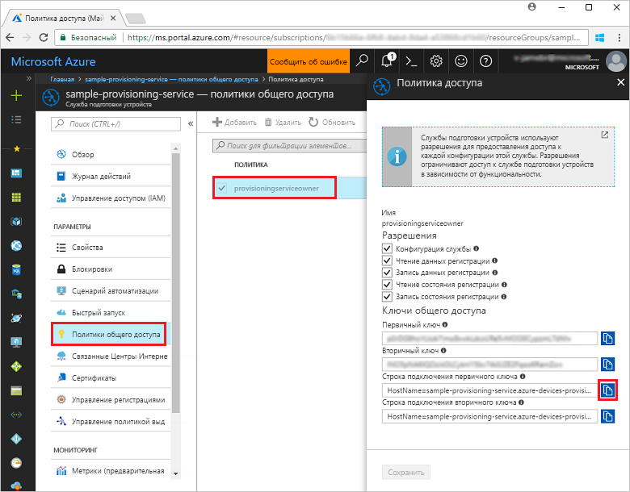
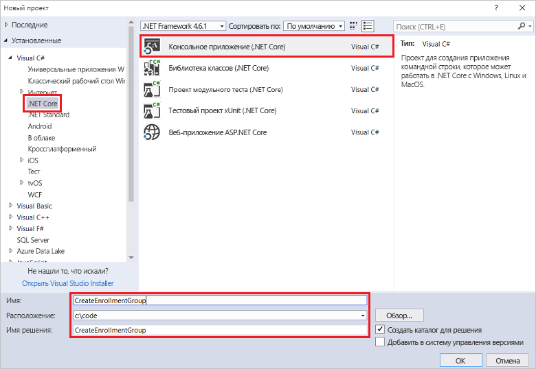

# <a name="enroll-x509-devices-to-iot-hub-device-provisioning-service-using-c-service-sdk"></a>Регистрация устройств X.509 в службе "Подготовка устройств к добавлению в Центр Интернета вещей" пакета SDK для служб C#

[!INCLUDE [iot-dps-selector-quick-enroll-device-x509](../../includes/iot-dps-selector-quick-enroll-device-x509.md)]


Здесь описан процесс, позволяющий программными средствами создать группу регистрации сертификатов X.509 промежуточных или корневых центров сертификации с помощью [пакета SDK для службы C#](https://github.com/Azure/azure-iot-sdk-csharp) и примера приложения C# .NET Core. Группа регистрации управляет доступом к службе подготовки устройств, которые совместно используют стандартный сертификат для подписи в цепочке сертификатов. Дополнительные сведения см. в разделе [Управление доступом устройств к службе подготовки с использованием сертификатов X.509](./concepts-security.md#controlling-device-access-to-the-provisioning-service-with-x509-certificates). Дополнительные сведения об использовании инфраструктуры открытых ключей на основе сертификатов X.509 с Центром Интернета вещей и службой подготовки устройств см. в статье [Device Authentication using X.509 CA Certificates](https://docs.microsoft.com/en-us/azure/iot-hub/iot-hub-x509ca-overview) (Проверка подлинности устройств с помощью сертификатов ЦС X.509). В этой статье описаны шаги по работе с компьютером под управлением Windows, но эту процедуру можно применить и к Linux.

## <a name="prepare-the-development-environment"></a>Подготовка среды разработки

1. Убедитесь, что на компьютере установлено [Visual Studio 2017](https://www.visualstudio.com/vs/). 
2. Установите на компьютере [пакет SDK для .Net Core](https://www.microsoft.com/net/download/windows). 
3. Прежде чем продолжить, выполните инструкции по [настройке службы подготовки устройств Центра Интернета вещей на портале Azure](./quick-setup-auto-provision.md).
4. Вам потребуется PEM- или CER-файл, содержащий открытую часть сертификата X.509 промежуточного или корневого центра сертификации, который вы заранее отправили в службу подготовки и проверили в ней. [Пакет SDK для Центра Интернета вещей Azure](https://github.com/Azure/azure-iot-sdk-c) содержит средства, с помощью которых можно создать цепочку сертификатов X.509, передать корневой или промежуточный сертификат из этой цепочки и подтвердить владение сертификатом в службе. Чтобы использовать эти средства, скачайте содержимое папки [azure-iot-sdk-c/tools/CACertificates](https://github.com/Azure/azure-iot-sdk-c/tree/master/tools/CACertificates) в рабочую папку своего компьютера и выполните шаги, приведенные в файле [azure-iot-sdk-c\tools\CACertificates\CACertificateOverview.md](https://github.com/Azure/azure-iot-sdk-c/blob/master/tools/CACertificates/CACertificateOverview.md). Помимо средств в **пакете SDK для службы C#** в [примере проверки сертификата группы](https://github.com/Azure/azure-iot-sdk-csharp/tree/master/provisioning/service/samples/GroupCertificateVerificationSample) показано, как подтвердить владение имеющимся промежуточным сертификатом или корневым сертификатом ЦС X.509. 

  > [!IMPORTANT]
  > Сертификаты, созданные с помощью инструментария пакета SDK, можно использовать только в целях разработки. Дополнительные сведения о получении сертификатов, подходящих для рабочего кода, см. в разделе [How to get an X.509 CA certificate](https://docs.microsoft.com/en-us/azure/iot-hub/iot-hub-x509ca-overview#how-to-get-an-x509-ca-certificate) (Как получить сертификат ЦС X.509) документации по Центру Интернета вещей Azure.

## <a name="get-the-connection-string-for-your-provisioning-service"></a>Получение строки подключения к службе подготовки

Чтобы запустить пример из этого краткого руководства, требуется строка подключения к службе подготовки.
1. Войдите на портал Azure, нажмите кнопку **Все ресурсы** в меню слева и откройте службу подготовки устройств. 
2. Щелкните **Политики общего доступа**, а затем выберите нужную политику доступа, чтобы открыть ее свойства. В окне **Политика доступа** скопируйте и запишите строку подключения первичного ключа. 

    

## <a name="create-the-enrollment-group-sample"></a>Создание примера группы регистрации 

В этом разделе показано, как создать консольное приложение .NET Core, которое добавляет группу регистрации в службу подготовки. С некоторыми изменениями c помощью этих шагов можно также создать консольное приложение [Windows IoT Базовая](https://developer.microsoft.com/en-us/windows/iot), чтобы добавить группу регистрации. Дополнительные сведения о разработке с помощью Windows IoT Базовая см. в этой [документации](https://docs.microsoft.com/en-us/windows/iot-core/).
1. В Visual Studio добавьте в новое решение проект консольного приложения Visual C# .NET Core с помощью шаблона проекта **консольного приложения (.NET Core)**. Убедитесь, что указана версия платформы .NET 4.5.1 или более поздняя версия. Назовите проект **CreateEnrollmentGroup**.

    

2. В обозревателе решений щелкните правой кнопкой мыши проект **CreateEnrollmentGroup** и выберите **Управление пакетами NuGet**.
3. В окне **Диспетчер пакетов NuGet** нажмите кнопку **Обзор**, найдите **Microsoft.Azure.Devices.Provisioning.Service**, щелкните **Установить**, чтобы установить пакет **Microsoft.Azure.Devices.Provisioning.Service**, и примите условия использования. В результате скачивается и устанавливается [клиентский пакет NuGet для службы "Подготовка устройств к добавлению в Центр Интернета вещей"](https://www.nuget.org/packages/Microsoft.Azure.Devices.Provisioning.Service/) и его зависимости, а также добавляется соответствующая ссылка.

    

4. Добавьте в начало файла **Program.cs** после других инструкций `using` следующие инструкции `using`:
   
   ```csharp
   using System.Security.Cryptography.X509Certificates;
   using System.Threading.Tasks;
   using Microsoft.Azure.Devices.Provisioning.Service;
   ```
    
5. Добавьте следующие поля в класс **Program** .  
   - Замените значение заполнителя **ProvisioningConnectionString** строкой подключения к службе подготовки, для которой необходимо создать регистрацию.
   - Замените заполнитель **X509RootCertPath** путем к PEM- или CER-файлу, которые представляют открытую часть ранее отправленного и проверенного службой подготовки промежуточного или корневого сертификата ЦС X.509.
   - При необходимости можно изменить значение **EnrollmentGroupId**. Строка может содержать только символы в нижнем регистре и дефисы. 

   > [!IMPORTANT]
   > В рабочем коде следует учитывать следующие рекомендации по безопасности:
   >
   > - Жесткое программирование строки подключения для администратора службы подготовки противоречит рекомендациям по обеспечению безопасности. Вместо этого строки подключения должны храниться без угрозы безопасности, например в безопасном файле конфигурации или в реестре.
   > - Обязательно отправьте только открытую часть сертификата подписи. Никогда не отправляйте в службу подготовки PFX- (PKCS12) или PEM-файлы, содержащие закрытые ключи.
        
   ```csharp
   private static string ProvisioningConnectionString = "{Your provisioning service connection string}";
   private static string EnrollmentGroupId = "enrollmentgrouptest";
   private static string X509RootCertPath = @"{Path to a .cer or .pem file for a verified root CA or intermediate CA X.509 certificate}";
   ```
    
6. Добавьте следующий метод в класс **Program**. Этот код создает запись группы регистрации, а затем вызывает метод **CreateOrUpdateEnrollmentGroupAsync** в **ProvisioningServiceClient**, чтобы добавить группу регистрации в службу подготовки.
   
   ```csharp
   public static async Task RunSample()
   {
       Console.WriteLine("Starting sample...");
 
       using (ProvisioningServiceClient provisioningServiceClient =
               ProvisioningServiceClient.CreateFromConnectionString(ProvisioningConnectionString))
       {
           #region Create a new enrollmentGroup config
           Console.WriteLine("\nCreating a new enrollmentGroup...");
           var certificate = new X509Certificate2(X509RootCertPath);
           Attestation attestation = X509Attestation.CreateFromRootCertificates(certificate);
           EnrollmentGroup enrollmentGroup =
                   new EnrollmentGroup(
                           EnrollmentGroupId,
                           attestation)
                   {
                       ProvisioningStatus = ProvisioningStatus.Enabled
                   };
           Console.WriteLine(enrollmentGroup);
           #endregion
 
           #region Create the enrollmentGroup
           Console.WriteLine("\nAdding new enrollmentGroup...");
           EnrollmentGroup enrollmentGroupResult =
               await provisioningServiceClient.CreateOrUpdateEnrollmentGroupAsync(enrollmentGroup).ConfigureAwait(false);
           Console.WriteLine("\nEnrollmentGroup created with success.");
           Console.WriteLine(enrollmentGroupResult);
           #endregion
 
       }
   }
   ```

7. Наконец, замените текст метода **Main** следующими строками:
   
   ```csharp
   RunSample().GetAwaiter().GetResult();
   Console.WriteLine("\nHit <Enter> to exit ...");
   Console.ReadLine();
   ```
        
8. Выполните сборку решения.

## <a name="run-the-enrollment-group-sample"></a>Запуск примера группы регистрации
  
1. Запустите пример в Visual Studio, чтобы создать группу регистрации.
 
2. После успешного создания в окне командной строки отобразятся свойства новой группы регистрации.

    

3. Чтобы проверить, создана ли группа регистрации, в колонке сводки службы подготовки устройств на портале Azure выберите **Управление регистрациями**, а затем перейдите на вкладку **Группы регистрации**. Вы должны увидеть новую запись регистрации, которая соответствует идентификатору регистрации, используемому в примере. Щелкните запись, чтобы проверить отпечаток сертификата и другие ее свойства.

    
 
## <a name="clean-up-resources"></a>Очистка ресурсов
Если вы планируете изучить пример службы C#, не удаляйте ресурсы, которые создали при работе с этим руководством. Если вы не планируете продолжать работу, следуйте инструкциям ниже, чтобы удалить все созданные ресурсы.

1. Закройте окно выходных данных примера C#, если оно открыто на компьютере.
2. Перейдите к службе подготовки устройств на портале Azure, щелкните **Управление регистрациями** и выберите вкладку **Группы регистрации**. Выберите *Идентификатор регистрации* для записи регистрации, которую вы создали в процессе работы с этим руководством, и нажмите кнопку **Удалить** в верхней части колонки.  
3. На странице службы подготовки устройств на портале Azure щелкните **Сертификаты**, выберите переданный для работы с руководством сертификат, а затем нажмите кнопку **Удалить** в верхней части окна  **Сведения о сертификате**.  
 
## <a name="next-steps"></a>Дополнительная информация
В этом кратком руководстве вы создали группу регистрации сертификата X.509 промежуточного или корневого центра сертификации с помощью службы "Подготовка устройств к добавлению в Центр Интернета вещей". Дополнительные сведения о подготовке устройств см. в руководстве по настройке службы подготовки устройств на портале Azure. 
 
> [!div class="nextstepaction"]
> [Руководства по службе подготовки устройств для Центра Интернета вещей Azure](./tutorial-set-up-cloud.md)
