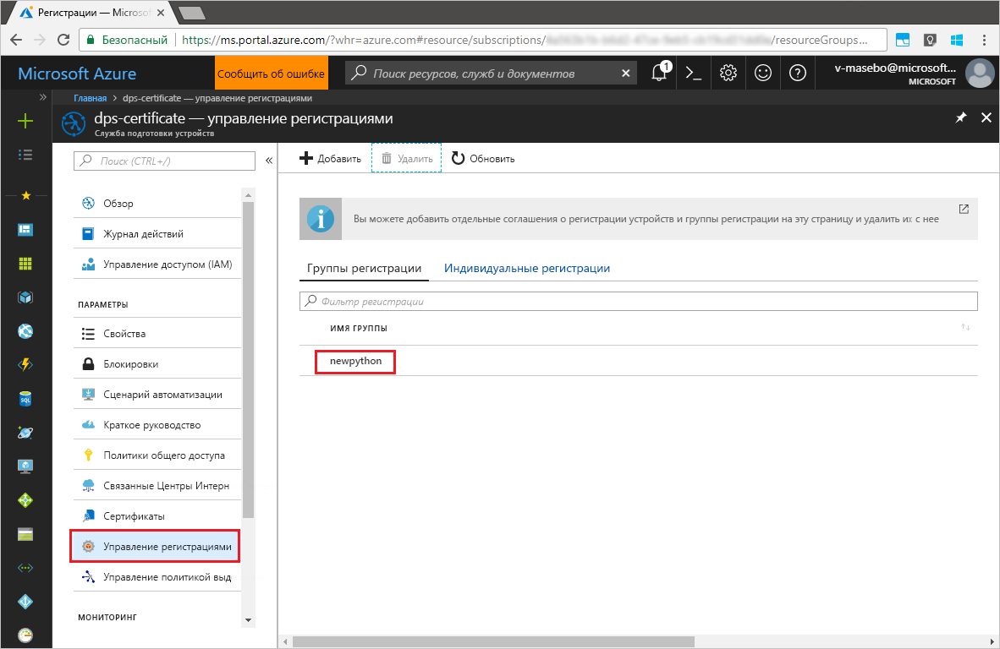

# <a name="quickstart-enroll-x509-devices-to-the-device-provisioning-service-using-python"></a>Краткое руководство. Регистрация устройств X.509 в Службе подготовки устройств с помощью Python

[!INCLUDE [iot-dps-selector-quick-enroll-device-x509](../../includes/iot-dps-selector-quick-enroll-device-x509.md)]

Устройства регистрируются в экземпляре службы подготовки, создавая [группу регистрации](concepts-service.md#enrollment-group) или [индивидуальную регистрацию](concepts-service.md#individual-enrollment). В этом кратком руководстве показано, как использовать Python для программного создания [группы регистраций](concepts-service.md#enrollment-group) с использованием промежуточного или корневого сертификата ЦС X.509. Группа регистрации управляет доступом к службе подготовки устройств, которые совместно используют стандартный сертификат для подписи в цепочке сертификатов. Эта группа регистрации создается с помощью [пакета SDK службы подготовки Python](https://github.com/Azure/azure-iot-sdk-python/tree/master/provisioning_service_client) и примера приложения Python. Создание индивидуальной регистрации, используя *пакет SDK службы подготовки Python*, все еще находится на стадии разработки. Дополнительные сведения см. в разделе [Управление доступом устройств к службе подготовки с использованием сертификатов X.509](./concepts-security.md#controlling-device-access-to-the-provisioning-service-with-x509-certificates). Дополнительные сведения об использовании инфраструктуры открытых ключей на основе сертификатов X.509 с Центром Интернета вещей и службой подготовки устройств см. в статье [Device Authentication using X.509 CA Certificates](https://docs.microsoft.com/azure/iot-hub/iot-hub-x509ca-overview) (Проверка подлинности устройств с помощью сертификатов ЦС X.509). 

В этом руководстве предполагается, что Центр Интернета вещей и экземпляр Службы подготовки устройств уже созданы. Если эти ресурсы еще не созданы, прежде чем продолжить, выполните действия, описанные в руководстве по [настройке Службы подготовки устройств к добавлению в Центр Интернета вещей на портале Azure](./quick-setup-auto-provision.md).

Описанные в этой статье действия применимы к виртуальным машинам Windows и Linux, но статья предназначена для работы с машинами Windows.

[!INCLUDE [quickstarts-free-trial-note](../../includes/quickstarts-free-trial-note.md)]


## <a name="prerequisites"></a>Предварительные требования

- Установите [Python 2.x или 3.x](https://www.python.org/downloads/). Обязательно используйте 32-разрядную или 64-разрядную версию установки согласно требованиям программы настройки. При появлении запроса во время установки обязательно добавьте Python в переменную среды соответствующей платформы.
- [Установите или обновите*pip* — систему управления пакетами Python](https://pip.pypa.io/en/stable/installing/).
- Установите [Git](https://git-scm.com/download/).


## <a name="prepare-test-certificates"></a>Подготовка тестовых сертификатов

Для этого краткого руководства требуется файл PEM или CER, который содержит общедоступную часть промежуточного или корневого сертификата ЦС X.509. Этот сертификат должен быть отправлен в службу подготовки и проверен в ней. 

[Пакет SDK для Центра Интернета вещей Azure](https://github.com/Azure/azure-iot-sdk-c) содержит средства тестирования, с помощью которых можно создать цепочку сертификатов X.509, передать корневой или промежуточный сертификат из этой цепочки и подтвердить владение сертификатом в службе. Сертификаты, созданные с помощью инструментария пакета SDK, можно использовать только в **целях тестовой разработки**. Эти сертификаты **не должны использоваться в рабочей среде**. В них жестко заданы пароли ("1234"), срок действия которых истекает через 30 дней. Сведения о получении сертификатов, подходящих для рабочего использования, см. в документации Центра Интернета вещей Azure в статье [Как получить сертификат ЦС X.509](https://docs.microsoft.com/azure/iot-hub/iot-hub-x509ca-overview#how-to-get-an-x509-ca-certificate).

Чтобы создать сертификаты с помощью этих средств тестирования, выполните следующие действия. 
 
1. Откройте командную строку или оболочку Git Bash и перейдите в рабочую папку на компьютере. Выполните следующую команду для клонирования репозитория GitHub [пакета SDK для устройства C Интернета вещей Azure](https://github.com/Azure/azure-iot-sdk-c):
    
  ```cmd/sh
  git clone https://github.com/Azure/azure-iot-sdk-c.git --recursive
  ```

  Размер этого репозитория в настоящее время составляет примерно 220 МБ. Выполнение этой операции может занять несколько минут.

  Средства тестирования находятся в клонированном репозитории *azure-iot-sdk-c/tools/CACertificates*.    

2. Выполните действия, описанные в статье [Managing test CA certificates for samples and tutorials](https://github.com/Azure/azure-iot-sdk-c/blob/master/tools/CACertificates/CACertificateOverview.md) (Управление тестовыми сертификатами ЦС для образцов и руководств). 


## <a name="modify-the-python-sample-code"></a>Изменение примера кода Python

В этом разделе показано, как добавить в пример кода сведения о подготовке устройства X.509. 

1. В текстовом редакторе создайте файл **EnrollmentGroup.py**.

1. Добавьте следующие инструкции `import` и переменные в начало файла **EnrollmentGroup.py**: Затем замените `dpsConnectionString` вашей строкой подключения, которая находится в разделе **Политики общего доступа** в **службе подготовки устройств** на **портале Azure**. Замените заполнитель сертификатов на сертификат, созданный ранее в разделе [Подготовка тестовых сертификатов](quick-enroll-device-x509-python.md#prepare-test-certificates). Наконец, создайте уникальный идентификатор `registrationid` и убедитесь, что он состоит только из алфавитно-цифровых символов нижнего регистра и дефисов.  
   
    ```python
    from provisioningserviceclient import ProvisioningServiceClient
    from provisioningserviceclient.models import EnrollmentGroup, AttestationMechanism

    CONNECTION_STRING = "{dpsConnectionString}"

    SIGNING_CERT = """-----BEGIN CERTIFICATE-----
    XXXXXXXXXXXXXXXXXXXXXXXXXXXXXXXXXXXXXXXXXXXXXXXXXXXXXXXXXXXXXXXX
    XXXXXXXXXXXXXXXXXXXXXXXXXXXXXXXXXXXXXXXXXXXXXXXXXXXXXXXXXXXXXXXX
    XXXXXXXXXXXXXXXXXXXXXXXXXXXXXXXXXXXXXXXXXXXXXXXXXXXXXXXXXXXXXXXX
    XXXXXXXXXXXXXXXXXXXXXXXXXXXXXXXXXXXXXXXXXXXXXXXXXXXXXXXXXXXXXXXX
    XXXXXXXXXXXXXXXXXXXXXXXXXXXXXXXXXXXXXXXXXXXXXXXXXXXXXXXXXXXXXXXX
    XXXXXXXXXXXXXXXXXXXXXXXXXXXXXXXXXXXXXXXXXXXXXXXXXXXXXXXXXXXXXXXX
    XXXXXXXXXXXXXXXXXXXXXXXXXXXXXXXXXXXXXXXXXXXXXXXXXXXXXXXXXXXXXXXX
    XXXXXXXXXXXXXXXXXXXXXXXXXXXXXXXXXXXXXXXXXXXXXXXXXXXXXXXXXXXXXXXX
    XXXXXXXXXXXXXXXXXXXXXXXXXXXXXXXXXXXXXXXXXXXXXXXXXXXXXXXXXXXXXXXX
    XXXXXXXXXXXXXXXXXXXXXXXXXXXXXXXXXXXXXXXXXXXXXXXXXXXXXXXXXXXXXXXX
    XXXXXXXXXXXXXXXXXXXXXXXXXXXXXXXXXXXXXXXXXXXXXXXXXXXXXXXXXXXXXXXX
    XXXXXXXXXXXXXXXXXXXXXXXXXXXXXXXXXXXXXXXXXXXXXXXXXXXXXXXXXXXXXXXX
    XXXXXXXXXXXXXXXXXXXXXXXXXXXXXXXXXXXXXXXXXXXXXXXXXXXXXXXXXXXXXXXX
    XXXXXXXXXXXXXXXXXXXXXXXXXXXXXXXXXXXXXXXXXXXXXXXXXXXXXXXXXXXXXXXX
    XXXXXXXXXXXXXXXXXXXXXXXXXXXXXXXXXXXXXXXXXXXXXXXXXXXXXXXX
    -----END CERTIFICATE-----"""

    GROUP_ID = "{registrationid}"
    ```

1. Добавьте следующую функцию и ее вызов, чтобы реализовать создание групповой регистрации:
   
    ```python
    def main():
        print ( "Initiating enrollment group creation..." )

        psc = ProvisioningServiceClient.create_from_connection_string(CONNECTION_STRING)
        att = AttestationMechanism.create_with_x509_signing_certs(SIGNING_CERT)
        eg = EnrollmentGroup.create(GROUP_ID, att)

        eg = psc.create_or_update(eg)
    
        print ( "Enrollment group created." )

    if __name__ == '__main__':
        main()
    ```

1. Сохраните и закройте файл **EnrollmentGroup.py**.
 

## <a name="run-the-sample-group-enrollment"></a>Выполнение примера для регистрации группы

1. Откройте средство командной строки и выполните следующую команду, чтобы установить [azure-iot-provisioning-device-client](https://pypi.org/project/azure-iot-provisioning-device-client).

    ```cmd/sh
    pip install azure-iothub-provisioningserviceclient    
    ```

2. Выполните сценарий в командной строке.

    ```cmd/sh
    python EnrollmentGroup.py
    ```

3. Удостоверьтесь, что регистрация прошла успешно, просмотрев выходные данные.

4. Откройте службу подготовки на портале Azure. Щелкните **Управление регистрациями**. Убедитесь, что на вкладке **Группы регистрации** появилась созданная ранее группа устройств X.509 с именем `registrationid`. 

      


## <a name="clean-up-resources"></a>Очистка ресурсов
Если вы планируете изучить пример службы Java, не удаляйте ресурсы, которые создали при работе с этим руководством. Если вы не планируете продолжать работу, следуйте инструкциям ниже, чтобы удалить все созданные ресурсы.

1. Закройте окно выходных данных примера Java, если оно открыто на компьютере.
1. Закройте окно _генератора сертификатов X.509_, если оно открыто на компьютере.
1. Перейдите к службе подготовки устройств на портале Azure, щелкните **Управление регистрациями** и выберите вкладку **Группы регистрации**. Выберите *имя группы* устройств X.509, которую вы зарегистрировали в процессе работы с этим руководством, и нажмите кнопку **Удалить** в верхней части колонки.  


## <a name="next-steps"></a>Дополнительная информация
В рамках работы с этим кратким руководством вы зарегистрировали группу имитированных устройств X.509 в службе подготовки устройств. Дополнительные сведения о подготовке устройств см. в руководстве по настройке службы подготовки устройств на портале Azure. 

> [!div class="nextstepaction"]
> [Руководства по службе подготовки устройств для Центра Интернета вещей Azure](./tutorial-set-up-cloud.md)
