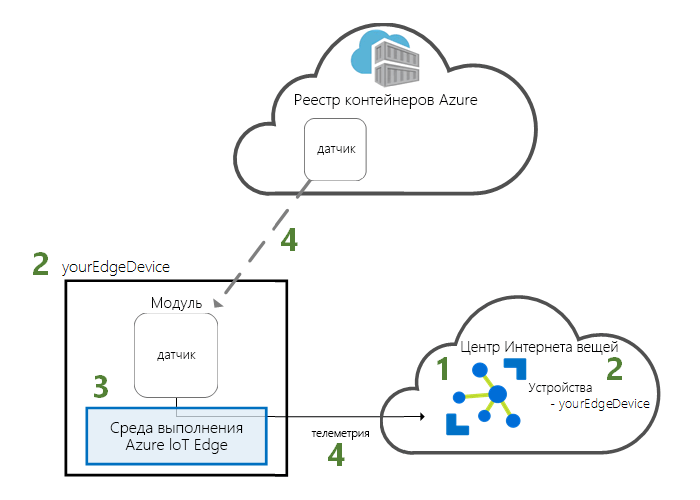
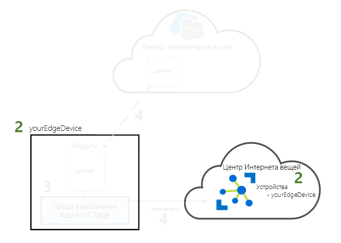
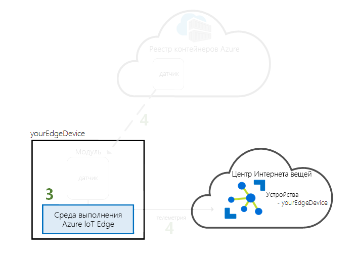
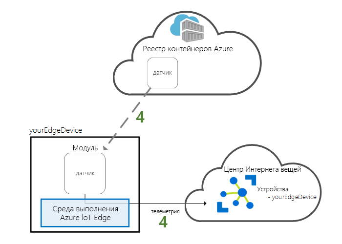

# <a name="quickstart-deploy-your-first-iot-edge-module-to-a-linux-x64-device"></a>Краткое руководство. Развертывание первого модуля IoT Edge на устройстве под управлением 64-разрядной ОС Linux

Azure IoT Edge переносит мощь облака на ваши устройства Интернета вещей. Из этого краткого руководства вы узнаете, как использовать облачный интерфейс для удаленного развертывания готового кода на устройстве IoT Edge.

Из этого краткого руководства вы узнаете, как выполнять следующие задачи:

1. Создайте Центр Интернета вещей.
2. Регистрация устройства IoT Edge в Центре Интернета вещей.
3. Установка и запуск среды выполнения IoT Edge на устройстве.
4. Удаленное развертывание модуля на устройстве IoT Edge.



В рамках этого краткого руководства компьютер или виртуальная машина Linux используются в качестве устройства IoT Edge. Вы можете развернуть модуль на портале Azure для устройства. Модуль, который вы развернете в рамках этого краткого руководства, представляет собой имитированный датчик, генерирующий данные температуры, влажности и давления. В других руководствах по Azure IoT Edge используются наработки из этой статьи: развернутые модули, которые анализируют смоделированные данные для бизнес-аналитики.

Если у вас нет активной подписки Azure, перед началом работы создайте [бесплатную учетную запись](https://azure.microsoft.com/free).

[!INCLUDE [cloud-shell-try-it.md](../../includes/cloud-shell-try-it.md)]

Для выполнения многих действий, описанных в этом кратком руководстве, используется Azure CLI, а также расширение Интернета вещей Azure для предоставления дополнительных функций. 

Добавьте расширение Интернета вещей Azure в экземпляр Cloud Shell.

   ```azurecli-interactive
   az extension add --name azure-cli-iot-ext
   ```

## <a name="prerequisites"></a>Предварительные требования

Облачные ресурсы. 

* Группа ресурсов для управления всеми ресурсами, которые вы используете в этом кратком руководстве. 

   ```azurecli-interactive
   az group create --name IoTEdgeResources --location westus2
   ```

Устройства IoT Edge:

* Устройство или виртуальная машина Linux для работы в качестве устройства IoT Edge. Рекомендуется использовать виртуальную машину [Azure IoT Edge on Ubuntu](https://azuremarketplace.microsoft.com/en-us/marketplace/apps/microsoft_iot_edge.iot_edge_vm_ubuntu), предоставляемую корпорацией Майкрософт, которая предварительно установит среду выполнения IoT Edge. Создайте эту виртуальную машину, используя следующую команду:

   ```azurecli-interactive
   az vm create --resource-group IoTEdgeResources --name EdgeVM --image microsoft_iot_edge:iot_edge_vm_ubuntu:ubuntu_1604_edgeruntimeonly:latest --admin-username azureuser --generate-ssh-keys --size Standard_DS1_v2
   ```

   При создании новой виртуальной машины запишите для нее значение **publicIpAddress** (общедоступный IP-адрес), которое содержится в выходных данных команды create. Используйте этот общедоступный IP-адрес для подключения к виртуальной машине далее в этом кратком руководстве.

* Если необходимо запустить среду выполнения Azure IoT Edge в локальной системе, следуйте инструкциям в статье [Установка среды выполнения Azure IoT Edge в Linux (x64)](how-to-install-iot-edge-linux.md).

* Если необходимо использовать устройство на базе ARM32, например Raspberry Pi, следуйте инструкциям в разделе [Выполнение установки Azure IoT Edge в Linux (ARM32v7/armhf)](how-to-install-iot-edge-linux-arm.md).

## <a name="create-an-iot-hub"></a>Создание Центра Интернета вещей

Начните с создания Центра Интернета вещей с помощью Azure CLI.


Для целей этого руководства можно использовать бесплатный уровень. Если вы уже использовали бесплатный Центр Интернета вещей и он у вас сохранился, можете использовать его. В подписке может быть только один бесплатный Центр Интернета вещей. 

При помощи следующего кода создается бесплатный центр **F1** в группе ресурсов **IoTEdgeResources**. Замените *{hub_name}* уникальным именем для вашего Центра Интернета вещей.

   ```azurecli-interactive
   az iot hub create --resource-group IoTEdgeResources --name {hub_name} --sku F1 
   ```

   Если отобразится сообщение об ошибке с уведомлением о том, что в вашей подписке уже имеется один бесплатный центр, измените номер SKU на **S1**. Если отобразится сообщение об ошибке с уведомлением о том, что имя недоступно, значит кто-то уже создал Центр Интернета вещей с таким именем. Выберите другое имя. 

## <a name="register-an-iot-edge-device"></a>Регистрация устройства IoT Edge

Зарегистрируйте устройство IoT Edge в только что созданном Центре Интернета вещей.


Создайте удостоверение для своего имитированного устройства, чтобы оно могло обмениваться данными с Центром Интернета вещей. Удостоверение устройства находится в облаке. Чтобы связать физическое устройство с удостоверением, нужно использовать уникальную строку подключения к устройству. 

Так как поведение и управление устройств IoT Edge и обычных устройств Интернета вещей отличаются, укажите в удостоверении, что это устройство IoT Edge, с помощью флага `--edge-enabled`. 

1. Чтобы создать устройство с именем **myEdgeDevice** в Центре Интернета вещей, введите следующую команду в Azure Cloud Shell.

   ```azurecli-interactive
   az iot hub device-identity create --hub-name {hub_name} --device-id myEdgeDevice --edge-enabled
   ```

   Если отобразится сообщение об ошибке при использовании ключей политики iothubowner, убедитесь, что в Cloud Shell установлена последняя версия расширения azure-cli-iot-ext. 

2. Получите строку подключения для устройства, которая связывает физическое устройство с его идентификатором в Центре Интернета вещей. 

   ```azurecli-interactive
   az iot hub device-identity show-connection-string --device-id myEdgeDevice --hub-name {hub_name}
   ```

3. Скопируйте строку подключения и сохраните ее. Это значение потребуется для настройки среды выполнения IoT Edge в следующем разделе. 

## <a name="connect-the-iot-edge-device-to-iot-hub"></a>Подключение устройства IoT Edge к Центру Интернета вещей

Установите и запустите среду выполнения Azure IoT Edge на устройстве IoT Edge. 


Среда выполнения IoT Edge развертывается на всех устройствах IoT Edge. Она состоит из трех компонентов. **Управляющая программа безопасности IoT Edge** запускается при каждой загрузке устройства Edge и перезагружает устройство, запустив агент IoT Edge. **Агент IoT Edge** упрощает развертывание и мониторинг модулей на устройстве IoT Edge, включая центр IoT Edge. **Центр IoT Edge** управляет взаимодействием между модулями на устройстве IoT Edge, а также между устройством и Центром Интернета вещей. 

Укажите строку подключения к устройству во время конфигурации среды выполнения. Используйте строку, полученную с помощью Azure CLI. Эта строка свяжет ваше физическое устройство с удостоверением устройства IoT Edge в Azure. 

### <a name="set-the-connection-string-on-the-iot-edge-device"></a>Настройте строку подключения на устройстве IoT Edge

* Если вы используете Azure IoT Edge на виртуальной машине Ubuntu, примените строку подключения устройства, которую вы скопировали ранее, для удаленной настройки устройства IoT Edge:

   ```azurecli-interactive
   az vm run-command invoke -g IoTEdgeResources -n EdgeVM --command-id RunShellScript --script '/etc/iotedge/configedge.sh "{device_connection_string}"'
   ```

   Для выполнения оставшихся инструкций получите общедоступный IP-адрес, который был выведен командой создания. Общедоступный IP-адрес можно также узнать на странице общих сведений о виртуальной машине на портале Azure. Подключитесь к виртуальной машине, используя приведенную ниже команду. Замените **{publicIpAddress}** адресом своей виртуальной машины. 

   ```azurecli-interactive
   ssh azureuser@{publicIpAddress}
   ```

* Если вы используете IoT Edge на локальном компьютере или устройстве ARM32, откройте файл конфигурации, расположенный в папке /etc/iotedge/config.yaml, и обновите переменную **device_connection_string** значением, скопированным ранее, затем перезапустите IoT Edge безопасности управляющей программы, чтобы применить внесенные изменения:

   ```bash
   sudo systemctl restart iotedge
   ```

>[!TIP]
>Для запуска команд `iotedge` требуется более высокий уровень привилегий. После установки среды выполнения IoT Edge, выхода из компьютера и обратного входа ваши разрешения обновляются автоматически. До этого момента используйте перед командой префикс **sudo**. 

### <a name="view-the-iot-edge-runtime-status"></a>Просмотр состояния среды выполнения IoT Edge

Убедитесь, что среда выполнения успешно установлена и настроена.

1. Убедитесь, что управляющая программа безопасности Edge выполняется как системная служба.

   ```bash
   sudo systemctl status iotedge
   ```

   

2. Если нужно устранить неполадки со службой, извлеките журналы службы. 

   ```bash
   journalctl -u iotedge
   ```

3. Просмотрите модули, запущенные на устройстве. 

   ```bash
   sudo iotedge list
   ```

   

Теперь устройство IoT Edge настроено. Оно готово для запуска модулей, развернутых в облаке. 

## <a name="deploy-a-module"></a>Развертывание модуля

Управляя устройством Azure IoT Edge из облака, разверните модуль, который будет передавать данные телеметрии в Центр Интернета вещей.


[!INCLUDE [iot-edge-deploy-module](../../includes/iot-edge-deploy-module.md)]

## <a name="view-generated-data"></a>Просмотр сформированных данных

В этом руководстве мы создали новое устройство IoT Edge и установили на нем среду выполнения IoT Edge. Затем с помощью портала Azure мы отправили на устройство и запустили модуль IoT Edge, не изменяя на устройстве никаких настроек. В этом примере отправленный модуль создает данные среды, которые можно использовать для работы с руководствами.

Откройте повторно командную строку на устройстве IoT Edge или используйте соединение SSH из Azure CLI. Убедитесь, что развернутый из облака модуль работает на вашем устройстве IoT Edge.

   ```bash
   sudo iotedge list
   ```

   

Убедитесь, что сообщения отправляются из модуля tempSensor.

   ```bash
   sudo iotedge logs tempSensor -f
   ```


Модуль датчика температуры может ожидать подключения к центру Edge, если последней строкой в журнале оказывается `Using transport Mqtt_Tcp_Only`. Попробуйте завершить модуль, и пусть агент Edge перезапустит его. Для завершения можно воспользоваться командой `sudo docker stop tempSensor`.

Вы также можете просматривать сообщения, которые поступают в Центр Интернета вещей, используя [расширение Azure IoT Toolkit для Visual Studio Code](https://marketplace.visualstudio.com/items?itemName=vsciot-vscode.azure-iot-toolkit). 

## <a name="clean-up-resources"></a>Очистка ресурсов

Если вы хотите продолжить ознакомление с руководствами по IoT Edge, используйте устройство, зарегистрированное и настроенное в рамках этого краткого руководства. В противном случае можно удалить с устройства созданные ресурсы Azure и среду выполнения IoT Edge.

### <a name="delete-azure-resources"></a>Удаление ресурсов Azure

Если вы создали виртуальную машину и Центр Интернета вещей в новой группе ресурсов, можно удалить эту группу и все связанные с ней ресурсы. Внимательно проверьте содержимое группы ресурсов. В ней не должно быть важных ресурсов. Если вы не хотите удалять всю группу, можно удалить отдельные ресурсы.

Удалите группу **IoTEdgeResources**.

   ```azurecli-interactive
   az group delete --name IoTEdgeResources 
   ```

### <a name="remove-the-iot-edge-runtime"></a>Удаление среды выполнения IoT Edge

Чтобы удалить файлы установки с устройства, используйте приведенные ниже команды.  

Удалите среду выполнения IoT Edge.

   ```bash
   sudo apt-get remove --purge iotedge
   ```

При удалении среды выполнения IoT Edge созданные с ее помощью контейнеры остановятся, но будут по-прежнему храниться на устройстве. Просмотрите все контейнеры.

   ```bash
   sudo docker ps -a
   ```

Удалите контейнеры, созданные на устройстве средой выполнения IoT Edge. Измените имя контейнера tempSensor, если вы указали для него другое имя. 

   ```bash
   sudo docker rm -f tempSensor
   sudo docker rm -f edgeHub
   sudo docker rm -f edgeAgent
   ```

Удалите среду выполнения контейнера.

   ```bash
   sudo apt-get remove --purge moby-cli
   sudo apt-get remove --purge moby-engine
   ```

## <a name="next-steps"></a>Дополнительная информация

Изучение этого этим краткого руководства обязательно для дальнейшей работы со всеми остальными руководствами по IoT Edge. Вы можете перейти к любому из оставшихся руководств, чтобы узнать, как Azure IoT Edge может помочь вам превратить данные в бизнес-аналитику на пограничном устройстве.

> [!div class="nextstepaction"]
> [Фильтрация данных датчика с помощью Функций Azure](tutorial-deploy-function.md)
