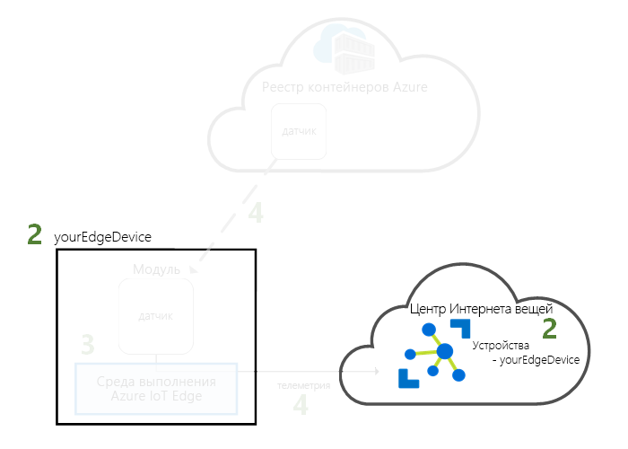
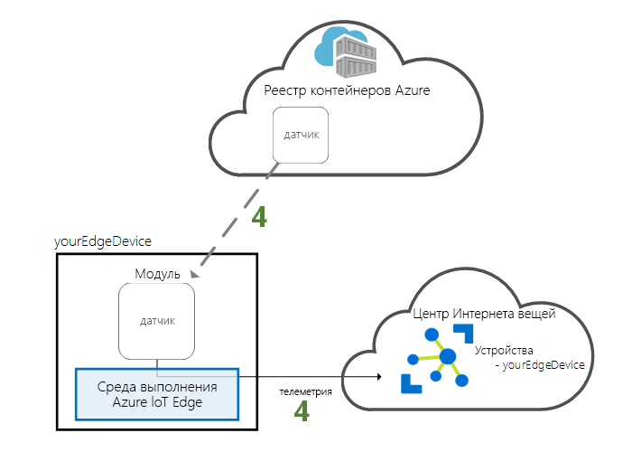

# <a name="quickstart-deploy-your-first-iot-edge-module-from-the-azure-portal-to-a-windows-device---preview"></a>Краткое руководство. Развертывание модуля IoT Edge на устройстве с Windows на портале Azure (предварительная версия)

В этом кратком руководстве вы примените облачный интерфейс Azure IoT Edge для удаленного развертывания готового кода на устройстве IoT Edge. Чтобы выполнить эту задачу, сначала вы создадите и настроите виртуальную машину Windows для работы в качестве устройства IoT Edge, а затем развернете модуль на ней.

Из этого краткого руководства вы узнаете, как выполнять следующие задачи:

1. Создайте Центр Интернета вещей.
2. Регистрация устройства IoT Edge в Центре Интернета вещей.
3. Установка и запуск среды выполнения IoT Edge на устройстве.
4. Удаленное развертывание модуля на устройстве IoT Edge и отправка телеметрии в Центр Интернета вещей.


Модуль, который вы развернете в рамках этого краткого руководства, представляет собой имитированный датчик, генерирующий данные температуры, влажности и давления. В других руководствах по Azure IoT Edge используются наработки из этой статьи: развернутые модули, которые анализируют смоделированные данные для бизнес-аналитики.

> [!NOTE]
> Среда выполнения IoT Edge в ОС Windows доступна в режиме [общедоступной предварительной версии](https://azure.microsoft.com/support/legal/preview-supplemental-terms/).

Если у вас нет активной подписки Azure, перед началом работы создайте [бесплатную учетную запись](https://azure.microsoft.com/free).

[!INCLUDE [cloud-shell-try-it.md](../../includes/cloud-shell-try-it.md)]

Для выполнения многих действий, описанных в этом кратком руководстве, используется Azure CLI, а также расширение Интернета вещей Azure для предоставления дополнительных функций.

Добавьте расширение Интернета вещей Azure в экземпляр Cloud Shell.

   ```azurecli-interactive
   az extension add --name azure-cli-iot-ext
   ```

## <a name="prerequisites"></a>Предварительные требования

Облачные ресурсы.

* Группа ресурсов для управления всеми ресурсами, которые вы используете в этом кратком руководстве.

   ```azurecli-interactive
   az group create --name IoTEdgeResources --location westus2
   ```

Устройства IoT Edge:

* Виртуальная машина Windows для работы в качестве устройства IoT Edge. Вы можете создать эту виртуальную машину с помощью следующей команды, заменив *{password}* надежным паролем:

  ```azurecli-interactive
  az vm create --resource-group IoTEdgeResources --name EdgeVM --image MicrosoftWindowsDesktop:Windows-10:rs5-pro:latest --admin-username azureuser --admin-password {password} --size Standard_DS1_v2
  ```

  Создание и запуск виртуальной машины может занять несколько минут. Затем вы можете загрузить RDP-файл, который будет использоваться при подключении к виртуальной машине:

  1. Перейдите к новой виртуальной машине Windows на портале Azure.
  1. Нажмите кнопку **Подключиться**.
  1. На вкладке **RDP** выберите **Скачать RDP-файл**.

  Откройте этот файл, используя подключение к удаленному рабочему столу, чтобы подключиться к виртуальной машине Windows, указав имя и пароль администратора, заданные в команде `az vm create`.

## <a name="create-an-iot-hub"></a>Создание Центра Интернета вещей

Начните с создания Центра Интернета вещей с помощью Azure CLI.


Для целей этого руководства можно использовать бесплатный уровень. Если вы уже использовали бесплатный Центр Интернета вещей и он у вас сохранился, можете использовать его. В подписке может быть только один бесплатный Центр Интернета вещей.

При помощи следующего кода создается бесплатный центр **F1** в группе ресурсов **IoTEdgeResources**. Замените *{hub_name}* уникальным именем для вашего Центра Интернета вещей.

   ```azurecli-interactive
   az iot hub create --resource-group IoTEdgeResources --name {hub_name} --sku F1
   ```

   Если отобразится сообщение об ошибке с уведомлением о том, что в вашей подписке уже имеется один бесплатный центр, измените номер SKU на **S1**. Если отобразится сообщение об ошибке с уведомлением о том, что имя недоступно, значит кто-то уже создал Центр Интернета вещей с таким именем. Выберите другое имя.

## <a name="register-an-iot-edge-device"></a>Регистрация устройства IoT Edge

Зарегистрируйте устройство IoT Edge в только что созданном Центре Интернета вещей.


Создайте удостоверение для своего имитированного устройства, чтобы оно могло обмениваться данными с Центром Интернета вещей. Удостоверение устройства находится в облаке. Чтобы связать физическое устройство с удостоверением, нужно использовать уникальную строку подключения к устройству.

Так как поведение и управление устройств IoT Edge и обычных устройств Интернета вещей отличаются, укажите в удостоверении, что это устройство IoT Edge, с помощью флага `--edge-enabled`.

1. Чтобы создать устройство с именем **myEdgeDevice** в Центре Интернета вещей, введите следующую команду в Azure Cloud Shell.

   ```azurecli-interactive
   az iot hub device-identity create --device-id myEdgeDevice --hub-name {hub_name} --edge-enabled
   ```

   Если отобразится сообщение об ошибке при использовании ключей политики iothubowner, убедитесь, что в Cloud Shell установлена последняя версия расширения azure-cli-iot-ext.

2. Получите строку подключения для устройства, которая связывает физическое устройство с его идентификатором в Центре Интернета вещей.

   ```azurecli-interactive
   az iot hub device-identity show-connection-string --device-id myEdgeDevice --hub-name {hub_name}
   ```

3. Скопируйте значение ключа `connectionString` из выходных данных JSON и сохраните его. Это значение — строка подключения устройства. Эта строка потребуется для настройки среды выполнения IoT Edge в следующем разделе.

   

## <a name="install-and-start-the-iot-edge-runtime"></a>Установка и запуск среды выполнения IoT Edge

Установите среду выполнения Azure IoT Edge на устройстве IoT Edge и настройте для нее строку подключения к устройству.


Среда выполнения IoT Edge развертывается на всех устройствах IoT Edge. Она состоит из трех компонентов. **Управляющая программа безопасности IoT Edge** запускается при каждой загрузке устройства Edge, перезагружая его путем запуска агента IoT Edge. **Агент IoT Edge** упрощает развертывание и мониторинг модулей на устройстве IoT Edge, включая центр IoT Edge. **Центр IoT Edge** управляет взаимодействием между модулями на устройстве IoT Edge, а также между устройством и Центром Интернета вещей.

Скрипт установки также включает в себя обработчик контейнеров (Moby), который управляет образами контейнеров на вашем устройстве IoT Edge.

Во время установки среды выполнения появится запрос на строку подключения к устройству. Используйте строку, полученную с помощью Azure CLI. Эта строка свяжет ваше физическое устройство с удостоверением устройства IoT Edge в Azure.

### <a name="connect-to-your-iot-edge-device"></a>Подключение к устройству IoT Edge

Действия, описанные в этом разделе, будут происходить на вашем устройстве IoT Edge, поэтому вам необходимо подключиться к этой виртуальной машине через удаленный рабочий стол.

### <a name="prepare-your-device-for-containers"></a>Подготовка устройства для контейнеров

Скрипт установки автоматически устанавливает подсистему Moby на устройстве перед установкой IoT Edge. Подготовьте устройство, включив функцию контейнеров.

1. На панели запуска найдите **Включение и отключение компонентов Windows** и откройте программу панели управления.
1. Найдите и выберите **Контейнеры**.
1. Нажмите кнопку **ОК**.

После завершения необходимо перезапустить Windows, чтобы изменения вступили в силу. Вместо перезапуска виртуальной машины на портале Azure это можно сделать во время сеанса удаленного рабочего стола.

### <a name="download-and-install-the-iot-edge-service"></a>Скачивание и установка службы IoT Edge

Загрузите и установите среду выполнения IoT Edge с помощью PowerShell. Настройте свое устройство, используя строку подключения к устройству, которую вы извлекли из Центра Интернета вещей.

1. На устройстве IoT Edge запустите PowerShell от имени администратора.

2. Загрузите и установите службу IoT Edge на устройстве.

   ```powershell
   . {Invoke-WebRequest -useb aka.ms/iotedge-win} | Invoke-Expression; `
   Install-SecurityDaemon -Manual -ContainerOs Windows
   ```

3. При появлении запроса на строку **DeviceConnectionString** укажите строку, скопированную в предыдущем разделе. Не заключайте строку подключения в кавычки.

### <a name="view-the-iot-edge-runtime-status"></a>Просмотр состояния среды выполнения IoT Edge

Убедитесь, что среда выполнения успешно установлена и настроена.

1. Проверьте состояние службы IoT Edge.

   ```powershell
   Get-Service iotedge
   ```

2. Если нужно устранить неполадки со службой, извлеките журналы службы.

   ```powershell
   # Displays logs from today, newest at the bottom.

   Get-WinEvent -ea SilentlyContinue `
    -FilterHashtable @{ProviderName= "iotedged";
      LogName = "application"; StartTime = [datetime]::Today} |
    select TimeCreated, Message |
    sort-object @{Expression="TimeCreated";Descending=$false} |
    format-table -autosize -wrap
   ```

3. Просмотрите данные обо всех модулях, запущенных на устройстве IoT Edge. Так как служба запущена первый раз, отобразится только запущенный модуль **edgeAgent**. Модуль edgeAgent запускается по умолчанию и позволяет установить и запустить любые дополнительные модули, развертываемые на устройстве.

   ```powershell
   iotedge list
   ```

   

Для завершения установки и запуска модуля агента IoT Edge может потребоваться несколько минут.

Теперь устройство IoT Edge настроено. Оно готово для запуска модулей, развернутых в облаке.

## <a name="deploy-a-module"></a>Развертывание модуля

Управляя устройством Azure IoT Edge из облака, разверните модуль, который будет передавать данные телеметрии в Центр Интернета вещей.


[!INCLUDE [iot-edge-deploy-module](../../includes/iot-edge-deploy-module.md)]

## <a name="view-generated-data"></a>Просмотр сформированных данных

В этом руководстве описано, как создать устройство IoT Edge и установить на нем среду выполнения IoT Edge. Затем с помощью портала Azure мы развернули модуль IoT Edge на устройстве, обеспечив возможность запуска без необходимости менять настройки на устройстве.

В этом примере отправленный модуль создает пример данных, которые можно использовать для тестирования. Имитированный модуль датчика температуры создает данные среды, которые вы сможете позже использовать для тестирования. Имитируемый датчик выполняет мониторинг оборудования и окружающей среды. Например, этот датчик может быть в серверной комнате, производственном цехе или ветроэлектрической установке. В сообщении отображаются данные о температуре и влажности окружающей среды, температуре и давлении оборудования, а также метка времени. При работе с руководствами по IoT Edge используйте данные, созданные этим модулем, как тестовые данные для аналитики.

Убедитесь, что развернутый из облака модуль работает на вашем устройстве IoT Edge.

```powershell
iotedge list
```

   

Убедитесь, что сообщения отправляются с модуля датчика температуры в облако.

```powershell
iotedge logs SimulatedTemperatureSensor -f
```

   >[!TIP]
   >В командах IoT Edge при использовании имен модулей учитывается регистр.

   

Вы также можете просматривать сообщения, которые поступают в Центр Интернета вещей, с помощью [расширения набора средств Центра Интернета вещей для Visual Studio Code](https://marketplace.visualstudio.com/items?itemName=vsciot-vscode.azure-iot-toolkit) (прежнее название — расширение набора средств Azure IoT).

## <a name="clean-up-resources"></a>Очистка ресурсов

Если вы хотите продолжить ознакомление с руководствами по IoT Edge, используйте устройство, зарегистрированное и настроенное в рамках этого краткого руководства. В противном случае можно удалить с устройства созданные ресурсы Azure и среду выполнения IoT Edge.

### <a name="delete-azure-resources"></a>Удаление ресурсов Azure

Если вы создали виртуальную машину и Центр Интернета вещей в новой группе ресурсов, можно удалить эту группу и все связанные с ней ресурсы. Внимательно проверьте содержимое группы ресурсов. В ней не должно быть важных ресурсов. Если вы не хотите удалять всю группу, можно удалить отдельные ресурсы.

Удалите группу **IoTEdgeResources**.

   ```azurecli-interactive
   az group delete --name IoTEdgeResources
   ```

### <a name="remove-the-iot-edge-runtime"></a>Удаление среды выполнения IoT Edge

Чтобы удалить файлы установки с устройства, используйте приведенные ниже команды.  

Удалите среду выполнения IoT Edge. Если вы планируете повторно установить IoT Edge, пропустите параметры `-DeleteConfig` и `-DeleteMobyDataRoot`, чтобы выполнить переустановку с использованием настроенной конфигурации.

   ```powershell
   . {Invoke-WebRequest -useb aka.ms/iotedge-win} | Invoke-Expression; `
   Uninstall-SecurityDaemon -DeleteConfig -DeleteMobyDataRoot
   ```

## <a name="next-steps"></a>Дополнительная информация

При работе с этим кратким руководством вы создали устройство IoT Edge и с помощью облачного интерфейса Azure IoT Edge развернули код на устройстве. В итоге вы получили устройство для тестирования, генерирующее необработанные данные о своей среде.

Вы можете перейти к любому из оставшихся руководств, чтобы узнать, как Azure IoT Edge может помочь вам превратить данные в бизнес-аналитику на пограничном устройстве.

> [!div class="nextstepaction"]
> [Фильтрация данных датчика с помощью Функций Azure](tutorial-deploy-function.md)
