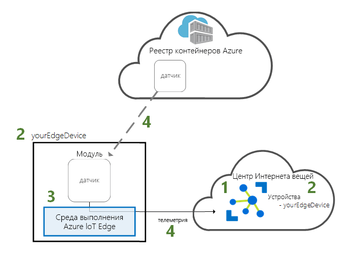
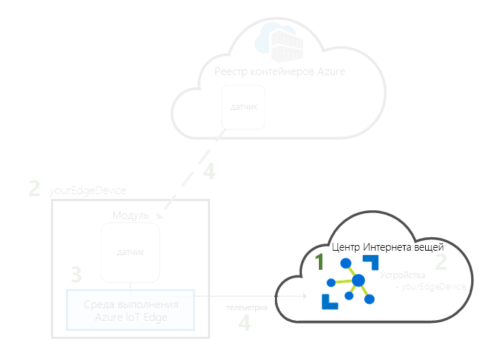
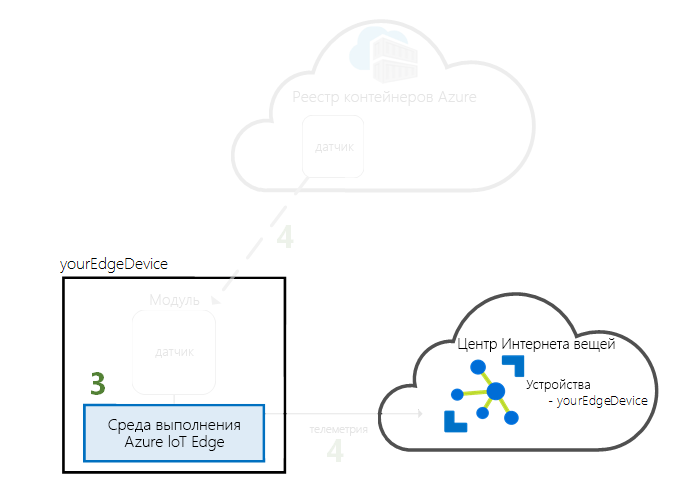

# <a name="quickstart-deploy-your-first-iot-edge-module-from-the-azure-portal-to-a-windows-device---preview"></a>Краткое руководство по развертыванию первого простого модуля IoT Edge на устройстве с Windows при помощи портала Azure (предварительная версия)

В этом кратком руководстве вы примените облачный интерфейс Azure IoT Edge для удаленного развертывания готового кода на устройстве IoT Edge. Чтобы выполнить эту задачу, сначала создайте виртуальное устройство IoT Edge на устройстве с Windows,а затем разверните на нем нужный модуль.

Из этого краткого руководства вы узнаете, как выполнять следующие задачи:

1. Создайте Центр Интернета вещей.
2. Регистрация устройства IoT Edge в Центре Интернета вещей.
3. Установка и запуск среды выполнения IoT Edge на устройстве.
4. Удаленное развертывание модуля на устройстве IoT Edge и отправка телеметрии в Центр Интернета вещей.



Модуль, который вы развернете в рамках этого краткого руководства, представляет собой имитированный датчик, генерирующий данные температуры, влажности и давления. В других руководствах по Azure IoT Edge используются наработки из этой статьи: развернутые модули, которые анализируют смоделированные данные для бизнес-аналитики.

>[!NOTE]
>Среда выполнения IoT Edge в ОС Windows доступна в режиме [общедоступной предварительной версии](https://azure.microsoft.com/support/legal/preview-supplemental-terms/).

Если у вас нет активной подписки Azure, перед началом работы создайте [бесплатную учетную запись](https://azure.microsoft.com/free).

[!INCLUDE [cloud-shell-try-it.md](../../includes/cloud-shell-try-it.md)]

Для выполнения многих действий, описанных в этом кратком руководстве, используется Azure CLI, а также расширение Интернета вещей Azure для предоставления дополнительных функций.

Добавьте расширение Интернета вещей Azure в экземпляр Cloud Shell.

   ```azurecli-interactive
   az extension add --name azure-cli-iot-ext
   ```

## <a name="prerequisites"></a>Предварительные требования

Облачные ресурсы.

* Группа ресурсов для управления всеми ресурсами, которые вы используете в этом кратком руководстве.

   ```azurecli-interactive
   az group create --name IoTEdgeResources --location westus
   ```

Устройства IoT Edge:

* Компьютер или виртуальная машина с Windows для работы в качестве устройства IoT Edge. Используйте поддерживаемую версию Windows:
  * Windows 10 или более поздней версии;
  * Windows Server 2016 или поздней версии.
* При использовании компьютера под управлением Windows убедитесь, что он соответствует [системным требованиям](https://docs.microsoft.com/virtualization/hyper-v-on-windows/reference/hyper-v-requirements) для использования Hyper-V.
* При использовании виртуальной машины включите [вложенную виртуализацию](https://docs.microsoft.com/virtualization/hyper-v-on-windows/user-guide/nested-virtualization) и выделите не менее 2 ГБ памяти.
* Установите среду [Docker для Windows](https://docs.docker.com/docker-for-windows/install/) и убедитесь, что она выполняется.

> [!TIP]
> При настройке Docker можно выбрать использование контейнеров Windows или Linux. В этом кратком руководстве описано, как настроить среду выполнения IoT Edge для использования контейнеров Linux.

## <a name="create-an-iot-hub"></a>Создание Центра Интернета вещей

Начните с создания Центра Интернета вещей с помощью Azure CLI.



Для целей этого руководства можно использовать бесплатный уровень. Если вы уже использовали бесплатный Центр Интернета вещей и он у вас сохранился, можете использовать его. В подписке может быть только один бесплатный Центр Интернета вещей.

При помощи следующего кода создается бесплатный центр **F1** в группе ресурсов **IoTEdgeResources**. Замените *{hub_name}* уникальным именем для вашего Центра Интернета вещей.

   ```azurecli-interactive
   az iot hub create --resource-group IoTEdgeResources --name {hub_name} --sku F1
   ```

   Если отобразится сообщение об ошибке с уведомлением о том, что в вашей подписке уже имеется один бесплатный центр, измените номер SKU на **S1**.

## <a name="register-an-iot-edge-device"></a>Регистрация устройства IoT Edge

Зарегистрируйте устройство IoT Edge в только что созданном Центре Интернета вещей.


Создайте удостоверение для своего имитированного устройства, чтобы оно могло обмениваться данными с Центром Интернета вещей. Удостоверение устройства находится в облаке. Чтобы связать физическое устройство с удостоверением, нужно использовать уникальную строку подключения к устройству.

Так как устройства IoT Edge отличаются от стандартных устройств Интернета вещей поведением и управлением, объявите свое устройство устройством IoT Edge с самого начала.

1. Чтобы создать устройство с именем **myEdgeDevice** в Центре Интернета вещей, введите следующую команду в Azure Cloud Shell.

   ```azurecli-interactive
   az iot hub device-identity create --device-id myEdgeDevice --hub-name {hub_name} --edge-enabled
   ```

1. Получите строку подключения для устройства, которая связывает физическое устройство с его идентификатором в Центре Интернета вещей.

   ```azurecli-interactive
   az iot hub device-identity show-connection-string --device-id myEdgeDevice --hub-name {hub_name}
   ```

1. Скопируйте строку подключения и сохраните ее. Это значение потребуется для настройки среды выполнения IoT Edge в следующем разделе.

## <a name="install-and-start-the-iot-edge-runtime"></a>Установка и запуск среды выполнения IoT Edge

Установите среду выполнения Azure IoT Edge на устройстве IoT Edge и настройте для нее строку подключения к устройству.


Среда выполнения IoT Edge развертывается на всех устройствах IoT Edge. Она состоит из трех компонентов. **Управляющая программа безопасности IoT Edge** запускается при каждой загрузке устройства Edge и перезагружает устройство, запустив агент IoT Edge. **Агент IoT Edge** упрощает развертывание и мониторинг модулей на устройстве IoT Edge, включая центр IoT Edge. **Центр IoT Edge** управляет взаимодействием между модулями на устройстве IoT Edge, а также между устройством и Центром Интернета вещей.

Во время установки среды выполнения появится запрос на строку подключения к устройству. Используйте строку, полученную с помощью Azure CLI. Эта строка свяжет ваше физическое устройство с удостоверением устройства IoT Edge в Azure.

Следуя инструкциям в этом разделе, вы настроите среду выполнения IoT Edge с контейнерами Linux. Если нужно использовать контейнеры Windows, см. статью [Install Azure IoT Edge runtime on Windows to use with Windows containers](how-to-install-iot-edge-windows-with-windows.md) (Установка среды выполнения IoT Edge в Windows для использования контейнеров Windows).

Выполните следующие шаги на компьютере или виртуальной машине с Windows, которую вы подготовили для работы в качестве устройства IoT Edge.

### <a name="download-and-install-the-iot-edge-service"></a>Скачивание и установка службы IoT Edge

Загрузите и установите среду выполнения IoT Edge с помощью PowerShell. Настройте свое устройство, используя строку подключения к устройству, которую вы извлекли из Центра Интернета вещей.

1. На устройстве IoT Edge запустите PowerShell от имени администратора.

2. Загрузите и установите службу IoT Edge на устройстве.

   ```powershell
   . {Invoke-WebRequest -useb aka.ms/iotedge-win} | Invoke-Expression; `
   Install-SecurityDaemon -Manual -ContainerOs Linux
   ```

3. При появлении запроса на строку **DeviceConnectionString** укажите строку, скопированную в предыдущем разделе. Не заключайте строку подключения в кавычки.

### <a name="view-the-iot-edge-runtime-status"></a>Просмотр состояния среды выполнения IoT Edge

Убедитесь, что среда выполнения успешно установлена и настроена.

1. Проверьте состояние службы IoT Edge.

   ```powershell
   Get-Service iotedge
   ```

2. Если нужно устранить неполадки со службой, извлеките журналы службы.

   ```powershell
   # Displays logs from today, newest at the bottom.

   Get-WinEvent -ea SilentlyContinue `
    -FilterHashtable @{ProviderName= "iotedged";
      LogName = "application"; StartTime = [datetime]::Today} |
    select TimeCreated, Message |
    sort-object @{Expression="TimeCreated";Descending=$false} |
    format-table -autosize -wrap
   ```

3. Просмотрите данные обо всех модулях, запущенных на устройстве IoT Edge. Так как служба запущена первый раз, отобразится только запущенный модуль **edgeAgent**. Модуль edgeAgent запускается по умолчанию и позволяет установить и запустить любые дополнительные модули, развертываемые на устройстве.

   ```powershell
   iotedge list
   ```

   

Теперь устройство IoT Edge настроено. Оно готово для запуска модулей, развернутых в облаке.

## <a name="deploy-a-module"></a>Развертывание модуля

Управляя устройством Azure IoT Edge из облака, разверните модуль, который будет передавать данные телеметрии в Центр Интернета вещей.


[!INCLUDE [iot-edge-deploy-module](../../includes/iot-edge-deploy-module.md)]

## <a name="view-generated-data"></a>Просмотр сформированных данных

В этом руководстве мы создали новое устройство IoT Edge и установили на нем среду выполнения IoT Edge. Затем с помощью портала Azure мы отправили на устройство и запустили модуль IoT Edge, не изменяя на устройстве никаких настроек. В этом примере отправленный модуль создает данные среды, которые можно использовать для работы с руководствами.

Убедитесь, что развернутый из облака модуль работает на вашем устройстве IoT Edge.

```powershell
iotedge list
```

   

Убедитесь, что сообщения отправляются из модуля tempSensor в облако.

```powershell
iotedge logs tempSensor -f
```

  

Вы также можете просматривать сообщения, которые получает Центр Интернета вещей, используя [расширение Azure IoT Toolkit для Visual Studio Code](https://marketplace.visualstudio.com/items?itemName=vsciot-vscode.azure-iot-toolkit).

## <a name="clean-up-resources"></a>Очистка ресурсов

Если вы хотите продолжить ознакомление с руководствами по IoT Edge, используйте устройство, зарегистрированное и настроенное в рамках этого краткого руководства. В противном случае можно удалить с устройства созданные ресурсы Azure и среду выполнения IoT Edge.

### <a name="delete-azure-resources"></a>Удаление ресурсов Azure

Если вы создали виртуальную машину и Центр Интернета вещей в новой группе ресурсов, можно удалить эту группу и все связанные с ней ресурсы. Если в группе ресурсов, которую необходимо удалить, имеются важные данные, можно удалить только ненужные ресурсы.

Удалите группу **IoTEdgeResources**.

   ```azurecli-interactive
   az group delete --name IoTEdgeResources
   ```

### <a name="remove-the-iot-edge-runtime"></a>Удаление среды выполнения IoT Edge

Если вы планируете использовать устройство IoT Edge для тестирования в будущем, но хотите, чтобы неиспользуемый модуль tempSensor перестал отправлять данные в Центр Интернета вещей, остановите работу службы IoT Edge, используя приведенную ниже команду.

   ```powershell
   Stop-Service iotedge -NoWait
   ```

Когда вы будете готовы к тестированию, вы сможете перезапустить службы.

   ```powershell
   Start-Service iotedge
   ```

Чтобы удалить файлы установки с устройства, используйте приведенные ниже команды.  

Удалите среду выполнения IoT Edge.

   ```powershell
   . {Invoke-WebRequest -useb aka.ms/iotedge-win} | Invoke-Expression; `
   Uninstall-SecurityDaemon
   ```

При удалении среды выполнения IoT Edge созданные с ее помощью контейнеры остановятся, но будут по-прежнему храниться на устройстве. Просмотрите все контейнеры.

   ```powershell
   docker ps -a
   ```

Удалите контейнеры, созданные на устройстве средой выполнения IoT Edge. Измените имя контейнера tempSensor, если вы указали для него другое имя.

   ```powershell
   docker rm -f tempSensor
   docker rm -f edgeHub
   docker rm -f edgeAgent
   ```
   
## <a name="next-steps"></a>Дополнительная информация

При работе с этим кратким руководством вы создали устройство IoT Edge и с помощью облачного интерфейса Azure IoT Edge развернули код на устройстве. В итоге вы получили устройство для тестирования, генерирующее необработанные данные о своей среде.

Вы можете перейти к любому из оставшихся руководств, чтобы узнать, как Azure IoT Edge может помочь вам превратить данные в бизнес-аналитику на пограничном устройстве.

> [!div class="nextstepaction"]
> [Фильтрация данных датчика с помощью Функций Azure](tutorial-deploy-function.md)
