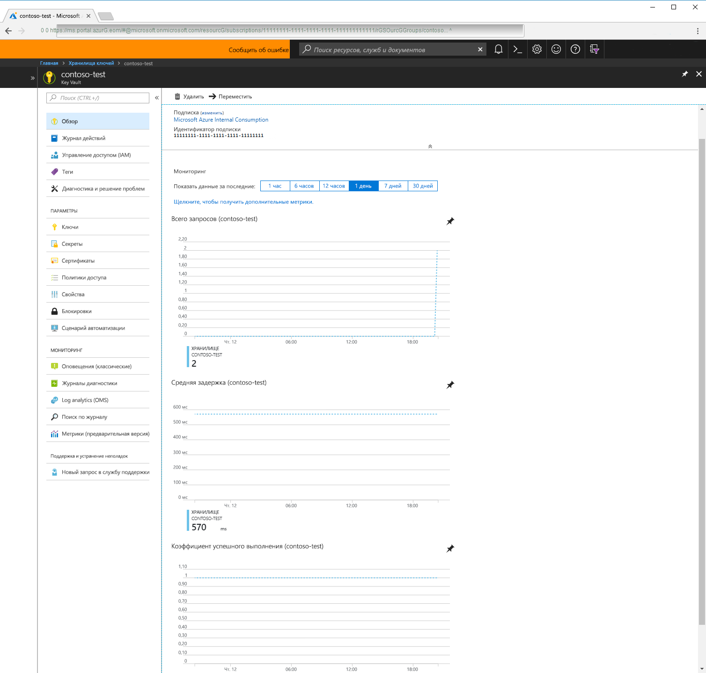

# Что такое хранилище ключей Azure?

Azure Key Vault — это облачная служба, которая работает как защищенное хранилище секретов.

У вас есть пароли, строки подключения и другие фрагменты данных, требуемые для работы приложений. Необходимо убедиться, что информация доступна, но защищена. В этом может помочь Azure Key Vault. Azure Key Vault может помочь в надежном хранении секретов приложения и в управлении ими.

Key Vault позволяет создать несколько безопасных контейнеров, называемых хранилищами. Эти хранилища поддерживают аппаратные модули безопасности (HSM). Хранилища позволяют уменьшить вероятность случайной потери информации о безопасности путем централизации хранения секретов приложений. Хранилища Key Vault также контролируют и регистрируют доступ к чему-либо, что хранится в них. Azure Key Vault может обрабатывать запросы и обновлять сертификаты протокола TLS, предоставляя функции, необходимые для надежного решения по управлению жизненным циклом сертификата.

 Решение Azure Key Vault предназначено для поддержки ключей приложения и секретов. Оно не предназначено для использования в качестве хранилища паролей пользователей.

## Использование Azure Key Vault

### Централизация секретов приложений

Централизованное хранение секретов приложения в Azure Key Vault позволяет управлять их распространением. Это значительно снижает вероятность случайной утечки секретов. При использовании Key Vault разработчикам приложений больше не требуется хранить информацию о безопасности своих приложений. Это устраняет необходимость встраивать эту информацию в код. Например, приложению может потребоваться подключиться к базе данных. Вместо хранения строки подключения в коде приложений она безопасно хранится в Key Vault.

Приложения могут безопасно получать доступ к необходимой информации, используя универсальные коды ресурса (URI), которые позволяют им получить определенные версии секретов после того, как ключ или секрет приложения будет сохранен в Azure Key Vault. Это происходит без необходимости писать настраиваемый код для защиты какой-либо секретной информации.

### Безопасное хранение секретов

Azure защищает ключи с использованием стандартных отраслевых алгоритмов, методов управления длиной ключей и аппаратных модулей безопасности (HSM). Аппаратные модули безопасности (HSM) используют проверенный федеральный стандарт обработки информации (FIPS) 140-2 уровня 2.

Прежде чем вызывающий объект (пользователь или приложение) сможет получить доступ к хранилищу ключей, требуется правильная проверка подлинности и авторизация. При проверке подлинности выполняется идентификация вызывающего объекта, а при авторизации определяется, какие операции ему разрешено выполнять.

Проверка подлинности выполняется с помощью Azure Active Directory. Авторизацию можно выполнить с помощью управления доступом на основе ролей (RBAC) или политики доступа Key Vault. RBAC используется при управлении хранилищами, а политика доступа к хранилищу ключей используется при попытке доступа к данным в хранилище.

Azure Key Vault может быть защищено либо с помощью программного обеспечения, либо с помощью оборудования HSM. В ситуациях, когда необходимо обеспечить более высокий уровень защиты, можно импортировать ключи или создать их в аппаратных модулях безопасности (ключи никогда не покидают их пределов). Корпорация Майкрософт использует аппаратные модули безопасности Thales. Средства Thales можно использовать для перемещения ключа из модуля HSM в Azure Key Vault.

Наконец, Azure Key Vault разработано таким образом, чтобы сотрудники корпорации Майкрософт не могли видеть или извлекать ваши ключи.

### Мониторинг доступа и использования

После создания пары Key Vault требуется следить за тем, как и когда к вашим ключам и секретам осуществляется доступ. Это можно сделать, включив ведение журнала Key Vault. Для Azure Key Vault можно настроить следующее:

- архивацию в учетной записи хранения;
- передачу в концентратор событий;
- отправку журналов в Log Analytics.

У вас есть контроль над журналами, их можно защитить, ограничив доступ. Кроме того, вы можете удалить ненужные журналы.

### Упрощенное администрирование секретов приложений

При хранении ценных данных необходимо выполнить несколько шагов. Информация о безопасности должна быть защищена, соответствовать жизненному циклу и быть высокодоступной. Azure Key Vault упрощает следующее:

- Отсутствие необходимости в собственных знаниях об HSM.
- Масштабирование в соответствии с пиками потребления вашей организации.
- Репликацию содержимого Key Vault в рамках региона и в дополнительный регион. Это обеспечивает высокий уровень доступности и не требует вмешательства администратора для запуска отработки отказа.
- Предоставление стандартных возможностей администрирования через портал, Azure CLI и PowerShell.
- Автоматизацию определенных задач с сертификатами, приобретенными в общедоступных центрах сертификации, например регистрацию и продление срока действия.

Кроме того, Azure Key Vault позволяет разделять секреты приложений. Приложения имеют доступ только к тому хранилищу, к которому им разрешено получать доступ, и смогут выполнять только определенные операции. Вы можете создать Azure Key Vault для каждого приложения и ограничить секреты, хранящиеся в Key Vault, конкретным приложением и командой разработчиков.

### Интеграция с другими службами Azure

Являясь защищенным хранилищем в Azure, Key Vault используется для упрощения таких сценариев, как [шифрование дисков Azure](../security/azure-security-disk-encryption.md), функции [постоянного шифрования]( https://docs.microsoft.com/sql/relational-databases/security/encryption/always-encrypted-database-engine) на сервере SQL и Azure SQL, [веб-приложений Azure]( https://docs.microsoft.com/azure/app-service/web-sites-purchase-ssl-web-site). Сам Key Vault можно интегрировать с учетными записями хранения, концентраторами событий и аналитикой журнала.

## Дополнительная информация

- [Краткое руководство. Создание Azure Key Vault с помощью CLI](quick-create-cli.md)
- [Tutorial: Configure an Azure web application to read a secret from Key Vault](tutorial-web-application-keyvault.md) (Руководство. Настройка веб-приложения Azure для считывания секрета из Key Vault)