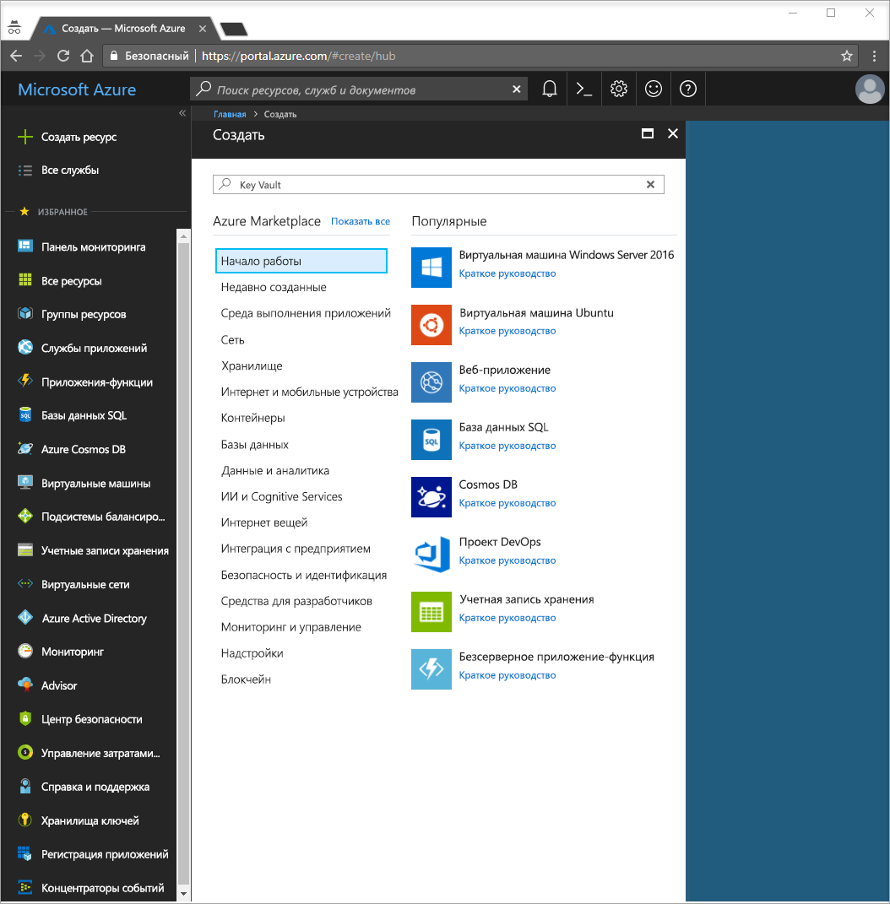
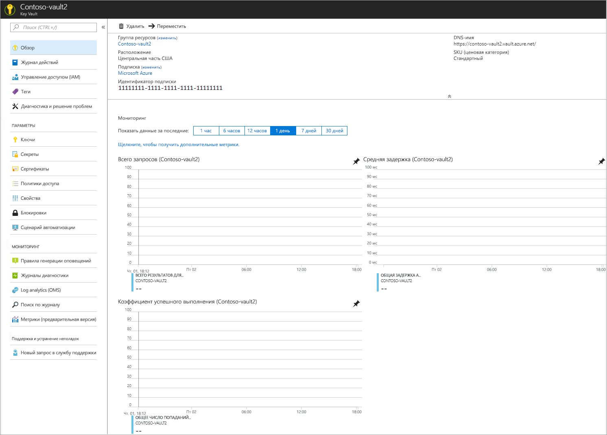

# Краткое руководство. Настройка и получение секрета из Azure Key Vault с помощью портала Azure

Azure Key Vault — это облачная служба, которая предоставляет защищенное хранилище для секретов. Вы можете безопасно хранить ключи, пароли, сертификаты и другие секреты. Создать хранилища Azure Key Vault и управлять ими можно на портале Azure. В рамках этого краткого руководства вы создадите хранилище ключей, используемое для хранения секрета. См. дополнительные сведения о [Key Vault](key-vault-overview.md).

Если у вас еще нет подписки Azure, [создайте бесплатную учетную запись Azure](https://azure.microsoft.com/free/?WT.mc_id=A261C142F), прежде чем начинать работу.

## Вход в Azure

Войдите на портал Azure по адресу http://portal.azure.com.

## Создание хранилища

1. Выберите параметр **Создать ресурс** в верхнем левом углу окна портала Azure.

    
2. В поле поиска введите **Key Vault**.
3. В списке результатов выберите **Key Vault**.
4. В разделе Key Vault выберите **Создать**.
5. В разделе **Создать Key Vault** введите приведенные ниже сведения.
    - **Имя** — укажите имя ресурса. В этом руководстве мы используем **Contoso-vault2**. 
    - **Подписка** — выберите подписку.
    - В разделе **Группа ресурсов** выберите **Создать** и введите имя группы ресурсов.
    - В раскрывающемся меню **Расположение** выберите расположение.
    - Установите флажок **Закрепить на панели мониторинга**.
    - Для других параметров оставьте значения по умолчанию.
6. Указав приведенные выше сведения, выберите **Создать**.

Запишите значения двух указанных ниже свойств.

* **Имя хранилища**. В данном примере это **Contoso-Vault2**. Вы будете использовать это имя для выполнения других этапов.
* **Код URI хранилища**. В данном примере это https://contoso-vault2.vault.azure.net/. Необходимо, чтобы приложения, использующие ваше хранилище через REST API, использовали этот URI.

На этом этапе операции в новом хранилище ключей может выполнять только учетная запись Azure.

## Добавление секрета в Key Vault

Чтобы добавить секрет в хранилище, вам просто нужно выполнить несколько дополнительных шагов. В нашем примере мы добавим пароль, который может использоваться приложением. Пароль называется **ExamplePassword**, и в нем хранится значение **Pa$$w0rd**.

1. На странице свойств Key Vault выберите **Секреты**.
2. Щелкните **Generate/Import** (Создать или импортировать).
3. На экране **Создание секрета** выберите следующие значения:
    - **Параметры отправки**: "Вручную".
    - **Имя**: ExamplePassword.
    - **Значение**: Pa$$w0rd.
    - Оставьте другие значения по умолчанию. Нажмите кнопку **Создать**.

Получив сообщение об успешном создании секрета, вы можете выбрать его в списке. Затем можно просмотреть некоторые свойства. Если щелкнуть текущую версию, отобразится значение, указанное на предыдущем этапе.

## Очистка ресурсов

Другие руководства о Key Vault созданы на основе этого документа. Если вы планируете продолжить работу с последующими краткими руководствами и статьями, эти ресурсы можно не удалять.
Удалите ненужную группу ресурсов. Key Vault и связанные ресурсы будут также удалены. Чтобы удалить группу ресурсов на портале, сделайте следующее:

1. В поле поиска в верхней части портала введите имя группы ресурсов. Если в результатах поиска отображается группа ресурсов, используемая в этом кратком руководстве, выберите ее.
2. Выберите **Удалить группу ресурсов**.
3. В поле **Введите имя группы ресурсов:** введите имя группы ресурсов и выберите **Удалить**.

## Дополнительная информация

В этом кратком руководстве вы создали Key Vault и сохранили секрет. Чтобы получить дополнительные сведения о Key Vault и о том, как вы можете использовать его в своих приложениях, ознакомьтесь с руководством по веб-приложениям, работающим с Key Vault.

> [!div class="nextstepaction"]
> Чтобы узнать, как считать секрет из Key Vault с помощью веб-приложения, используя управляемые удостоверения для ресурсов Azure, см. руководство по [настройке веб-приложения Azure для чтения секретов из Key Vault](quick-create-net.md).
