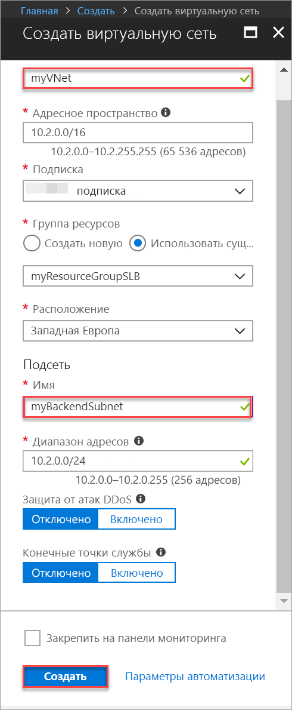
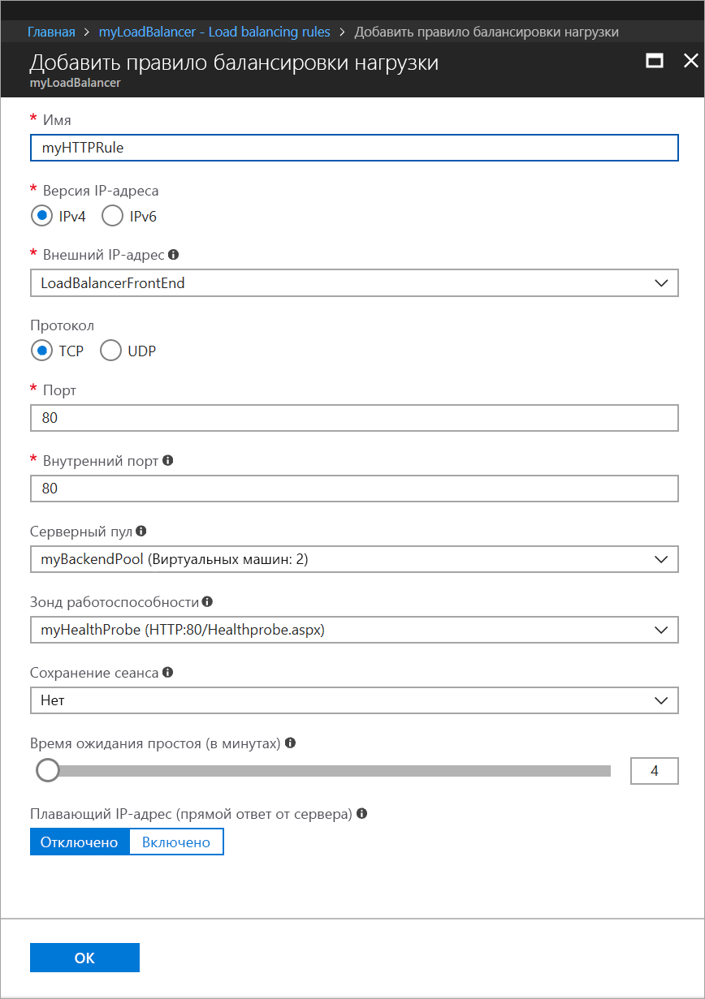

# Краткое руководство. Создание подсистемы балансировки нагрузки уровня "Стандартный" с помощью портала Azure для распределения нагрузки между виртуальными машинами

Балансировка нагрузки обеспечивает более высокий уровень доступности и масштабирования за счет распределения входящих запросов между несколькими виртуальными машинами. Вы можете использовать портал Azure для создания подсистемы балансировки нагрузки, чтобы распределять нагрузку виртуальных машин. В этом кратком руководстве показано, как распределять нагрузку между виртуальными машинами с помощью подсистемы балансировки нагрузки уровня "Стандартный".

Если у вас еще нет подписки Azure, [создайте бесплатную учетную запись Azure](https://azure.microsoft.com/free/?WT.mc_id=A261C142F), прежде чем начинать работу. 

## Вход в Azure

Войдите на портал Azure по адресу [http://portal.azure.com](http://portal.azure.com).

## Создание общедоступной подсистемы балансировки нагрузки

В этом разделе вы создадите общедоступную подсистему балансировки нагрузки, помогающую распределять нагрузку виртуальных машин. Подсистема балансировки нагрузки уровня "Стандартный" поддерживает только стандартные общедоступные IP-адреса. Вместе с подсистемой балансировки нагрузки уровня "Стандартный" необходимо также создать новый стандартный общедоступный IP-адрес, настроенный для него в качестве интерфейсного сервера (с именем *LoadBalancerFrontend* по умолчанию). 

1. В верхней левой части экрана выберите **Создать ресурс** > **Сети** > **Балансировщик нагрузки**.
2. На странице**Создание подсистемы балансировки нагрузки** введите или выберите следующие сведения, примите значения по умолчанию для остальных параметров и нажмите кнопку **Создать**:

    | Параметр                 | Значение                                              |
    | ---                     | ---                                                |
    | ИМЯ                   | *myLoadBalancer*                                   |
    | type          | Общедоступные                                        |
    | SKU           | Стандартная                          |
    | Общедоступный IP-адрес | Выберите **Создать** и введите *myPublicIP* в текстовом поле. По умолчанию для общедоступного IP-адреса выбран SKU "Стандартный". В поле **Зона доступности** выберите **Избыточное между зонами**. |
    | Подписка               | Выберите свою подписку.    |
    |Группа ресурсов | Выберите **Создать**, а затем введите *myResourceGroupSLB*.    |
    | Расположение           | Выберите **Западная Европа**.                          |
    

## Создание внутренних серверов

В этом разделе вы создаете виртуальную сеть, две виртуальные машины внутреннего пула подсистемы балансировки нагрузки, а затем устанавливаете службы IIS на виртуальных машинах для проверки подсистемы балансировки нагрузки.

### Создать виртуальную сеть
1. В верхней левой части экрана щелкните **Создать** > **Сети** > **Виртуальная сеть**, а затем введите следующие значения для виртуальной сети:
    - *myVNet* — для имени виртуальной сети;
    - *myResourceGroupSLB* — в качестве имени имеющейся группы ресурсов;
    - *myBackendSubnet* — для имени подсети.
2. Щелкните **Создать**, чтобы создать виртуальную сеть.

    

### Создание виртуальных машин

1. В верхней части экрана слева щелкните **Создать** > **Вычисления** > **Windows Server 2016 Datacenter**, а затем введите следующие значения для виртуальной машины:
    - *myVM1* — для имени виртуальной машины;        
    - *myResourceGroupSLB* — для **группы ресурсов**. Установите флажок **Использовать существующую** и выберите *myResourceGroupSLB*.
2. Последовательно выберите **ОК**.
3. Выберите значение **DS1_V2** в качестве размера виртуальной машины и нажмите кнопку **Выбрать**.
4. Введите следующие значения для параметров виртуальной машины.
    1. Убедитесь, что выбраны виртуальная сеть *myVNet* и подсеть *myBackendSubnet*.
    2. **Общедоступный IP-адрес**. В области **Создать общедоступный IP-адрес** выберите **Стандартный**, а затем нажмите кнопку **ОК**.
    3. **Группа безопасности сети**. Выберите **Дополнительно**, а затем сделайте следующее:
        1. Выберите *Группа безопасности сети (брандмауэр) и на странице **Выбрать группу безопасности сети** щелкните **Создать**. 
        2. На странице **Создание группы безопасности сети** введите **имя** *myNetworkSecurityGroup*, а затем нажмите кнопку **ОК**.
5. Щелкните **Отключено**, чтобы отключить диагностику загрузки.
6. Нажмите кнопку **ОК**, просмотрите параметры на странице сводки и нажмите кнопку **Создать**.
7. Выполнив шаги 1–6, создайте вторую виртуальную машину с именем *VM2*, группой доступности *myAvailibilityset*, виртуальной сетью *myVnet*, подсетью *myBackendSubnet* и группой безопасности сети **myNetworkSecurityGroup*. 

### Создание правила группы безопасности сети

В этом разделе описано, как создать правила группы безопасности сети, чтобы разрешить входящие подключения по протоколу HTTP.

1. В меню слева щелкните **Все ресурсы**, а затем в списке ресурсов выберите группу безопасности сети **myNetworkSecurityGroup**, расположенную в группе ресурсов **myResourceGroupSLB**.
2. В разделе **Параметры** щелкните **Правила безопасности для входящего трафика**, а затем — **Добавить**.
3. Введите (выберите) следующие значения для правила безопасности для входящего трафика с именем *myHTTPRule*, чтобы разрешить входящие подключения HTTP через порт 80:
    - *Service Tag* — для **источника**;
    - *Internet* — для **тега службы источника**;
    - *80* — для **диапазонов портов назначения**;
    - *TCP* — для **протокола**;
    - *Разрешить* — для **действия**;
    - *100* — для значения **приоритета**;
    - *myHTTPRule* — для имени;
    - *Разрешить HTTP* — для описания.
4. Последовательно выберите **ОК**.
 
### Установка служб IIS

1. В меню слева щелкните **Все ресурсы**, а затем выберите в списке виртуальную машину **myVM1**, расположенную в группе ресурсов *myResourceGroupLB*.
2. На странице **обзора** щелкните **Подключить**, чтобы подключиться по протоколу RDP к виртуальной машине.
3. Войдите в виртуальную машину с именем пользователя *azureuser*.
4. На рабочем столе сервера перейдите к **Средства администрирования Windows**>**Диспетчер сервера**.
5. В диспетчере сервера выберите **Добавить роли и компоненты**.
6. В мастере **добавления ролей и компонентов** введите следующие значения.
    - На странице **Выбор типа установки** выберите **Установка ролей или компонентов**.
    - На странице **Выбор целевого сервера** щелкните **myVM1**.
    - На странице **Выберите роль сервера** щелкните **Веб-сервер (IIS)**.
    - Следуйте инструкциям, чтобы выполнить оставшиеся шаги мастера. 
7. Выполните шаги 1–6 для виртуальной машины *myVM2*.

## Создание ресурсов подсистемы балансировки нагрузки

В этом разделе описано, как настроить параметры подсистемы балансировки нагрузки для внутреннего пула адресов и пробы работоспособности, а также указать правила подсистемы балансировки нагрузки.

### Создание внутреннего пула адресов

Для распределения трафика между виртуальными машинами пул внутренних адресов содержит IP-адреса виртуальных сетевых карт, подключенных к подсистеме балансировки нагрузки. Создайте внутренний пул адресов *myBackendPool*, куда будут входить виртуальные машины *VM1* и *VM2*.

1. Щелкните **Все ресурсы** в меню слева, а затем из списка ресурсов выберите **myLoadBalancer**.
2. В разделе **Параметры** выберите **Серверные пулы** и нажмите кнопку **Добавить**.
3. На странице **Add a backend pool** (Добавление серверного пула) сделайте следующее:
   - В поле имени внутреннего пула введите *myBackEndPool*.
   - В качестве **виртуальной сети** выберите *myVNet*.
   - В раздел **Виртуальная машина** добавьте *myVM1* и *myVM2* с соответствующими IP-адресами и выберите **Добавить**.
    - Последовательно выберите **ОК**.

3. Убедитесь, что в настройках серверного пула подсистемы балансировки нагрузки отображаются обе виртуальные машины (**VM1** и **VM2**).

### Создание пробы работоспособности

Чтобы балансировщик нагрузки мог следить за состоянием приложения, необходимо настроить пробу работоспособности. Проба работоспособности динамически добавляет или удаляет виртуальные машины из балансировщика нагрузки на основе их ответа на проверки работоспособности. Создайте зонд работоспособности *myHealthProbe*, чтобы отслеживать работоспособность виртуальных машин.

1. Щелкните **Все ресурсы** в меню слева, а затем из списка ресурсов выберите **myLoadBalancer**.
2. В разделе **Параметры** щелкните **Зонды работоспособности** и нажмите кнопку **Добавить**.
3. Для создания зонда работоспособности используйте следующие значения:
    - *myHealthProbe* — для имени зонда работоспособности;
    - **HTTP** — для типа протокола;
    - *80* — для номера порта;
    - *Healthprobe.aspx* — для пути URI. Можно заменить это значение любым другим URI или оставить стандартное значение пути **"\\"**, чтобы использовать URI по умолчанию.
    - *15* — для **интервала** между попытками выполнения зонда (в секундах);
    - *2* — для числа **порога состояния неработоспособности** или последовательных сбоев зонда, которые должны произойти, прежде чем виртуальная машина будет считаться неработоспособной.
4. Последовательно выберите **ОК**.

   

### Создание правила балансировщика нагрузки

Правило балансировщика нагрузки позволяет определить распределение трафика между виртуальными машинами. Вы определяете конфигурацию внешнего IP-адреса для входящего трафика и пул внутренних IP-адресов для приема трафика, а также требуемый порт источника и назначения. Создайте правило балансировки нагрузки *myLoadBalancerRuleWeb* для прослушивания порта 80 в интерфейсном сервере *FrontendLoadBalancer* и отправки сетевого трафика со сбалансированной нагрузкой во внутренний пул адресов *myBackEndPool*, также используя порт 80. 

1. Щелкните **Все ресурсы** в меню слева, а затем из списка ресурсов выберите **myLoadBalancer**.
2. В разделе **Параметры** выберите **Правила балансировки нагрузки**, а затем щелкните **Добавить**.
3. Для настройки правила балансировки нагрузки используйте следующие значения:
    - *myHTTPRule* — для имени правила балансировки нагрузки;
    - **TCP** — для типа протокола;
    - *80* — для номера порта;
    - *80* — для внутреннего порта;
    - *myBackendPool* — для имени серверного пула;
    - *myHealthProbe* — для имени зонда работоспособности;
4. Последовательно выберите **ОК**.
    
    

## Тестирование подсистемы балансировки нагрузки
1. Найдите общедоступный IP-адрес для подсистемы балансировки нагрузки на экране **обзора**. Выберите **Все ресурсы**, а затем щелкните **myPublicIP**.

2. Скопируйте общедоступный IP-адрес и вставьте его в адресную строку браузера. В браузере отобразится страница по умолчанию веб-сервера IIS.

      

## Очистка ресурсов

Ставшие ненужными группу ресурсов, подсистему балансировки нагрузки и все связанные ресурсы можно удалить. Для этого выберите группу ресурсов, содержащую подсистему балансировки нагрузки, и щелкните **Удалить**.

## Дополнительная информация

Из этого краткого руководства вы узнали, как создать подсистему балансировки нагрузки в службе Azure Load Balancer (цен. категории "Стандартный"), подключить к ней виртуальные машины, настроить правило трафика подсистемы балансировки нагрузки, зонд работоспособности, а также протестировать подсистему балансировки нагрузки. Чтобы узнать больше об Azure Load Balancer, ознакомьтесь с другими руководствами по этой службе.

> [!div class="nextstepaction"]
> [Руководства по Azure Load Balancer](tutorial-load-balancer-standard-public-zone-redundant-portal.md)
