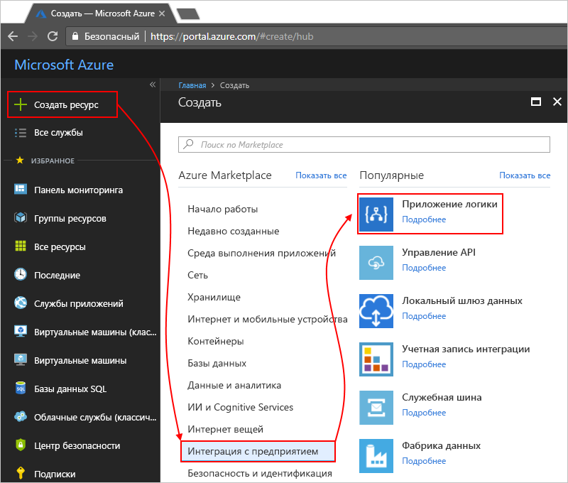

# Мониторинг выполнения приложений логики и получение аналитических сведений о них с помощью Operations Management Suite (OMS) и Log Analytics

Для мониторинга и получения более подробных данных отладки при создании приложения логики можно включить Log Analytics. Служба Log Analytics предоставляет ведение журнала диагностики и мониторинг выполнения приложений логики на портале Operations Management Suite (OMS). При добавлении решения Logic Apps Management в OMS вы получаете обобщенные сведения о выполнении приложений логики, а также некоторые подробные данные, такие как состояние приложения, время выполнения, состояние повторной отправки и идентификаторы корреляции.

В этом разделе показано, как включить службу Log Analytics или установить решение Logic Apps Management в OMS, чтобы вы могли просматривать события и данные среды выполнения, относящиеся к выполнению ваших приложений логики.

 > [!TIP]
 > Чтобы отслеживать существующие приложения логики, выполните следующие действия для [включения ведения журнала диагностики и отправки данных среды выполнения приложений логики в OMS](../logic-apps/logic-apps-monitor-your-logic-apps.md#azure-diagnostics).

## Требования

Прежде чем начать, необходимо иметь рабочую область OMS. Узнайте о том, [как создать ее](../log-analytics/log-analytics-get-started.md). 

## Включение ведения журнала диагностики при создании приложений логики

1. На [портале Azure](https://portal.azure.com) создайте приложение логики. Выберите **Создать** > **Интеграция Enterprise** > **Приложение логики** > **Создать**.

   

2. На странице **Создание приложения логики** выполните показанные ниже действия.

   1. Введите имя приложения логики и выберите подписку Azure. 
   2. Создайте или выберите существующую группу ресурсов Azure.
   3. Установите переключатель **Log Analytics** в положение **Вкл.** 
   Выберите рабочую область OMS, в которую будут отправляться данные, относящиеся к выполнению приложений логики. 
   4. Когда вы будете готовы, установите флажок **Закрепить на панели мониторинга** >  и нажмите кнопку **Создать**.

      

      По завершении этого шага Azure создает приложение логики, которое теперь связано с рабочей областью OMS. 
      На этом шаге в рабочую область OMS также автоматически устанавливается решение Logic Apps Management.

3. Чтобы просмотреть сведения о выполнении приложений логики в OMS, [выполните следующие действия](#view-logic-app-runs-oms).

## Установка решения Logic Apps Management в OMS

Если вы уже включили Log Analytics при создании приложения логики, то пропустите этот шаг. Решение Logic Apps Management у вас уже установлено в OMS.

1. На [портале Azure](https://portal.azure.com) щелкните **Больше служб**. В поле поиска введите словосочетание "log analytics" в качестве фильтра и выберите **Log Analytics**, как показано ниже.

   

2. В разделе **Log Analytics** найдите и выберите рабочую область OMS. 

   

3. В разделе **Управление** выберите **Портал OMS**.

   

4. Если на домашней странице OMS отображается баннер обновления, щелкните его, чтобы сначала обновить рабочую область OMS. Затем выберите **Коллекция решений**.

   

5. В разделе **Все решения** найдите и выберите элемент решения **Logic Apps Management**.

   

6. Чтобы установить решение в рабочую область OMS, нажмите кнопку **Добавить**.

   

## Просмотр сведений о выполнении приложений логики в рабочей области OMS

1. Чтобы просмотреть число и состояние выполнений приложений логики, перейдите на страницу обзора своей рабочей области OMS. Просмотрите сведения в элементе **Logic Apps Management**.

   

   > [!Note]
   > Если баннер обновления отображается вместо элемента "Logic Apps Management" (Управление Logic Apps), щелкните баннер, чтобы сначала обновить рабочую область OMS.
  
   > 

2. Чтобы просмотреть сводку с более подробными сведениями о выполнении приложений логики, выберите элемент **Logic Apps Management**.

   Здесь сведения о выполнении приложений логики группируются по имени или по состоянию выполнения.

   
   
3. Чтобы просмотреть все сведения о выполнении конкретного приложения логики или о конкретном состоянии, выберите строку с соответствующим приложением логики или состоянием.

   Ниже приведен пример, в котором показаны все сведения о выполнении конкретного приложения логики.

   

   > [!NOTE]
   > В столбце **Resubmission** (Повторная отправка) отображается "Да", если выполнение является результатом повторного выполнения.

4. Чтобы отфильтровать эти результаты, можно применить фильтр как на стороне клиента, так и на стороне сервера.

   * Клиентский фильтр: для каждого столбца выберите необходимые фильтры. 
   Ниже приведены некоторые примеры:

     

   * Серверный фильтр: чтобы выбрать определенное временное окно или ограничить отображаемое количество выполнений, воспользуйтесь элементом ограничения области в верхней части страницы. 
   По умолчанию за раз отображается только 1000 записей. 
   
     
 
5. Чтобы просмотреть все действия и сведения о них для определенного выполнения, выберите строку. В результате откроется страница поиска по журналам. 

   * Чтобы просмотреть эти сведения в формате таблицы, выберите **Таблица**.
   * Чтобы изменить запрос, отредактируйте строку запроса на панели поиска. 
   Для доступа к дополнительным функциональным возможностям выберите **Расширенная аналитика**.

     

     На открывшейся странице Azure Log Analytics можно обновить запросы и просмотреть результаты из таблицы. 
     В этом запросе используется [язык запросов Kusto](https://docs.loganalytics.io/learn/tutorials/getting_started_with_queries.html), который можно изменять, если требуется просмотреть другие результаты. 

     

## Дальнейшие действия

* [Мониторинг сообщений B2B](../logic-apps/logic-apps-monitor-b2b-message.md)

