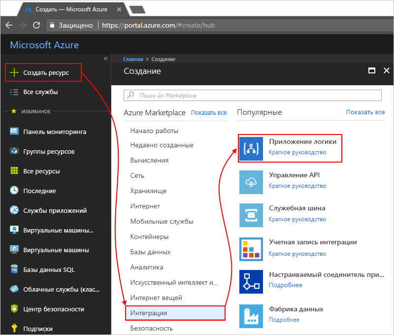
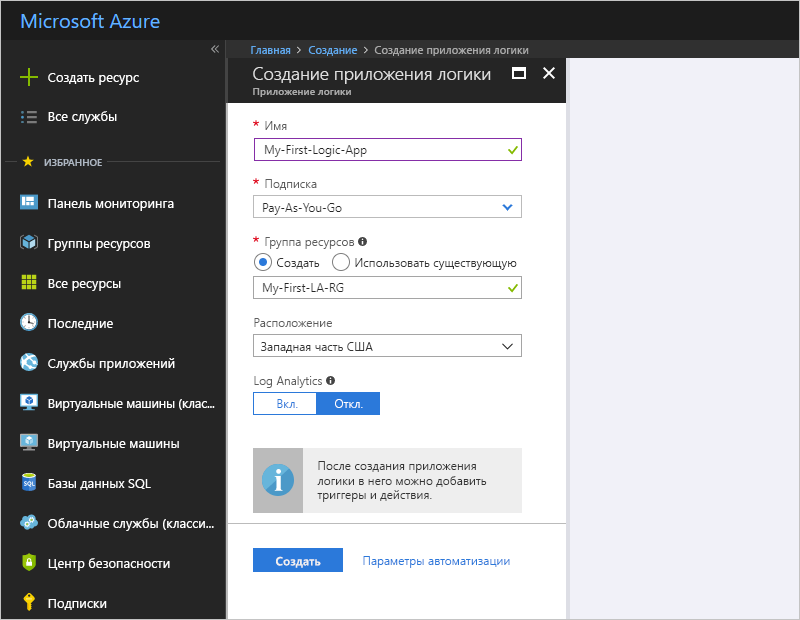
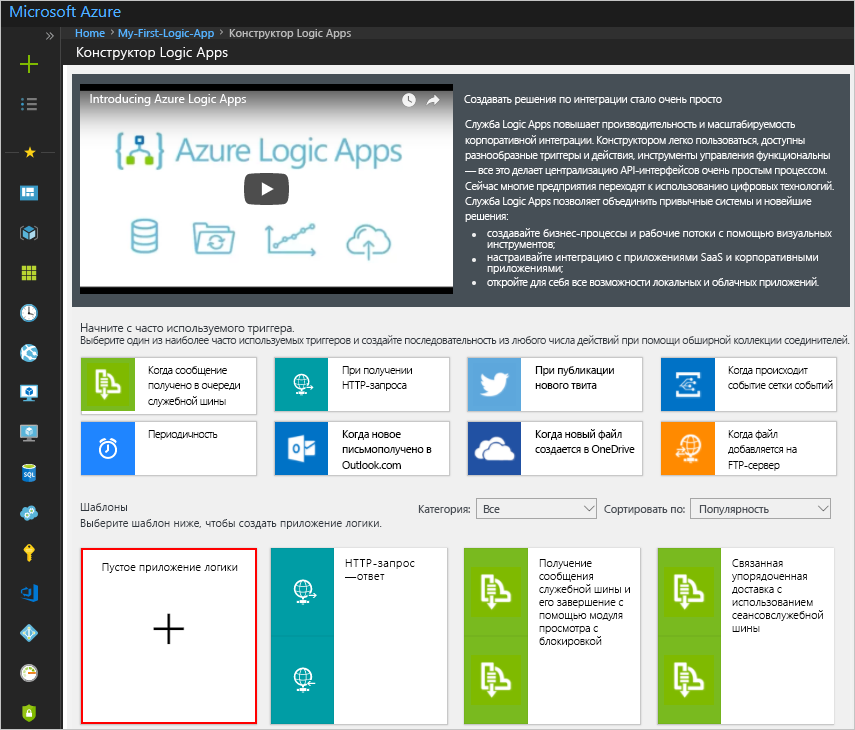
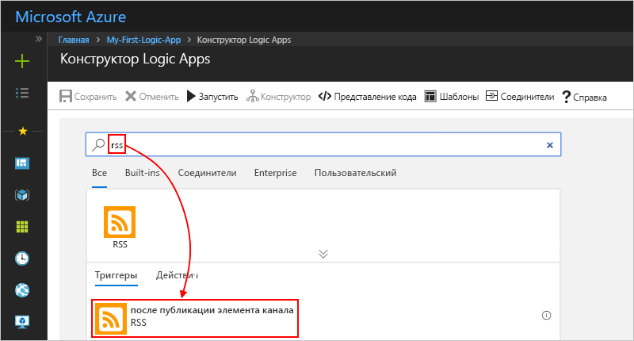
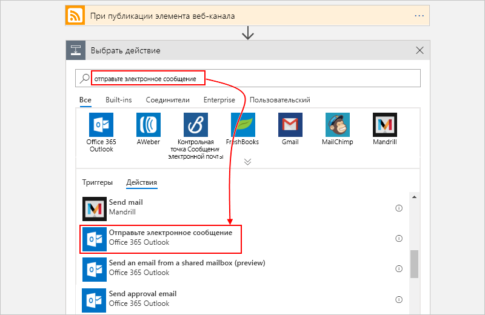
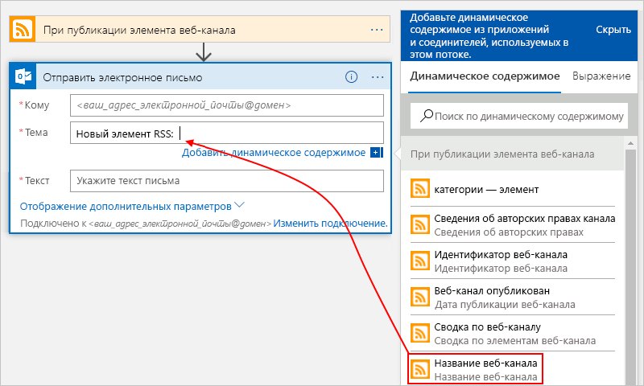
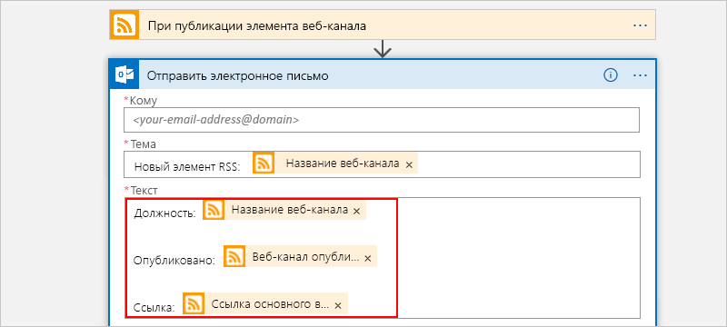
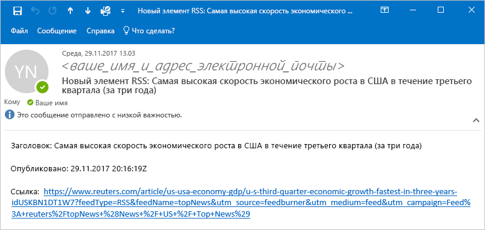
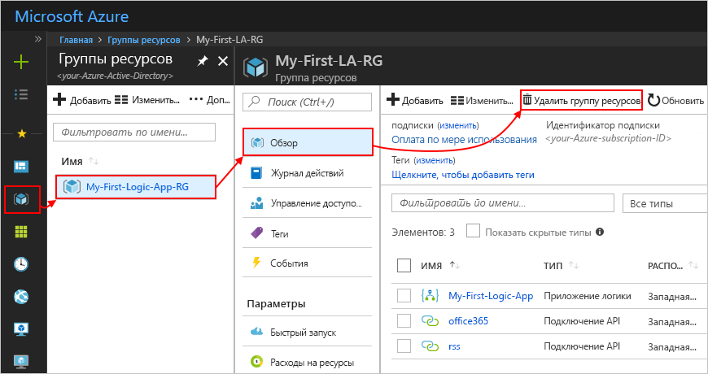
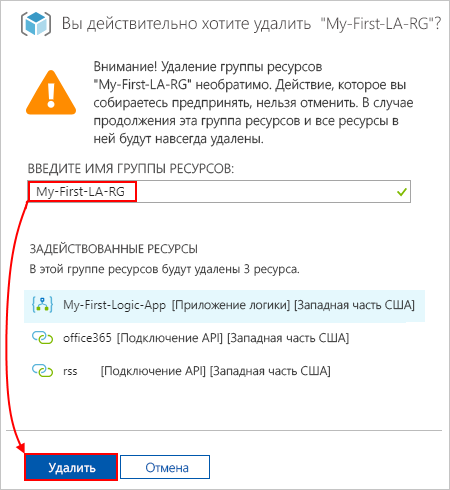

# <a name="quickstart-create-your-first-automated-workflow-with-azure-logic-apps---azure-portal"></a>Краткое руководство. Создание первого автоматизированного рабочего процесса с помощью Azure Logic Apps на портале Azure

Это краткое руководство содержит данные о способах создания первого автоматизированного рабочего процесса с помощью [Azure Logic Apps](../logic-apps/logic-apps-overview.md). В этой статье вы создадите приложение логики, которое регулярно проверяет RSS-канал веб-сайта на наличие новых элементов. Если они есть, приложение логики отправляет сообщение электронной почты для каждого из них. По завершении приложение логики будет выглядеть как этот высокоуровневый рабочий процесс:


Для роботы с этим кратким руководством необходима учетная запись электронной почты любого поставщика, поддерживаемого Logic Apps, например Office 365 Outlook, Outlook.com или Gmail. Сведения о дополнительных поставщиках см. в [списке соединителей](https://docs.microsoft.com/connectors/). Это приложение логики использует учетную запись Office 365 Outlook. Если вы используете другую учетную запись электронной почты, общие шаги те же, но пользовательский интерфейс может немного отличаться. 

Кроме того, если у вас еще нет подписки Azure, <a href="https://azure.microsoft.com/free/" target="_blank">подпишитесь для получения бесплатной учетной записи Azure</a>.

## <a name="sign-in-to-the-azure-portal"></a>Вход на портал Azure

Войдите на <a href="https://portal.azure.com" target="_blank">портал Azure</a> с помощью учетных данных учетной записи Azure.

## <a name="create-your-logic-app"></a>Создание приложения логики 

1. В главном меню на портале Azure выберите **Создать ресурс** > **Интеграция** > **Приложение логики**.

   

3. В разделе **Создание приложения логики** предоставьте сведения о приложении логики, как показано здесь. По завершении выберите **Закрепить на панели мониторинга** > **Создать**.

   

   | Свойство | Значение | ОПИСАНИЕ | 
   |----------|-------|-------------| 
   | **Имя** | MyFirstLogicApp | Имя приложения логики. | 
   | **Подписка** | <*Имя вашей подписки Azure*> | Имя подписки Azure. | 
   | **Группа ресурсов** | My-First-LA-RG | Имя [группы ресурсов Azure](../azure-resource-manager/resource-group-overview.md), используемой для упорядочения связанных ресурсов. | 
   | **Местоположение.** | Запад США | Регион для хранения сведений приложения логики | 
   | **Служба Log Analytics** | Отключить | Сохраните параметр **Выкл.** для журнала ведения диагностики. | 
   |||| 

3. После развертывания приложения в Azure открывается конструктор Logic Apps и отображается страница с вводным видео и часто используемыми триггерами. В разделе **Шаблоны** выберите **Пустое приложение логики**.

   

Затем добавьте [триггер](../logic-apps/logic-apps-overview.md#logic-app-concepts), который срабатывает при появлении нового элемента RSS-канала. Каждое приложение логики должно запускаться по триггеру, который активируется, когда происходит определенное событие или если выполняются заданные условия. При каждом срабатывании триггера обработчик Logic Apps создает экземпляр приложения логики, запускающий и выполняющий рабочий процесс.

<a name="add-rss-trigger"></a>

## <a name="check-rss-feed-with-a-trigger"></a>Проверка RSS-канала с помощью триггера

1. В конструкторе введите rss в поле поиска. Выберите этот триггер: **RSS - When a feed item is published** (RSS — при публикации элемента веб-канала).

   

2. Предоставьте сведения для триггера, как показано и описано далее: 

   

   | Свойство | Значение | ОПИСАНИЕ | 
   |----------|-------|-------------| 
   | **URL-адрес RSS-канала** | ```http://feeds.reuters.com/reuters/topNews``` | Ссылка для RSS-канала, который вы хотите отслеживать | 
   | **Интервал** | 1 | Количество интервалов ожидания между проверками. | 
   | **Frequency** | Минута | Единица измерения времени для каждого интервала между проверками  | 
   |||| 

   Совместно интервал и частота определяют расписание для триггера приложения логики. 
   Это приложение логики проверяет веб-канал каждую минуту.

3. Чтобы скрыть сведения о триггере, щелкните внутри заголовка окна триггера.

   

4. Сохраните приложение логики. На панели инструментов конструктора нажмите кнопку **Сохранить**. 

Теперь приложение логики активно, но оно только проверяет RSS-канал. Итак, добавим действие, отвечающее при срабатывании триггера.

## <a name="send-email-with-an-action"></a>Отправка сообщений электронной почты с помощью действия

Теперь добавьте [действие](../logic-apps/logic-apps-overview.md#logic-app-concepts), которое отправляет сообщение электронной почты, когда новый элемент появляется в веб-канале RSS. 

1. В разделе триггера **When a feed item is published** (При публикации элемента веб-канала) выберите **+ New step** (Создать шаг)  > **Add an action** (Добавить действие).

   

2. В разделе **Choose an action** (Выбрать действие) введите "отправить сообщения электронной почты" для фильтрации. В списке действий выберите "отправить сообщения электронной почты" для нужного вам поставщика услуг электронной почты. 

   

   Чтобы отфильтровать список действий для определенного приложения или службы, можно сначала выбрать это приложение или службу.

   * Для рабочих или учебных учетных записей Azure выберите Office 365 Outlook. 
   * Для личных учетных записей Майкрософт выберите Outlook.com.

3. При появлении запроса на ввод учетных данных войдите в свою учетную запись электронной почты для установки подключения к этой учетной записи в Logic Apps.

4. В действии **Send an email** (Отправить сообщение электронной почты) укажите данные, которые нужно добавить в электронное письмо. 

   1. В поле **Кому** введите адрес электронной почты получателя. 
   Для тестировании можете использовать свой собственный адрес.

      Пока проигнорируйте появившийся список **Add dynamic content** (Добавить динамическое содержимое). 
      Если щелкнуть внутри некоторых текстовых полей, появится список доступных параметров из предыдущего шага, которые можно включить в качестве входных данных в рабочем процессе. 

   2. В поле **Тема** введите следующий текст с пробелом: ```New RSS item: ```.

      
 
   3. В списке **Добавить динамическое содержимое** выберите **Название канала**, чтобы включить его в заголовок RSS-элемента.

      

      В конечном итоге тема сообщения будет выглядеть примерно так:

      

      Если в конструкторе появляется цикл "For each", выберите маркер, содержащий массив, например маркер **categories-Item**. 
      Для этих типов маркеров конструктор автоматически добавляет цикл к действию, которое ссылается на конкретный маркер. 
      Таким образом приложение логики будет выполнять это действие для каждого элемента массива. 
      Чтобы удалить цикл, нажмите кнопку с **многоточием** (**...**) на панели заголовка цикла, а затем выберите **Удалить**.

   4. В поле **Тело** введите текст и выберите необходимые маркеры для тела сообщения электронной почты. 
   Чтобы добавить пустые строки в поле редактирования, нажмите Shift + ВВОД. 

      

      | Свойство | ОПИСАНИЕ | 
      |----------|-------------| 
      | **Название веб-канала** | Заголовок элемента | 
      | **Веб-канал опубликован** | Время и дата публикации элемента | 
      | **Ссылка основного веб-канала** | URL-адрес для элемента | 
      ||| 
   
5. Сохраните приложение логики.

Затем проверьте приложение логики.

## <a name="run-your-logic-app"></a>Запуск приложения логики

Чтобы вручную запустить приложение логики, на панели инструментов конструктора щелкните **Запустить**. Или дождитесь, пока приложение логики проверит веб-канал RSS по указанному расписанию (каждую минуту). Если в RSS-канале есть новые элементы, приложение логики отправляет сообщение электронной почты для каждого нового элемента. В противном случае приложение логики ожидает до следующего интервала перед повторной проверкой. 

Например, ниже приведен образец сообщения электронной почты, которое отправляет это приложение логики. Если сообщения электронной почты не приходят, проверьте папку нежелательной почты.



Технически, когда триггер проверяет веб-канал RSS и находит новые элементы, он срабатывает, и подсистема Logic Apps создает для приложения логики экземпляр рабочего процесса, в котором выполняются действия.
Если триггер не находит новые элементы, он не срабатывает и "пропускает" создание экземпляра рабочего процесса.

Поздравляем, вы успешно создали и запустили свое первое приложение логики с помощью портала Azure.

## <a name="clean-up-resources"></a>Очистка ресурсов

Если этот образец больше не нужен, удалите группу ресурсов, содержащую приложение логики и связанные ресурсы. 

1. В главном меню Azure перейдите на вкладку **Группы ресурсов** и выберите группу ресурсов для приложения логики. На вкладке **Обзор** выберите поле **Удалить группу ресурсов**. 

   

2. Введите имя группы ресурсов для подтверждения и нажмите кнопку **Удалить**.

   

## <a name="get-support"></a>Получение поддержки

* Если у вас возникли вопросы, то посетите [форум Azure Logic Apps](https://social.msdn.microsoft.com/Forums/en-US/home?forum=azurelogicapps).
* Отправить идею по поводу возможности или проголосовать за нее вы можете на [сайте отзывов пользователей Logic Apps](http://aka.ms/logicapps-wish).

## <a name="next-steps"></a>Дополнительная информация

В этом кратком руководстве вы создали свое первое приложение логики, которое проверяет наличие обновлений RSS на основе заданного расписания (каждую минуту) и выполняет действие (отправляет электронные сообщения) при наличии обновлений. Для получения дополнительных сведений продолжите роботу с указанным ниже руководством по созданию более сложных рабочих процессов, которые выполняются по расписанию.

> [!div class="nextstepaction"]
> [Проверка загрузки дорог при помощи приложения логики на основе планировщика](../logic-apps/tutorial-build-schedule-recurring-logic-app-workflow.md)
