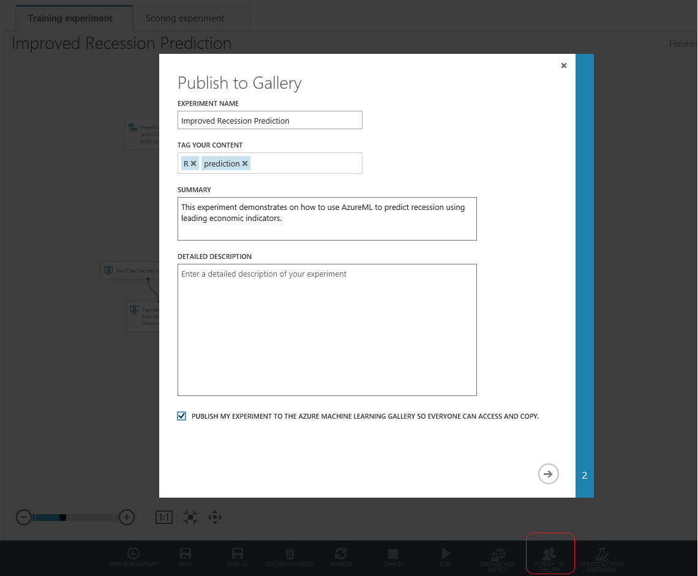

<properties 
	pageTitle="Коллекция машинного обучения Azure | Microsoft Azure" 
	description="Описание веб-сайта Коллекции машинного обучения Azure для опубликованного в сообществе эксперимента машинного обучения." 
	services="machine-learning" 
	documentationCenter="" 
	authors="cjgronlund" 
	manager="paulettm" 
	editor="cgronlun"/>

<tags 
	ms.service="machine-learning" 
	ms.workload="data-services" 
	ms.tgt_pltfrm="na" 
	ms.devlang="na" 
	ms.topic="article" 
	ms.date="02/16/2015" 
	ms.author="chhavib;garye"/>

# **Коллекция машинного обучения** #
Коллекция машинного обучения Azure — веб-сайт сообщества, на котором можно найти эксперименты, решающие интересные задачи. Это место предназначено для пользователей, которые стремятся почерпнуть полезные сведения из экспериментов других пользователей или просто приступить к машинному обучению Azure. Эти эксперименты пополняются в основном сообществом пользователей машинного обучения Azure.

Коллекция также позволяет пользователям просматривать и копировать эксперименты, предоставленные группой машинного обучения Microsoft Azure.

**[ПЕРЕЙТИ К КОЛЛЕКЦИИ >>](http://gallery.azureml.net)**

[AZURE.INCLUDE [machine-learning-free-trial](../includes/machine-learning-free-trial.md)]

## Преимущества ##
Присоединяйтесь к сообществу Коллекции, чтобы воспользоваться ее преимуществами:

- интересными экспериментами; 
- опытом других пользователей.

Выполните вход с помощью учетной записи Майкрософт, чтобы использовать следующие дополнительные преимущества.

- Копируйте эксперименты в свою рабочую область и приступайте к решению задач с помощью Azure ML
- Принимайте участие и демонстрируйте свою работу

## Обнаружение ##
В Коллекции можно искать и просматривать интересные эксперименты, которые помогают удовлетворять ваши нужды в машинном обучении, или можно просто приступить к созданию экспериментов по машинному обучению Azure.

В коллекции можно начать с того, чтобы найти и ознакомиться с экспериментами без выполнения входа. Здесь можно без труда находить недавно опубликованные эксперименты и анализ тенденций экспериментов или искать эксперименты по именам, тегам, алгоритмам и другим атрибутам.

Можно видеть вклад в эксперимент конкретного автора, щелкнув имя автора в любой плитке эксперимента.

Если вас заинтересовал определенной эксперимент, можно прочитать дополнительные сведения об этом эксперименте на странице сведений эксперимента.

Эксперимент можно также комментировать, отправить для него отзыв или задавать вопросы в разделе «примечания» на каждой странице эксперимента. Кроме того, можно также совместно использовать нужный эксперимент с друзьями и коллегами, используя возможности общего доступа с помощью учетных записей LinkedIn или Twitter. Также у вас есть возможность отправлять по электронной почте ссылки на эти эксперименты, приглашая других пользователей для просмотра страниц эксперимента.

## Загрузить ##
Коллекции машинного обучения Azure позволяет одним щелчком легко копировать эксперименты в рабочую область и немедленно приступить к его выполнению для собственных задач. Если вы не еще вошли во время просмотра, вам будет предложено войти с использованием учетной записи Майкрософт перед копированием эксперимента из Студии в рабочую область.

## Участие ##
Вы готовы участвовать в экспериментах в Коллекции?

Выполните следующие действия.

- Войдите в Студию с помощью учетной записи Майкрософт (убедитесь, что ваше изображение и имя в параметрах профиля учетной записи Майкрософт, именно такие, как вам нужно)
- Создайте свой эксперимент и запустите его
- Когда вы будете готовы опубликовать свой эксперимент в Коллекции, щелкните «Опубликовать в Коллекции» в нижней черной полосе Студии.  Вот и все!

## Нам очень интересно ваше мнение! ##
Мы хотим, чтобы Коллекция развивалась нашими пользователями и для наших пользователей. Вставьте значок справа от сообщения, чтобы дать нам знать, что вам нравится или не нравится в Коллекции.

## Часто задаваемые вопросы ##
**Хотелось бы внести изменения в рабочий процесс эксперимента, отправленного в Коллекцию. Как это можно сделать?**

На данный момент обновления рабочего процесса для экспериментов, опубликованных в Коллекции, не поддерживаются. Такие изменения можно публиковать как новый эксперимент в Коллекции, удалив старый эксперимент. Мы активно работаем над реализацией публикации обновлений для уже добавленных в Коллекцию рабочих процессов. Следите за новостями.

**Придется ли мне публиковать новый эксперимент, даже если мне нужно лишь изменить теги или описание?** В уже опубликованном эксперименте без необходимости новой публикации можно изменить следующие параметры.

- Имя эксперимента
- Текст сводки
- Текст описания
- Теги
- Образы

Чтобы изменить эти поля, щелкните нужный эксперимент, который вы хотите изменить (убедитесь, что вы вошли в систему с учетной записью Майкрософт). После этого произойдет переход на страницу сведений эксперимента, где можно просмотреть параметры, которые нужно изменить или удалить. Щелкните «Изменить», чтобы изменить любое из указанных выше полей.

**Я только что опубликовал свой эксперимент в коллекции машинного обучения Azure. Мне не удается увидеть рисунок профиля рядом со своим именем**

Возможно вы используете учетную запись, отличную от @outlook, @msn, @live или @hotmail. Если это так, вы увидите изображение местозаполнителя вместо изображения профиля из параметров конфигурации учетной записи Майкрософт. Если воспользоваться учетной записью Майкрософт и повторно отправить эксперимент, это поможет решить проблему

**Я обновил изображение профиля в настройках учетной записи Microsoft. Почему в моих существующих публикациях экспериментов этот рисунок профиля не отображается?**

Если вам нужно, чтобы последние изменений профиля (изображение профиля, ваше имя или фамилия) отображались для всех экспериментов, следует повторно отправить старые эксперименты в Коллекцию. Таким образом необходимо будет удалить старые копии экспериментов, в которых отражаются старые параметры профиля.

**Каковы требования к изображению при отправке или редактировании изображения для моего эксперимента?**

Изображения, которые можно отправить вместе с вашим экспериментом будет использоваться для создания плитки публикуемого эксперимента. Рекомендуется использовать изображение размером до 500 КБайт и с соотношением сторон 3:2. Рекомендуется использовать разрешение 960 x 640

**Что происходит с набором данных, который использовался в эксперименте? Набор данных также публикуется в Коллекции?**

Если набор данных является частью вашего эксперимента и не был запрошен через модуль чтения, он является частью вашего эксперимента и публикуется в Коллекции вместе с вашим экспериментом. Для этого убедитесь, что у публикуемого набора данных эксперимента соответствующие условия лицензирования, которые допускают общий доступ и загрузку для любого пользователя.

**У меня есть эксперимент, использующий модуль чтения для извлечения данных из HDInsight или SQL. Для получения данных он использует учетные данные. Как опубликовать такой эксперимента и быть уверенным, что мои учетные данные не будут при этом переданы другим пользователям?**

В настоящее время мы не позволяем публиковать эксперименты, использующие учетные данные.

**Как можно разграничивать теги?**

Для разграничения тегов можно использовать табуляцию.

**Я вижу несколько подробно проиллюстрированных экспериментов с форматированным описанием. Однако при попытке составить форматированное описание, оно отображается в виде обычного текста.**

Форматированное описание доступно не для всех пользователей Коллекции. Мы активно работаем над предоставлением этой возможности с помощью поддержки разметки Markdown.

**[ПЕРЕЙТИ К КОЛЛЕКЦИИ >>](http://gallery.azureml.net)**

<!--HONumber=54-->