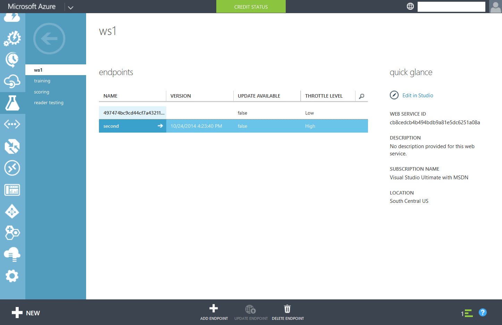
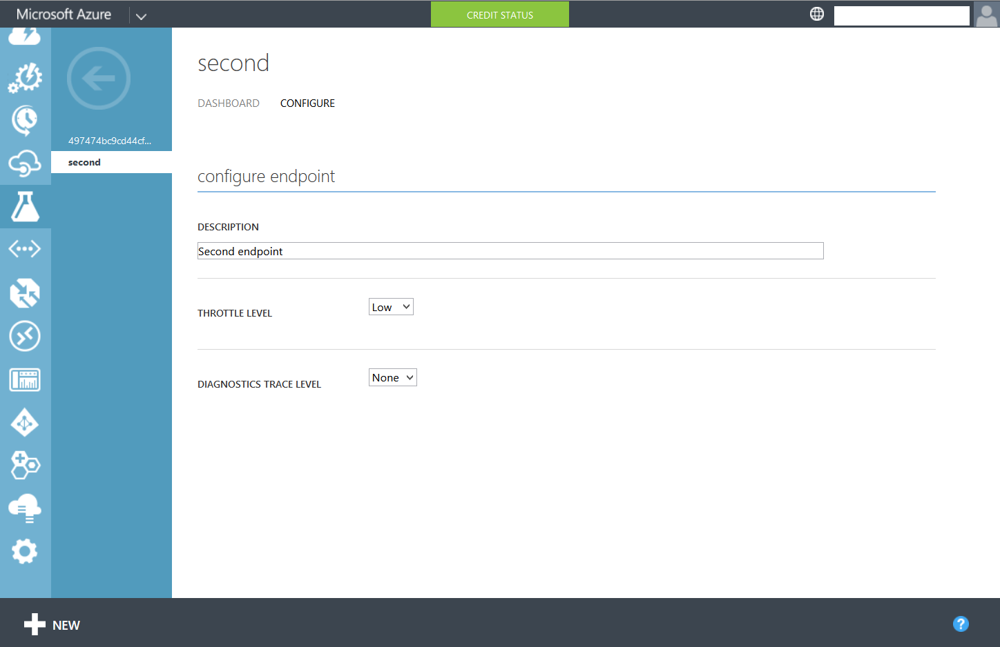

<properties 
	pageTitle="Масштабирование конечных точек API" 
	description="Масштабирование конечных точек веб-службы в машинном обучении Azure" 
	services="machine-learning" 
	authors="hiteshmadan" 
	manager="padou" 
	editor=""/>

<tags
	ms.service="machine-learning"
	ms.devlang="multiple"
	ms.topic="article"
	ms.tgt_pltfrm="na"
	ms.workload="tbd" 
	ms.date="02/19/2015"
	ms.author="himad"/>

# Масштабирование конечных точек API

Конечные точки веб-службы в машинном обучении Azure имеют выбираемые уровни ускорения, которые соответствуют скорости, с которой будет выполнено потребление конечной точки.

Существует два фактора, которые управляют степенью ускорения для определенной точки — уровень ускорения: высокий или низкий. Только платные заказчики могут устанавливать высокий уровень ускорения — максимум 4 одновременных вызова для низкого уровня ускорения; от 20 до 200 одновременных вызовов для высокого уровня ускорения.

Синхронные API обычно используются в ситуациях, когда требуется низкий уровень задержки. Под задержкой здесь подразумевается время, необходимое для того, чтобы API завершил один запрос, и в ней не учитывается время сетевой задержки. Предположим, что имеется API с задержкой в 50 мс. Чтобы полностью задействовать доступный объем с использованием высокого уровня ускорения и максимальным количеством одновременных вызовов = 20, необходимо вызывать этот API 20 * 1000 / 50 = 400 раз в секунду. Далее, при максимальном количестве одновременных вызовов = 200 можно вызывать API 4000 раз в секунду при задержке в 50 мс.

Если планируется вызывать этот API с большей нагрузкой, чем это поддерживается при установке 200 максимальных одновременных вызовов, потребуется создать несколько конечных точек для одной веб-службы и случайным образом распределить нагрузку между ними.

Помните, что использование высоких значений количества одновременных событий может быть неблагоприятно, если API не вызывается с соответствующей этому высокой нагрузкой. При создании достаточно низкой нагрузки на API, настроенный на высокую нагрузку, периодически случайно могут возникать периоды ожидания или резкое повышение значений задержки.

Обратите внимание, что изменение параметров влияет только на поведение синхронного API. Эти параметры должны регулироваться, только если часто возникает ошибка отклика 503 Service Unavailable в синхронном API.

Интерфейс управления позволяет переключаться между уровнями ускорения. Чтобы использовать пользовательское значение количества одновременных вызовов, применяемое с высоким уровнем ускорения, используйте API обновления конечной точки.

- Откройте узел manage.windowsazure.com
- Перейдите на вкладку "Машинное обучение"
- Щелкните рабочее пространство.
- Перейдите к веб-службе, в которой находится конечная точка 

- Щелкните конечную точку, после чего перейдите на вкладку "Настройка" 

- Измените уровень ускорения на высокий и нажмите "Сохранить".

<!--HONumber=54-->