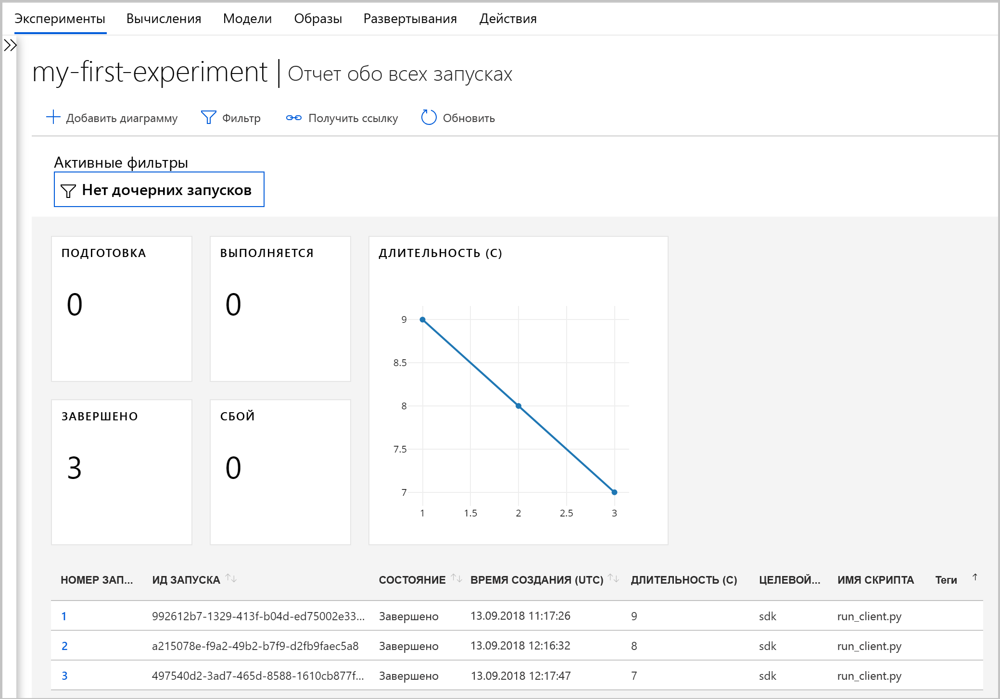
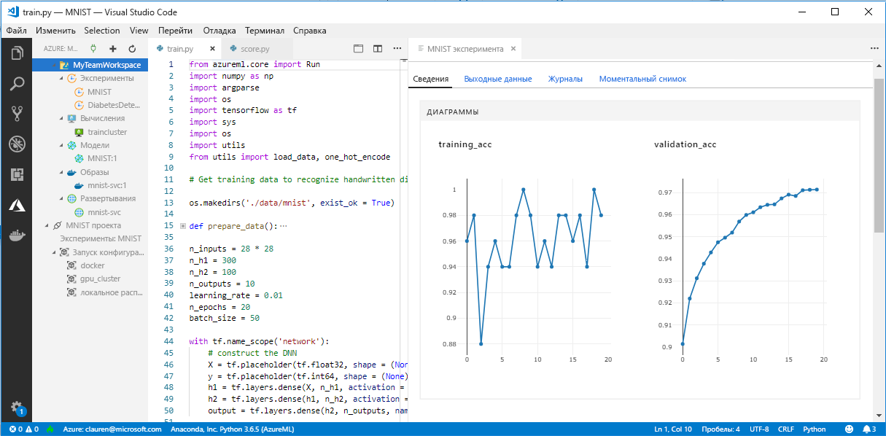

# Что произошло с приложением Machine Learning Workbench в Службе машинного обучения Azure?

Приложение Azure Machine Learning Workbench и некоторые другие ранние функции устарели и были заменены в выпуске за сентябрь 2018 г. в рамках процесса улучшения [архитектуры](concept-azure-machine-learning-architecture.md). Этот выпуск содержит множество существенных обновлений, внесенных с учетом отзывов клиентов для улучшения удобства работы. Изменения не коснулись основных функций службы, начиная от запуска эксперимента и кончая развертыванием модели. Но теперь в вашем распоряжении надежный <a href="https://aka.ms/aml-sdk" target="_blank">пакет SDK</a> и интерфейс [Azure CLI](reference-azure-machine-learning-cli.md) для выполнения задач и конвейеров машинного обучения.  

В этой статье рассказывается, что было изменено и как эти изменения повлияют на уже существующие применения службы Azure Machine Learning Workbench и ее API.

## Что изменилось?

Последний выпуск Машинного обучения Azure включает следующие возможности:
+ [Упрощенная модель ресурсов Azure](concept-azure-machine-learning-architecture.md).
+ [Новый пользовательский интерфейс портала](how-to-track-experiments.md) для управления экспериментами и целевыми объектами вычислений.
+ Новый, более функциональный <a href="https://aka.ms/aml-sdk" target="_blank">пакет SDK</a> для Python.
+ Обновленное и дополненное [расширение интерфейса командной строки Azure](reference-azure-machine-learning-cli.md) для машинного обучения

Переработанная [архитектура](concept-azure-machine-learning-architecture.md) для упрощения использования. Вместо нескольких ресурсов Azure и учетных записей требуется только [рабочая область Машинного обучения Azure](concept-azure-machine-learning-architecture.md#workspace). Новые рабочие области можно быстро создать на [портале Azure](quickstart-get-started.md). Рабочая область позволяет нескольким пользователя хранить целевые объекты вычислений для обучения и развертывания, экспериментов с моделями, образов Docker, развернутых моделей и т. д.

Текущий выпуск предоставляет обновленные и улучшенные клиенты для работы с интерфейсом командной строки и пакетом SDK, но само классическое приложение Workbench объявляется устаревшим. Теперь вы можете отслеживать эксперименты [на панели мониторинга рабочей области на портале Azure](how-to-track-experiments.md#view-the-experiment-in-the-azure-portal). Используйте панель мониторинга, чтобы просматривать историю эксперимента, управлять целевыми объектами вычислений, подключенными к рабочей области, управлять моделями и образами Docker и даже развертывать веб-службы.

## Как выполнить миграцию

Большинство артефактов, которые были созданы в предыдущей версии Службы машинного обучения Azure, хранятся в вашем локальном или облачном хранилище. Эти артефакты не исчезнут. Для перехода нужно повторно зарегистрировать артефакты в обновленной службе "Машинное обучение Azure". Узнайте, что можно перенести и как это сделать, в этой [статье о переносе](how-to-migrate.md).

## Сроки поддержки

После сентября 2018 г. вы по-прежнему можете использовать учетные записи экспериментирования и управления моделями в Службе машинного обучения Azure, а также приложение Machine Learning Workbench. Поддержка перечисленных ниже ресурсов будет постепенно прекращена в течение 3–4 месяцев после выхода этого выпуска. Документацию по старым функциям можно найти в разделе [Ресурсы](../desktop-workbench/tutorial-classifying-iris-part-1.md) в нижней части содержания.

|Этап&nbsp;снятия с эксплуатации|Сведения о поддержке более ранних функций|
|:---:|----------------|
|4 декабря 2018 г.|На портале Azure и в интерфейсе командной строки прекращена поддержка создания учетных записей Экспериментирования и Управления моделями в Машинном обучении Azure. Также прекращена поддержка создания вычислительных сред машинного обучения с помощью CLI. Если у вас уже есть существующая учетная запись, интерфейс командной строки и классическое приложение Workbench пока можно использовать и дальше.|
|9 января 2019 г.|После этой даты завершается поддержка всех остальных элементов. Это относится, например, к не упомянутым выше интерфейсам API и классическому приложению Machine Learning Workbench.|

[Начните переход](how-to-migrate.md) прямо сегодня. Все новейшие возможности доступны при использовании нового <a href="https://aka.ms/aml-sdk" target="_blank">пакета SDK</a>, [интерфейса командной строки](reference-azure-machine-learning-cli.md) и [портала](quickstart-get-started.md).

## Что будет с журналами выполнения?

Журналы выполнения на некоторое время остаются доступными. Когда все будет готово к переходу на обновленную версию Службы машинного обучения Azure, можно экспортировать эти журналы выполнения, если нужно сохранить копию.

В текущем выпуске журналы выполнения называются **экспериментами**. Вы можете собрать эксперименты модели и исследовать их, используя пакет SDK, интерфейс командной строки или портал Azure.

Панель мониторинга для рабочей области на портале поддерживается только в браузерах Microsoft Edge, Chrome и Firefox.

[ ] (./media/overview-what-happened-to-workbench/image001.png#lightbox)

## Можно ли по-прежнему готовить данные?

Уже существующие файлы подготовки данных нельзя перенести в последнюю версию, так как приложение Machine Learning Workbench больше не поддерживается. Но можно по-прежнему готовить данные для моделирования.  

Для наборов данных любых размеров можно использовать [пакет SDK для подготовки данных Службы машинного обучения Azure](http://aka.ms/data-prep-sdk), позволяющий быстро создать код Python для подготовки данных перед моделированием. 

См. дополнительные сведения о том, как [использовать пакет SDK для подготовки данных Службы машинного обучения Azure](tutorial-data-prep.md).

## Сохранятся ли проекты?

Никакой код и никакие наработки не будут потеряны. В более ранней версии проекты являются объектами облака с локальным каталогом. В последней версии локальные каталоги привязываются к рабочей области Службы машинного обучения Azure с помощью локального файла конфигурации. Ознакомьтесь со [схемой актуальной архитектуры](concept-azure-machine-learning-architecture.md).

Большая часть содержимого проекта уже находится на локальном компьютере. Это означает, что для подключения к рабочей области осталось создать в этом каталоге файл конфигурации добавить в код ссылку для подключения к рабочей области. Узнайте, как [перенести существующие проекты.](how-to-migrate.md#projects)

Узнайте, как приступить к работе [в среде Python с помощью основного пакета SDK](quickstart-create-workspace-with-python.md) или [с помощью портала Azure](quickstart-get-started.md).

## Что будет с уже зарегистрированными моделями и образами?
 
Если нужно продолжить использование моделей, уже зарегистрированных в старом реестре моделей, их необходимо перенести в новую рабочую область. Чтобы выполнить миграцию моделей, [скачайте модели и зарегистрируйте их](how-to-migrate.md) в новой рабочей области. 

Чтобы продолжить использование образов, созданных в старом реестре образов, их необходимо создать повторно в новой рабочей области. Эти образы можно заново [создать и настроить](how-to-deploy-and-where.md#configureimage). 

## Что случится с развернутыми веб-службами?

Модели, развернутые как веб-службы с помощью учетной записи Управления моделями Машинного обучения, продолжат работать, пока не прекратится поддержка службы контейнеров Azure. Эти веб-службы будут работать, даже когда прекратится поддержка учетных записей Управления моделями Машинного обучения. Но с окончанием поддержки старого интерфейса командной строки управление этими веб-службами станет невозможным.

В новой версии модели развертываются как веб-службы в Экземплярах контейнеров Azure или кластерах Службы Azure Kubernetes (AKS). Можно также выполнить развертывание в FPGA и Azure IoT Edge. См. дополнительные сведения о [развертывании](how-to-deploy-and-where.md). С помощью нового пакета SDK или интерфейса командной строки модели можно повторно выполнить развертывание без необходимости изменять файлы оценки, зависимости и схемы. 

## Что будет со старым пакетом SDK и интерфейсом командной строки?

Они будут продолжать работать до января. См. описанный выше [график](#timeline). Мы рекомендуем уже сейчас создавать эксперименты и модели с помощью последнего пакета SDK или интерфейса командной строки.

Использование пакета SDK для Python из последнего выпуска позволяет взаимодействовать со Службой машинного обучения Azure в любой среде Python. Узнайте, как установить последний пакет <a href="https://aka.ms/aml-sdk" target="_blank">SDK</a>. Для взаимодействия со службой в любой среде командной строки, включая среду Cloud Shell портала Azure, можно также использовать [обновленное расширение машинного обучения интерфейса командной строки Azure](reference-azure-machine-learning-cli.md) с богатым набором команд `az ml`.

## Что будет с Машинным обучением Azure для Visual Studio Code?

В этом последнем выпуске в Службе машинного обучения Azure для Visual Studio Code реализованы доработки и улучшения, чтобы обеспечить работу с вышеописанными новыми функциями.

[ ] (./media/overview-what-happened-to-workbench/vscode-big.png#lightbox)

## Что будет с пакетами домена?

Пакеты домена для [компьютерного зрения, анализа текста и прогнозирования](../desktop-workbench/reference-python-package-overview.md) нельзя использовать с последней версией Службы машинного обучения Azure. Но вы по-прежнему можете создавать и обучать модели компьютерного зрения, текста и прогнозирования, используя последний <a href="https://aka.ms/aml-sdk" target="_blank">пакет SDK</a> для Python Службы машинного обучения Azure. Чтобы узнать, как перенести уже существующие модели, созданные с использованием пакетов компьютерного зрения, анализа текста и прогнозирования, обратитесь сюда: [AML-Packages@microsoft.com](mailto:AML-Packages@microsoft.com).

## Дополнительная информация

Сведения об [актуальной архитектуре Службы машинного обучения Azure](concept-azure-machine-learning-architecture.md). Попробуйте выполнить краткие руководства:

* [Что такое Служба машинного обучения Azure](overview-what-is-azure-ml.md)
* [Краткое руководство Создание рабочей области с помощью Python](quickstart-get-started.md)
* [Руководство. Обучение модели](tutorial-train-models-with-aml.md)
