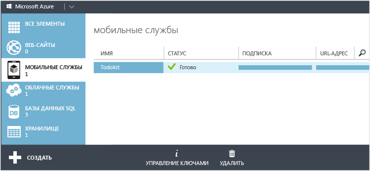
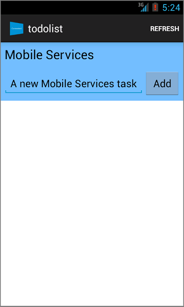

<properties urlDisplayName="Get Started with Push" pageTitle="Приступая к работе с push-уведомлениями (Android) | Центр разработчиков мобильных устройств" metaKeywords="" description="Learn how to use Azure Mobile Services to send push notifications to your Android .Net app." metaCanonical="" services="mobile-services,notification-hubs" documentationCenter="Mobile" title="Get started with push notifications in Mobile Services" authors="ricksal" solutions="" manager="dwrede" editor="" />

<tags ms.service="mobile-services" ms.workload="mobile" ms.tgt_pltfrm="Mobile-Android" ms.devlang="Java" ms.topic="article" ms.date="09/26/2014" ms.author="ricksal" />

# Добавление push-уведомлений к приложению мобильных служб

[WACOM.INCLUDE [mobile-services-selector-get-started-push](../includes/mobile-services-selector-get-started-push.md)]

В этом разделе показано, как использовать мобильные службы Azure для отправки push-уведомлений в приложение Android. В этом учебнике вам предстоит добавить push-уведомления в проект быстрого запуска с помощью службы Google Cloud Messaging (GCM). В результате ваша мобильная служба будет отправлять push-уведомление каждый раз при вставке записи. 

В этом учебнике рассматриваются следующие действия.

1. [Включение Google Cloud Messaging](#register)
2. [Настройка мобильных служб для отправки push-запросов](#configure)
5. [Обновление сервера для отправки push-уведомлений](#update-server)
7. [Добавление push-уведомлений в приложение](#update-app)
8. [Включение push-уведомлений для локального тестирования](#local-testing)
9. [Тестирование приложения с помощью опубликованной мобильной службы]

Этот учебник создан на основе краткого руководства по мобильным службам. Перед работой с этим учебником необходимо сначала пройти учебник [Приступая к работе с мобильными службами] или [Приступая к работе с данными], чтобы подключить свой проект к мобильной службе. Таким образом, для работы с этим учебником также требуется Visual Studio 2013. 

>[WACOM.NOTE]Для работы с этим учебником требуется учетная запись Azure. Если ее нет, можно создать бесплатную пробную учетную запись всего за несколько минут. Дополнительные сведения см. в разделе <a href="http://www.windowsazure.com/ru-ru/pricing/free-trial/?WT.mc_id=AE564AB28&returnurl=http%3A%2F%2Fwww.windowsazure.com%2Fru-ru%2Fdocumentation%2Farticles%2Fmobile-services-dotnet-backend-windows-store-dotnet-get-started-data%2F" target="_blank">Бесплатная пробная версия Azure</a>. 

##Включение Google Cloud Messaging

[WACOM.INCLUDE [Включение GCM](../includes/mobile-services-enable-Google-cloud-messaging.md)]

##Настройка мобильных служб для отправки push-запросов

1. Войдите в [Портал управления Azure], щелкните **Мобильные службы**, затем щелкните свое приложение.

   	

2. Перейдите на вкладку **Push-уведомления**, введите значение **Ключ API**, полученное от GCM при выполнении предыдущей процедуры, а затем нажмите кнопку **Сохранить**.

   	

    
<b>Важно!</b>
	
При задании учетных данных GCM для улучшенных push-уведомлений на вкладке Push-уведомления портала эти сведения передаются в концентраторы уведомлений в целях настройки концентратора уведомлений с вашим приложением.

    

Ваша мобильная служба теперь настроена для работы с GCM и концентраторами уведомлений.

<h2>Загрузите службу на локальный компьютер</h2>

[WACOM.INCLUDE [mobile-services-download-service-locally](../includes/mobile-services-download-service-locally.md)]

<h2>Тестирование мобильной службы</h2>

[WACOM.INCLUDE [mobile-services-dotnet-backend-test-local-service](../includes/mobile-services-dotnet-backend-test-local-service.md)]

##Обновление сервера для отправки push-уведомлений

1. В обозревателе решений Visual Studio разверните папку **Контроллеры** в проекте мобильной службы. Откройте скрипт TodoItemController.cs. В верхней части файла добавьте следующие инструкции `using`:

		using System;
		using System.Collections.Generic;

2. Обновите определение метода `PostTodoItem`, введя следующий код:  

        public async Task<IHttpActionResult> PostTodoItem(TodoItem item)
        {
            TodoItem current = await InsertAsync(item);

            Dictionary<string, string> data = new Dictionary<string, string>()
            {
                { "message", item.Text}
            };
            GooglePushMessage message = new GooglePushMessage(data, TimeSpan.FromHours(1));

            try
            {
                var result = await Services.Push.SendAsync(message);
                Services.Log.Info(result.State.ToString());
            }
            catch (System.Exception ex)
            {
                Services.Log.Error(ex.Message, null, "Push.SendAsync Error");
            }
            return CreatedAtRoute("Tables", new { id = current.Id }, current);
        }

    Этот код отправляет push-уведомления (с текстом вставленного элемента) после вставки элемента, подлежащего выполнению. В случае ошибки код добавляет запись в журнал ошибок, который можно просмотреть на вкладке **Журналы** мобильной службы на портале управления.

<h2>Публикация мобильной службы в Azure</h2>

[WACOM.INCLUDE [mobile-services-dotnet-backend-publish-service](../includes/mobile-services-dotnet-backend-publish-service.md)]

##Добавление push-уведомлений в приложение

###Проверка версии Android SDK

[WACOM.INCLUDE [mobile-services-verify-android-sdk-version](../includes/mobile-services-verify-android-sdk-version.md)]

На следующем шаге необходимо установить службы Google Play. Облачные средства передачи сообщений Google задают определенные минимальные требования уровня API по разработке и тестированию, которым должно соответствовать свойство **minSdkVersion** в манифесте. 

Если тестирование будет проводиться на более старом устройстве, проверьте раздел [Установка SDK служб Google Play], чтобы определить, насколько низким может быть установлено это значение, и задайте его должным образом.

###Добавление служб Google Play в проект

[WACOM.INCLUDE [Добавление служб воспроизведения](../includes/mobile-services-add-Google-play-services.md)]

###Добавление кода

[WACOM.INCLUDE [mobile-services-android-getting-started-with-push](../includes/mobile-services-android-getting-started-with-push.md)]

<h2>Тестирование приложения с помощью опубликованной мобильной службы</h2>

Приложение можно проверить, подключив телефон Android напрямую с помощью USB-кабеля или используя виртуальное устройство в эмуляторе.

###При использовании эмулятора для тестирования...

Убедитесь, что используется виртуальное устройство на платформе Android (AVD), поддерживающее API-интерфейсы Google.

1. В разделе **Окно** выберите **Диспетчер виртуальных устройств Android**, выберите ваше устройство, выберите команду **Изменить** (или **Создать**, если пока нет никаких устройств).

	

2. Выберите **API Google** (или **API Google x86**) в разделе **Цель**, а затем нажмите кнопку "ОК".

   	

	При этом виртуальное устройство на платформе Android будет предназначено для использования API-интерфейсов Google. Если имеется несколько установленных версий пакета Android SDK, убедитесь, что уровень API соответствует установленному ранее в свойствах проекта.

### Включение push-уведомлений для локального тестирования

[WACOM.INCLUDE [mobile-services-dotnet-backend-configure-local-push](../includes/mobile-services-dotnet-backend-configure-local-push.md)]

###Выполнение теста

1. Откройте меню **Выполнить** в Eclipse и щелкните **Выполнить**, чтобы запустить приложение.

2. В приложении введите значимый текст, такой как _Новая задача мобильных служб_, затем щелкните кнопку **Добавить**.

  	

3. Проведите пальцем вниз с верхней части экрана, чтобы открыть центр уведомлений для просмотра уведомления.

Вы успешно завершили ознакомление с данным учебником.

## Дальнейшие действия

<!---This tutorial demonstrated the basics of enabling an Android app to use Mobile Services and Notification Hubs to send push notifications. Next, consider completing the next tutorial, [Send push notifications to authenticated users], which shows how to use tags to send push notifications from a Mobile Service to only an authenticated user.

+ [Send push notifications to authenticated users]
	 Применение тегов для отправки push-уведомлений из мобильной службы только пользователю, прошедшему проверку подлинности.

+ [Отправка широковещательных уведомлений подписчикам]
	 Предоставление пользователям возможности регистрироваться и получать push-уведомления только по интересующим их категориям.

+ [Отправка подписчикам уведомлений на основе шаблона]
	 Использование шаблонов для отправки push-уведомлений из мобильной службы без создания зависящих от платформы полезных данных на сервере.
-->
Дополнительные сведения о мобильных службах и концентраторах уведомлений см. в следующих разделах.

* [Приступая к работе с данными]
   Узнайте больше о хранении и передаче запросов к данным с использованием мобильных служб.

* [Приступая к работе с аутентификацией]
   Проверка подлинности пользователей приложения с различными типами учетных записей с использованием мобильных служб.

* [Что такое концентраторы уведомлений?]
   Применение концентраторов уведомлений для доставки уведомлений в приложения на всех основных клиентских платформах.

* [Отладка приложений концентраторов уведомлений](http://go.microsoft.com/fwlink/p/?linkid=386630)
   Устранение неполадок и отладка решений на основе концентраторов уведомлений. 

* [Использование клиентской библиотеки Android для мобильных служб]
   Использование мобильных служб с Android.  
  
<!-- Anchors. -->

[Создание мобильной службы]: #create-service
[Локальная загрузка мобильной службы]: #download-the-service-locally
[Тестирование мобильной службы]: #test-the-service
[Загрузка пакета GetStartedWithData]: #download-app
[Обновление приложения для использования мобильной службы для доступа к данным]: #update-app
[Проверка работы приложения Android со службой, размещенной локально]: #test-locally-hosted
[Публикация мобильной службы в Azure]: #publish-mobile-service
[Проверка работы приложения Android со службой, размещенной в Azure]: #test-azure-hosted
[Тестирование приложения с помощью опубликованной мобильной службы]: #test-app
[Следующие шаги]:#next-steps

<!-- Images. -->
[0]: ./media/mobile-services-dotnet-backend-windows-store-dotnet-get-started-data/app-view.png
[1]: ./media/mobile-services-dotnet-backend-windows-store-dotnet-get-started-data/mobile-data-sample-download-dotnet-vs13.png
[2]: ./media/mobile-services-dotnet-backend-windows-store-dotnet-get-started-data/mobile-service-overview-page.png
[3]: ./media/mobile-services-dotnet-backend-windows-store-dotnet-get-started-data/download-service-project.png
[4]: ./media/mobile-services-dotnet-backend-windows-store-dotnet-get-started-data/add-service-project-to-solution.png
[5]: ./media/mobile-services-dotnet-backend-windows-store-dotnet-get-started-data/download-publishing-profile.png
[6]: ./media/mobile-services-dotnet-backend-windows-store-dotnet-get-started-data/add-existing-project-dialog.png
[7]: ./media/mobile-services-dotnet-backend-windows-store-dotnet-get-started-data/vs-manage-nuget-packages.png
[8]: ./media/mobile-services-dotnet-backend-windows-store-dotnet-get-started-data/manage-nuget-packages.png
[9]: ./media/mobile-services-dotnet-backend-windows-store-dotnet-get-started-data/copy-mobileserviceclient-snippet.png
[10]: ./media/mobile-services-dotnet-backend-windows-store-dotnet-get-started-data/vs-pasted-mobileserviceclient.png
[11]: ./media/mobile-services-dotnet-backend-windows-store-dotnet-get-started-data/vs-build-solution.png
[12]: ./media/mobile-services-dotnet-backend-windows-store-dotnet-get-started-data/vs-run-solution.png
[13]: ./media/mobile-services-dotnet-backend-windows-store-dotnet-get-started-data/new-local-todoitem.png
[14]: ./media/mobile-services-dotnet-backend-windows-store-dotnet-get-started-data/vs-show-local-table-data.png
[15]: ./media/mobile-services-dotnet-backend-windows-store-dotnet-get-started-data/local-item-checked.png
[16]: ./media/mobile-services-dotnet-backend-windows-store-dotnet-get-started-data/azure-items.png
[17]: ./media/mobile-services-dotnet-backend-windows-store-dotnet-get-started-data/manage-sql-azure-database.png
[18]: ./media/mobile-services-dotnet-backend-windows-store-dotnet-get-started-data/sql-azure-query.png

[20]: ./media/mobile-services-dotnet-backend-windows-store-dotnet-get-started-data/vs-build-service-project.png
[21]: ./media/mobile-services-dotnet-backend-windows-store-dotnet-get-started-data/vs-start-debug-service-project.png
[22]: ./media/mobile-services-dotnet-backend-windows-store-dotnet-get-started-data/service-welcome-page.png
[23]: ./media/mobile-services-dotnet-backend-windows-store-dotnet-get-started-data/iis-express-tray.png

[26]: ./media/mobile-services-dotnet-backend-windows-store-dotnet-get-started-data/copy-service-and-packages-folder.png

<!-- URLs. -->
[Проверка и изменение данных с помощью скриптов]: /ru-ru/develop/mobile/tutorials/validate-modify-and-augment-data-dotnet
[Уточнение запросов посредством разбиения по страницам]: /ru-ru/develop/mobile/tutorials/add-paging-to-data-dotnet
[Приступая к работе с мобильными службами]: /ru-ru/documentation/articles/mobile-services-dotnet-backend-android-get-started
[Приступая к работе с данными]: /ru-ru/documentation/articles/mobile-services-dotnet-backend-android-get-started-data
[Приступая к работе с аутентификацией]: /ru-ru/documentation/articles/mobile-services-dotnet-backend-android-get-started-users
[JavaScript и HTML]: /ru-ru/develop/mobile/tutorials/get-started-with-data-js
[Серверная версия JavaScript]: /ru-ru/develop/mobile/tutorials/get-started-with-data-android
[Портал управления Azure]: https://manage.windowsazure.com/
[Портал управления]: https://manage.windowsazure.com/
[Пакет SDK для мобильных служб]: http://go.microsoft.com/fwlink/p/?LinkId=257545
[Веб-сайт с примерами кода для разработчиков]:  http://go.microsoft.com/fwlink/p/?LinkId=328660
[Справочник принципов использования мобильных служб .NET]: /ru-ru/develop/mobile/how-to-guides/work-with-net-client-library
[Класс MobileServiceClient]: http://go.microsoft.com/fwlink/p/?LinkId=302030

[Использование клиентской библиотеки Android для мобильных служб]: /ru-ru/documentation/articles/mobile-services-android-how-to-use-client-library

[Рассылка push-уведомлений проверенным пользователям]: /ru-ru/documentation/articles/mobile-services-dotnet-backend-android-push-notifications-app-users/

[Что такое концентраторы уведомлений?]: /ru-ru/documentation/articles/notification-hubs-overview/
[Отправка широковещательных уведомлений подписчикам]: /ru-ru/documentation/articles/notification-hubs-windows-store-dotnet-send-breaking-news/
[Отправка подписчикам уведомлений на основе шаблона]: /ru-ru/documentation/articles/notification-hubs-windows-store-dotnet-send-localized-breaking-news/
[Портал управления Azure]: https://manage.windowsazure.com/
