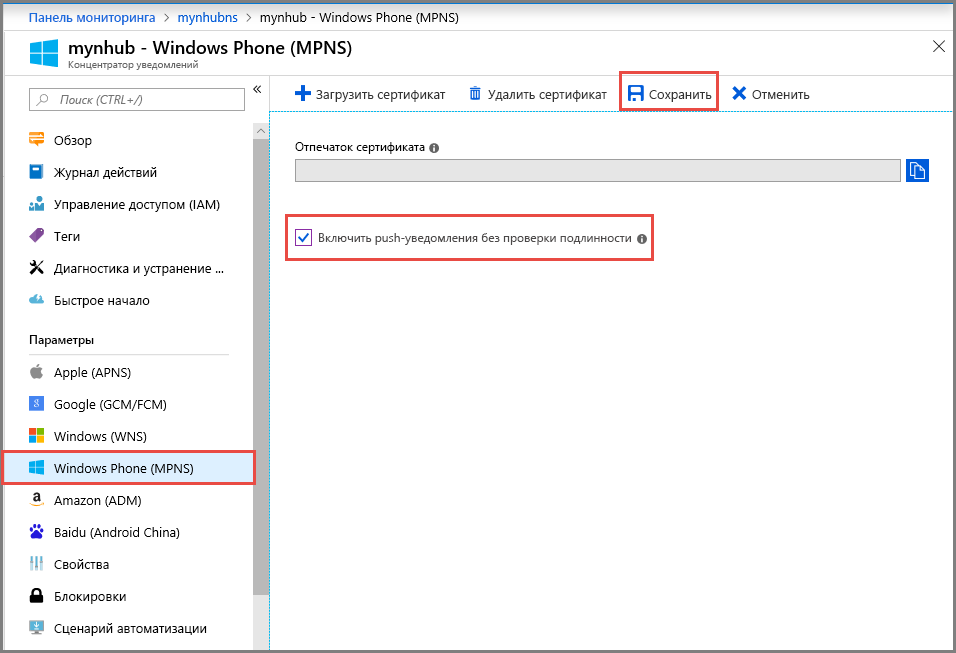

# Начало работы с Центрами уведомлений Azure для приложений Windows Phone
[!INCLUDE [notification-hubs-selector-get-started](../../includes/notification-hubs-selector-get-started.md)]

## Обзор
> [!NOTE]
> Для работы с этим учебником необходима активная учетная запись Azure. Если ее нет, можно создать бесплатную пробную учетную запись всего за несколько минут. Дополнительные сведения см. в разделе [Бесплатная пробная версия Azure](https://azure.microsoft.com/pricing/free-trial/?WT.mc_id=A0E0E5C02&amp;returnurl=http%3A%2F%2Fazure.microsoft.com%2Fen-us%2Fdocumentation%2Farticles%2Fnotification-hubs-windows-phone-get-started%2F).
> 
> 

В этом учебнике показано, как использовать центры уведомлений Azure для отправки push-уведомлений в приложение Silverlight для Windows Phone 8 или Windows Phone 8.1. Если вы ориентируетесь на Windows Phone 8.1 (не Silverlight), см. версию [Windows Universal](notification-hubs-windows-store-dotnet-get-started-wns-push-notification.md).
В этом учебнике вам предстоит создать пустое приложение Windows Phone 8, получающее push-уведомления с помощью службы push-уведомлений Майкрософт (MPNS). По завершении вы сможете рассылать push-уведомления на все устройства, где запущено ваше приложение, с помощью центра уведомлений.

> [!NOTE]
> Центры уведомлений Windows Phone SDK не поддерживают использование службы push-уведомлений Windows (WNS) с приложениями Windows Phone 8.1 Silverlight. Использование WNS (вместо MPNS) с приложениями Windows Phone 8.1 Silverlight описано в статье [Центр уведомлений: учебник для Windows Phone Silverlight], в котором используются API REST.
> 
> 

В этом учебнике описывается простой сценарий вещания с использованием Центров уведомлений.

## предварительным требованиям
Для работы с данным учебником требуется следующее:

* [Microsoft Visual Studio 2012 Express для Windows Phone]или более поздняя версия.

Завершение изучения этого учебника является необходимым условием для работы со всеми другими учебниками, посвященными Центрам уведомлений для приложений Windows Phone 8.

## Создание центра уведомлений
[!INCLUDE [notification-hubs-portal-create-new-hub](../../includes/notification-hubs-portal-create-new-hub.md)]

<ol start="6">
<li>
В разделе <b>Службы уведомлений</b> выберите пункт <b>Windows Phone (MPNS)</b> и установите флажок <b>Включить push-уведомления без проверки подлинности</b>.

</li>
</ol>

&emsp;&emsp;

Концентратор будет создан и настроен для отправки уведомлений без проверки подлинности для Windows Phone.

> [!NOTE]
> В этом учебнике используется MPNS в режиме без проверки подлинности. Режим MPNS без проверки подлинности налагает ограничения на использование уведомлений, отправляемых для каждого канала. Центры уведомлений поддерживают [Режим работы MPNS с проверкой подлинности](http://msdn.microsoft.com/library/windowsphone/develop/ff941099.aspx) , позволяя отправить ваш сертификат.
> 
> 

## Подключение приложения к центру уведомлений
1. В Visual Studio создайте новое консольное приложение Windows Phone 8.
   
    ![Visual Studio — новый проект — приложение для Windows Phone][13]
   
    В Visual Studio 2013 с обновлением 2 вместо этого вы создаете приложение Windows Phone Silverlight.
   
    ![Visual Studio — новый проект — пустое приложение — Windows Phone Silverlight][11]
2. В Visual Studio щелкните решение правой кнопкой мыши, а затем выберите пункт **Управление пакетами NuGet**.
   
    Откроется диалоговое окно **Управление пакетами NuGet** .
3. Выполните поиск по запросу `WindowsAzure.Messaging.Managed` , щелкните **Установить**, а затем примите условия использования.
   
    ![Visual Studio — диспетчер пакетов NuGet][20]
   
    После этого будут выполнены скачивание, установка и добавление ссылки на библиотеку Azure Messaging для Windows с помощью <a href="http://nuget.org/packages/WindowsAzure.Messaging.Managed/">пакета NuGet WindowsAzure.Messaging.Managed</a>.
4. Откройте файл App.xaml.cs и добавьте следующие инструкции `using` :
   
        using Microsoft.Phone.Notification;
        using Microsoft.WindowsAzure.Messaging;
5. Добавьте следующий код в верхнюю часть метода **Application_Launching** в файле App.xaml.cs:
   
        var channel = HttpNotificationChannel.Find("MyPushChannel");
        if (channel == null)
        {
            channel = new HttpNotificationChannel("MyPushChannel");
            channel.Open();
            channel.BindToShellToast();
        }
   
        channel.ChannelUriUpdated += new EventHandler<NotificationChannelUriEventArgs>(async (o, args) =>
        {
            var hub = new NotificationHub("<hub name>", "<connection string>");
            var result = await hub.RegisterNativeAsync(args.ChannelUri.ToString());
   
            System.Windows.Deployment.Current.Dispatcher.BeginInvoke(() =>
            {
                MessageBox.Show("Registration :" + result.RegistrationId, "Registered", MessageBoxButton.OK);
            });
        });
   
   > [!NOTE]
   > Значение **MyPushChannel** — это индекс, который используется для поиска существующего канала в коллекции [HttpNotificationChannel](https://msdn.microsoft.com/library/windows/apps/microsoft.phone.notification.httpnotificationchannel.aspx) . Если канал отсутствует, создайте новую запись с таким именем.
   > 
   > 
   
    Обязательно вставьте имя концентратора и строку подключения с именем **DefaultListenSharedAccessSignature** , полученные в предыдущем разделе.
    Этот код получает универсальный код ресурса (URI) канала (ChannelURI) для приложения из MPNS, а затем регистрирует ChannelURI в вашем центре уведомлений. Он также гарантирует регистрацию ChannelURI в центре уведомлений при каждом запуске приложения.
   
   > [!NOTE]
   > В этом учебнике на устройство отправляется всплывающее уведомление. Когда вы отправляете всплывающее уведомление, необходимо вместо этого вызвать метод **BindToShellTile** в канале. Чтобы поддерживать одновременно и всплывающие уведомления, и уведомления на плитке, следует вызвать оба метода: **BindToShellTile** и **BindToShellToast**.
   > 
   > 
6. В обозревателе решений разверните меню **Свойства**, откройте файл `WMAppManifest.xml`, перейдите на вкладку **Capabilities** (Возможности) и убедитесь, что установлен флажок **ID_CAP_PUSH_NOTIFICATION**.
   
    ![Visual Studio — возможности приложений Windows Phone][14]
   
    Это гарантирует, что приложение сможет получать push-уведомления. Без такого действия любая попытка отправки push-уведомления в приложение будет неудачной.
7. Нажмите клавишу `F5` , чтобы запустить приложение.
   
    В приложении отобразится сообщение о регистрации.
8. Закройте приложение.  
   
   > [!NOTE]
   > Для получения всплывающего push-уведомления приложение не должно выполняться в фоновом режиме.
   >

## Дополнительная информация
В этом простом примере осуществляется широковещательная рассылка push-уведомлений на все устройства Windows Phone 8. 

Сведения о том, как рассылать уведомления определенным пользователям, см. в руководстве [Уведомление пользователей посредством концентраторов уведомлений с помощью серверной части .NET]. 

Если необходимо разделить пользователей по группам интересов, см. раздел [Использование концентраторов уведомлений для передачи экстренных новостей]. 

Дополнительные сведения об использовании концентраторов уведомлений см. в [руководстве по использованию концентраторов уведомлений].

<!-- Images. -->
[6]: ./media/notification-hubs-windows-phone-get-started/notification-hub-create-console-app.png
[7]: ./media/notification-hubs-windows-phone-get-started/notification-hub-create-from-portal.png
[8]: ./media/notification-hubs-windows-phone-get-started/notification-hub-create-from-portal2.png
[9]: ./media/notification-hubs-windows-phone-get-started/notification-hub-select-from-portal.png
[10]: ./media/notification-hubs-windows-phone-get-started/notification-hub-select-from-portal2.png
[11]: ./media/notification-hubs-windows-phone-get-started/notification-hub-create-wp-silverlight-app.png
[12]: ./media/notification-hubs-windows-phone-get-started/notification-hub-connection-strings.png

[13]: ./media/notification-hubs-windows-phone-get-started/notification-hub-create-wp-app.png
[14]: ./media/notification-hubs-windows-phone-get-started/mobile-app-enable-push-wp8.png
[15]: ./media/notification-hubs-windows-phone-get-started/notification-hub-pushauth.png
[20]: ./media/notification-hubs-windows-phone-get-started/notification-hub-windows-universal-app-install-package.png
[213]: ./media/notification-hubs-windows-phone-get-started/notification-hub-create-console-app.png

<!-- URLs. -->
[Microsoft Visual Studio 2012 Express для Windows Phone]: https://go.microsoft.com/fwLink/p/?LinkID=268374
[руководстве по использованию концентраторов уведомлений]: http://msdn.microsoft.com/library/jj927170.aspx
[MPNS authenticated mode]: http://msdn.microsoft.com/library/windowsphone/develop/ff941099(v=vs.105).aspx
[Уведомление пользователей посредством концентраторов уведомлений с помощью серверной части .NET]: notification-hubs-aspnet-backend-windows-dotnet-wns-notification.md
[Использование концентраторов уведомлений для передачи экстренных новостей]: notification-hubs-windows-phone-push-xplat-segmented-mpns-notification.md
[toast catalog]: http://msdn.microsoft.com/library/windowsphone/develop/jj662938(v=vs.105).aspx
[tile catalog]: http://msdn.microsoft.com/library/windowsphone/develop/hh202948(v=vs.105).aspx
[Центр уведомлений: учебник для Windows Phone Silverlight]: https://github.com/Azure/azure-notificationhubs-samples/tree/master/PushToSLPhoneApp

