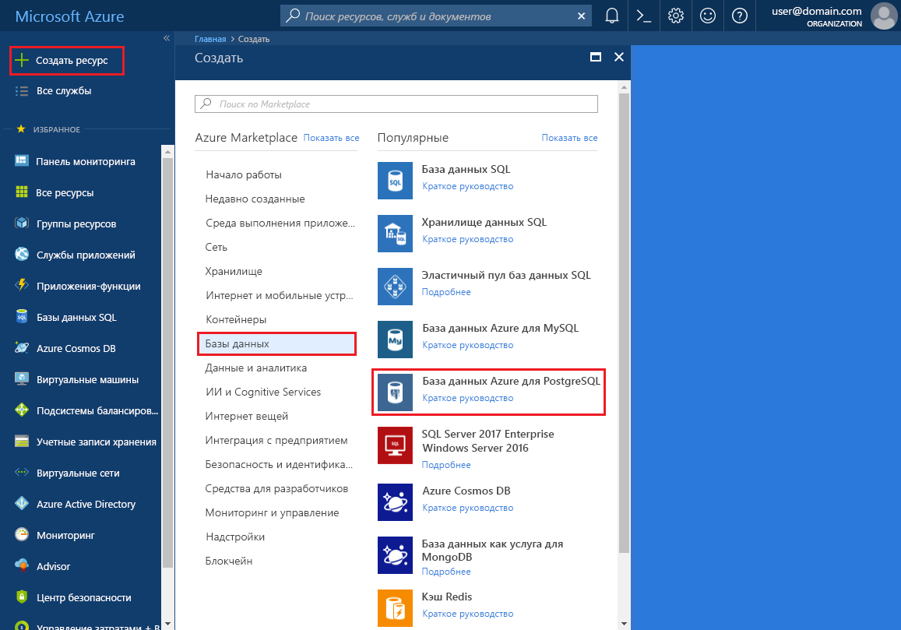
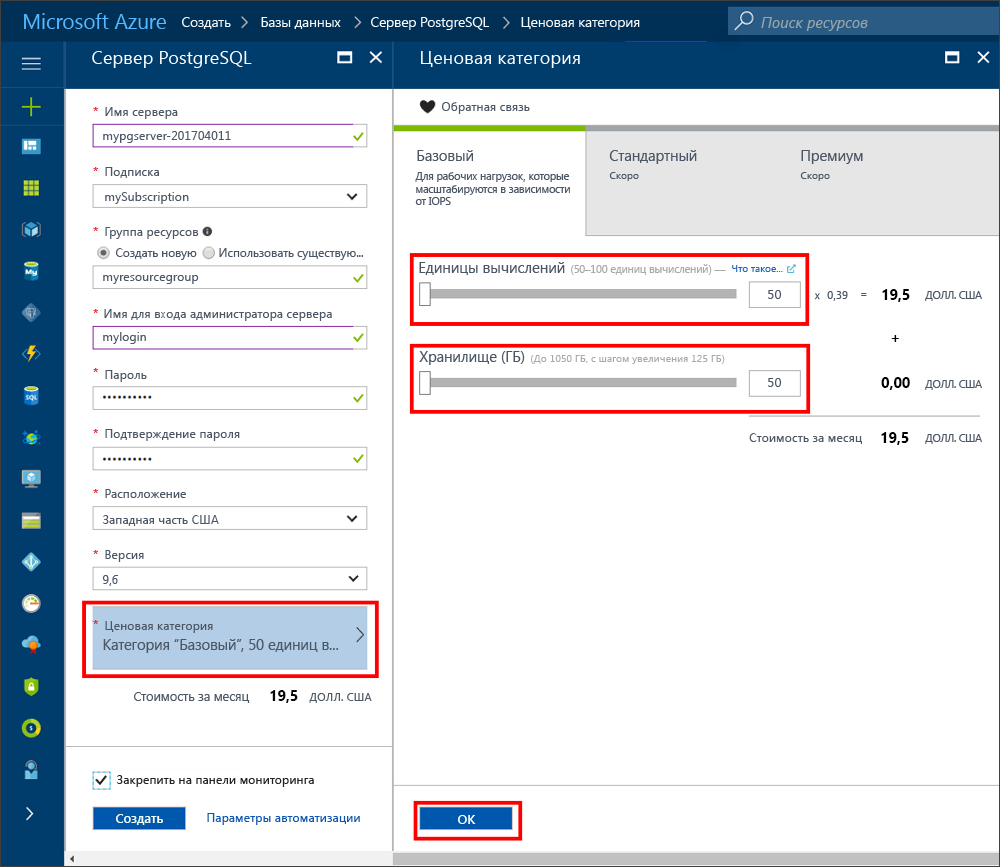

# <a name="create-an-azure-database-for-postgresql-in-the-azure-portal"></a>Создание базы данных Azure для PostgreSQL на портале Azure

База данных Azure для PostgreSQL является управляемой службой, которая позволяет запускать и масштабировать высокодоступные базы данных PostgreSQL, а также управлять ими в облаке. В этом кратком руководстве описывается создание базы данных Azure для сервера PostgreSQL с помощью портала Azure.

Если у вас еще нет подписки Azure, создайте [бесплатную](https://azure.microsoft.com/free/) учетную запись Azure, прежде чем начинать работу.

## <a name="log-in-to-the-azure-portal"></a>Войдите на портал Azure.

Войдите на [портал Azure](https://portal.azure.com).

## <a name="create-an-azure-database-for-postgresql"></a>Создание базы данных Azure для PostgreSQL

Сервер базы данных Azure для PostgreSQL создается с определенным набором [вычислительных ресурсов и ресурсов хранения](./concepts-compute-unit-and-storage.md). Он создается в [группе ресурсов Azure](../azure-resource-manager/resource-group-overview.md).

Чтобы создать базу данных Azure для сервера PostgreSQL, сделайте следующее:
1.  Щелкните **Создать** (+) в верхнем левом углу портала Azure.
2.  На странице **создания** выберите **Базы данных**, а на странице **Базы данных** щелкните **Azure Database for PostgreSQL** (База данных Azure для PostgreSQL).
 

3.  Заполните форму сведений о новом сервере, указав следующую информацию, как показано на предыдущем рисунке.

    Настройка|Рекомендуемое значение|Описание
    ---|---|---
    имя сервера; |*mypgserver-20170401*|Выберите уникальное имя, идентифицирующее базу данных Azure для сервера PostgreSQL. Имя домена *postgres.database.azure.com* добавляется к указанному вами имени сервера, к которому должны подключаться приложения. В имени сервера можно использовать только строчные буквы, цифры и знак дефиса (-). Длина имени должна составлять от 3 до 63 символов.
    Подписки|*Ваша подписка*|Подписка Azure, которую вы хотите использовать для сервера. Если вы используете несколько подписок, выберите ту, в которой за ресурс взимается плата.
    Группа ресурсов|*myresourcegroup*| Можно создать новую группу ресурсов или использовать существующую группу из подписки.
    учетные данные администратора сервера для входа; |*mylogin*| Создайте учетную запись для подключения к серверу. Не используйте для имени учетной записи администратора такие варианты: azure_superuser, azure_pg_admin, admin, administrator, root, guest или public. Также не используйте имя, которое начинается с pg_.
    Пароль |*По своему выбору* | Создайте пароль учетной записи администратора сервера. Пароль должен содержать от 8 до 128 символов. Пароль должен содержать символы трех из следующих категорий: прописные латинские буквы, строчные латинские буквы, цифры (0–9) и другие символы (!, $, #, % и т. д.).
    Расположение|*Ближайший к пользователям регион*| Выберите ближайшее к пользователям расположение.
    Версия PostgreSQL.|*Выберите последнюю версию*| Если нет особых требований, выберите последнюю версию.
    Ценовая категория | **Базовый**, **50 единиц вычислений**,  **50 ГБ** | Щелкните **Ценовая категория**, чтобы указать уровень производительности и уровень служб для новой базы данных. На вкладке вверху выберите уровень "Базовый". Щелкните ползунок "Единицы вычислений" слева, чтобы для начала выбрать наименьшее доступное значение. Нажмите кнопку **ОК**, чтобы сохранить ценовую категорию. Экран должен выглядеть следующим образом.
    | Закрепление на панели мониторинга | Проверка | Установите флажок **Закрепить на панели мониторинга**, чтобы отслеживать работу сервера на странице передней панели мониторинга портала Azure.

  > [!IMPORTANT]
  > Указанные здесь учетные данные и пароль администратора сервера понадобятся позже в этом руководстве, чтобы войти на сервер и в его базу данных. Запомните или запишите эту информацию для последующего использования.

    

4.  Нажмите кнопку **Создать**, чтобы подготовить сервер. Подготовка занимает максимум 20 минут.

5.  На панели инструментов щелкните **Уведомления**, чтобы отслеживать процесс развертывания.
 
   
  По умолчанию на сервере создается база данных **postgres**. База данных [postgres](https://www.postgresql.org/docs/9.6/static/app-initdb.html) — это база данных по умолчанию, предназначенная для использования пользователями, служебными программами и сторонними приложениями. 

## <a name="configure-a-server-level-firewall-rule"></a>Настройка правила брандмауэра на уровне сервера

База данных Azure для службы PostgreSQL создает брандмауэр на уровне сервера. Он не позволяет внешним приложениям и средствам подключаться к серверу и к любой базе данных на сервере, если не создано правило брандмауэра, открывающее брандмауэр для определенных IP-адресов. 

1.  Найдите сервер после завершения развертывания. При необходимости можно выполнить поиск. Например, щелкните **Все ресурсы** в меню слева и введите имя сервера (например, mypgserver-20170401), чтобы найти созданный сервер. Щелкните имя сервера в результатах поиска. Откроется страница обзора сервера с параметрами для настройки.
 
    

2.  На странице сервера выберите **Безопасность подключения**. 
    

3.  В разделе **Правила брандмауэра** щелкните пустое текстовое поле в столбце **Имя правила**, чтобы создать правило брандмауэра. 

    В этом кратком руководстве мы разрешим трафик на сервер со всех IP-адресов. Для этого введите следующие значения в текстовое поле в каждом столбце.

    Имя правила | Начальный IP-адрес | Конечный IP-адрес 
    ---|---|---
    AllowAllIps |  0.0.0.0 | 255.255.255.255

4. На верхней панели инструментов страницы "Безопасность подключения" нажмите кнопку **Сохранить**. Щелкните значок **X**, чтобы закрыть страницу "Безопасность подключения".

    > [!NOTE]
    > Сервер PostgreSQL Azure обменивается данными через порт 5432. Если вы пытаетесь подключиться из корпоративной сети, исходящий трафик через порт 5432 может быть запрещен сетевым брандмауэром. В таком случае вы не сможете подключиться к серверу базы данных SQL Azure. Для этого ваш ИТ-отдел должен открыть порт 5432.
  >

## <a name="get-the-connection-information"></a>Получение сведений о подключении

При создании базы данных Azure для сервера PostgreSQL создается база данных по умолчанию **postgres**. Для подключения к серверу базы данных вам потребуются учетные данные администратора для входа и полное имя сервера. Скорее всего, вы записали эти значения на предыдущем этапе этого руководства. Если вы этого не сделали, вы можете легко найти данные для входа на странице обзора сервера на портале Azure.

1. Откройте страницу сервера **Обзор**. Запишите значения **имени сервера** и **имени для входа администратора сервера**.
    Наведите указатель на каждое поле. Справа от текста отобразится значок копирования. Щелкните значок копирования, чтобы скопировать нужные значения.

 

## <a name="connect-to-postgresql-database-using-psql-in-cloud-shell"></a>Подключение к базе данных PostgreSQL с помощью psql в Cloud Shell

К базе данных Azure для сервера PostgreSQL можно подключиться с помощью нескольких приложений. Сначала воспользуемся служебной программой командной строки psql для подключения к серверу.  Веб-браузер и Azure Cloud Shell можно использовать, как описано здесь, без установки дополнительного программного обеспечения. Если на вашем компьютере установлена служебная программа psql, вы можете подключиться с него.

1. Запустите Azure Cloud Shell с помощью значка терминала в верхней области навигации.

   

2. В браузере откроется служба Azure Cloud Shell, которая позволяет выполнять команды оболочки Bash.

   

3. Чтобы подключиться к базе данных Azure для сервера PostgreSQL, введите команду psql в зеленой командной строке Cloud Shell.

    Используйте следующий формат, чтобы подключиться к серверу базы данных Azure для PostgreSQL с помощью служебной программы [psql](https://www.postgresql.org/docs/9.6/static/app-psql.html):
    ```bash
    psql --host=<yourserver> --port=<port> --username=<server admin login> --dbname=<database name>
    ```

    Например, следующая команда позволяет подключиться к серверу, используемому для примера:

    ```bash
    psql --host=mypgserver-20170401.postgres.database.azure.com --port=5432 --username=mylogin@mypgserver-20170401 --dbname=postgres
    ```

    Параметр psql |Рекомендуемое значение|Описание
    ---|---|---
    --host | *имя сервера* | Укажите значение имени сервера, которое вы использовали ранее при создании базы данных Azure для PostgreSQL. В нашем примере используется такое имя сервера: mypgserver-20170401.postgres.database.azure.com. Используйте полное доменное имя (\*.postgres.database.azure.com), как показано в примере. Следуйте инструкциям из предыдущего раздела, чтобы найти сведения для подключения, если вы не помните имя своего сервера. 
    --port | **5432** | Всегда используйте порт 5432 при подключении к базе данных Azure для PostgreSQL. 
    --username | *имя для входа администратора сервера* |Введите имя администратора сервера, которое вы использовали ранее при создании базы данных Azure для PostgreSQL. Следуйте инструкциям из предыдущего раздела, чтобы найти сведения для подключения, если вы не помните имя пользователя.  Используйте формат *username@servername*.
    --dbname | **postgres** | Для первого подключения используйте имя базы данных по умолчанию *postgres*, созданное автоматически. Позже можно создать собственную базу данных.

    Когда вы запустите команду psql с собственными значениями параметров, появится запрос на ввод пароля администратора сервера. Это пароль, который вы указали при создании сервера. 

    Параметр psql |Рекомендуемое значение|Описание
    ---|---|---
    пароль | *ваш пароль администратора* | Обратите внимание, что символы введенного пароля не будут отображаться в строке Bash. После ввода всех символов нажмите клавишу ВВОД для проверки подлинности и подключения.

4.  Подключившись к серверу, создайте пустую базу данных. Для этого в командной строке введите следующую команду:
    ```bash
    CREATE DATABASE mypgsqldb;
    ```

5.  Чтобы подключиться к созданной базе данных **mypgsqldb**, выполните в командной строке следующую команду.
    ```bash
    \c mypgsqldb
    ```

6.  Введите \q и нажмите клавишу ВВОД, чтобы выйти из программы psql. Теперь Azure Cloud Shell можно закрыть.

Итак, вы подключились к базе данных Azure для PostgreSQL и создали пустую пользовательскую базу данных. Перейдите к следующему разделу, чтобы подключиться к базе данных с помощью другого популярного средства — pgAdmin.

## <a name="connect-to-postgresql-database-using-pgadmin"></a>Подключение к базе данных PostgreSQL с помощью pgAdmin

Чтобы подключиться к серверу PostgreSQL Azure с помощью инструмента графического интерфейса пользователя _pgAdmin_, сделайте следующее:
1.  Запустите приложение _pgAdmin_ на клиентском компьютере. Вы можете установить _pgAdmin_ с помощью http://www.pgadmin.org/.
2.  В меню **Быстрые ссылки** выберите **Добавление сервера**.
3.  На вкладке **Общее** в диалоговом окне **Создать сервер** введите уникальное понятное имя для сервера, например **Azure PostgreSQL Server**.

4.  На вкладке **Подключение** в диалоговом окне **Создать сервер** используйте настройки, как указано, а затем нажмите кнопку **Сохранить**.
   
    - **Host Name/Address** (Имя или адрес узла) — mypgserver-20170401.postgres.database.azure.com. 
        - Полное имя сервера.
    - **Порт** — 5432.
        - Номер порта, используемый этим сервером базы данных — 5432.
    - **Maintenance Database** (База данных обслуживания) — postgres. 
        - Имя базы данных по умолчанию, созданное системой.
    - **Имя пользователя** — mylogin@mypgserver-20170401. 
        - Учетные данные администратора сервера для входа (user@mypgserver), полученные ранее при работе с этим руководством.
    - **Пароль** — пароль, выбранный при создании сервера во время работы с этим руководством.
    - **Режим SSL** — обязателен.
        - По умолчанию все серверы PostgreSQL Azure создаются с включенным применением SSL. Чтобы выключить применение SSL, ознакомьтесь со статьей [о настройке подключения SSL в базе данных Azure для PostgreSQL](./concepts-ssl-connection-security.md).
5.  Щелкните **Сохранить**.
6.  В левой области браузера разверните **Группы серверов**. Выберите свой сервер **Azure PostgreSQL Server**.
7.  Выберите раздел **Сервер** для подключения, а затем выберите в нем **Базы данных**. 
8.  Щелкните правой кнопкой мыши **Базы данных**, чтобы создать базу данных.
9.  Выберите имя базы данных **mypgsqldb** и ее владельца, используя учетные данные администратора сервера для входа **mylogin**.
10. Нажмите кнопку **Сохранить**, чтобы создать пустую базу данных.
11. В разделе **Браузер** разверните узел **Сервер**. Разверните созданный сервер, чтобы увидеть базу данных **mypgsqldb**.
 


## <a name="clean-up-resources"></a>Очистка ресурсов
Очистите все ресурсы, созданные при работе с кратким руководством, удалив [группу ресурсов Azure](../azure-resource-manager/resource-group-overview.md).

> [!TIP]
> Другие краткие руководства в этой коллекции созданы на основе этого документа. Если вы планируете продолжать работу с этими краткими руководствами, не удаляйте созданные ресурсы. Если вы не планируете продолжать работу, удалите все созданные ресурсы, выполнив на портале Azure следующие действия.

1.  В меню слева на портале Azure щелкните **Группы ресурсов**, а затем выберите **myresourcegroup**.
2.  На странице группы ресурсов щелкните **Удалить**, в текстовом поле введите **myresourcegroup** и щелкните "Удалить".

Если вы хотите удалить созданный сервер, сделайте следующее:
1.  В меню слева на портале Azure щелкните серверы PostgreSQL и выполните поиск созданного сервера.
2.  На странице обзора нажмите кнопку удаления в верхней области. 
3.  Подтвердите имя сервера, которое вы хотите удалить, чтобы появилась нужная база данных. В текстовом поле введите **mypgserver-20170401** и щелкните "Удалить".

## <a name="next-steps"></a>Дальнейшие действия
> [!div class="nextstepaction"]
> [Перенос базы данных с помощью экспорта и импорта](./howto-migrate-using-export-and-import.md)

