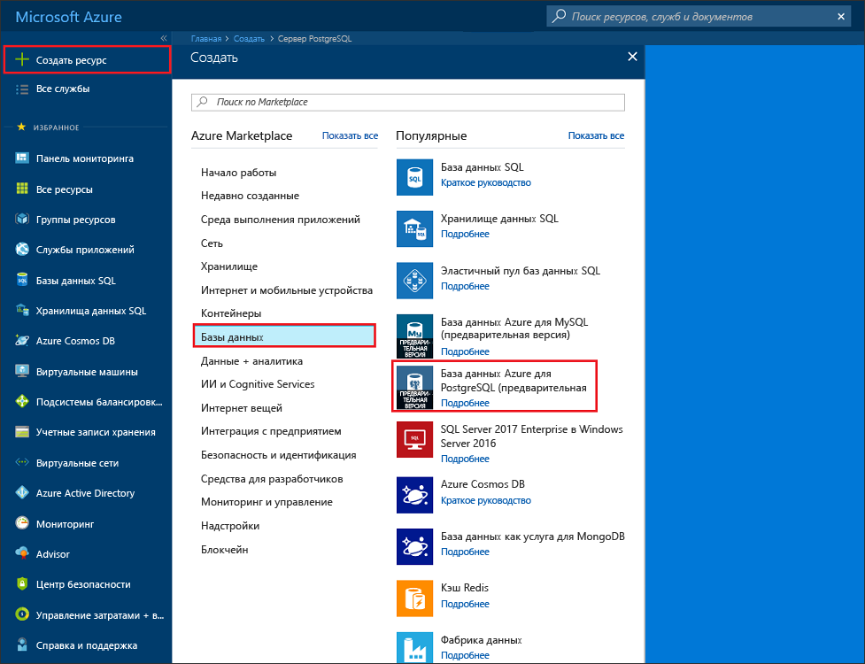
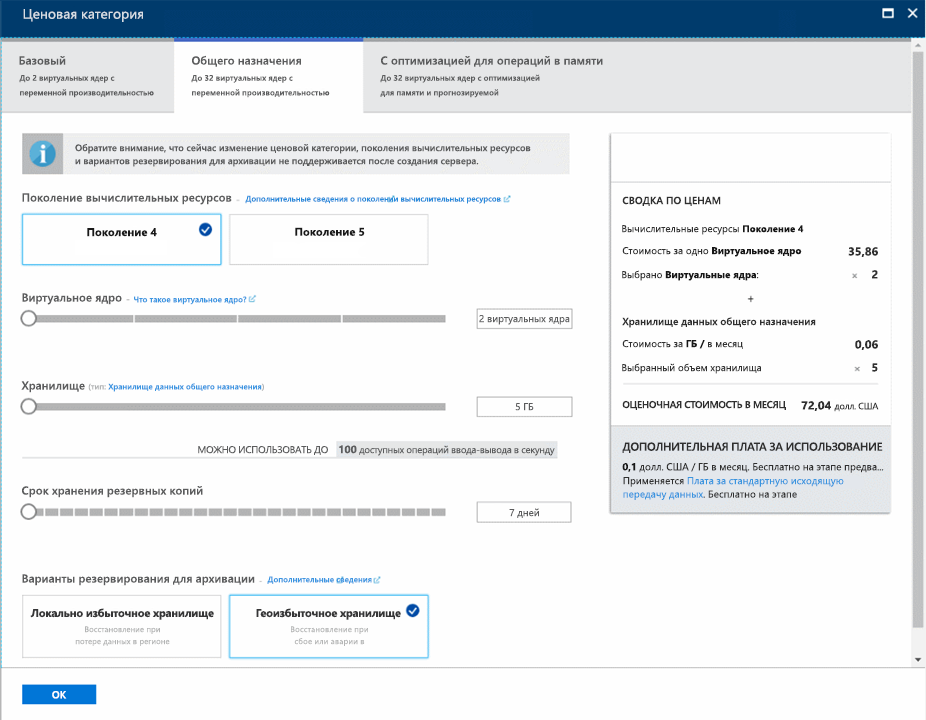
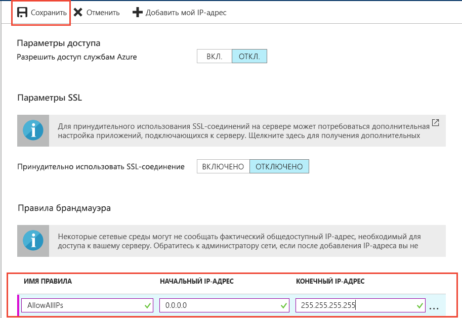

# <a name="tutorial-design-an-azure-database-for-postgresql-using-the-azure-portal"></a>Руководство по проектированию службы "База данных Azure для PostgreSQL" с помощью портала Azure

База данных Azure для PostgreSQL является управляемой службой, которая позволяет запускать и масштабировать высокодоступные базы данных PostgreSQL, а также управлять ими в облаке. С помощью портала Azure можно легко управлять сервером и проектировать базы данных.

Из этого руководства вы узнаете, как с помощью портала Azure выполнять следующие операции:
> [!div class="checklist"]
> * Создание сервера базы данных Azure для PostgreSQL
> * настройка брандмауэра сервера;
> * использование служебной программы [**psql**](https://www.postgresql.org/docs/9.6/static/app-psql.html) для создания базы данных;
> * Загрузка примера данных
> * Запрос данных
> * Обновление данных
> * восстановление данных.

## <a name="prerequisites"></a>предварительным требованиям
Если у вас еще нет подписки Azure, создайте [бесплатную](https://azure.microsoft.com/free/) учетную запись Azure, прежде чем начинать работу.

## <a name="log-in-to-the-azure-portal"></a>Войдите на портал Azure.
Войдите на [портал Azure](https://portal.azure.com).

## <a name="create-an-azure-database-for-postgresql"></a>Создание базы данных Azure для PostgreSQL

Сервер базы данных Azure для PostgreSQL создается с определенным набором [вычислительных ресурсов и ресурсов хранения](./concepts-compute-unit-and-storage.md). Он создается в [группе ресурсов Azure](../azure-resource-manager/resource-group-overview.md).

Чтобы создать базу данных Azure для сервера PostgreSQL, сделайте следующее:
1.  Щелкните **Создать ресурс** в верхнем левом углу окна портала Azure.
2.  На странице **создания** выберите **Базы данных**, а на странице **Базы данных** щелкните **Azure Database for PostgreSQL** (База данных Azure для PostgreSQL).
  

3.  Заполните форму для создания сервера, указав следующую информацию:

    

    - Имя сервера — **mydemoserver** (имя сервера сопоставляется с DNS-именем, и поэтому оно должно быть глобально уникальным). 
    - Подписка. Если вы используете несколько подписок, выберите соответствующую подписку, в которой находится ресурс либо в которой за него взимается плата.
    - Группа ресурсов — **myresourcegroup**.
    - Имя для входа администратора сервера и пароль.
    - Расположение
    - Версия PostgreSQL.

   > [!IMPORTANT]
   > Указанные здесь учетные данные и пароль администратора сервера понадобятся позже в этом руководстве, чтобы войти на сервер и в его базу данных. Запомните или запишите эту информацию для последующего использования.

4.  Щелкните **Ценовая категория**, чтобы указать ценовую категорию для нового сервера. В рамках этого руководства выберите категорию **Общего назначения**, для поколения вычислительных ресурсов задайте **4 поколение**, укажите "2" для **виртуальных ядер**, 5 ГБ — для **хранилища** и 7 дней — для **срока хранения резервной копии**. В качестве типа избыточности резервного копирования выберите **Геоизбыточное хранилище**, чтобы в нем автоматически сохранялись резервные копии сервера.
 

5.  Нажмите кнопку **ОК**.

6.  Нажмите кнопку **Создать**, чтобы подготовить сервер. Подготовка занимает несколько минут.

7.  На панели инструментов щелкните **Уведомления**, чтобы отслеживать процесс развертывания.
 

   > [!TIP]
   > Установите флажок **Закрепить на панели мониторинга**, чтобы с легкостью отслеживать процесс развертывания.

   По умолчанию на сервере создается база данных **postgres**. База данных [postgres](https://www.postgresql.org/docs/9.6/static/app-initdb.html) — это база данных по умолчанию, предназначенная для использования пользователями, служебными программами и сторонними приложениями. 

## <a name="configure-a-server-level-firewall-rule"></a>Настройка правила брандмауэра на уровне сервера

База данных Azure для службы PostgreSQL использует брандмауэр на уровне сервера. По умолчанию он не позволяет внешним приложениям и средствам подключаться к серверу и к любой базе данных на сервере, если не создано правило брандмауэра, открывающее брандмауэр для определенного диапазона IP-адресов. 

1.  По завершении развертывания щелкните **Все ресурсы** в меню слева и введите имя **mydemoserver**, чтобы найти созданный сервер. Щелкните имя сервера в результатах поиска. После этого откроется страница **обзора** сервера с параметрами для дальнейшей конфигурации.

   

2.  На странице сервера выберите **Безопасность подключения**. 

3.  Щелкните текстовое поле раздела **Имя правила** и добавьте новое правило брандмауэра, чтобы добавить диапазон IP-адресов для подключения в список разрешений. В задачах этого руководства разрешите подключение для всех IP-адресов, указав для параметра **Имя правила** значение AllowAllIps, для параметра **Начальный IP-адрес** значение 0.0.0.0, а для параметра **Конечный IP-адрес** значение 255.255.255.255, после чего щелкните **Сохранить**. Вы можете задать определенное правило брандмауэра, охватывающее меньший диапазон IP-адресов, чтобы иметь возможность подключаться из сети.

   

4.  Щелкните **Сохранить**, а затем **X**, чтобы закрыть страницу **Безопасность подключения**.

   > [!NOTE]
   > Сервер PostgreSQL Azure обменивается данными через порт 5432. Если вы пытаетесь подключиться из корпоративной сети, исходящий трафик через порт 5432 может быть запрещен сетевым брандмауэром. В таком случае вы не сможете подключиться к серверу базы данных SQL Azure, пока ваш ИТ-отдел не откроет порт 5432.
   >

## <a name="get-the-connection-information"></a>Получение сведений о подключении

При создании базы данных Azure для сервера PostgreSQL была также создана база данных по умолчанию **postgres**. Чтобы подключиться к серверу базы данных, необходимо указать сведения об узле и учетные данные для доступа.

1. На портале Azure в меню слева щелкните **Все ресурсы** и найдите только что созданный сервер.

   

2. Щелкните имя сервера **mydemoserver**.

3. Выберите страницу **обзора** сервера. Запишите значения **имени сервера** и **имени для входа администратора сервера**.

   


## <a name="connect-to-postgresql-database-using-psql-in-cloud-shell"></a>Подключение к базе данных PostgreSQL с помощью psql в Cloud Shell

Теперь подключимся к серверу базы данных Azure для PostgreSQL с помощью служебной программы командной строки [psql](https://www.postgresql.org/docs/9.6/static/app-psql.html). 
1. Запустите Azure Cloud Shell с помощью значка терминала в верхней области навигации.

   

2. В браузере откроется служба Azure Cloud Shell, которая позволяет выполнять команды Bash.

   

3. Подключитесь к базе данных Azure для сервера PostgreSQL, выполнив команду psql в командной строке Cloud Shell. Используйте следующий формат, чтобы подключиться к серверу базы данных Azure для PostgreSQL с помощью служебной программы [psql](https://www.postgresql.org/docs/9.6/static/app-psql.html):
   ```bash
   psql --host=<myserver> --port=<port> --username=<server admin login> --dbname=<database name>
   ```

   Например, следующая команда устанавливает подключение к базе данных по умолчанию **postgres** на сервере PostgreSQL **mydemoserver.postgres.database.azure.com**, используя учетные данные для доступа. В ответ на запрос введите пароль администратора сервера.

   ```bash
   psql --host=mydemoserver.postgres.database.azure.com --port=5432 --username=myadmin@mydemoserver --dbname=postgres
   ```

## <a name="create-a-new-database"></a>Создание базы данных
Подключившись к серверу, создайте пустую базу данных с помощью командной строки.
```bash
CREATE DATABASE mypgsqldb;
```

Выполните следующую команду в командной строке, чтобы подключиться к созданной базе данных **mypgsqldb**.
```bash
\c mypgsqldb
```
## <a name="create-tables-in-the-database"></a>Создание таблиц в базе данных
Теперь, когда вы знаете, как подключиться к базе данных Azure для PostgreSQL, можно выполнить некоторые основные задачи.

Сначала создайте таблицу и заполните ее некоторыми данными. Давайте создадим таблицу, с помощью которой можно отслеживать данные инвентаризации, используя код SQL.
```sql
CREATE TABLE inventory (
    id serial PRIMARY KEY, 
    name VARCHAR(50), 
    quantity INTEGER
);
```

Вы можете просмотреть созданную таблицу в списке таблиц, введя:
```sql
\dt
```

## <a name="load-data-into-the-tables"></a>Загрузка данных в таблицу
Теперь, когда таблица создана, мы можем вставить в нее данные. Чтобы вставить некоторые строки данных, в открытом окне командной строки выполните следующий запрос:
```sql
INSERT INTO inventory (id, name, quantity) VALUES (1, 'banana', 150); 
INSERT INTO inventory (id, name, quantity) VALUES (2, 'orange', 154);
```

Итак, в созданной ранее таблице inventory содержится две строки данных.

## <a name="query-and-update-the-data-in-the-tables"></a>Запрос и обновление данных в таблицах
Чтобы извлечь сведения из таблицы inventory базы данных, выполните приведенный ниже запрос. 
```sql
SELECT * FROM inventory;
```

Вы можете также обновить данные в таблице, выполнив следующую команду:
```sql
UPDATE inventory SET quantity = 200 WHERE name = 'banana';
```

При извлечении данных вы увидите обновленные значения.
```sql
SELECT * FROM inventory;
```

## <a name="restore-data-to-a-previous-point-in-time"></a>Восстановление данных до предшествующей точки во времени
Представьте, что вы случайно удалили таблицу. Восстановить ее будет непросто. База данных Azure для PostgreSQL позволяет вернуть состояние до любой точки времени при наличии резервных копий сервера (определяется по настроенному сроку хранения резервной копии) и восстановить данные до этой точки на новом сервере. Вы можете восстановить удаленные данные с помощью нового сервера. Следующие шаги позволяют восстановить сервер **mydemoserver** до точки во времени перед добавлением таблицы inventory.

1.  На странице **Обзор** сервера базы данных Azure для PostgreSQL на панели инструментов щелкните **Восстановить**. Откроется страница **Восстановление**.

   

2.  Заполните форму **Восстановление**, указав следующие сведения.

   

   - **Точка восстановления.** Выберите время до того момента, когда был изменен сервер.
   - **Целевой сервер**: укажите новое имя сервера, который нужно восстановить.
   - **Расположение**: вы не сможете выбрать регион, по умолчанию он совпадает с регионом исходного сервера.
   - **Ценовая категория**: это значение нельзя изменить при восстановлении сервера. Она совпадает с ценовой категорией исходного сервера. 
3.  Чтобы [восстановить сервер до точки во времени](./howto-restore-server-portal.md) перед удалением таблицы, нажмите кнопку **OК**. При восстановлении сервера до точки во времени создается копия исходного сервера с состоянием на момент указанной точки во времени (в пределах срока хранения, установленного для вашей [ценовой категории](./concepts-pricing-tiers.md)).

## <a name="next-steps"></a>Дополнительная информация
Из этого руководства вы узнали, как с помощью портала Azure и других служебных программ выполнить следующие операции:
> [!div class="checklist"]
> * Создание сервера базы данных Azure для PostgreSQL
> * настройка брандмауэра сервера;
> * использование служебной программы [**psql**](https://www.postgresql.org/docs/9.6/static/app-psql.html) для создания базы данных;
> * Загрузка примера данных
> * Запрос данных
> * Обновление данных
> * восстановление данных.

Чтобы узнать, как выполнять похожие задачи с помощью Azure CLI, см. сведения в руководстве [Проектирование первой базы данных Azure для PostgreSQL с помощью Azure CLI](tutorial-design-database-using-azure-cli.md).
