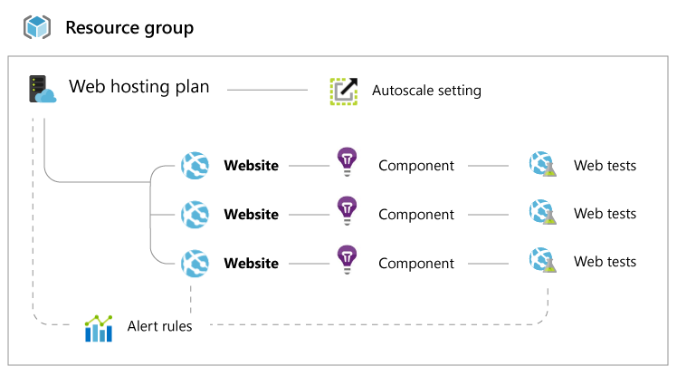

<properties 
	pageTitle="Устранение неполадок при управлении доступом на основе ролей" 
	<MORAVIA_NOTRANSLATE></MORAVIA_NOTRANSLATE> 
	services="" 
	documentationCenter="" 
	authors="stepsic-microsoft-com" 
	writer="" 
	manager="terrylan" 
	editor=""/>

<tags 
	ms.service="multiple" 
	ms.workload="multiple" 
	ms.tgt_pltfrm="ibiza" 
	ms.devlang="na" 
	ms.topic="article" 
	ms.date="11/03/2014" 
	ms.author="stepsic"/>

# Устранение неполадок при управлении доступом на основе ролей

## Введение

[Управление доступом на основе ролей](http://azure.microsoft.com/documentation/articles/role-based-access-control-configure/) - эффективная функция, позволяющая делегировать доступ к ресурсам Azure на детальном уровне. Это означает, что можно предоставить конкретному человеку только те права, которые ему действительно нужны. Но временами разобраться в модели ресурсов для Azure может быть так же сложно, как и понять принципы назначения прав доступа.

В этом документе рассказывается, чего ожидать при использовании новых ролей в предварительной версии портала.  В данной версии представлены три встроенные роли:
* владелец;
* участник;
* читатель.

И владельцы, и участники получают полный доступ к управлению ресурсами; разница лишь в том, что участник не может предоставлять доступ другим пользователям или группам. Роль читателя несколько более неочевидна, поэтому на ней мы остановимся подробнее. [В этой статье](http://azure.microsoft.com/documentation/articles/role-based-access-control-configure/) подробно описан процесс назначения прав доступа.

## Рабочие нагрузки веб-сайта

### Доступ только для чтения 

Если вы дали пользователю только права доступа на чтение веб-сайта или сами имеете только их, то вам могут быть недоступны некоторые возможности. Перечисленные ниже возможности управления требуют доступа к веб-сайту с правом **записи** (роль участника или владельца) и будут недоступны при наличии только прав на чтение. 
 
1. Команды (например, запуск, остановка и т. д.).
2. Изменение параметров, таких как общие параметры конфигурации, параметры масштабирования, резервного копирования и мониторинга.
3. Доступ к учетным данным для публикации и другим секретам, например к параметрам приложений и строкам подключения.
4. Журналы потоковой передачи.
5. Конфигурация журналов диагностики.
6. Консоль веб-сайтов (командная строка).
7. Активные и недавние развертывания (для локального непрерывного развертывания Git).
8. Приблизительные затраты.
9. Веб-тесты
10. Виртуальная сеть (видна читателю только в том случае, если ранее была настроена пользователем с доступом на запись).
 
Если вы не можете получить доступ к чему-либо из указанного, то это означает, что вам нужны права участника для этого веб-сайта. 

### Работа со связанными ресурсами
 
Работу с веб-сайтами усложняет наличие нескольких взаимодействующих между собой ресурсов. Вот типичная группа ресурсов с парой веб-сайтов:

В результате, если вы дадите кому-либо доступ лишь к веб-сайту, большая часть функционала на панели веб-сайта будет полностью недоступна. 
 
1. Эти объекты требуют доступа к **плану веб-хостинга**, связанному с вашим веб-сайтом:  
    * Просмотр ценового уровня веб-сайта (например, Free, Shared, Basic или Standard).
    * конфигурация масштабирования (т. е. число экземпляров, размер виртуальной машины, параметры автоматического масштабирования);
    * квоты (например, квоты хранилища, пропускной способности, ресурсов ЦП).
2. Эти объекты требуют доступа ко всей **группе ресурсов**, где содержится веб-сайт:  
    * SSL-сертификаты и привязки (это связано с тем, что SSL-сертификаты могут совместно использоваться сайтами, относящимися к одной группе ресурсов и находящимися в одном географическом расположении);
    * правила оповещений.
    * параметры автоматического масштабирования;
    * компоненты Application Insights;
    * Веб-тесты

## Рабочие нагрузки виртуальной машины

Как и в случае с веб-сайтами, для некоторых функций в колонке виртуальной машины нужен доступ на запись к виртуальной машине или к другим ресурсам в группе ресурсов.

С виртуальными машинами связаны следующие ресурсы:
* Имена доменов
* виртуальные сети;
* учетные записи хранения;
* правила оповещений.

1. Эти объекты требуют доступа на **запись** для виртуальной машины:  
    * Конечные точки
    * IP-адреса;
    * диски;
    * расширения.
2. Эти объекты требуют доступа на запись как для виртуальной машины, так и для **группы ресурсов** (вместе с именем домена), где она находится:  
    * группа доступности;
    * набор балансировки нагрузки;
    * правила оповещений.
    
Если вы не можете получить доступ к этим компонентам, попросите администратора предоставить вам права участника для группы ресурсов.

<!--HONumber=46--> 
