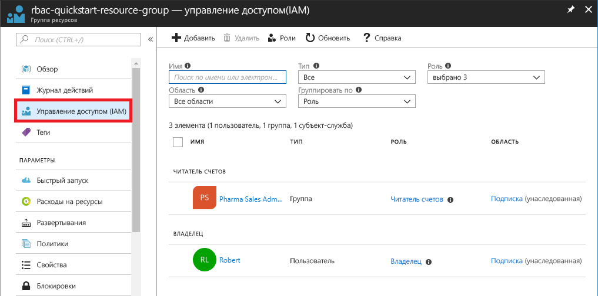
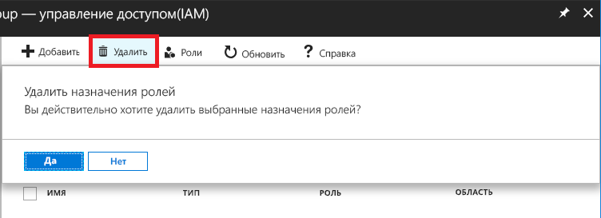

# Руководство. Предоставление доступа пользователю с помощью RBAC и портала Azure

[Управление доступом на основе ролей (RBAC)](overview.md) — это способ управления доступом к ресурсам в Azure. В этом руководстве объясняется, как предоставить пользователю доступ к созданию и администрированию виртуальных машин в группе ресурсов.

Из этого руководства вы узнаете, как выполнять следующие задачи:

> [!div class="checklist"]
> * Предоставление доступа пользователю в области действия группы ресурсов
> * Запрет доступа

Если у вас еще нет подписки Azure, [создайте бесплатную учетную запись Azure](https://azure.microsoft.com/free/?WT.mc_id=A261C142F), прежде чем начинать работу.

## Вход в Azure

Войдите на портал Azure по адресу https://portal.azure.com.

## Создание группы ресурсов

1. В списке переходов щелкните **Группы ресурсов**.

1. Чтобы открыть колонку **Группа ресурсов**, щелкните **Добавить**.

   

1. Для **имени группы ресурсов** введите **rbac-resource-group**.

1. Выберите подписку и расположение группы ресурсов.

1. Щелкните **Создать** , чтобы создать группу ресурсов.

1. Чтобы обновить список групп ресурсов, щелкните **Обновить**.

   Новая группа ресурсов появится в списке групп ресурсов.

   

## Предоставление доступа

При использовании RBAC, чтобы предоставить доступ, нужно создать назначение ролей.

1. В списке **Группы ресурсов** щелкните новую группу ресурсов **rbac-resource-group**.

1. Щелкните **Управление доступом (IAM)**.

1. Щелкните вкладку **Назначения ролей**, чтобы просмотреть выбранный список назначения ролей.

   

1. Щелкните **Добавить** > **Добавить назначение ролей**, чтобы открыть панель Добавить назначение ролей.

   Если у вас нет прав назначать роли, функция "Добавить назначение роли" будет неактивна.

   

   

1. В раскрывающемся списке **Роль** выберите **Участник виртуальных машин**.

1. В списке **Выбор** выберите себя или другого пользователя.

1. Чтобы создать назначение роли, нажмите **Сохранить**.

   Через несколько секунд пользователю будет назначена роль "Участник виртуальной машины" в пределах группы ресурсов rbac-resource-group.

   

## Запрет доступа

В RBAC, чтобы удалить доступ, нужно удалить назначение роли.

1. В списке назначения ролей установите флажок рядом с пользователем с ролью "Участник виртуальной машины".

1. Нажмите кнопку **Удалить**.

   

1. В появившемся сообщении об отзыве назначения роли щелкните **Да**.

## Очистка

1. В списке переходов щелкните **Группы ресурсов**.

1. Чтобы открыть группу ресурсов, щелкните **rbac-resource-group**.

1. Чтобы удалить группу ресурсов, щелкните **Удалить группу ресурсов**.

   

1. В колонке **Вы действительно хотите удалить** введите имя группы ресурсов: **rbac-resource-group**.

1. Чтобы удалить группу ресурсов, щелкните **Удалить**.

## Дополнительная информация

> [!div class="nextstepaction"]
> [Руководство Предоставление доступа пользователям с помощью RBAC и Azure PowerShell](tutorial-role-assignments-user-powershell.md)

