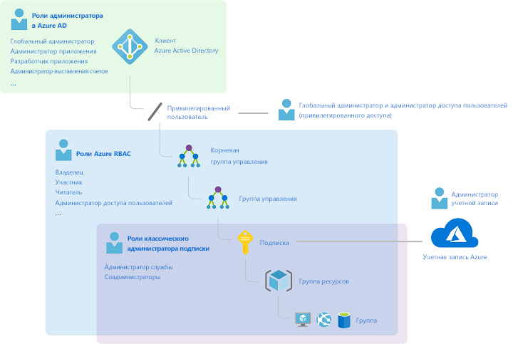
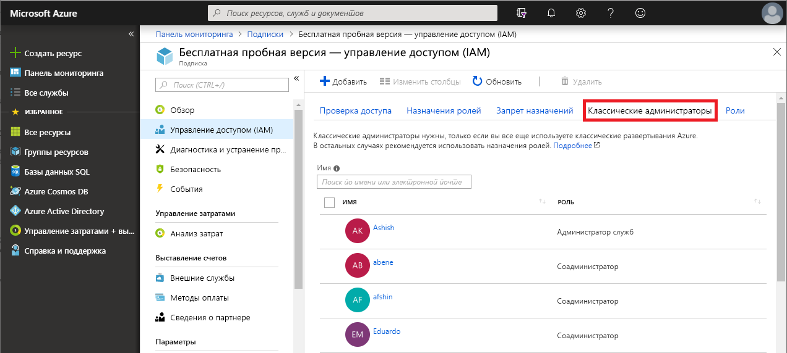
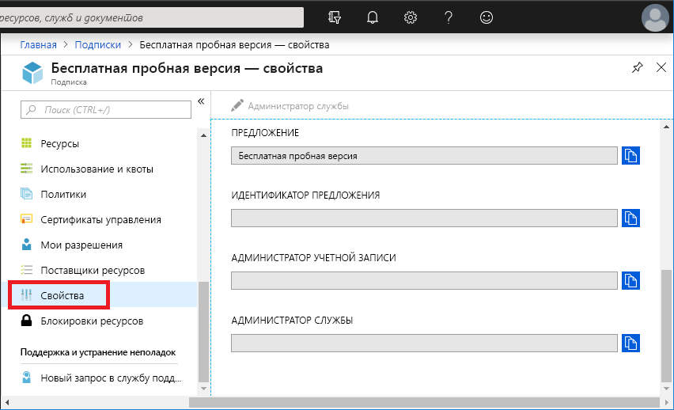
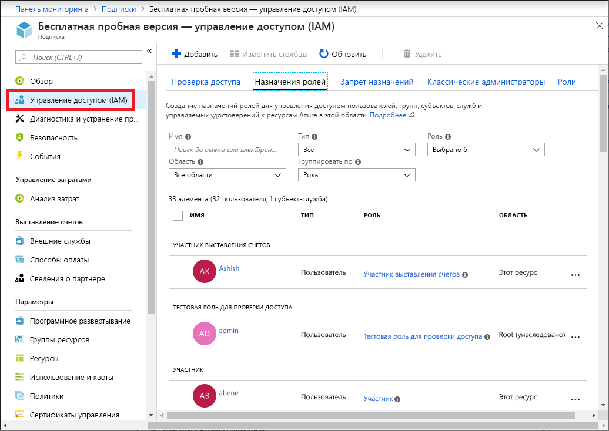
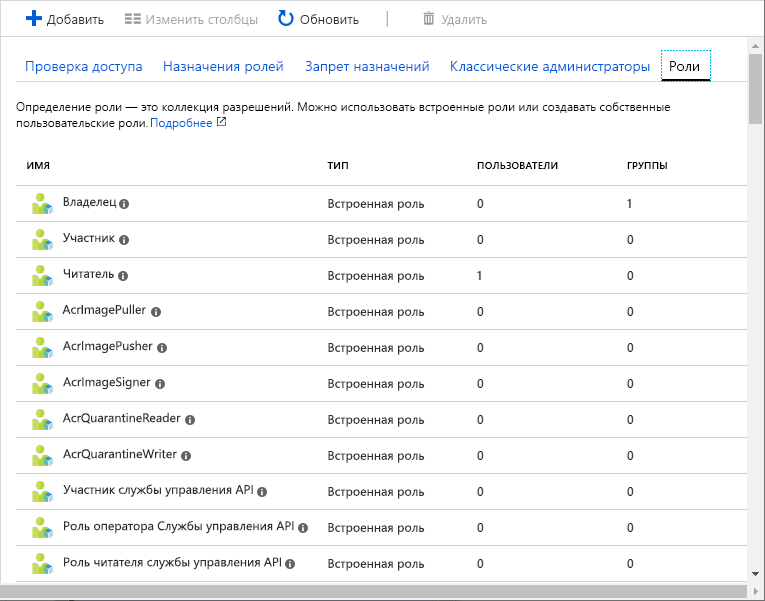
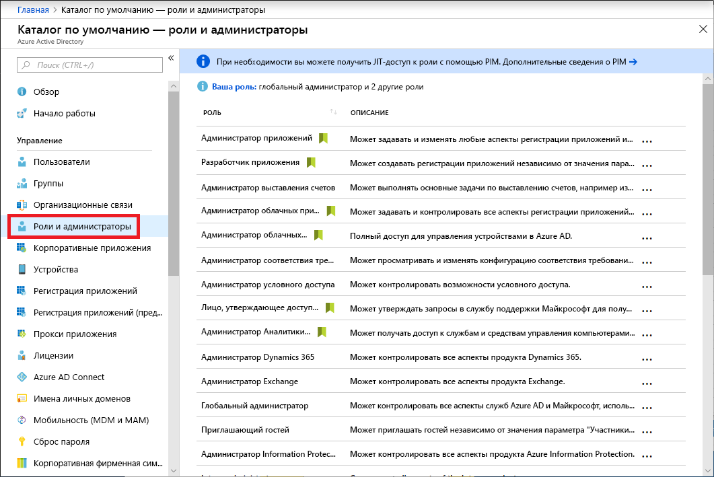
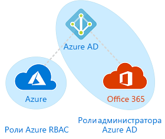

# Роли классического администратора подписки, роли RBAC Azure и роли администратора Azure AD

Если вы еще не знакомы с Azure, понимание вопросов, связанных с ролями в Azure, может показаться вам достаточно сложным. В этой статье описываются следующие роли и приводятся рекомендации по их использованию:
- Роли классического администратора подписки
- Роли управление доступом на основе ролей в Azure (RBAC)
- Роли администратора Azure Active Directory (Azure AD)

## Взаимосвязи между ролями

Для лучшего понимания ролей в Azure требуется определенная историческая справка. В первоначальном выпуске Azure для управления доступом к ресурсам использовались всего три роли администратора: администратор учетной записи, администратор служб и соадминистратор. Впоследствии была добавлена роль управления доступом на основе ролей (RBAC) для ресурсов Azure. RBAC Azure — это новая система авторизации, которая обеспечивает более точное управление доступом к ресурсам Azure. Система RBAC включает множество встроенных ролей, которые могут назначаться в различных областях, а также позволяет создавать собственные пользовательские роли. Для управления такими ресурсами Azure AD, как пользователи, группы и домены, используется несколько ролей администратора Azure AD.

На следующем рисунке представлена высокоуровневая схема взаимосвязей между ролями классического администратора подписки, RBAC Azure и администратора Azure AD.

## Роли классического администратора подписки

В Azure предусмотрено три роли классического администратора подписки: администратор учетной записи, администратор службы и соадминистратор. Классические администраторы подписки имеют полный доступ к подписке Azure. Они могут управлять ресурсами с помощью портала Azure, интерфейсов API Azure Resource Manager и классической модели развертывания Azure. Учетной записи, используемой для регистрации в Azure, автоматически назначается роль администратора учетной записи и администратора службы. Дополнительные роли соадминистратора можно добавить уже позже. Администратор служб и соадминистратор имеют эквивалентные права доступа для пользователей, которым была назначена роль владельца (роль RBAC Azure) в области действия подписки. В следующей таблице представлены различия между этими тремя ролями классического администратора подписки.

| Классический администратор подписки | Ограничение | Разрешения | Примечания |
| --- | --- | --- | --- |
| Администратор учетной записи | Один на учетную запись Azure | <ul><li>Доступ к [центру управления учетной записью Azure](https://account.azure.com/Subscriptions)</li><li>Управление всеми подписками в учетной записи</li><li>Создание новых подписок</li><li>Отмена подписок</li><li>Изменение тарифного плана для подписки</li><li>Изменение администратора служб</li></ul> | По существу, это владелец подписки, которому выставляются счета. Администратор учетной записи не имеет доступа к порталу Azure. |
| Администратор служб | Один на подписку Azure | <ul><li>Управление службами [на портале Azure](https://portal.azure.com)</li><li>Назначение роли соадминистратора пользователям</li></ul> | По умолчанию для новой подписки администратор учетных записей является также администратором службы. Администратор служб имеет эквивалентные права доступа для пользователя, которому назначена роль владельца в области действия подписки. Администратор служб имеет полный доступ к порталу Azure. |
| Соадминистратор | 200 на подписку | <ul><li>Имеет те же права доступа, что и администратор службы, но не может менять связь подписок с каталогами Azure</li><li>Назначение роли соадминистратора пользователям без возможности изменения администратора служб</li></ul> | Соадминистратор имеет эквивалентные права доступа для пользователя, которому назначена роль владельца в области действия подписки. |

На вкладке **Классические администраторы** портала Azure вы можете управлять соадминистраторами или просмотреть данные об администраторах служб.

В колонке свойств подписки на портале Azure вы можете просмотреть и изменить администраторов служб или просмотреть администраторов учетной записи.

Дополнительные сведения см. в статье [Классические администраторы подписок Azure](classic-administrators.md).

### Учетная запись Azure и подписки Azure

Учетная запись Azure представляет собой отношение выставления счетов. Учетная запись Azure представляет собой удостоверение пользователя, одну или несколько подписок Azure и связанный набор ресурсов Azure. Пользователь, создавший учетную запись, является администратором учетной записи для всех создаваемых в ее рамках подписок. Этот пользователь также по умолчанию назначается администратором служб для этой подписки.

Подписки Azure служат для организованного доступа к ресурсам Azure. Они также позволяют управлять составлением отчетов об использовании ресурса, выставлением счетов за использование и их оплатой. Каждая подписка может иметь различные настройки для выставления счетов и их оплаты, поэтому у вас могут быть разные подписки и тарифные планы для разных офисов, отделов, проектов и т. д. Каждая служба привязана к подписке, идентификатор которой может требоваться для выполнения программных операций.

Управление учетными записями и подписками осуществляется в [центре управления учетной записью Azure](https://account.azure.com/Subscriptions).

## Роли RBAC Azure

RBAC Azure — это система авторизации на основе [Azure Resource Manager](../azure-resource-manager/resource-group-overview.md), которая обеспечивает точное управление доступом к ресурсам в Azure, например к вычислительным ресурсам и хранилищу. Система RBAC Azure включает более 70 встроенных ролей. В системе RBAC предусмотрены четыре основные роли. Первые три роли охватывают все типы ресурсов:

| Роль RBAC Azure | Разрешения | Примечания |
| --- | --- | --- |
| [Владелец](built-in-roles.md#owner) | <ul><li>Полный доступ ко всем ресурсам</li><li>Делегирование прав доступа другим пользователям</li></ul> | Администратору служб и соадминистраторам назначается роль владельца в области действия подписки Применяется ко всем типам ресурсов. |
| [Участник](built-in-roles.md#contributor) | <ul><li>Создание ресурсов Azure любых типов и управление ими</li><li>Не может предоставлять права доступа другим пользователям</li></ul> | Применяется ко всем типам ресурсов. |
| [Читатель](built-in-roles.md#reader) | <ul><li>Просмотр ресурсов Azure</li></ul> | Применяется ко всем типам ресурсов. |
| [Администратор доступа пользователей](built-in-roles.md#user-access-administrator) | <ul><li>Управление доступом пользователей к ресурсам Azure</li></ul> |  |

Остальные встроенные роли разрешают управление определенными ресурсами Azure. Например, роль [Участник виртуальных машин](built-in-roles.md#virtual-machine-contributor) позволяет пользователю создавать виртуальные машины и управлять ими. Полный список встроенных ролей см. в статье [Встроенные роли для ресурсов Azure](built-in-roles.md).

Модель RBAC поддерживается только порталом Azure и API-интерфейсами Azure Resource Manager. Пользователи, группы и приложения, которым назначены роли RBAC, не могут использовать [API классической модели развертывания Azure](../azure-resource-manager/resource-manager-deployment-model.md).

На портале Azure сведения о назначении ролей RBAC отображаются в колонке **Управление доступом (IAM)**. Эта колонка представлена в различных разделах портала, в том числе в группах управления, подписках, группах ресурсов и различных ресурсах.

При выборе вкладки **Роли** отобразится список встроенных и пользовательских ролей.

Дополнительные сведения см. в статье [Управление доступом к ресурсам Azure с помощью RBAC и портала Azure](role-assignments-portal.md).

## Роли администратора в Azure AD

Роли администратора Azure AD используются для управления ресурсами Azure AD в каталоге, то есть для создания и изменения пользователей, назначения ролей администратора другим пользователям, сброса паролей пользователей, управления лицензиями пользователей, а также для управления доменами. В следующей таблице описываются некоторые основные роли администратора Azure AD.

| Роль администратора в Azure AD | Разрешения | Примечания |
| --- | --- | --- |
| [Глобальный администратор](../active-directory/users-groups-roles/directory-assign-admin-roles.md#company-administrator) | <ul><li>Управление доступа ко всем административным функциям в Azure Active Directory, а также к службам, которые включены в федерацию с Azure Active Directory</li><li>Назначение ролей администратора другим пользователям</li><li>Сброс паролей для любого пользователя и других администраторов</li></ul> | Пользователь, зарегистрировавший клиент Azure Active Directory, становится глобальным администратором. |
| [Администратор пользователей](../active-directory/users-groups-roles/directory-assign-admin-roles.md#user-administrator) | <ul><li>Создание всех аспектов пользователей и групп и управление ими</li><li>Управление запросами в службу поддержки</li><li>Мониторинг работоспособности служб</li><li>Изменение паролей для пользователей, администраторов службы технической поддержки и других администраторов пользователей</li></ul> |  |
| [Администратор выставления счетов](../active-directory/users-groups-roles/directory-assign-admin-roles.md#billing-administrator) | <ul><li>Совершение покупок</li><li>Управление подписками</li><li>Управление запросами в службу поддержки</li><li>Мониторинг работоспособности службы</li></ul> |  |

Список ролей администратора Azure AD можно просмотреть в колонке **Роли и администраторы** на портале Azure. Полный список ролей администратора Azure AD см. в статье [Разрешения роли администратора в Azure Active Directory](../active-directory/users-groups-roles/directory-assign-admin-roles.md).

## Различия между ролями RBAC Azure и ролями администратора Azure AD

На верхнем уровне роли RBAC Azure управляют разрешениями на управление ресурсами Azure, а роли администратора Azure AD управляют разрешениями на управление ресурсами Azure Active Directory. Сравнение различий приводится в следующей таблице.

| Роли RBAC Azure | Роли администратора в Azure AD |
| --- | --- |
| Управление доступом к ресурсам Azure | Управление доступом к ресурсам Azure Active Directory |
| Поддержка пользовательских ролей | Отсутствует возможность создавать собственные роли |
| Возможность указывать область действия на нескольких уровнях (группа управления, подписка, группа ресурсов, ресурс) | Область действия на уровне клиента |
| Сведения о роли можно получить на портале Azure, в Azure CLI, Azure PowerShell, в шаблонах Azure Resource Manager и API REST | Сведения о роли можно получить на портале администрирования Azure, в Центре администрирования Microsoft 365, в Microsoft Graph и AzureAD PowerShell |

### Пересекаются ли роли RBAC Azure и роли администратора Azure AD?

По умолчанию действие ролей RBAC Azure и ролей администратора Azure AD не распространяется на Azure и Azure AD. Тем не менее, если глобальный администратор повысит свой уровень доступа с помощью параметра **Глобальный администратор может управлять подписками Azure и группами управления** на портале Azure, глобальному администратору будет назначена роль [Администратор доступа пользователей](built-in-roles.md#user-access-administrator) (роль RBAC) для всех подписок соответствующего клиента. Роль администратора доступа пользователей позволяет предоставлять другим пользователям доступ к ресурсам Azure. Этот параметр может использоваться для восстановления доступа к подписке. Дополнительные сведения см. в разделе [Повышение уровня доступа в качестве администратора Azure AD](elevate-access-global-admin.md).

Некоторые роли администратора Azure AD, например глобальный администратор или администратор пользователей, действуют в отношении Azure AD и Microsoft Office 365. Например, если вам назначена роль глобального администратора, у вас будут права глобального администратора в отношении Azure AD и Office 365, позволяющие, например, вносить изменения в Microsoft Exchange и Microsoft SharePoint. Тем не менее по умолчанию у глобального администратора отсутствуют права доступа к ресурсам Azure.

## Дополнительная информация

- [Что такое управление доступом на основе ролей (RBAC)?](overview.md)
- [Разрешения роли администратора в Azure Active Directory](../active-directory/users-groups-roles/directory-assign-admin-roles.md)
- [Классические администраторы подписок Azure](classic-administrators.md)
