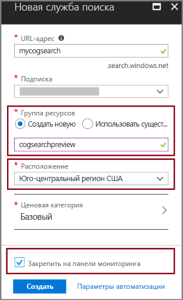
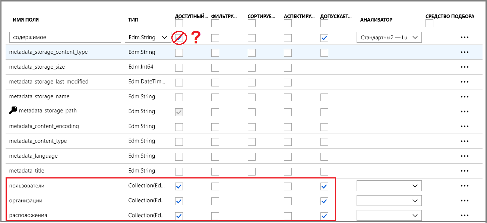
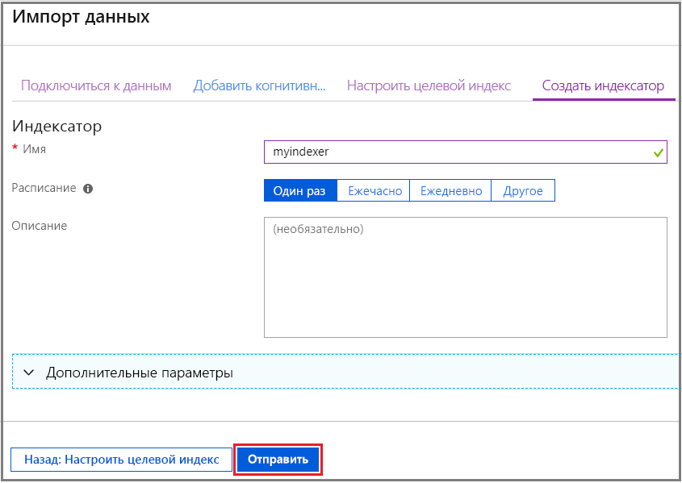

# Краткое руководство по созданию конвейера когнитивного поиска с использованием навыков и примера данных

Функция "Когнитивный поиск" (предварительная версия) добавляет навыки извлечения данных, обработки естественного языка и изображений в конвейер индексирования службы "Поиск Azure", упрощая поиск содержимого, по которому не выполняется обычный поиск или которое не структурировано. Сведения, созданные навыком, такие как распознавание сущностей или анализ изображения, добавляются в индекс службы "Поиск Azure".

В этом кратком руководстве вы ознакомитесь с конвейером обогащения на [портале Azure](https://portal.azure.com), прежде чем написать хоть одну строку кода:

* Начните работу с выборкой данных в хранилище BLOB-объектов Azure.
* Настройте [мастер импорта данных](search-import-data-portal.md) для индексирования и обогащения данных. 
* Запустите мастер (навык сущности обнаруживает людей, расположение и организации).
* Используйте [обозреватель поиска](search-explorer.md) для запроса обогащенных данных.

##  Поддерживаемые регионы

Вы можете воспользоваться функцией когнитивного поиска в службе "Поиск Azure", созданной в следующих регионах:

* Западно-центральная часть США
* Центрально-южная часть США
* Восточная часть США
* Западная Европа
* Северная Европа
* Юго-Восточная Азия

Если у вас еще нет подписки Azure, [создайте бесплатную учетную запись Azure](https://azure.microsoft.com/free/?WT.mc_id=A261C142F), прежде чем начинать работу.

> [!NOTE]
> Служба "Когнитивный поиск" находится в общедоступной предварительной версии. Выполнение набора навыков, а также извлечение и нормализация изображений в настоящее время предлагаются бесплатно. Цена на эти функции будет объявлена позже. 

## Предварительные требования

В статье о [когнитивном поиске](cognitive-search-concept-intro.md) представлена инфраструктура обогащения и соответствующие компоненты. 

Службы Azure используются исключительно в этом сценарии. Создание необходимых служб является частью подготовки.

+ Хранилище BLOB-объектов Azure предоставляет исходные данные.
+ Служба "Поиск Azure" обрабатывает прием и индексацию данных, обогащение на основе когнитивного поиска и запросы полнотекстового поиска.

### Настройка службы "Поиск Azure"

Сначала зарегистрируйтесь в службе "Поиск Azure". 

1. Перейдите на [портал Azure](https://portal.azure.com) и войдите в систему, используя свою учетную запись Azure.

1. Щелкните **Создать ресурс**, выполните поиск по запросу "Поиск Azure" и щелкните **Создать**. Ознакомьтесь со статьей [Создание службы "Поиск Azure" на портале](search-create-service-portal.md), если вы настраиваете службу поиска впервые и вам нужна дополнительная помощь.

  

1. Создайте группу ресурсов, которая будет содержать все ресурсы, созданные в этом кратком руководстве. Это упрощает очистку ресурсов после завершения работы с руководством.

1. В качестве расположения выберите один из [поддерживаемых регионов](#supported-regions) для функции "Когнитивный поиск".

1. В разделе ценовой категории можно выбрать **бесплатный** уровень, чтобы выполнить инструкции в руководствах. Для более глубокого анализа с использованием собственных данных создайте [платную службу](https://azure.microsoft.com/pricing/details/search/), например с уровнем **Базовый** или **Стандартный**. 

  Бесплатная служба ограничивается 3 индексами, максимальным размером большого двоичного объекта в 16 МБ и 2 минутами индексирования, чего недостаточно для использования всех возможностей когнитивного поиска. Ограничения для разных уровней см. на странице [Ограничения поиска Azure](search-limits-quotas-capacity.md).

  > [!NOTE]
  > Служба когнитивного поиска находится в общедоступной предварительной версии. Выполнение набора навыков в настоящее время доступно на всех уровнях, включая бесплатный. Цена на эту функцию будет объявлена позже.

1. Закрепите службу на панели мониторинга, чтобы получать быстрый доступ к информации о службе.

  

### Настройка службы BLOB-объектов Azure и загрузка примера данных

Конвейер обогащения извлекает из Azure источники данных, поддерживаемые [индексаторами службы "Поиски Azure"](search-indexer-overview.md). В этом упражнении используется хранилище BLOB-объектов, чтобы продемонстрировать несколько типов содержимого.

1. [Скачайте пример данных](https://1drv.ms/f/s!As7Oy81M_gVPa-LCb5lC_3hbS-4), который состоит из небольшого набора файлов различных типов. 

1. Зарегистрируйтесь в хранилище BLOB-объектов Azure, создайте учетную запись хранения, войдите в обозреватель хранилища и создайте контейнер. Дополнительные инструкции по всем шагам см. в статье [Краткое руководство по передаче, скачиванию и составлению списка больших двоичных объектов с помощью Обозревателя службы хранилища Azure](../storage/blobs/storage-quickstart-blobs-storage-explorer.md).

1. Используя обозреватель службы хранилища Azure, в созданном контейнере щелкните **Отправить**, чтобы отправить примеры файлов.

  

## Создание конвейера обогащения

Вернитесь на страницу панели мониторинга службы "Поиск Azure" и выберите **Импорт данных** на панели команд, чтобы настроить обогащение за четыре шага.

### Шаг 1. Создание источника данных

В разделе **Connect to your data** (Подключение к данным)  > **Хранилище BLOB-объектов** выберите учетную запись и созданный контейнер. Присвойте источнику данных имя, а для остальных параметров используйте значения по умолчанию. 

   

Нажмите кнопку **ОК**, чтобы создать источник данных.

Одним из преимуществ использования мастера **импорта данных** является то, что он также может создать ваш индекс. При создании источника данных мастер одновременно создает схему индекса. Создание индекса может занять несколько секунд.

### Шаг 2. Добавление когнитивных навыков

Затем добавьте шаги обогащения в конвейер индексирования. Портал предоставляет предопределенные когнитивные навыки для анализа изображений и текста. На портале набор навыков работает над одним полем источника. Это может показаться маленькой целью, но для больших двоичных объектов Azure поле `content` содержит большую часть документа такого объекта (например, документа Word или набора слайдов PowerPoint). Таким образом это поле является идеальными входными данными, так как здесь присутствует все содержимое большого двоичного объекта.

Иногда требуется извлечь текстовое представление из файлов отсканированных изображений, например PDF-файлов, создаваемых сканером. Служба "Поиск Azure" может автоматически извлекать содержимое из внедренных изображений в документе. Для этого выберите **Enable OCR and merge all text into merged_content field** (Включить OCR и объединить весь текст в поле merged_content). Это автоматически создаст поле `merged_content`, которое содержит текст, извлеченный из документа, а также текстовое представление внедренный в документ изображений. При выборе этого параметра для `Source data field` будет задано значение `merged_content`.

В разделе **добавления когнитивных навыков** выберите навыки, выполняющие обработку естественного языка. Для этого краткого руководства выберите распознавание людей, организаций и расположений.

Нажмите кнопку **ОК**, чтобы принять определение.
   
  

Навыки обработки естественного языка работают с текстовым содержимым в примере набора данных. Так как мы не выбрали параметры обработки изображений, JPEG-файлы, обнаруженные в примере набора данных, не будут обрабатываться в этом кратком руководстве. 

### Шаг 3. Настройка индекса

Помните индекс, созданный вместе с источником данных? На этом шаге можно просмотреть его схему и потенциально изменить любые параметры. 

В этом кратком руководстве мастер устанавливает разумные значения по умолчанию: 

+ У каждого индекса должно быть имя. Для этого типа источника данных имя по умолчанию — *azureblob-index*.

+ Каждый документ должен иметь ключ. Мастер выбирает поле, имеющее уникальное значение. В этом кратком руководстве ключ — это *metadata_storage_path*.

+ Каждая коллекция полей должна иметь имя поля с типом данных, описывающим содержащиеся значения, а каждое поле должно иметь атрибуты индекса, которые описывают, как оно используется в сценарии поиска. 

Так как вы определили набор навыков, мастер предполагает, что вам необходимо поле исходных данных, а также поля выводных данных, созданные навыками. По этой причине портал добавляет поля индекса для `content`, `people`, `organizations` и `locations`. Обратите внимание, что мастер автоматически включает атрибуты доступности для чтения и поиска для этих полей.

В разделе **настройки индекса** проверьте атрибуты в полях, чтобы просмотреть, как они используются в индексе. Доступность для поиска означает, что по этому полю можно выполнять поиск. Доступность для получения означает, что его можно вернуть в результатах. 

Рассмотрите возможность удаления атрибута доступности для получения из поля `content`. В больших двоичных объектах это поле можно выполнять в тысячах строк, которые трудно считать в таком инструменте, как **обозреватель поиска**.

Нажмите кнопку **ОК**, чтобы принять определение индекса.

  

> [!NOTE]
> Для краткости на снимке экрана были усечены неиспользованные поля. Если вы работаете на портале, в вашем списке будут дополнительные поля.

### Шаг 4. Настройка индексатора

Индексатор — это ресурс высокого уровня, управляющий процессом индексации. Он задает имя источника данных, индекс и частоту выполнения. Конечным результатом мастера **импорта данных** всегда является индексатор, выполняемый несколько раз.

На странице **Индексатор** присвойте индексатору имя и используйте значение по умолчанию ("выполнить один раз"), чтобы немедленно выполнить его. 

  

Нажмите кнопку **ОК**, чтобы импортировать, обогатить и индексировать данные.

  

Индексирование и обогащение может занять время, поэтому для ранних исследований рекомендуется использовать маленькие наборы данных. Отслеживать индексирование можно на странице "Уведомления" на портале Azure. 

## Запросы в обозревателе поиска

После создания индекса можно отправлять запросы, возвращающие документы в индекс. Используйте **обозреватель поиска** на портале, чтобы выполнять запросы и просматривать результаты. 

1. На странице панели мониторинга службы поиска щелкните **Обозреватель поиска** в командной строке.

1. В верхней части окна щелкните **Изменить индекс**, чтобы выбрать созданный индекс.

1. Введите строку поиска, чтобы запросить индекс, например "John F. Kennedy".

Результаты возвращаются в формате JSON, который может быть подробным и трудным для чтения, особенно в больших документах, исходящих из больших двоичных объектов Azure. 

Если вы не можете легко проверить результаты, используйте сочетание клавиш CTRL+F для поиска в документах. Для этого запроса можно выполнить поиск термина "John F. Kennedy" в JSON, чтобы просмотреть экземпляры этого термина. 

Сочетание клавиш CTRL+F также позволяет определить, сколько документов предоставлено в результирующем наборе. Для больших двоичных объектов Azure портал выбирает metadata_storage_path в качестве ключа, так как каждое значение в этом документе уникально. С помощью сочетания клавиш CTRL+F найдите metadata_storage_path, чтобы узнать количество документов. В этом запросе два документа в результирующем наборе содержат термин "John F. Kennedy".

  

## Общие выводы

Вы завершили свое первое упражнение обогащенного индексирования. В этом кратком руководстве представлены важные понятия и шаги мастера, чтобы пользователь мог быстро создавать прототипы решений когнитивного поиска с помощью собственных данных.

Некоторые ключевые понятия, с которыми, как мы надеемся, вы разобрались, включают зависимость от источников данных Azure. Обогащение на основе когнитивного поиска привязано к индексаторам, а индексаторы — к Azure и соответствующим источникам. Несмотря на то что краткое руководство использует хранилище BLOB-объектов Azure, можно использовать и другие источники данных Azure. Дополнительные сведения см. в статье [Индексаторы в службе поиска Azure](search-indexer-overview.md).

Другим важным понятием является выполнение навыков в отношении полей входных данных. На портале необходимо выбрать одно поле входных данных для всех навыков. В коде входными данными могут быть другие поля или выходные данные вышестоящих навыков.

 Входные данные для навыка сопоставляются с полем выходных данных индекса. На внутреннем уровне портал настраивает [заметки](cognitive-search-concept-annotations-syntax.md) и определяет [набор навыков](cognitive-search-defining-skillset.md), устанавливая порядок операций и общую последовательность действий. Эти шаги скрыты на портале, но эти понятия становятся важными при написании кода.

Наконец, вы узнали, что для просмотра результатов необходимо запросить индекс. В результате служба "Поиск Azure" предоставляет доступный для поиска индекс, который можно запрашивать с помощью [простого](https://docs.microsoft.com/rest/api/searchservice/simple-query-syntax-in-azure-search) или [полностью расширенного синтаксиса запроса](https://docs.microsoft.com/rest/api/searchservice/lucene-query-syntax-in-azure-search). Индекс, который содержит обогащенные поля, не отличается от других. Если вы хотите включить стандартные или [настраиваемые анализаторы](search-analyzers.md), [профили оценки](https://docs.microsoft.com/rest/api/searchservice/add-scoring-profiles-to-a-search-index), [синонимы](search-synonyms.md), [фильтры аспектов](search-filters-facets.md), географический поиск или любую другую функцию службы "Поиск Azure", вы можете это сделать.

## Очистка ресурсов

Если изучение завершено, самый быстрый способ очистки — удалить группу ресурсов, содержащую службу "Поиск Azure" и службу BLOB-объектов Azure.  

Предположим, обе службы находятся в одной группе, удалите группу ресурсов, чтобы окончательно удалить все ее содержимое, включая службы и любое хранимое содержимое, созданное для этого упражнения. На портале имя группы ресурсов находится на странице "Обзор" каждой службы.

## Дополнительная информация

Вы можете поэкспериментировать с индексированием и обогащением, повторно запустив мастер с разными навыками и полями источника данных. Чтобы повторить шаги, удалите индекс и индексатор, а затем повторно создайте индексатор с новым сочетанием выбранных элементов.

+ В разделе **Обзор** > **Индексы** выберите созданный индекс, а затем щелкните **Удалить**.

+ В разделе **Обзор** дважды щелкните элемент **Индексаторы**. Найдите созданный индексатор и удалите его.

Кроме того, этот пример данных и созданные службы можно использовать повторно, чтобы узнать, как выполнять эти же задания программно в следующем руководстве. 

> [!div class="nextstepaction"]
> [Руководство по REST API когнитивного поиска](cognitive-search-tutorial-blob.md)
