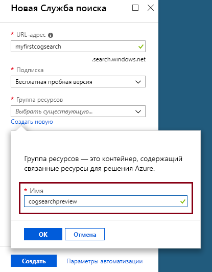
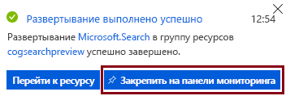
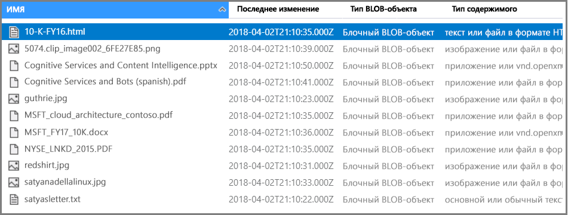
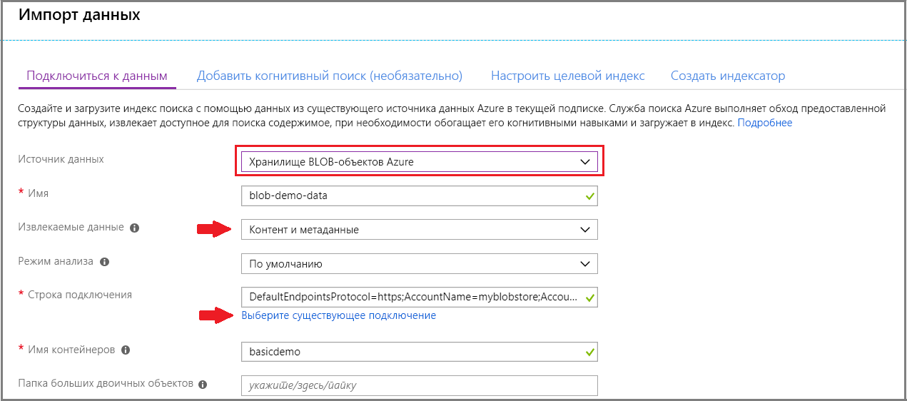
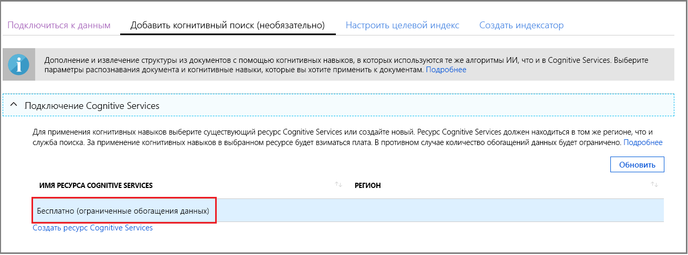
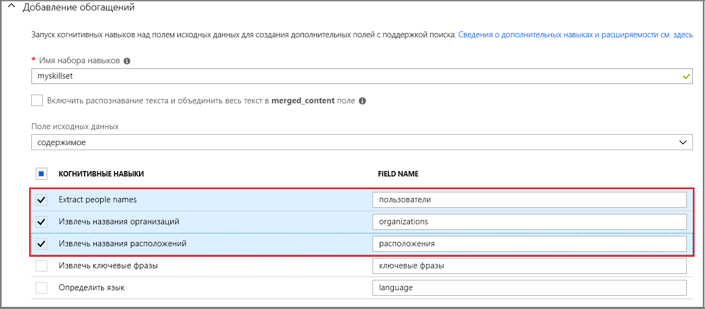
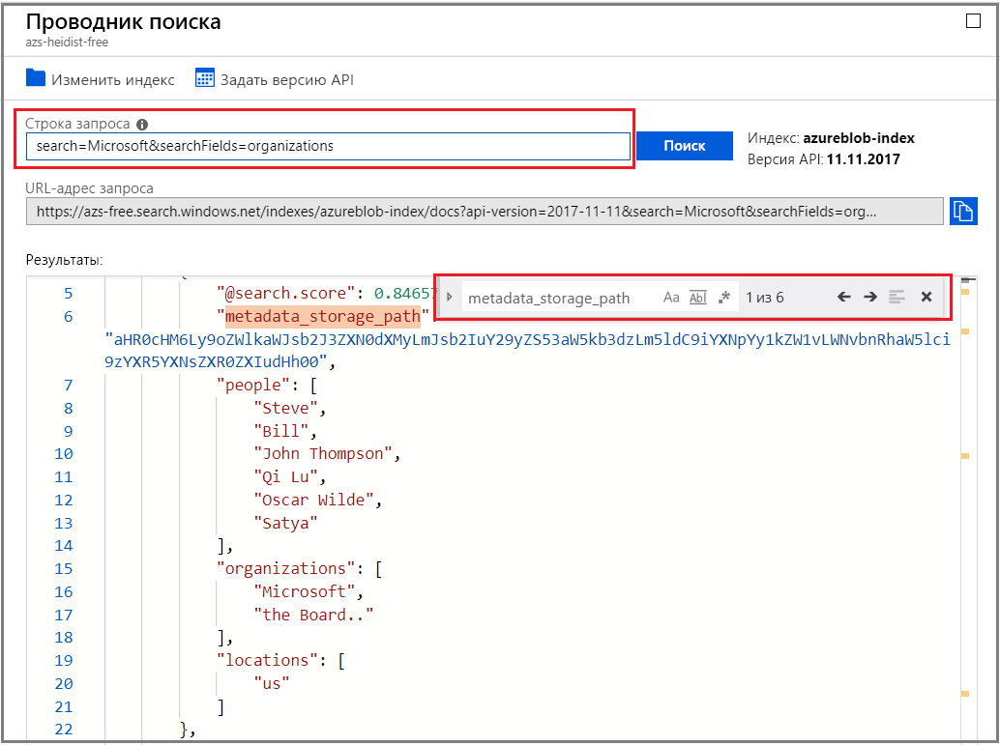

# Краткое руководство. Создание конвейера когнитивного поиска с использованием навыков и примера данных

Функция "Когнитивный поиск" (предварительная версия) добавляет навыки извлечения данных, обработки естественного языка и изображений в конвейер индексирования службы "Поиск Azure", упрощая поиск содержимого, по которому не выполняется обычный поиск или которое не структурировано. 

Конвейер когнитивного поиска интегрирует [ресурсы Cognitive Services](https://azure.microsoft.com/services/cognitive-services/), такие как [OCR](cognitive-search-skill-ocr.md), [распознавание языка](cognitive-search-skill-language-detection.md) или [распознавание сущностей](cognitive-search-skill-entity-recognition.md) в единый процесс индексирования. Алгоритмы искусственного интеллекта Cognitive Services используются для поиска шаблонов, компонентов и характеристики в исходных данных и возвращают структуры и текстовое содержимое, которые пригодны для применения в решениях полнотекстового поиска на базе Поиска Azure.

В этом кратком руководстве вы создадите простейший конвейер обогащения на [портале Azure](https://portal.azure.com), не написав ни одной строки кода.

> [!div class="checklist"]
> * Начните работу с выборкой данных в хранилище BLOB-объектов Azure.
> * Настройте мастер [**импорта данных**](search-import-data-portal.md) для когнитивного индексирования и обогащения данных. 
> * Запустите мастер (навык сущности обнаруживает людей, расположение и организации).
> * Примените [**проводник поиска**](search-explorer.md) для запроса по обогащенным данным.

##  Поддерживаемые регионы

Вы можете воспользоваться функцией когнитивного поиска в службе "Поиск Azure", созданной в следующих регионах:

* Западно-центральная часть США
* Центрально-южная часть США
* Восточная часть США
* Восток США 2
* Западный регион США 2
* Центральная Канада
* Западная Европа
* Южная часть Великобритании
* Северная Европа
* Южная часть Бразилии
* Юго-Восточная Азия
* Центральная Индия
* Восточная часть Австралии

Если у вас еще нет подписки Azure, [создайте бесплатную учетную запись Azure](https://azure.microsoft.com/free/?WT.mc_id=A261C142F), прежде чем начинать работу.

> [!NOTE]
> С 21 декабря 2018 г. вы сможете связывать ресурсы Cognitive Services с набором навыков службы "Поиск Azure". Благодаря этому мы сможем начать начислять плату за выполнение набора навыков. С этой даты мы также начнем начислять плату за извлечение изображений при открытии документов. Извлечение текста из документов будет выполняться бесплатно, как и прежде.
>
> За операции с применением встроенных навыков взимается [плата по мере использования по существующим тарифам для служб Cognitive Services](https://azure.microsoft.com/pricing/details/cognitive-services/). За извлечение изображений взимается плата по тарифам для предварительной версии, как описано на странице [цен на службу "Поиск Azure"](https://go.microsoft.com/fwlink/?linkid=2042400). [Подробнее](cognitive-search-attach-cognitive-services.md).

## Предварительные требования

В статье о [когнитивном поиске](cognitive-search-concept-intro.md) представлена инфраструктура обогащения и соответствующие компоненты. 

Службы Azure используются исключительно в этом сценарии. Создание необходимых служб является частью подготовки.

+ [Хранилище BLOB-объектов Azure](https://azure.microsoft.com/services/storage/blobs/) предоставляет исходные данные.
+ [Cognitive Services](https://azure.microsoft.com/services/cognitive-services/) предоставляет функции искусственного интеллекта (эти ресурсы можно создать прямо в строке описания конвейера).
+ [Поиск Azure](https://azure.microsoft.com/services/search/) предоставляет конвейер обогащенного индексирования и многофункциональную систему поиска произвольного текста, которые можно использовать в пользовательских приложениях.

### Настройка службы "Поиск Azure"

Сначала зарегистрируйтесь в службе "Поиск Azure". 

1. Перейдите на [портал Azure](https://portal.azure.com) и войдите в систему, используя свою учетную запись Azure.

1. Щелкните **Создать ресурс**, выполните поиск по запросу "Поиск Azure" и щелкните **Создать**. Ознакомьтесь со статьей [Создание службы "Поиск Azure" на портале](search-create-service-portal.md), если вы настраиваете службу поиска впервые и вам нужна дополнительная помощь.

  

1. Создайте новую группу ресурсов, которая будет содержать все созданные в этом кратком руководстве ресурсы. Это упрощает очистку ресурсов после завершения работы с руководством.

1. В качестве расположения выберите один из [регионов](#supported-regions), в которых поддерживается функция когнитивного поиска.

1. В разделе ценовой категории можно выбрать **бесплатный** уровень, чтобы выполнить инструкции в руководствах. Для более глубокого анализа с использованием собственных данных создайте [платную службу](https://azure.microsoft.com/pricing/details/search/), например с уровнем **Базовый** или **Стандартный**. 

  Бесплатная служба ограничивается 3 индексами, максимальным размером большого двоичного объекта в 16 МБ и 2 минутами индексирования, чего недостаточно для использования всех возможностей когнитивного поиска. Ограничения для разных уровней см. на странице [Ограничения поиска Azure](search-limits-quotas-capacity.md).

  

  > [!NOTE]
  > Служба когнитивного поиска находится в общедоступной предварительной версии. Выполнение набора навыков в настоящее время доступно на всех уровнях, включая бесплатный. Вы можете выполнить ограниченное число обогащений без связывания платного ресурса Cognitive Services. [Подробнее](cognitive-search-attach-cognitive-services.md).

1. Закрепите службу на панели мониторинга, чтобы получать быстрый доступ к информации о службе.

  

### Настройка службы BLOB-объектов Azure и загрузка примера данных

Конвейер обогащения извлекает из Azure источники данных, поддерживаемые [индексаторами службы "Поиски Azure"](search-indexer-overview.md). Обратите внимание на то, что в Хранилище таблиц Azure когнитивный поиск не поддерживается. В этом упражнении используется хранилище BLOB-объектов, чтобы продемонстрировать несколько типов содержимого.

1. [Скачайте пример данных](https://1drv.ms/f/s!As7Oy81M_gVPa-LCb5lC_3hbS-4), который состоит из небольшого набора файлов различных типов. 

1. Зарегистрируйтесь в хранилище BLOB-объектов Azure, создайте учетную запись хранения, откройте страницы служб BLOB-объектов и создайте контейнер. В контейнере для уровня доступа установите значение **Контейнер**. Дополнительные сведения см. в разделе [Создание контейнера](../storage/blobs/storage-unstructured-search.md#create-a-container) в руководстве *по поиску неструктурированных данных*.

1. В созданном контейнере щелкните **Отправить**, чтобы отправить примеры файлов, которые вы скачали на предыдущем шаге.

  

## Создание конвейера обогащения

Вернитесь на страницу информационной панели Поиска Azure и щелкните **Импорт данных** на панели команд, чтобы настроить когнитивное обогащение за четыре шага.

  

### Шаг 1. Создание источника данных

В разделе **Подключение к данным** выберите **Хранилище BLOB-объектов**, затем выберите учетную запись и созданный контейнер. Присвойте источнику данных имя, а для остальных параметров используйте значения по умолчанию. 

  

Перейдите к следующей странице.

  

### Шаг 2. Добавление когнитивных навыков

Затем добавьте шаги обогащения в конвейер индексирования. Если у вас нет ресурса Cognitive Services, вы можете зарегистрироваться на получение бесплатной версии, которая предоставляет до 20 транзакций ежедневно. Пример данных состоит из 14 файлов, а значит после выполнения этого мастера дневная квота будет почти полностью использована.

1. Разверните узел **Подключение Cognitive Services**, чтобы просмотреть варианты ресурсов для API-интерфейсов Cognitive Services. Для целей этого руководства можно использовать **Бесплатный** ресурс.

  

2. Разверните узел **Добавление обогащений** и выберите навыки, которые выполняют обработку естественного языка. Для этого краткого руководства выберите распознавание людей, организаций и расположений.

  

  Портал предоставляет встроенные навыки для распознавания и анализа текста. На портале набор навыков работает над одним полем источника. Это может показаться маленькой целью, но для больших двоичных объектов Azure поле `content` содержит большую часть документа такого объекта (например, документа Word или набора слайдов PowerPoint). Таким образом это поле является идеальными входными данными, так как здесь присутствует все содержимое большого двоичного объекта.

3. Перейдите к следующей странице.

  

> [!NOTE]
> Навыки обработки естественного языка работают с текстовым содержимым в примере набора данных. Так как мы не выбрали распознавание текста, JPEG и PNG-файлы из тестового набора данных не будут обрабатываться при выполнении этого краткого руководства. 

### Шаг 3. Настройка индекса

Как правило, мастер правильно определяет индекс по умолчанию. На этом шаге вы можете просмотреть созданную схему и изменить любые параметры, если потребуется. Ниже представлен индекс по умолчанию, созданный для демонстрационного набора BLOB-объектов.

В этом кратком руководстве мастер устанавливает разумные значения по умолчанию: 

+ Имя по умолчанию *azureblob-index*.
+ Ключ по умолчанию *metadata_storage_path* (это поле содержит уникальные значения).
+ Типы данных и атрибуты по умолчанию пригодны для сценариев полнотекстового поиска.

Возможно, стоит удалить атрибута **Retrievable** (Доступность) из поля `content`. Для больших двоичных объектах это поле может содержать несколько тысяч строк. Только представьте, насколько это осложнит просмотр файлов с объемным содержимым, например документов Word или PowerPoint в списке результатов поиска в формате JSON. 

Так как вы определили набор навыков, мастер предполагает, что вам потребуется не только исходное поле данных, но и поля созданных навыками выходных данных. По этой причине портал добавляет поля индекса для `content`, `people`, `organizations` и `locations`. Обратите внимание, что мастер автоматически включает для этих полей атрибуты **Retrievable** (Доступность для чтения) и **Searchable** (Доступность для поиска). **Доступность для поиска** означает, что по этому полю можно выполнять поиск. **Доступность для получения** означает, что его можно возвращать в результатах. 

  
  
Перейдите к следующей странице.

  

### Шаг 4. Настройка индексатора

Индексатор — это ресурс высокого уровня, управляющий процессом индексации. Он задает имя источника данных, целевой индекс и частоту выполнения. Конечным результатом мастера **импорта данных** всегда является индексатор, выполняемый несколько раз.

На странице **Индексатор** вы можете подтвердить имя по умолчанию и применить функцию планирования **Запустить один раз**, чтобы выполнить его немедленно. 

  

Щелкните **Отправить**, чтобы создать и немедленно запустить индексатор.

## Мониторинга индексирования

Действия по обогащению выполняются дольше, чем обычное текстовое индексирование. Мастер откроет на странице обзорной информации список индексатора, что позволяет отслеживать ход выполнения. Вы также можете самостоятельно открыть страницу обзорной информации и щелкнуть **Индексаторы**.

Вы увидите предупреждение, поскольку в списке есть файлы изображений JPG и PNG, но мы не добавили в конвейер навык распознавания текста. Также вы увидите уведомления об усечении. Поиск Azure на уровень "бесплатный" извлекает не более 32 000 символов.

  

Индексирование и обогащение может занять время, поэтому для ранних исследований рекомендуется использовать маленькие наборы данных. 

## Запросы в обозревателе поиска

После создания индекса можно отправлять запросы, возвращающие документы в индекс. Используйте **обозреватель поиска** на портале, чтобы выполнять запросы и просматривать результаты. 

1. На странице панели мониторинга службы поиска щелкните **Обозреватель поиска** в командной строке.

1. В верхней части окна щелкните **Изменить индекс**, чтобы выбрать созданный индекс.

1. Введите строку поиска для запроса по индексу, например `search=Microsoft&searchFields=organizations`.

Результаты возвращаются в формате JSON, который может быть подробным и трудным для чтения, особенно в больших документах, исходящих из больших двоичных объектов Azure. Если вы не можете легко проверить результаты, используйте сочетание клавиш CTRL+F для поиска в документах. Для этого запроса вы можете найти в документе JSON определенные термины. 

Сочетание клавиш CTRL+F также позволяет определить, сколько документов предоставлено в результирующем наборе. Для больших двоичных объектов Azure портал выбирает metadata_storage_path в качестве ключа, так как каждое значение в этом документе уникально. С помощью сочетания клавиш CTRL+F найдите metadata_storage_path, чтобы узнать количество документов. 

  

## Общие выводы

Итак, вы завершили первое упражнение по обогащенному индексированию. В этом кратком руководстве представлены важные понятия и шаги мастера, чтобы пользователь мог быстро создавать прототипы решений когнитивного поиска с помощью собственных данных.

Некоторые ключевые понятия, с которыми, как мы надеемся, вы разобрались, включают зависимость от источников данных Azure. Обогащение на основе когнитивного поиска привязано к индексаторам, а индексаторы — к Azure и соответствующим источникам. Несмотря на то что краткое руководство использует хранилище BLOB-объектов Azure, можно использовать и другие источники данных Azure. Дополнительные сведения см. в статье [Индексаторы в службе поиска Azure](search-indexer-overview.md).

Другим важным понятием является выполнение навыков в отношении полей входных данных. На портале необходимо выбрать одно поле входных данных для всех навыков. В коде входными данными могут быть другие поля или выходные данные вышестоящих навыков.

 Входные данные для навыка сопоставляются с полем выходных данных индекса. На внутреннем уровне портал настраивает [заметки](cognitive-search-concept-annotations-syntax.md) и определяет [набор навыков](cognitive-search-defining-skillset.md), устанавливая порядок операций и общую последовательность действий. Эти шаги скрыты на портале, но эти понятия становятся важными при написании кода.

Наконец, вы узнали, что для просмотра результатов необходимо запросить индекс. В результате служба "Поиск Azure" предоставляет доступный для поиска индекс, который можно запрашивать с помощью [простого](https://docs.microsoft.com/rest/api/searchservice/simple-query-syntax-in-azure-search) или [полностью расширенного синтаксиса запроса](https://docs.microsoft.com/rest/api/searchservice/lucene-query-syntax-in-azure-search). Индекс, который содержит обогащенные поля, не отличается от других. Если вы хотите включить стандартные или [настраиваемые анализаторы](search-analyzers.md), [профили оценки](https://docs.microsoft.com/rest/api/searchservice/add-scoring-profiles-to-a-search-index), [синонимы](search-synonyms.md), [фильтры аспектов](search-filters-facets.md), географический поиск или любую другую функцию службы "Поиск Azure", вы можете это сделать.

## Очистка ресурсов

Если изучение завершено, самый быстрый способ очистки — удалить группу ресурсов, содержащую службу "Поиск Azure" и службу BLOB-объектов Azure.  

Предположим, обе службы находятся в одной группе, удалите группу ресурсов, чтобы окончательно удалить все ее содержимое, включая службы и любое хранимое содержимое, созданное для этого упражнения. На портале имя группы ресурсов находится на странице "Обзор" каждой службы.

## Дополнительная информация

В зависимости от того, как вы подготовили ресурс Cognitive Services, вы можете поэкспериментировать с индексированием и обогащением, повторно запустив мастер с разными навыками и полями источника данных. Чтобы повторить шаги, удалите индекс и индексатор, а затем повторно создайте индексатор с новым сочетанием выбранных элементов.

+ В разделе **Обзор** > **Индексы** выберите созданный индекс, а затем щелкните **Удалить**.

+ В разделе **Обзор** дважды щелкните элемент **Индексаторы**. Найдите созданный индексатор и удалите его.

Кроме того, этот пример данных и созданные службы можно использовать повторно, чтобы узнать, как выполнять эти же задания программно в следующем руководстве. 

> [!div class="nextstepaction"]
> [Руководство. REST API когнитивного поиска](cognitive-search-tutorial-blob.md)
