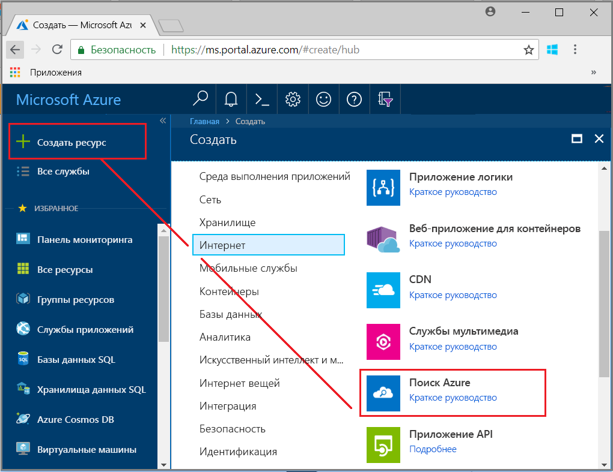
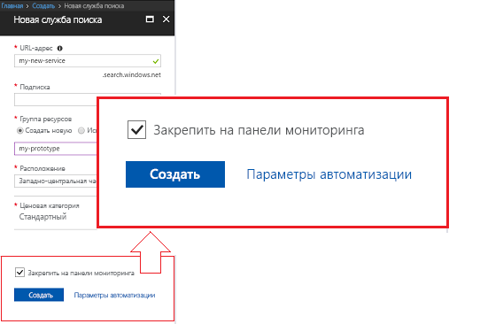

# Создание службы "Поиск Azure" на портале

Узнайте, как создать или подготовить службу "Поиск Azure" на портале. 

Предпочитаете использовать PowerShell? Используйте [шаблон службы](https://azure.microsoft.com/resources/templates/101-azure-search-create/) Azure Resource Manager. Чтобы получить дополнительные сведения и приступить к работе, ознакомьтесь с разделом [Управление службой поиска Azure с помощью PowerShell](search-manage-powershell.md).

## Подписка (бесплатная или платная)

[Откройте бесплатную учетную запись Azure](https://azure.microsoft.com/pricing/free-trial/?WT.mc_id=A261C142F) и используйте бесплатные кредиты, чтобы опробовать платные службы Azure. После того, как кредиты будут израсходованы, сохраните свою учетную запись. Вы сможете использовать ее для работы с бесплатными службами Azure, такими как веб-сайты. С вашей кредитной карты не будет взиматься плата, если вы явно не измените параметры и не попросите снимать плату.

Кроме того, вы можете [активировать преимущества подписчика MSDN](https://azure.microsoft.com/pricing/member-offers/msdn-benefits-details/?WT.mc_id=A261C142F). Подписка MSDN каждый месяц приносит вам кредиты, которыми можно оплачивать использование платных служб Azure. 

## Как найти Поиск Azure
1. Войдите на [портале Azure](https://portal.azure.com/).
2. Щелкните знак "плюс" ("+") в верхнем левом углу.
3. Выберите **Интернет + мобильные устройства** > **Поиск Azure**.

## Присвоение имени службы и URL-адреса конечной точки

Имя службы является частью URL-адреса конечной точки, к которой отправляются вызовы API: `https://your-service-name.search.windows.net`. Введите имя службы в поле **URL-адрес**. 

Требования к имени службы:
   * имя должно быть уникальным в пределах пространства имен search.windows.net;
   * должно содержать от 2 до 60 знаков;
   * используйте строчные буквы, цифры или дефисы ("-");
   * имя не должно содержать дефис ("-") в первых двух и последней позиции;
   * имя не должно содержать последовательные дефисы ("--").

## Выбор подписки
Если у вас несколько подписок, выберите ту, которая также содержит службы хранилища данных или файлов. Служба "Поиск Azure" может автоматически определить хранилище таблиц Azure и хранилище BLOB-объектов Azure, базу данных SQL и Azure Cosmos DB для индексирования с помощью [*индексаторов*](search-indexer-overview.md), но только для служб в одной подписке.

## Выбор группы ресурсов
Группы ресурсов — это набор служб и ресурсов Azure, которые используются совместно. Например, если вы используете службу Поиска Azure для индексации базы данных SQL, то обе службы должны входить в одну группу ресурсов.

> [!TIP]
> При удалении группы ресурсов также удаляются службы внутри нее. Если проект прототипа использует нескольких служб, то, поместив их все в одну группу ресурсов, можно упростить очистку после завершения этого проекта. 

## Выбор расположения размещения 
Являясь службой Azure, Поиск Azure может размещаться в центрах обработки данных по всему миру. Обратите внимание, что [цены могут отличаться](https://azure.microsoft.com/pricing/details/search/) в зависимости от географического региона.

## Выбор ценовой категории (номера SKU)
[Служба поиска Azure сейчас предлагается в нескольких ценовых категориях](https://azure.microsoft.com/pricing/details/search/): "Бесплатный", "Базовый" и "Стандартный". Каждая категория отличается собственным [объемом и ограничениями](search-limits-quotas-capacity.md). Подробные сведения см. в статье [Выбор SKU или ценовой категории для службы поиска Azure](search-sku-tier.md).

В данном пошаговом руководстве мы выбрали для службы уровень "Стандартный".

После создания службы ценовую категорию изменить нельзя. Если позднее вам потребуется повысить или понизить категорию, нужно будет повторно создать службу.

## Создание службы

Не забудьте закрепить службу на панели мониторинга, чтобы иметь к ней быстрый доступ после каждого входа в систему.

## Выполните масштабирование службы
Создание службы может занять несколько минут (от 15 минут, в зависимости от уровня). Подготовив службу, вы можете выполнить ее масштабирование в соответствии со своими потребностями. Выбрав уровень "Стандартный" для службы поиска Azure, вы сможете масштабировать свою службу в двух измерениях: репликах и секциях. Если вы выбрали уровень "Базовый", то сможете добавлять только реплики. Если подготовлена бесплатная служба, масштабирование будет недоступно.

***Секции*** позволяют службе хранить данные и осуществлять поиск в большем количестве документов.

***Реплики*** дают службе возможность справляться с повышенной нагрузкой запросов поиска.

> [!Important]
> У службы должно быть [2 реплики для выполнения соглашения об уровне обслуживания только для чтения и 3 реплики для выполнения соглашения об уровне обслуживания чтения и записи](https://azure.microsoft.com/support/legal/sla/search/v1_0/).

1. Перейдите к странице своей службы поиска на портале Azure.
2. В области навигации слева щелкните **Параметры** > **Масштаб**.
3. Используйте ползунок, чтобы добавить реплики или секции.

> [!Note] 
> Каждый уровень имеет свои [ограничения](search-limits-quotas-capacity.md) на общее количество единиц поиска, разрешенных для одной службы (реплики * секции = общее количество единиц поиска).

## Когда следует добавлять вторую службу

Подавляющее большинство пользователей использует только одну службу, подготовленную на уровне, который обеспечивает [правильный баланс ресурсов](search-sku-tier.md). В одной службе может размещаться несколько индексов с учетом [максимального ограничения выбранного уровня](search-capacity-planning.md), при этом все индексы изолированы друг от друга. В Поиске Azure запросы могут направляться только в один индекс, сводя к минимуму вероятность случайного или преднамеренного извлечения данных из других индексов в той же службе.

Несмотря на то, что большинство пользователей использует только одну службу, избыточность служб может потребоваться, если в эксплуатационных целях необходимо обеспечить следующее:

+ Аварийное восстановление (сбой центра обработки данных). Поиск Azure не обеспечивает немедленную отработку отказа в случае сбоя. Рекомендации и инструкции см. в статье [Администрирование службы поиска Azure на портале Azure](search-manage.md).
+ Изучая мультитенантную модель, мы определили, что использование дополнительных служб обеспечивает оптимальную архитектуру. Дополнительные сведения см. в статье [Шаблоны разработки для мультитенантных приложений SaaS и Поиска Azure](search-modeling-multitenant-saas-applications.md).
+ Для глобально развернутых приложений может потребоваться наличие экземпляра Поиска Azure в нескольких регионах, чтобы минимизировать задержку международного трафика приложения.

> [!NOTE]
> В Поиске Azure невозможно разделить индексирование и рабочие нагрузки запросов. Поэтому вы не сможете создать несколько служб для разделенных рабочих нагрузок. Индекс всегда запрашивается в службе, в которой он был создан (невозможно создать индекс в одной службе и скопировать его на другую).
>

Для обеспечения высокого уровня доступности вторая служба не является обязательной. Высокая доступность для запросов достигается за счет использования двух или более реплик в одной службе. Обновление реплик выполняется последовательно, то есть при развертывании обновления службы должна работать по крайней мере одна реплика. Дополнительные сведения об обеспечении бесперебойной работы см. в [Соглашении об уровне обслуживания](https://azure.microsoft.com/support/legal/sla/search/v1_0/).

## Дополнительная информация
Подготовив службу Поиска Azure, вы можете [определить индекс](search-what-is-an-index.md), чтобы передавать свои данные и осуществлять в них поиск. 

> [!div class="nextstepaction"]
> [Как использовать Поиск Azure в приложении .NET](search-howto-dotnet-sdk.md)
