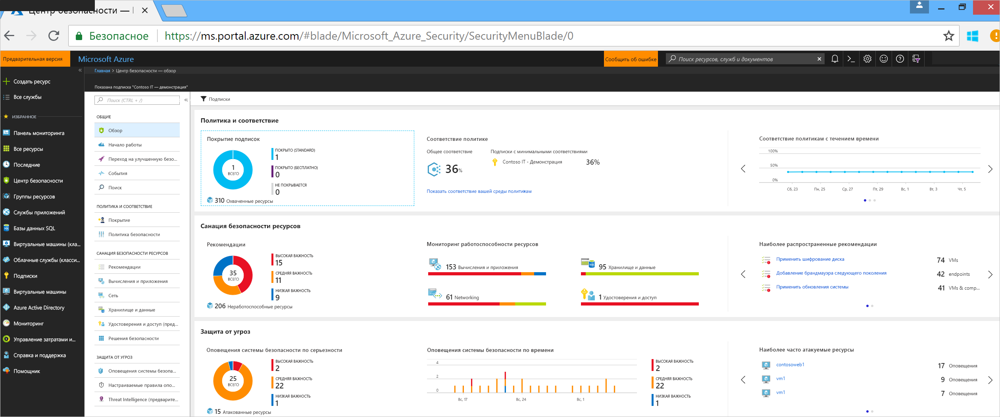
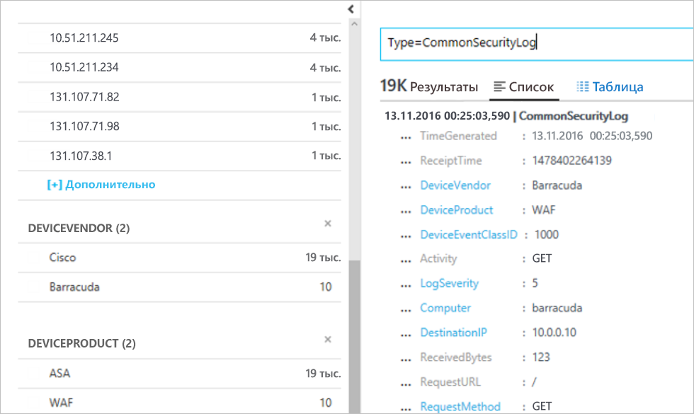

# Краткое руководство. Подключение решений безопасности

Помимо сбора данных безопасности с компьютеров, вы можете интегрировать данные безопасности из других средств безопасности, в том числе из тех, которые поддерживают общий формат событий (CEF). CEF — это отраслевой стандартный формат на основе сообщений решения Syslog, которое используют многие поставщики средств безопасности, чтобы обеспечить интеграцию событий на разных платформах.

В этом кратком руководстве объясняется, как выполнять следующие задачи:
- подключить решение безопасности к центру безопасности с помощью журналов CEF;
- проверить подключение с помощью решения для системы безопасности.

## предварительным требованиям
Для начала работы с Центром безопасности необходима подписка Microsoft Azure. Если у вас нет подписки, вы можете зарегистрироваться для получения [бесплатной учетной записи](https://azure.microsoft.com/free/).

Для работы с этим руководством требуется центр безопасности с ценовой категорией "Стандартный". Вы можете использовать центр безопасности категории "Стандартный" бесплатно в течение первых 60 дней. Следуйте инструкциям [краткого руководства по центру безопасности Azure](security-center-get-started.md), чтобы обновить ценовую категорию до уровня "Стандартный".

Также вам понадобится [компьютер Linux](https://docs.microsoft.com/azure/log-analytics/log-analytics-agent-linux) со службой Syslog, которая уже подключена к вашему центру безопасности.

## Подключение решения с помощью CEF

1. Войдите на [портал Azure](https://azure.microsoft.com/features/azure-portal/).
2. В меню **Microsoft Azure** выберите пункт **Центр безопасности**. Откроется окно **Security Center - Overview** (Центр безопасности — обзор).

      

3. В главном меню центра безопасности выберите пункт **Решения безопасности**.
4. На странице решения безопасности в разделе **Добавление источника данных (3)** нажмите кнопку **Добавить** под пунктом **Общий формат событий**.

    

5. На странице "Журналы общего формата событий разверните второй шаг. **Настройте переадресацию Syslog, чтобы отправлять нужные журналы агенту через UDP-порт 25226** и выполните следующие инструкции на компьютере Linux:

    

6. Разверните третий шаг. **Поместите файл конфигурации агента на компьютер агента** и выполните следующие инструкции на компьютере Linux:

    

7. Разверните четвертый шаг. **Перезапустите управляющую программу Syslog и агент** и выполните следующие инструкции на компьютере Linux:

    

## Проверка подключения

Прежде чем продолжить указанные ниже действия, подождите, пока решение Syslog начнет высылать отчеты центру безопасности. Этот процесс может занять некоторое время в зависимости от размера среды.

1.  В левой части панели мониторинга центра безопасности, нажмите кнопку **Поиск**.
2.  Выберите рабочую область, к которой подключено решение Syslog (компьютер Linux).
3.  Введите *CommonSecurityLog* и нажмите кнопку **Поиск**.

В следующем примере показан результат этих действий: 

## Очистка ресурсов
Другие руководства в этой серии созданы на основе этого документа. Если вы планируете продолжить работу со следующими руководствами, продолжайте использовать уровень "Стандартный" и оставьте включенной автоматическую подготовку. Если вы не планируете продолжать или хотите вернуться к уровню "Бесплатный", выполните следующие действия.

1. Вернитесь в главное меню центра безопасности и выберите пункт **Политика безопасности**.
2. Выберите подписку или политику, которую хотите вернуть на уровень "Бесплатный". Откроется окно **Политика безопасности**.
3. В разделе **Компоненты политики** выберите **Ценовая категория**.
4. Выберите уровень **Бесплатный**, чтобы изменить уровень подписки со стандартного на бесплатный.
5. Щелкните **Сохранить**.

Чтобы отключить автоматическую подготовку, выполните следующие действия:

1. Вернитесь в главное меню центра безопасности и выберите пункт **Политика безопасности**.
2. Выберите подписку, в которой нужно отключить автоматическую подготовку.
3. В колонке **Security policy – Data Collection** (Политика безопасности — сбор данных) в разделе **Подключение** выберите **Отключить**, чтобы отключить автоматическую подготовку.
4. Щелкните **Сохранить**.

>[!NOTE]
> При отключении автоматической подготовки агент Microsoft Monitoring Agent не будет удален с виртуальных машин Azure, на которых он был подготовлен. Если отключить ее, мониторинг безопасности ваших ресурсов будет ограничен.
>

## Дополнительная информация
Из этого краткого руководства вы узнали, как подключить решение Linux Syslog с помощью CEF. Подключив журналы CEF к центру безопасности, вы сможете находить и настраивать правила генерации оповещений и улучшенные функции анализа угроз для каждого журнала. Дополнительные сведения об использовании центра безопасности см. в руководстве по настройке политики безопасности и оценке безопасности ресурсов.

> [!div class="nextstepaction"]
> [Руководство: определение и оценка политик безопасности](./tutorial-security-policy.md)
