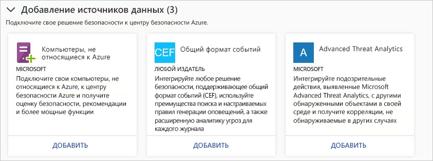
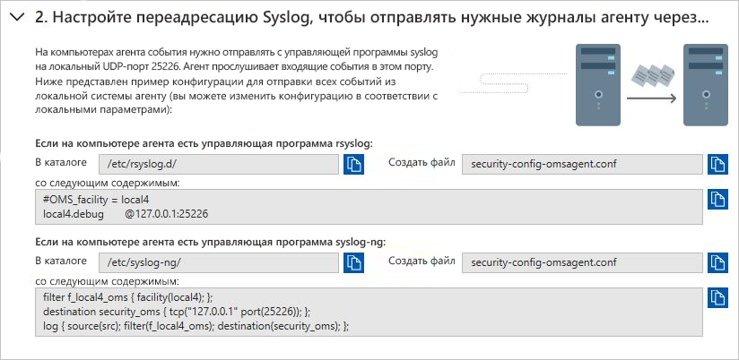

# Интеграция решений по обеспечению безопасности в центре безопасности Azure
В этом документе описана процедура управления решениями по обеспечению безопасности, подключенными к центру безопасности Azure, и добавления новых решений.

## Интегрированные решения по обеспечению безопасности Azure
Центр безопасности упрощает включение интегрированных решений по обеспечению безопасности в Azure. Основные преимущества:

- **Упрощенный процесс развертывания**. Центр безопасности предлагает упрощенную подготовку партнерских решений обеспечения безопасности. Для таких решений, как антивредоносные программы и решения по оценке уязвимостей, центр безопасности может подготовить необходимый агент на виртуальных машинах, а для решений брандмауэра он может выполнить большую часть необходимой конфигурации сети.
- **Интегрированные обнаружения**. События безопасности автоматически собираются из партнерских решений, объединяются и отображаются в списках оповещений и инцидентов центра безопасности. Эти события используются совместно с результатами сканирования других источников, что дает дополнительные возможности для обнаружения угроз.
- **Единый мониторинг работоспособности и единое управление**. Пользователи могут использовать интегрированные события работоспособности, чтобы отслеживать все партнерские решения в одном расположении. Предоставляются базовые возможности для управления и быстрый доступ к партнерским решениям для расширенной настройки.

Сейчас к интегрированным решениям безопасности относятся следующие решения:

- Брандмауэр веб-приложения ([Barracuda](https://www.barracuda.com/products/webapplicationfirewall), [F5](https://support.f5.com/kb/en-us/products/big-ip_asm/manuals/product/bigip-ve-web-application-firewall-microsoft-azure-12-0-0.html), [Imperva](https://www.imperva.com/Products/WebApplicationFirewall-WAF), [Fortinet](https://www.fortinet.com/products.html) и [шлюз приложений Azure](https://azure.microsoft.com/blog/azure-web-application-firewall-waf-generally-available/)).
- брандмауэр следующего поколения ([Check Point](https://www.checkpoint.com/products/vsec-microsoft-azure/), [Barracuda](https://campus.barracuda.com/product/nextgenfirewallf/article/NGF/AzureDeployment/), [Fortinet](http://docs.fortinet.com/d/fortigate-fortios-handbook-the-complete-guide-to-fortios-5.2), [Cisco](http://www.cisco.com/c/en/us/td/docs/security/firepower/quick_start/azure/ftdv-azure-qsg.html) и [Palo Alto Networks](https://www.paloaltonetworks.com/products));
- Оценка уязвимостей ([Qualys](https://www.qualys.com/public-clouds/microsoft-azure/) и [Rapid7](https://www.rapid7.com/products/insightvm/)).

> [!NOTE]
> Центр безопасности не устанавливает Microsoft Monitoring Agent на виртуальные модули партнеров, так как большинство поставщиков систем безопасности запрещают выполнение внешних агентов на своих модулях.
>
>

## Как интегрируются решения по обеспечению безопасности
Решения по обеспечению безопасности Azure, развертываемые из центра безопасности, подключены автоматически. Вы также можете подключить другие источники данных безопасности:

- защиту идентификации Azure AD
- Компьютеры, работающие локально или в других облаках.
- Решения по обеспечению безопасности, поддерживающие общий формат событий (CEF).
- Microsoft Advanced Threat Analytics.

## Управление интегрированными решениями по обеспечению безопасности Azure и другими источниками данных

1. Войдите на [портале Azure](https://azure.microsoft.com/features/azure-portal/).

2. В меню **Microsoft Azure** выберите пункт **Центр безопасности**. Откроется окно **Security Center - Overview** (Центр безопасности — обзор).

3. В меню центра безопасности выберите пункт **Решения безопасности**.

  

В разделе **Решения безопасности** можно просмотреть сведения о работоспособности встроенного решения по обеспечению безопасности Azure и выполнить основные задачи управления. Вы также можете подключить другие типы источников данных безопасности, такие как оповещения службы "Защита идентификации Azure Active Directory" и журналы брандмауэра в общем формате событий (CEF).

### Подключенные решения

Раздел **Подключенные решения** содержит решения безопасности, которые подключены к центру безопасности, и сведения о состоянии работоспособности для каждого из них.  

Поле состояния партнерского решения может содержать следующее значение:

* "Исправно" (зеленый) — нет никаких проблем с работоспособностью.
* "Неисправно" (красный) — проблема работоспособности, которая требует немедленного внимания.
* "Проблемы работоспособности" (оранжевый) — решение перестало сообщать о работоспособности.
* "Отчет не отправлен" (серый) — решение еще не сообщало о своем состоянии. Сведения о состоянии не отправляются, если решение подключено недавно и еще не завершило развертывание или отсутствуют данные о работоспособности.

> [!NOTE]
> Если данные о работоспособности отсутствуют, центр безопасности отображает дату и время последнего полученного события, позволяя проверить отправку отчетов с устройства. Если данные о работоспособности отсутствуют и от устройства нет оповещений уже в течение 14 дней, центр безопасности информирует о неисправности устройства или отсутствии отчетов от него.
>
>

2. Выберите **Просмотр**, чтобы получить дополнительные сведения и возможности:

  - **Консоль решения**. Открывает интерфейс управления для этого решения.
  - **Связать виртуальную машину**. Открывает колонку "Связывание приложений". В ней можно подключить ресурсы к решению партнера.
  - **Удалить решение**.
  - **Настройка**.

   

### Обнаруженные решения

Центр безопасности автоматически обнаруживает решения по обеспечению безопасности, которые запущены в Azure, но не подключены к центру безопасности, и отображает их в разделе **Обнаруженные решения**. Сюда входят такие решения Azure, как [Защита идентификации Azure Active Directory](https://docs.microsoft.com/azure/active-directory/active-directory-identityprotection), а также партнерские решения.

> [!NOTE]
> Использование центра безопасности категории "Стандартный" на уровне подписки является обязательным требованием для работы функции обнаружения решений. Дополнительные сведения о ценовых категориях центра безопасности см. на странице [Цены](security-center-pricing.md).
>
>

Для интеграции с центром безопасности и получения оповещений безопасности щелкните **Подключить** под именем решения.

Центр безопасности также обнаруживает решения, развернутые в подписке, которые могут пересылать журналы общего формата событий (CEF). Узнайте, как [подключить решение безопасности](quick-security-solutions.md), в котором используются журналы CEF, к центру безопасности.

### Добавление источников данных

В разделе **Добавление источников данных** содержатся сведения о других доступных источниках данных, которые можно подключить. Чтобы получить инструкции по добавлению данных из любого из этих источников, щелкните **Добавить**.

### Подключение внешних решений

Помимо сбора данных безопасности с компьютеров, вы можете интегрировать данные безопасности из других средств безопасности, в том числе из тех, которые поддерживают общий формат событий (CEF). CEF — это отраслевой стандартный формат на основе сообщений решения Syslog, которое используют многие поставщики средств безопасности, чтобы обеспечить интеграцию событий на разных платформах.

В этом кратком руководстве объясняется, как выполнять следующие задачи:
- подключить решение безопасности к центру безопасности с помощью журналов CEF;
- проверить подключение с помощью решения для системы безопасности.

#### Предварительные требования
Для начала работы с Центром безопасности необходима подписка Microsoft Azure. Если у вас нет подписки, вы можете зарегистрироваться для получения [бесплатной учетной записи](https://azure.microsoft.com/free/).

Для работы с этим руководством требуется центр безопасности с ценовой категорией "Стандартный". Вы можете бесплатно опробовать центр безопасности ценовой категории "Стандартный". Следуйте инструкциям в [кратком руководстве по центру безопасности Azure](security-center-get-started.md), чтобы обновить ценовую категорию до уровня "Стандартный". Дополнительные сведения см. на [странице с ценами](https://azure.microsoft.com/pricing/details/security-center/).

Также вам понадобится [компьютер Linux](https://docs.microsoft.com/azure/log-analytics/log-analytics-agent-linux) со службой Syslog, которая уже подключена к вашему центру безопасности.

#### Подключение решения с помощью CEF

1. Войдите на [портал Azure](https://azure.microsoft.com/features/azure-portal/).
2. В меню **Microsoft Azure** выберите пункт **Центр безопасности**. Откроется окно **Security Center - Overview** (Центр безопасности — обзор).

      

3. В главном меню центра безопасности выберите пункт **Решения безопасности**.
4. На странице решения безопасности в разделе **Добавление источника данных (3)** нажмите кнопку **Добавить** под пунктом **Общий формат событий**.

    

5. На странице "Журналы общего формата событий разверните второй шаг. **Настройте переадресацию Syslog, чтобы отправлять нужные журналы агенту через UDP-порт 25226** и выполните следующие инструкции на компьютере Linux:

    

6. Разверните третий шаг. **Поместите файл конфигурации агента на компьютер агента** и выполните следующие инструкции на компьютере Linux:

    

7. Разверните четвертый шаг. **Перезапустите управляющую программу Syslog и агент** и выполните следующие инструкции на компьютере Linux:

    

#### Проверка подключения

Прежде чем продолжить указанные ниже действия, подождите, пока решение Syslog начнет высылать отчеты центру безопасности. Этот процесс может занять некоторое время в зависимости от размера среды.

1.  В левой части панели мониторинга центра безопасности, нажмите кнопку **Поиск**.
2.  Выберите рабочую область, к которой подключено решение Syslog (компьютер Linux).
3.  Введите *CommonSecurityLog* и нажмите кнопку **Поиск**.

В следующем примере показан результат этих действий. 

#### Очистка ресурсов
Другие руководства в этой серии созданы на основе этого документа. Если вы планируете продолжить работу со следующими руководствами, продолжайте использовать уровень "Стандартный" и оставьте включенной автоматическую подготовку. Если вы не планируете продолжать или хотите вернуться к уровню "Бесплатный", выполните следующие действия.

1. Вернитесь в главное меню центра безопасности и выберите пункт **Политика безопасности**.
2. Выберите подписку или политику, которую хотите вернуть на уровень "Бесплатный". Откроется окно **Политика безопасности**.
3. В разделе **Компоненты политики** выберите **Ценовая категория**.
4. Выберите уровень **Бесплатный**, чтобы изменить уровень подписки со стандартного на бесплатный.
5. Щелкните **Сохранить**.

Чтобы отключить автоматическую подготовку, выполните следующие действия:

1. Вернитесь в главное меню центра безопасности и выберите пункт **Политика безопасности**.
2. Выберите подписку, в которой нужно отключить автоматическую подготовку.
3. В колонке **Security policy – Data Collection** (Политика безопасности — сбор данных) в разделе **Подключение** выберите **Отключить**, чтобы отключить автоматическую подготовку.
4. Щелкните **Сохранить**.

>[!NOTE]
> При отключении автоматической подготовки агент Microsoft Monitoring Agent не будет удален с виртуальных машин Azure, на которых он был подготовлен. Если отключить ее, мониторинг безопасности ваших ресурсов будет ограничен.
>

## Экспорт данных в SIEM

Обработанные события, создаваемые центром безопасности Azure, публикуются в [журнале действий](../monitoring-and-diagnostics/monitoring-overview-activity-logs.md) Azure, одном из различных журналов, доступных через Azure Monitor. Azure Monitor предлагает объединенный конвейер для передачи всех данных мониторинга в инструмент SIEM. Для этого используется потоковая передача данных мониторинга в концентратор событий, из которого они затем могут быть извлечены в инструмент партнера.

Этот канал использует [отдельный конвейер мониторинга Azure](../azure-monitor/platform/stream-monitoring-data-event-hubs.md) для получения доступа к данным мониторинга из среды Azure. Это позволяет легко настроить компоненты SIEM и инструменты мониторинга для работы с данными.

В следующих разделах описывается, как настроить потоковую передачу данных в концентратор событий. В инструкциях предполагается, что в вашей подписке Azure настроен центр безопасности Azure.

Общий обзор

### Какие данные безопасности Azure передаются в SIEM?

В этой версии предоставляются [оповещения системы безопасности](../security-center/security-center-managing-and-responding-alerts.md). В будущих выпусках мы дополним их рекомендациями по безопасности.

### Как можно настроить конвейер

#### Создание концентратора событий

Вначале следует [создать пространство имен Центров событий](../event-hubs/event-hubs-create.md). Это пространство имен и концентратор событий — место назначения всех ваших данных мониторинга.

#### Потоковая передача журнала действий Azure в Центры событий

Ознакомьтесь со статьей [Потоковая передача журналов действий в Центры событий](../azure-monitor/platform/activity-logs-stream-event-hubs.md).

#### Установка соединителя SIEM партнера 

Маршрутизация данных мониторинга в концентратор событий с помощью Azure Monitor обеспечивает интеграцию с партнерским решением SIEM и инструментами мониторинга.

Воспользуйтесь приведенной ссылкой, чтобы просмотреть список [поддерживаемых решений SIEM](../azure-monitor/platform/stream-monitoring-data-event-hubs.md#what-can-i-do-with-the-monitoring-data-being-sent-to-my-event-hub).

### Пример запроса данных 

Ниже приведено несколько запросов Splunk, которые можно использовать для извлечения данных оповещений.

| **Описание запроса** | **Запрос** |
|----|----|
| Все оповещения.| index=main Microsoft.Security/locations/alerts|
| Суммирование количества операций по имени.| index=main sourcetype="amal:security" \| table operationName \| stats count by operationName|
| Получение сведений об оповещении: время, имя, состояние, идентификатор и подписка. | index=main Microsoft.Security/locations/alerts \| table \_time, properties.eventName, State, properties.operationId, am_subscriptionId |

## Дополнительная информация

Из этой статьи вы узнали, как интегрировать партнерские решения в центре безопасности. Дополнительные сведения о центре безопасности см. в следующих статьях:

* [Подключение Microsoft Advanced Threat Analytics к центру безопасности Azure](security-center-ata-integration.md)
* [Подключение службы "Защита идентификации Azure Active Directory" к центру безопасности Azure](security-center-aadip-integration.md)
* [Наблюдение за работоспособностью системы безопасности в Центре безопасности Azure](security-center-monitoring.md). Узнайте, как отслеживать работоспособность ресурсов Azure.
* [Мониторинг решений партнеров с помощью центра безопасности Azure](security-center-partner-solutions.md). Узнайте, как отслеживать работоспособность партнерских решений.
* [Центр безопасности Azure: часто задаваемые вопросы](security-center-faq.md). Ознакомьтесь с ответами на часто задаваемые вопросы об использовании центра безопасности.
* [Блог по безопасности Azure](https://blogs.msdn.com/b/azuresecurity/). Записи блога, посвященные безопасности и соответствию требованиям в Azure.
