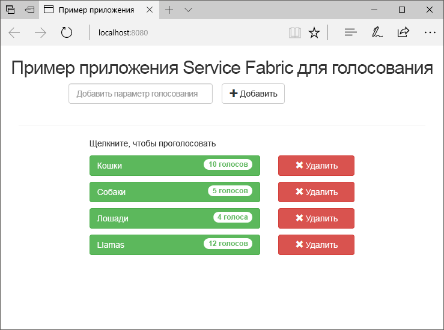
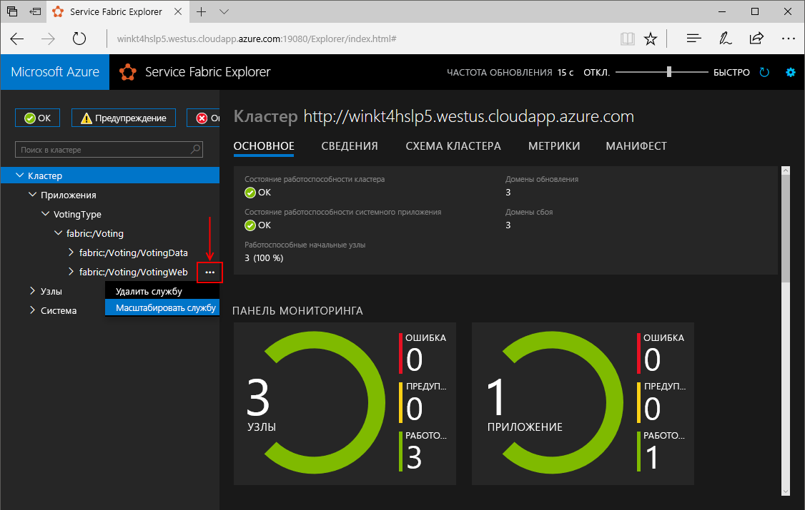
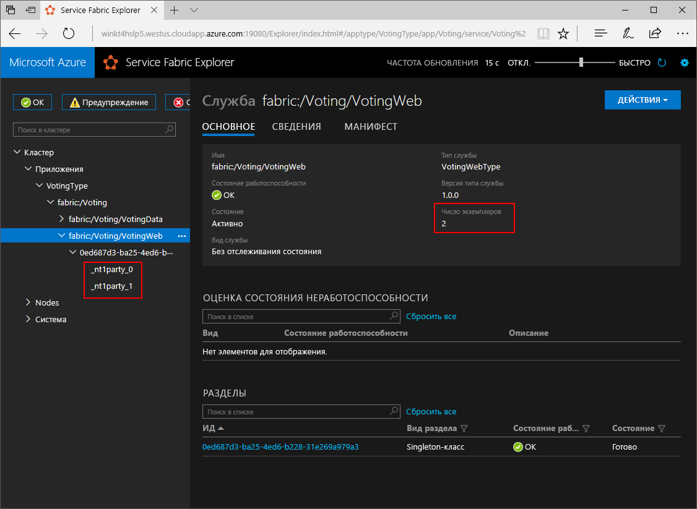
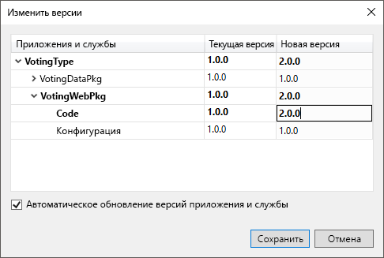

# <a name="create-a-net-service-fabric-application-in-azure"></a>Создание приложения .NET Service Fabric в Azure
Azure Service Fabric — это платформа распределенных систем для развертывания масштабируемых надежных микрослужб и контейнеров и управления ими. 

В этом руководстве описано, как развернуть свое первое приложение .NET в Service Fabric. После завершения этого руководства вы получите приложение для голосования с клиентской частью в виде веб-приложения ASP.NET Core, которое сохраняет результаты голосования во внутренней службе с отслеживанием состояния в кластере.



С помощью этого приложения вы узнаете, как выполнить следующие действия:
> [!div class="checklist"]
> * Создание приложения с использованием .NET и Service Fabric
> * Использование ASP.NET Core в качестве клиентского веб-интерфейса
> * Хранение данных приложения в службе с отслеживанием состояния
> * Локальная отладка приложения
> * Развертывание приложения в кластере Azure
> * Масштабирование приложения на несколько узлов
> * Последовательное обновление приложения

## <a name="prerequisites"></a>предварительным требованиям
Для работы с этим кратким руководством сделайте следующее:
1. [Установите Visual Studio 2017](https://www.visualstudio.com/), а также рабочие нагрузки **разработка Azure** и **ASP.NET и веб-разработка**.
2. [установите Git](https://git-scm.com/);
3. [Установите пакет SDK для Microsoft Azure Service Fabric](http://www.microsoft.com/web/handlers/webpi.ashx?command=getinstallerredirect&appid=MicrosoftAzure-ServiceFabric-CoreSDK)
4. Выполните следующую команду, чтобы разрешить развертывание на локальный кластер Service Fabric в Visual Studio:
    ```powershell
    Set-ExecutionPolicy -ExecutionPolicy Unrestricted -Force -Scope CurrentUser
    ```

>[!NOTE]
> В примере приложения в этом кратком руководстве используются функции, недоступные в Windows 7.
>

## <a name="download-the-sample"></a>Скачивание примера приложения
В окне терминала выполните следующую команду, чтобы клонировать репозиторий с примером приложения на локальный компьютер.
```
git clone https://github.com/Azure-Samples/service-fabric-dotnet-quickstart
```

## <a name="run-the-application-locally"></a>Локальный запуск приложения
Щелкните правой кнопкой мыши значок Visual Studio в меню "Пуск" и выберите **Запуск от имени администратора**. Чтобы подключить отладчик к службам, необходимо запустить Visual Studio от имени администратора.

В клонированном репозитории откройте решение **Voting.sln** в Visual Studio.  

По умолчанию приложение для голосования настроено для прослушивания порта 8080.  Порт приложения задается в файле */VotingWeb/PackageRoot/ServiceManifest.xml*.  Можно изменить порт приложения, обновив атрибут **Port** для элемента **Endpoint**.  Для локального развертывания и запуска приложения порт приложения должен быть открыт и доступен на компьютере.  Чтобы изменить порт приложения, подставьте нужное значение вместо "8080" в этой статье.

Чтобы развернуть приложение, нажмите клавишу **F5**.

> [!NOTE]
> Во время первого запуска и развертывания приложения Visual Studio создает локальный кластер для отладки. Эта операция может занять некоторое время. Процесс создания кластера можно наблюдать в окне вывода Visual Studio.  В выходных данных появится сообщение "The application URL is not set or is not an HTTP/HTTPS URL so the browser will not be opened to the application" (URL-адрес приложения не задан или не является URL-адресом HTTP/HTTPS, поэтому браузер не будет открыт для приложения).  Это сообщение не указывает на ошибку, но браузер не будет запускаться автоматически.

После завершения развертывания будет открыто окно браузера со страницей `http://localhost:8080`. Это страница веб-приложения.


Теперь можно добавить варианты для выбора в голосовании и начать прием голосов. Приложение запускается и хранит все данные в кластере Service Fabric без необходимости использования отдельной базы данных.

## <a name="walk-through-the-voting-sample-application"></a>Описание примера приложения для голосования
Приложение для голосования состоит из двух служб:
- Служба веб-интерфейса (VotingWeb) — служба веб-интерфейса ASP.NET Core, которая обслуживает веб-страницу и предоставляет доступ к веб-API для связи с внутренней службой.
- Внутренняя служба (VotingData) — веб-служба ASP.NET Core, которая предоставляет API для сохранения результатов голосования в надежном словаре на диске.


Во время голосования в приложении происходят следующие события:
1. JavaScript отправляет запрос о голосовании веб-API в службе веб-интерфейса в виде запроса HTTP PUT.

2. Служба веб-интерфейса использует прокси, чтобы обнаружить и перенаправить запрос HTTP PUT внутренней службе.

3. Внутренняя служба принимает входящий запрос и сохраняет обновленный результат в надежном словаре, который реплицируется на несколько узлов в кластере и сохраняется на диске. Все данные приложения хранятся в кластере, поэтому база данных не требуется.

## <a name="debug-in-visual-studio"></a>Отладка в Visual Studio
При отладке приложения в Visual Studio вы используете локальный кластер разработки Service Fabric. Вы можете настроить отладку для своего сценария. В этом приложении данные хранятся во внутренней службе с помощью надежного словаря. По умолчанию при остановке отладчика Visual Studio удаляет приложение. При удалении приложения данные во внутренней службе также удаляются. Для сохранения данных между сеансами отладки можно изменить свойство **Режим отладки приложения** проекта **Voting** в Visual Studio.

Чтобы посмотреть, как выполняется код, сделайте следующее:
1. Откройте файл **/VotingWeb/Controllers/VotesController.cs** и установите точку останова в методе **Put** для веб-API (строка 47). Найти нужный файл можно с помощью функции поиска в обозревателе решений в Visual Studio.

2. Откройте файл **/VotingData/Controllers/VoteDataController.cs** и установите точку останова в методе **Put** этого веб-API (строка 50).

3. Вернитесь в браузер и выберите один из вариантов голосования или добавьте новый вариант. Выполнение остановится на первой точке останова в контроллере API клиентского веб-интерфейса.
    - Здесь код JavaScript в браузере отправляет запрос контроллеру веб-API в службе веб-интерфейса.
    
    

    - Сначала создайте URL-адрес обратного прокси-сервера внутренней службы **(1)**.
    - Затем отправьте HTTP-запрос PUT к обратному прокси-серверу **(2)**.
    - Наконец, верните ответ внутренней службы клиенту **(3)**.

4. Нажмите клавишу **F5**, чтобы продолжить выполнение кода.
    - Теперь вы находитесь в точке останова внутренней службы.
    
    

    - В первой строке метода **(1)** используется `StateManager` для получения или добавления надежного словаря `counts`.
    - Все взаимодействие с надежным словарем осуществляется с помощью транзакций. Для создания транзакции используется инструкция using **(2)**.
    - В транзакции обновите значение соответствующего ключа для варианта голосования и зафиксируйте операцию **(3)**. После возврата метода фиксации данные в словаре обновляются и реплицируются на другие узлы в кластере. Теперь данные безопасно хранятся в кластере, и внутренняя служба может выполнять отработку отказа на другие узлы, сохраняя доступ к данным.
5. Нажмите клавишу **F5**, чтобы продолжить выполнение кода.

Чтобы остановить сеанс отладки, нажмите **SHIFT + F5**.

## <a name="deploy-the-application-to-azure"></a>Развертывание приложения в Azure
Чтобы развернуть приложение в Azure, требуется кластер Service Fabric, в котором будет выполняться приложение. 

### <a name="join-a-party-cluster"></a>Присоединение кластера сообщества
Кластеры сообщества — это бесплатные кластеры Service Fabric, которые доступны в течение ограниченного времени. Эти кластеры размещены в Azure и поддерживаются командой Service Fabric. Любой пользователь может развертывать приложения на этих кластерах и знакомиться с платформой. Кластер использует один самозаверяющий сертификат для обмена данными между узлами и обеспечения безопасности при взаимодействии между клиентом и узлом. 

Войдите в систему и [присоедините кластер Windows](http://aka.ms/tryservicefabric). Загрузите сертификат PFX на компьютер, щелкнув ссылку **PFX**. Сертификат и значение **конечной точки подключения** будут использоваться в дальнейшем.


На компьютере Windows установите PFX в хранилище сертификатов: *CurrentUser\My*.

```powershell
PS C:\mycertificates> Import-PfxCertificate -FilePath .\party-cluster-873689604-client-cert.pfx -CertStoreLocation Cert:
\CurrentUser\My


   PSParentPath: Microsoft.PowerShell.Security\Certificate::CurrentUser\My

Thumbprint                                Subject
----------                                -------
3B138D84C077C292579BA35E4410634E164075CD  CN=zwin7fh14scd.westus.cloudapp.azure.com
```

Помните об отпечатке для следующего шага.

> [!Note]
> По умолчанию служба веб-интерфейса ожидает передачи данных через порт 8080 для входящего трафика. Порт 8080 открыт в кластере сообщества.  Если нужно изменить порт приложения, замените его одним из портов, открытых в кластере сообщества.
>

### <a name="deploy-the-application-using-visual-studio"></a>Развертывание приложения с помощью Visual Studio
Теперь, когда приложение готово, можно развернуть его в кластер напрямую из Visual Studio.

1. Щелкните правой кнопкой мыши **Voting** в обозревателе решений и выберите **Опубликовать**. Появится диалоговое окно "Опубликовать".


2. Скопируйте **конечную точку подключения** со страницы кластера сообщества в поле **Конечная точка подключения**. Например, `zwin7fh14scd.westus.cloudapp.azure.com:19000`. Щелкните **Дополнительные параметры подключения** и укажите следующие сведения.  Значения *FindValue* и *ServerCertThumbprint* должны соответствовать отпечатку сертификата, который установлен на предыдущем шаге. 

    

    Имя каждого приложения в кластере должно быть уникальным.  Кластеры сообщества — это открытая общедоступная среда. Но они могут конфликтовать с существующим приложением.  В случае конфликта имен переименуйте проект Visual Studio и повторите развертывание.

3. Щелкните **Опубликовать**.

4. Откройте браузер и введите адрес кластера и порт ":8080", чтобы получить доступ к приложению в кластере. Пример: `http://zwin7fh14scd.westus.cloudapp.azure.com:8080`. Вы увидите приложения, выполняющиеся в кластере Azure.


## <a name="scale-applications-and-services-in-a-cluster"></a>Масштабирование приложений и служб в кластере
Службы Service Fabric могут легко масштабироваться в кластере с учетом изменения нагрузки на службы. Масштабирование службы осуществляется путем изменения числа экземпляров, запущенных в кластере. Существует несколько способов масштабирования служб — вы можете использовать сценарии PowerShell или команды интерфейса командной строки Service Fabric (sfctl). В этом примере используйте Service Fabric Explorer.

Service Fabric Explorer выполняется во всех кластерах Service Fabric. Чтобы его открыть, укажите адрес кластера и порт управления кластерами HTTP (19080) в адресной строке, например `http://zwin7fh14scd.westus.cloudapp.azure.com:19080`. 

В браузере может появиться предупреждение, что расположение не является доверенным. Причина — сертификат является самозаверяющим. Вы можете пропустить это предупреждение и продолжить работу. При появлении запроса в браузере выберите установленный сертификат для подключения. 

Для масштабирования службы веб-интерфейса выполните следующие действия:

1. Откройте Service Fabric Explorer в своем кластере (например, по ссылке `http://zwin7fh14scd.westus.cloudapp.azure.com:19080`).
2. Щелкните многоточие рядом с узлом **fabric:/Voting/VotingWeb** в дереве и выберите **Масштабировать службу**.

    

    Теперь вы можете изменить количество экземпляров службы веб-интерфейса.

3. Измените количество на **2** и нажмите кнопку **Масштабировать службу**.
4. Щелкните узел **fabric:/Voting/VotingWeb** в дереве и разверните узел раздела (он отображается в виде идентификатора GUID).

    

    Через некоторое время вы увидите два экземпляра службы.  В представлении в виде дерева можно узнать, на каких узлах выполняются эти экземпляры.

С помощью этой простой задачи управления удвоено количество ресурсов для обработки пользовательской нагрузки для службы веб-интерфейса. Важно понимать, что для надежной работы службы не требуется запускать несколько экземпляров службы. При сбое в работе службы Service Fabric запускает новый экземпляр службы в кластере.

## <a name="perform-a-rolling-application-upgrade"></a>Последовательное обновление приложения
Service Fabric развертывает обновления для приложения безопасным способом. Последовательные обновления позволяют избежать простоя, а также автоматического отката в случае возникновения ошибок.

Для обновления приложения выполните следующие действия:

1. Откройте файл **/VotingWeb/Views/Home/Index.cshtml** в Visual Studio.
2. Измените заголовок на странице, добавив или обновив текст. Например, измените заголовок на Service Fabric Voting Sample v2.
3. Сохраните файл.
4. Щелкните правой кнопкой мыши **Voting** в обозревателе решений и выберите **Опубликовать**. Появится диалоговое окно "Опубликовать".
5. Нажмите кнопку **Версия манифеста**, чтобы изменить версию службы и приложения.
6. Например, измените версию элемента **Code** в разделе **VotingWebPkg** на "2.0.0" и нажмите кнопку **Сохранить**.

    
7. В диалоговом окне **Публикация приложения Service Fabric** установите флажок "Обновить приложение" и нажмите кнопку **Опубликовать**.

    
8. Откройте в браузере адрес кластера, добавив порт 19080 — например, `http://zwin7fh14scd.westus.cloudapp.azure.com:19080`.
9. Щелкните узел **Приложения** в дереве, а затем щелкните **Выполняемые обновления** в области справа. Вы увидите, как обновление проходит по доменам обновления в кластере, проверяя работоспособность каждого домена перед переходом к следующему. Зеленый цвет индикатора состояния для домена обновления указывает на то, что его работоспособность подтверждена.
    

    Service Fabric выполняет надежное обновление. Для этого после обновления службы на каждом узле кластера выполняется ожидание в течение двух минут, и затем Service Fabric переходит к следующему узлу кластера. Все обновление должно занять около 8 минут.

10. Во время обновления вы можете использовать приложение. Из-за наличия двух экземпляров службы, запущенных в кластере, некоторые из ваших запросов могут получить обновленную версию приложения, а другие — старую версию.

## <a name="next-steps"></a>Дополнительная информация
Из этого руководства вы узнали, как выполнить следующие действия:

> [!div class="checklist"]
> * Создание приложения с использованием .NET и Service Fabric
> * Использование ASP.NET Core в качестве клиентского веб-интерфейса
> * Хранение данных приложения в службе с отслеживанием состояния
> * Локальная отладка приложения
> * Развертывание приложения в кластере Azure
> * Масштабирование приложения на несколько узлов
> * Последовательное обновление приложения

Дополнительные сведения о Service Fabric и .NET см. в следующем руководстве:
> [!div class="nextstepaction"]
> [Приложение .NET в Service Fabric](service-fabric-tutorial-create-dotnet-app.md)
