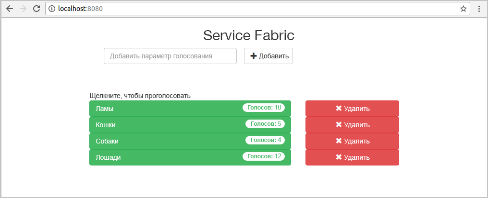
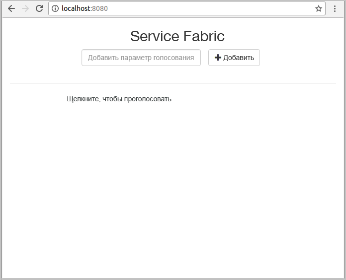
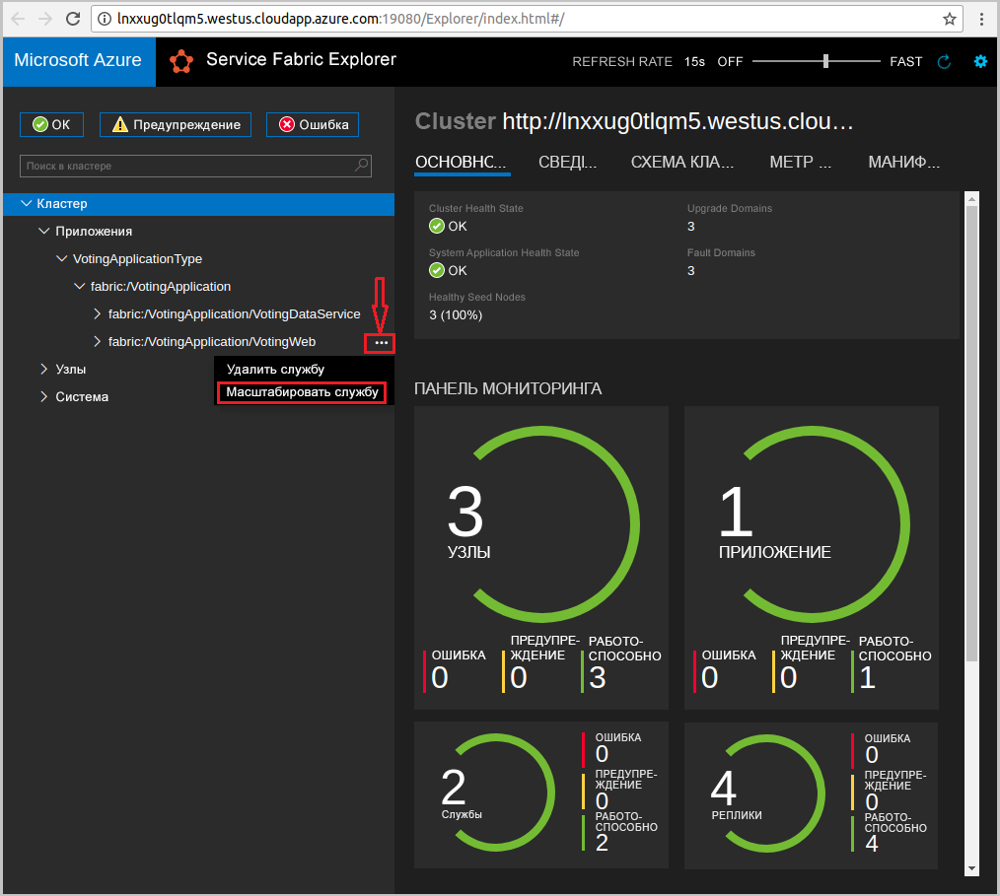

# <a name="quickstart-deploy-a-java-service-fabric-reliable-services-application-to-azure"></a>Краткое руководство. Развертывание приложения надежных служб Java Service Fabric в Azure
Azure Service Fabric — это платформа распределенных систем для развертывания микрослужб и контейнеров и управления ими. 

В этом кратком руководстве показано, как развернуть первое приложение Java в Service Fabric с использованием интегрированной среды разработки Eclipse на компьютере разработчика Linux. После завершения этого руководства вы получите приложение для голосования с клиентской частью в виде веб-приложения Java, которое сохраняет результаты голосования во внутренней службе с отслеживанием состояния в кластере.



Из этого краткого руководства вы узнаете, как выполнять следующие задачи:

* Использование Eclipse в качестве средства для приложений Java Service Fabric.
* Развертывание приложения в локальном кластере. 
* Развертывание приложения в кластере Azure
* Масштабирование приложения на несколько узлов

## <a name="prerequisites"></a>предварительным требованиям
Для работы с этим кратким руководством сделайте следующее:
1. [Установите пакет SDK и интерфейс командной строки Service Fabric](https://docs.microsoft.com/azure/service-fabric/service-fabric-get-started-linux#installation-methods).
2. [установите Git](https://git-scm.com/);
3. [Установите Eclipse](https://www.eclipse.org/downloads/).
4. [Настройте среду Java](https://docs.microsoft.com/azure/service-fabric/service-fabric-get-started-linux#set-up-java-development), следуя дополнительным шагам по установке подключаемого модуля Eclipse. 

## <a name="download-the-sample"></a>Скачивание примера приложения
В окне терминала выполните следующую команду, чтобы клонировать репозиторий с примером приложения на локальный компьютер.
```
git clone https://github.com/Azure-Samples/service-fabric-java-quickstart.git
```

## <a name="run-the-application-locally"></a>Локальный запуск приложения
1. Запустите локальный кластер, выполнив следующую команду:

    ```bash
    sudo /opt/microsoft/sdk/servicefabric/common/clustersetup/devclustersetup.sh
    ```
    Запуск локального кластера занимает некоторое время. Чтобы убедиться, что кластер является рабочим, откройте Service Fabric Explorer по адресу **http://localhost:19080**. Наличие пяти работоспособных узлов означает, что локальный кластер запущен и работает. 
    
    

2. Откройте Eclipse.
3. Щелкните File (Файл) -> Open Projects from File System... (Открыть проекты из файловой системы...). 
4. Щелкните каталог и выберите каталог `Voting` из папки `service-fabric-java-quickstart`, клонированной из GitHub. Нажмите кнопку Готово. 

    
    
5. Теперь у вас имеется проект `Voting` в обозревателе пакетов для Eclipse. 
6. Щелкните правой кнопкой мыши проект и выберите **Publish Application...** (Опубликовать приложение...) в раскрывающемся списке **Service Fabric**. Выберите **PublishProfiles/Local.json** в качестве целевого профиля и нажмите кнопку Publish (Опубликовать). 

    
    
7. Откройте любой веб-браузер и перейдите к приложению по адресу **http://localhost:8080**. 

    
    
Теперь можно добавить варианты для выбора в голосовании и начать прием голосов. Приложение запускается и хранит все данные в кластере Service Fabric без необходимости использования отдельной базы данных.

## <a name="deploy-the-application-to-azure"></a>Развертывание приложения в Azure

### <a name="set-up-your-azure-service-fabric-cluster"></a>Настройка кластера Azure Service Fabric
Чтобы развернуть приложение в кластере Azure, создайте собственный кластер.

Общедоступные кластеры — это размещенные в Azure бесплатные временные кластеры Service Fabric, которыми управляет команда Service Fabric. Общедоступные кластеры можно использовать для развертывания приложений и изучения возможностей платформы. Кластер использует один самозаверяющий сертификат для обеспечения безопасности при взаимодействии между узлами и между клиентом и узлом.

Войдите в систему и [присоедините кластер Linux](http://aka.ms/tryservicefabric). Загрузите сертификат PFX на компьютер, щелкнув ссылку **PFX**. Щелкните ссылку на **файл сведений**, чтобы найти пароль для сертификата и инструкции о том, как настраивать различные среды для использования сертификата. Не закрывайте страницу **приветствия** и **файл сведений**. Некоторые из этих инструкций будут использованы на следующих шагах. 

> [!Note]
> В течение одного часа доступно ограниченное число общедоступных кластеров. Если при попытке регистрации в общедоступном кластере появляется сообщение об ошибке, подождите немного и повторите попытку или следуйте инструкциям из раздела о [создании кластера Service Fabric в Azure](service-fabric-tutorial-create-vnet-and-linux-cluster.md), чтобы создать кластер в подписке. 
>
> Служба Spring Boot прослушивает входящий трафик через порт 8080. Убедитесь, что порт открыт в кластере. При использовании кластера сообщества этот порт открыт.
>

Service Fabric предоставляет ряд средств, которые можно использовать для управления кластером и его приложениями:

- средство Service Fabric Explorer на основе браузера;
- интерфейс командной строки (CLI) Service Fabric, который работает на базе Azure CLI 2.0;
- команды PowerShell. 

При работе с этим кратким руководством используется интерфейс командной строки Service Fabric и Service Fabric Explorer. 

Чтобы использовать CLI, создайте PEM-файл на основе скачанного PFX-файла. Для преобразования файла используйте приведенную ниже команду. (Для общедоступных кластеров можно скопировать команду, указанную для PFX-файла, из инструкций на странице **файла сведений**.)

    ```bash
    openssl pkcs12 -in party-cluster-1486790479-client-cert.pfx -out party-cluster-1486790479-client-cert.pem -nodes -passin pass:1486790479
    ``` 

Чтобы использовать Service Fabric Explorer, необходимо импортировать PFX-файл сертификата, скачанный с веб-сайта общедоступного кластера, в хранилище сертификатов (Windows или Mac) или в сам браузер (Ubuntu). Вам потребуется пароль закрытого ключа PFX-файла, который можно найти на странице **файла сведений**.

Для импорта сертификата на компьютер можно использовать любой удобный метод. Например: 

- В Windows: дважды щелкните PFX-файл и следуйте инструкциям на экране для установки сертификата в личном хранилище, `Certificates - Current User\Personal\Certificates`. Кроме того, можно использовать команду PowerShell из инструкций в **файле сведений**.
- В Mac: дважды щелкните PFX-файл и следуйте инструкциям на экране, чтобы установить сертификат в цепочке ключей.
- В Ubuntu: браузером по умолчанию в Ubuntu 16.04 является Mozilla Firefox. Чтобы импортировать сертификат в Firefox, нажмите кнопку меню в правом верхнем углу браузера, а затем щелкните **Options** (Параметры). На странице **Preferences** (Настройки) введите в поле поиска слово "сертификаты". Нажмите кнопку **View Certificates** (Просмотр сертификатов), выберите вкладку **Your Certificates** (Ваши сертификаты), щелкните **Import** (Импорт) и следуйте инструкциям на экране, чтобы импортировать сертификат.
 
    


### <a name="add-certificate-information-to-your-application"></a>Добавление сведений о сертификате в приложение

Отпечаток сертификата необходимо добавить в приложение, чтобы обеспечить использование моделей программирования Service Fabric. 

1. Вам потребуется отпечаток сертификата в файле ```Voting/VotingApplication/ApplicationManiest.xml``` при работе с безопасным кластером. Выполните следующую команду, чтобы извлечь отпечаток сертификата.

    ```bash
    openssl x509 -in [CERTIFICATE_PEM_FILE] -fingerprint -noout
    ```

2. В ```Voting/VotingApplication/ApplicationManiest.xml``` добавьте следующий фрагмент кода в тег **ApplicationManifest**. Значение **X509FindValue** должно представлять отпечаток из предыдущего шага (без точки с запятой). 

    ```xml
    <Certificates>
        <SecretsCertificate X509FindType="FindByThumbprint" X509FindValue="0A00AA0AAAA0AAA00A000000A0AA00A0AAAA00" />
    </Certificates>   
    ```
    
### <a name="deploy-the-application-using-eclipse"></a>Развертывание приложения с помощью Eclipse
Теперь, когда приложение и кластер готовы, можно развернуть их в кластер напрямую из Eclipse.

1. Откройте файл **Cloud.json** в каталоге **PublishProfiles** и заполните поля `ConnectionIPOrURL` и `ConnectionPort` соответствующим образом. Например: 

    ```bash
    {
         "ClusterConnectionParameters": 
         {
            "ConnectionIPOrURL": "lnxxug0tlqm5.westus.cloudapp.azure.com",
            "ConnectionPort": "19080",
            "ClientKey": "[path_to_your_pem_file_on_local_machine]",
            "ClientCert": "[path_to_your_pem_file_on_local_machine]"
         }
    }
    ```

2. Щелкните правой кнопкой мыши проект и выберите **Publish Application...** (Опубликовать приложение...) в раскрывающемся списке **Service Fabric**. Выберите **PublishProfiles/Cloud.json** в качестве целевого профиля и щелкните Publish (Опубликовать). 

    

3. Откройте браузер и введите в адресную строку адрес приложения: **http://\<IP-адрес_или_URL-адрес_подключения>:8080**. 

    
    
## <a name="scale-applications-and-services-in-a-cluster"></a>Масштабирование приложений и служб в кластере
Службы могут легко масштабироваться в кластере с учетом изменения нагрузки на службы. Масштабирование службы осуществляется путем изменения числа экземпляров, запущенных в кластере. Существует множество способов масштабирования служб. Например, можно использовать скрипты или команды интерфейса командной строки Service Fabric (sfctl). В описанных далее действиях предполагается использование Service Fabric Explorer.

Средство Service Fabric Explorer работает во всех кластерах Service Fabric. Чтобы его открыть, укажите адрес кластера и порт управления HTTP (19080) для кластера в адресной строке браузера, например `http://lnxxug0tlqm5.westus.cloudapp.azure.com:19080`.

Для масштабирования службы веб-интерфейса сделайте следующее:

1. Откройте Service Fabric Explorer в своем кластере (например, по ссылке `https://lnxxug0tlqm5.westus.cloudapp.azure.com:19080`).
2. Щелкните многоточие рядом с узлом **fabric:/Voting/VotingWeb** в дереве и выберите **Масштабировать службу**.

    

    Теперь вы можете изменить количество экземпляров службы веб-интерфейса.

3. Измените количество на **2** и нажмите кнопку **Масштабировать службу**.
4. Щелкните узел **fabric:/Voting/VotingWeb** в дереве и разверните узел раздела (он отображается в виде идентификатора GUID).

    

    Теперь вы видите, что у службы есть два экземпляра, а с помощью дерева вы можете определить узлы, на которых запущены эти экземпляры.

С помощью этой простой задачи управления вы удвоили количество ресурсов для обработки пользовательской нагрузки для службы веб-интерфейса. Важно понимать, что для надежной работы службы не требуется запускать несколько экземпляров службы. При сбое в работе службы Service Fabric запускает новый экземпляр службы в кластере.

## <a name="next-steps"></a>Дополнительная информация
Из этого руководства вы узнали, как выполнить следующие действия:

* Использование Eclipse в качестве средства для приложений Java Service Fabric.
* Развертывание приложений Java в локальном кластере. 
* Развертывание приложений Java в кластере Azure.
* Масштабирование приложения на несколько узлов

Дополнительные сведения о работе с приложениями Java в Service Fabric см. в руководстве по приложениям Java.

> [!div class="nextstepaction"]
> [Развертывание приложения Java](./service-fabric-tutorial-create-java-app.md)
