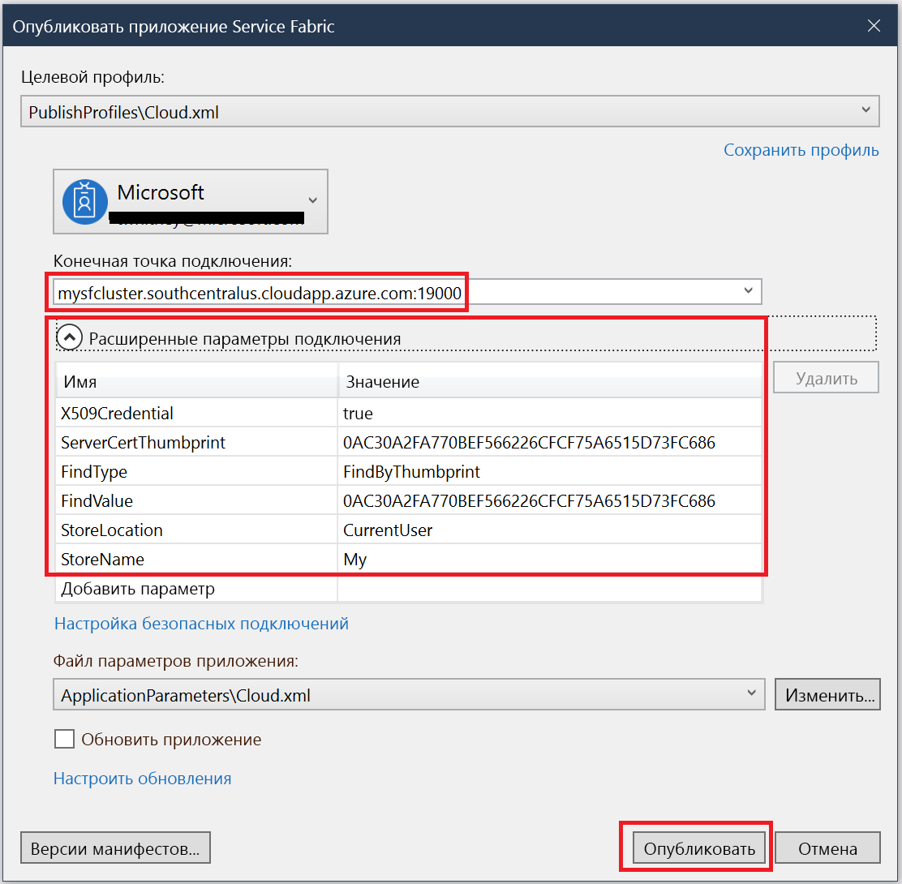

# <a name="tutorial-deploy-an-application-to-a-service-fabric-cluster-in-azure"></a>Руководство по развертыванию приложения в кластере Service Fabric в Azure
Это руководство является вторым из серии руководств. В нем показано, как развернуть приложение Azure Service Fabric в кластере, выполняющемся в Azure.

Во втором руководстве из цикла вы узнаете, как выполнять такие задачи:
> [!div class="checklist"]
> * [Создание приложения .NET Service Fabric](service-fabric-tutorial-create-dotnet-app.md).
> * Развертывание приложения в удаленном кластере.
> * [Настройка непрерывной интеграции и непрерывного развертывания с помощью Visual Studio Team Services](service-fabric-tutorial-deploy-app-with-cicd-vsts.md).
> * [Настройка мониторинга и диагностики приложения](service-fabric-tutorial-monitoring-aspnet.md)

Из этого цикла руководств вы узнаете, как выполнять такие задачи:
> [!div class="checklist"]
> * Развертывание приложения на удаленный кластер с помощью Visual Studio
> * Удаление приложения из кластера с помощью Service Fabric Explorer

## <a name="prerequisites"></a>предварительным требованиям
Перед началом работы с этим руководством выполните следующие действия:
- Если у вас еще нет подписки Azure, создайте [бесплатную учетную запись](https://azure.microsoft.com/free/?WT.mc_id=A261C142F).
- [Установите Visual Studio 2017](https://www.visualstudio.com/), а также рабочие нагрузки **разработка Azure** и **ASP.NET и веб-разработка**.
- [Установка пакета SDK для Service Fabric](service-fabric-get-started.md)

## <a name="download-the-voting-sample-application"></a>Скачивание примера приложения для голосования
Если вы не создавали пример приложения для голосования [в первой части этой серии руководств](service-fabric-tutorial-create-dotnet-app.md), вы можете скачать его. В окне терминала выполните следующую команду, чтобы клонировать репозиторий с примером приложения на локальный компьютер.

```
git clone https://github.com/Azure-Samples/service-fabric-dotnet-quickstart
```

## <a name="set-up-a-party-cluster"></a>Настройка кластера сообщества
Кластеры сообщества — это бесплатные кластеры Service Fabric, которые доступны в течение ограниченного времени. Эти кластеры размещены в Azure и поддерживаются командой Service Fabric. Любой пользователь может развертывать приложения на этих кластерах и знакомиться с платформой. Бесплатно!

Чтобы получить доступ к кластеру сообщества, зайдите на сайт http://aka.ms/tryservicefabric и следуйте инструкциям. Для получения доступа к кластеру сообщества потребуется учетная запись Facebook или GitHub.

При желании можно использовать собственный кластер вместо кластера сообщества.  Веб-интерфейс ASP.NET Core использует обратный прокси-сервер для взаимодействия с серверной частью службы с отслеживанием состояния.  Обратный прокси-сервер включен по умолчанию для кластеров сообщества и кластера локальной разработки.  При развертывании примера приложения для голосования в собственном кластере вам необходимо [включить в кластере обратный прокси-сервер](service-fabric-reverseproxy.md#setup-and-configuration).

> [!NOTE]
> Кластеры сообщества не защищены, поэтому все ваши приложения и данные, размещенные на этих кластерах, могут быть доступны для других пользователей. Не разворачивайте приложения, которые не должны увидеть другие пользователи. Обязательно прочтите условия использования, чтобы получить все необходимые сведения.

Войдите в систему и [присоедините кластер Windows](http://aka.ms/tryservicefabric). Загрузите сертификат PFX на компьютер, щелкнув ссылку **PFX**. Сертификат и значение **конечной точки подключения** будут использоваться в дальнейшем.


На компьютере Windows установите PFX в хранилище сертификатов: *CurrentUser\My*.

```powershell
PS C:\mycertificates> Import-PfxCertificate -FilePath .\party-cluster-873689604-client-cert.pfx -CertStoreLocation Cert:
\CurrentUser\My


  PSParentPath: Microsoft.PowerShell.Security\Certificate::CurrentUser\My

Thumbprint                                Subject
----------                                -------
3B138D84C077C292579BA35E4410634E164075CD  CN=zwin7fh14scd.westus.cloudapp.azure.com
```


## <a name="deploy-the-app-to-the-azure"></a>Развертывание приложения в Azure
Теперь, когда приложение готово, можно развернуть его в кластер сообщества прямо из Visual Studio.

1. Щелкните правой кнопкой мыши **Voting** в обозревателе решений и выберите **Опубликовать**. 

    

2. Скопируйте **конечную точку подключения** со страницы кластера сообщества в поле **Конечная точка подключения**. Например, `zwin7fh14scd.westus.cloudapp.azure.com:19000`. Щелкните **Дополнительные параметры подключения** и укажите следующие сведения.  Значения *FindValue* и *ServerCertThumbprint* должны соответствовать отпечатку сертификата, который установлен на предыдущем шаге. Щелкните **Опубликовать**. 

    После завершения публикации вы сможете отправить запрос к приложению через браузер.

3. Откройте любой браузер и введите адрес кластера (конечную точку подключения без указания порта — например, win1kw5649s.westus.cloudapp.azure.com).

    Вы должны увидеть такой же результат, как и при локальном запуске приложения.

    

## <a name="remove-the-application-from-a-cluster-using-service-fabric-explorer"></a>Удаление приложения из кластера с помощью Service Fabric Explorer
Service Fabric Explorer — графический пользовательский интерфейс для просмотра приложений в кластере Service Fabric и управления ими.

Чтобы удалить приложение из кластера сообщества, сделайте следующее:

1. Перейдите в Service Fabric Explorer, используя соответствующую ссылку на странице регистрации для кластера сообщества. Например, https://win1kw5649s.westus.cloudapp.azure.com:19080/Explorer/index.html.

2. В Service Fabric Explorer перейдите к узлу **fabric:/Voting** в представлении в виде дереве слева.

3. Нажмите кнопку **Действия** в области **Основные действия** справа и выберите **Удалить приложение**. Подтвердите удаление экземпляра приложения. После этого экземпляр нашего приложения, запущенный в кластере, будет удален.


## <a name="remove-the-application-type-from-a-cluster-using-service-fabric-explorer"></a>Удаление типа приложения из кластера с помощью Service Fabric Explorer
Приложения в кластере Service Fabric развертываются по типам приложений. Это позволяет иметь несколько экземпляров и версий приложения в одном и том же кластере. После удаления запущенного экземпляра приложения также можно удалить тип, чтобы завершить очистку.

Дополнительные сведения о моделировании приложений в Service Fabric см. в разделе [Моделирование приложений в Service Fabric](service-fabric-application-model.md).

1. Перейдите к узлу **VotingType** в дереве.

2. Нажмите кнопку **Действия** в области **Основные действия** справа и выберите **Отменить подготовку типа**. Подтвердите отмену подготовки типа приложения.


Это заключительный шаг учебника.

## <a name="next-steps"></a>Дополнительная информация
Из этого руководства вы узнали, как выполнить следующие задачи:

> [!div class="checklist"]
> * Развертывание приложения на удаленный кластер с помощью Visual Studio
> * Удаление приложения из кластера с помощью Service Fabric Explorer

Перейдите к следующему руководству:
> [!div class="nextstepaction"]
> [Настройка непрерывной интеграции с Visual Studio Team Services](service-fabric-tutorial-deploy-app-with-cicd-vsts.md)
