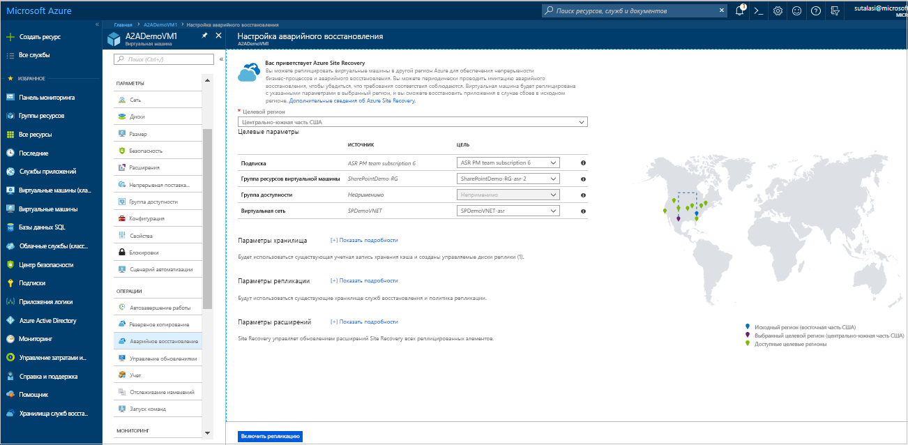
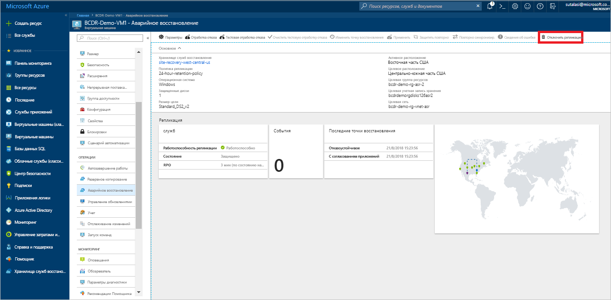

# Репликация виртуальной машины Azure в другой регион Azure

Служба [Azure Site Recovery](site-recovery-overview.md) помогает реализовать стратегию непрерывности бизнес-процессов и аварийного восстановления (BCDR), обеспечивая работоспособность бизнес-приложений во время запланированных и незапланированных простоев. Site Recovery управляет аварийным восстановлением локальных компьютеров и виртуальных машин Azure, включая операции репликации, отработки отказа и восстановления.

В этом кратком руководстве описывается процесс репликации виртуальной машины Azure в другой регион Azure. Репликация из Azure в Azure сейчас доступна в режиме предварительной версии

Если у вас еще нет подписки Azure, [создайте бесплатную учетную запись Azure](https://azure.microsoft.com/free/?WT.mc_id=A261C142F), прежде чем начинать работу.

## Вход в Azure

Войдите на портал Azure по адресу http://portal.azure.com.

## Включение репликации виртуальной машины Azure

1. На портале Azure щелкните **Виртуальные машины**, а затем выберите виртуальную машину, которую требуется реплицировать.

2. В разделе **Параметры** щелкните **Аварийное восстановление**.
3. В разделе **Настройка аварийного восстановления** > **Целевой регион** выберите целевой регион, в который будет выполняться репликация.
4. Для выполнения действий в этом кратком руководстве примите другие значения по умолчанию.
5. Щелкните **Включить репликацию**. Будет запущено задание для включения репликации виртуальной машины.

    

## Проверка параметров

После завершения задания репликации можно проверить состояние репликации, изменить параметры настройки репликации и протестировать развертывание.

1. В меню виртуальной машины щелкните **Аварийное восстановление (предварительная версия)**.
2. Можно проверить работоспособность репликации, созданные точки восстановления и исходный и целевой регионы на карте.

   

## Очистка ресурсов

Репликация виртуальной машины в основном регионе останавливается при отключении репликации:

- Параметры репликации в источнике автоматически очищаются.
- Выставление счетов Site Recovery за виртуальную машину также прекращается.

Остановите репликацию следующим образом.

1. Выберите виртуальную машину.
2. В разделе **Аварийное восстановление** щелкните **Дополнительно**.
3. Щелкните **Отключить репликацию**.

   

## Дополнительная информация

В этом кратком руководстве вы реплицировали виртуальную машину в дополнительный регион.

> [!div class="nextstepaction"]
> [Настройка аварийного восстановления для виртуальных машин Azure](azure-to-azure-tutorial-enable-replication.md)
