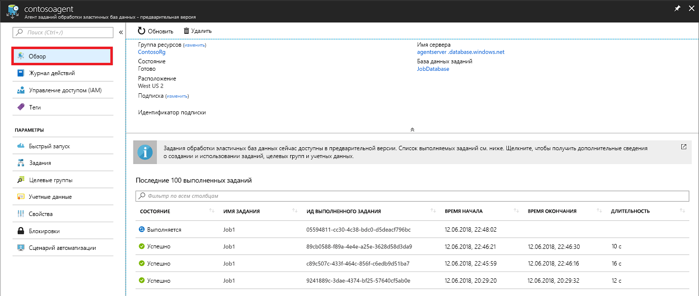

# <a name="create-configure-and-manage-elastic-jobs"></a>Создание, настройка и управление заданиями обработки эластичных баз данных

В этой статье вы узнаете, как создавать, настраивать задания обработки эластичных баз данных и управлять ими. Если вы не использовали задания обработки эластичных баз данных, изучите статью [Automate management tasks using database jobs](sql-database-job-automation-overview.md) (Автоматизация управления задачами с помощью заданий базы данных).

## <a name="create-and-configure-the-agent"></a>Создание и настройка агента

1. Создайте или определите пустую базу данных SQL с уровнем обслуживания S0 или выше. Она будет использоваться в качестве *базы данных задания* при создании агента задания обработки эластичных баз данных.
2. Создайте агент заданий обработки эластичных баз данных на [портале](https://portal.azure.com/#create/Microsoft.SQLElasticJobAgent) или с помощью [PowerShell](elastic-jobs-powershell.md#create-the-elastic-job-agent).

   

## <a name="create-run-and-manage-jobs"></a>Создание, запуск заданий и управление ими

1. Создайте учетные данные для выполнения задания в *базе данных заданий*, используя [PowerShell](elastic-jobs-powershell.md#create-job-credentials-so-that-jobs-can-execute-scripts-on-its-targets) или [T-SQL](elastic-jobs-tsql.md#create-a-credential-for-job-execution).
2. Определите целевую группу (базы данных, в которых вы хотите запустить задание) с помощью [PowerShell](elastic-jobs-powershell.md#define-the-target-databases-you-want-to-run-the-job-against) или [T-SQL](elastic-jobs-tsql.md#create-a-target-group-servers).
3. Создайте учетные данные агента заданий в каждой базе данных, где будет запущено задание [(добавьте пользователя (или роль) в каждую базу данных в группе)](sql-database-control-access.md). Пример см. в [руководстве по PowerShell](elastic-jobs-powershell.md#create-job-credentials-so-that-jobs-can-execute-scripts-on-its-targets).
4. Создайте задание с помощью [PowerShell](elastic-jobs-powershell.md#create-a-job) или [T-SQL](elastic-jobs-tsql.md#deploy-new-schema-to-many-databases).
5. Добавьте шаги задания с помощью [PowerShell](elastic-jobs-powershell.md#create-a-job-step) или [T-SQL](elastic-jobs-tsql.md#deploy-new-schema-to-many-databases).
6. Запустите задание с помощью [PowerShell](elastic-jobs-powershell.md#run-the-job) или [T-SQL](elastic-jobs-tsql.md#begin-ad-hoc-execution-of-a-job).
7. Отслеживайте состояние выполнения задания на портале с использованием [PowerShell](elastic-jobs-powershell.md#monitor-status-of-job-executions) или [T-SQL](elastic-jobs-tsql.md#monitor-job-execution-status).

   

## <a name="credentials-for-running-jobs"></a>Учетные данные для выполнения заданий

Задания используют [учетные данные для базы данных](/sql/t-sql/statements/create-database-scoped-credential-transact-sql), чтобы подключаться к базам данных, указанным целевой группой при выполнении. Если целевая группа содержит серверы или пулы, эти учетные данные с привязкой к базе данных используются для подключения к базе данных master для перечисления доступных баз данных.

Настройка правильных учетных данных для запуска задания может быть немного запутанной, поэтому учитывайте следующие моменты:

- Учетные данные для базы данных должны быть созданы в *базе данных заданий*.
- **Все целевые базы данных должны иметь вход с [достаточными разрешениями](https://docs.microsoft.com/sql/relational-databases/security/permissions-database-engine) для успешного завершения задания** (`jobuser` на диаграмме ниже).
- Учетные данные будут повторно использоваться в заданиях, а пароли учетных данных будут зашифрованы и защищены от пользователей, имеющих доступ только для чтения объектов заданий.

Рассмотрев следующее изображение, вы сможете ознакомиться с правильными учетными данными и настроить их. **Не забудьте создать пользователя в каждой базе данных (все *целевые базы данных пользователя*), где задание должно быть запущено**.


## <a name="security-best-practices"></a>Рекомендации по обеспечению безопасности

Несколько рекомендаций по оптимальной работе с заданиями обработки эластичных баз данных

- Предоставляйте доступ к API-интерфейсам только доверенным лицам.
- Учетные данные должны иметь только те права, которые необходимы для выполнения шагов задания. Дополнительные сведения см. в статье [Авторизация и разрешения в SQL Server](https://docs.microsoft.com/dotnet/framework/data/adonet/sql/authorization-and-permissions-in-sql-server).
- При использовании члена целевой группы сервера или пула настоятельно рекомендуется создать отдельные учетные данные с правами в базе данных master для просмотра или перечисления баз данных, используемых для расширения списков серверов или пулов до выполнения задания.

## <a name="agent-performance-capacity-and-limitations"></a>Производительность, емкость и ограничения агента

В заданиях обработки эластичных баз данных используются минимальные вычислительные ресурсы при ожидании завершения длительных заданий.

В зависимости от размера целевой группы баз данных и требуемого времени выполнения задания (количество одновременных рабочих ролей) агенту требуется разные объемы вычислений и производительности *базы данных заданий* (чем больше целевых объектов и заданий, тем выше требуемый объем вычислений).

Эта предварительная версия ограничена 100 одновременными заданиями.

### <a name="prevent-jobs-from-reducing-target-database-performance"></a>Предотвращение сокращения производительности заданий целевой базы данных

Чтобы ресурсы не перегружались при работе с базами данных в эластичном пуле SQL, задания можно настроить для ограничения количества баз данных, в которых может одновременно работать задание.

Задать количество одновременных баз данных, задание выполняется, установив `sp_add_jobstep` хранимой процедуры `@max_parallelism` параметр в T-SQL, или `Add-AzSqlElasticJobStep -MaxParallelism` в PowerShell.

## <a name="best-practices-for-creating-jobs"></a>Рекомендации по созданию заданий

### <a name="idempotent-scripts"></a>Идемпотентные сценарии
Скрипты задания T-SQL должны быть [идемпотентными](https://en.wikipedia.org/wiki/Idempotence). **Идемпотентный** означает, что, если сценарий выполнился успешно и запустился снова, его результат останется неизменным. Сценарий может завершиться ошибкой из-за временных проблем в сети. В этом случае задание будет автоматически пытаться выполнить сценарий указанное количество раз, после чего попытки будут прекращены. Идемпотентный сценарий дает неизменный результат даже после двух успешных запусков (или более).

Прежде чем создавать объект, рекомендуется сначала проверить, не существует ли он уже.


```sql
IF NOT EXIST (some_object)
    -- Create the object
    -- If it exists, drop the object before recreating it.
```

Аналогичным образом сценарий должен успешно завершаться, выполняя логическую проверку на существование различных условий и их обработку.


## <a name="next-steps"></a>Дальнейшие действия

- [Создание заданий обработки эластичных баз данных и управление ими с помощью PowerShell](elastic-jobs-powershell.md)
- [Use Transact-SQL (T-SQL) to create and manage Elastic Database Jobs](elastic-jobs-tsql.md) (Создание заданий обработки эластичных БД и управление ими с использованием Transact-SQL (T-SQL))
