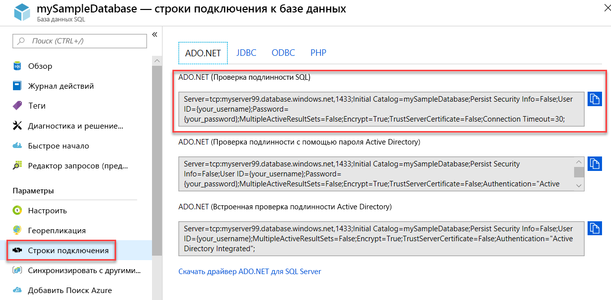

# <a name="quickstart-use-net-core-c-to-query-an-azure-sql-database"></a>Краткое руководство. Использование .NET Core (C#) для создания запросов к базе данных SQL Azure

В этом кратком руководстве показано, как использовать [.NET Core](https://www.microsoft.com/net/) и код C# для подключения к базе данных SQL Azure, а затем выполнить инструкцию Transact-SQL, чтобы запросить данные.

## <a name="prerequisites"></a>Предварительные требования

Для работы с этим руководством необходимы указанные ниже компоненты.

[!INCLUDE [prerequisites-create-db](../../includes/sql-database-connect-query-prerequisites-create-db-includes.md)]

- [Правило брандмауэра на уровне сервера](sql-database-get-started-portal-firewall.md) для общедоступного IP-адреса используемого компьютера.

- Установленный [.NET Core для вашей операционной системы](https://www.microsoft.com/net/core). 

> [!NOTE]
> В этом кратком руководстве используется база данных *mySampleDatabase*. Если вы хотите использовать другую базу данных, необходимо будет изменить ссылки на базы данных и изменить запрос `SELECT` в коде C#.


## <a name="get-sql-server-connection-information"></a>Получение сведений о подключении к SQL Server

[!INCLUDE [prerequisites-server-connection-info](../../includes/sql-database-connect-query-prerequisites-server-connection-info-includes.md)]

#### <a name="get-adonet-connection-information-optional"></a>Получение сведений о подключении к ADO.NET (необязательно)

1. Перейдите на страницу **mySampleDatabase** и в разделе **Параметры** выберите **Строки подключения**.

2. Просмотрите полную строку подключения **ADO.NET**.

    

3. Скопируйте строку подключения **ADO.NET**, если вы планируете использовать ее.
  
## <a name="create-a-new-net-core-project"></a>Создание проекта .NET Core

1. Откройте командную строку и создайте папку с именем **sqltest**. Перейдите в эту папку и выполните команду ниже.

    ```cmd
    dotnet new console
    ```
    Она создает файлы проекта нового приложения, включая первоначальный файл кода C# (**Program.cs**), файл конфигурации XML (**sqltest.csproj**) и необходимые двоичные файлы.

2. В текстовом редакторе откройте **sqltest.csproj** и вставьте следующий XML-код между тегами `<Project>`. В результате `System.Data.SqlClient` добавляется как зависимость.

    ```xml
    <ItemGroup>
        <PackageReference Include="System.Data.SqlClient" Version="4.6.0" />
    </ItemGroup>
    ```

## <a name="insert-code-to-query-sql-database"></a>Вставка кода для отправки запроса к базе данных SQL

1. Откройте файл **Program.cs** в текстовом редакторе.

2. Замените содержимое следующим кодом и добавьте соответствующие значения для сервера, базы данных, имени пользователя и пароля.

> [!NOTE]
> Чтобы использовать строку подключения ADO.NET, замените 4 строки в коде, устанавливающем сервер, базу данных, имя пользователя и пароль, следующей строкой. В строке задайте имя пользователя и пароль.
>
>    `builder.ConnectionString="<your_ado_net_connection_string>";`

```csharp
using System;
using System.Data.SqlClient;
using System.Text;

namespace sqltest
{
    class Program
    {
        static void Main(string[] args)
        {
            try 
            { 
                SqlConnectionStringBuilder builder = new SqlConnectionStringBuilder();

                builder.DataSource = "<your_server.database.windows.net>"; 
                builder.UserID = "<your_username>";            
                builder.Password = "<your_password>";     
                builder.InitialCatalog = "<your_database>";
         
                using (SqlConnection connection = new SqlConnection(builder.ConnectionString))
                {
                    Console.WriteLine("\nQuery data example:");
                    Console.WriteLine("=========================================\n");
                    
                    connection.Open();       
                    StringBuilder sb = new StringBuilder();
                    sb.Append("SELECT TOP 20 pc.Name as CategoryName, p.name as ProductName ");
                    sb.Append("FROM [SalesLT].[ProductCategory] pc ");
                    sb.Append("JOIN [SalesLT].[Product] p ");
                    sb.Append("ON pc.productcategoryid = p.productcategoryid;");
                    String sql = sb.ToString();

                    using (SqlCommand command = new SqlCommand(sql, connection))
                    {
                        using (SqlDataReader reader = command.ExecuteReader())
                        {
                            while (reader.Read())
                            {
                                Console.WriteLine("{0} {1}", reader.GetString(0), reader.GetString(1));
                            }
                        }
                    }                    
                }
            }
            catch (SqlException e)
            {
                Console.WriteLine(e.ToString());
            }
            Console.WriteLine("\nDone. Press enter.");
            Console.ReadLine(); 
        }
    }
}
```

## <a name="run-the-code"></a>Выполнение кода

1. Выполните следующие команды при выводе запроса.

   ```cmd
   dotnet restore
   dotnet run
   ```

2. Убедитесь, что возвращены первые 20 строк.

   ```text
   Query data example:
   =========================================

   Road Frames HL Road Frame - Black, 58
   Road Frames HL Road Frame - Red, 58
   Helmets Sport-100 Helmet, Red
   Helmets Sport-100 Helmet, Black
   Socks Mountain Bike Socks, M
   Socks Mountain Bike Socks, L
   Helmets Sport-100 Helmet, Blue
   Caps AWC Logo Cap
   Jerseys Long-Sleeve Logo Jersey, S
   Jerseys Long-Sleeve Logo Jersey, M
   Jerseys Long-Sleeve Logo Jersey, L
   Jerseys Long-Sleeve Logo Jersey, XL
   Road Frames HL Road Frame - Red, 62
   Road Frames HL Road Frame - Red, 44
   Road Frames HL Road Frame - Red, 48
   Road Frames HL Road Frame - Red, 52
   Road Frames HL Road Frame - Red, 56
   Road Frames LL Road Frame - Black, 58
   Road Frames LL Road Frame - Black, 60
   Road Frames LL Road Frame - Black, 62

   Done. Press enter.
   ```
3. Нажмите клавишу **ВВОД**, чтобы закрыть окно приложения.

## <a name="next-steps"></a>Дополнительная информация

- [Начало работы с .NET Core в Windows, Linux и Mac OS с помощью командной строки](/dotnet/core/tutorials/using-with-xplat-cli).
- Узнайте, как [подключиться и отправить запрос к базе данных SQL Azure с помощью .NET Framework и Visual Studio](sql-database-connect-query-dotnet-visual-studio.md).  
- Узнайте, как [спроектировать первую базу данных SQL Azure с помощью SSMS](sql-database-design-first-database.md) или [спроектировать базу данных SQL Azure и выполнить подключение к C# и ADO.NET](sql-database-design-first-database-csharp.md).
- Дополнительные сведения о .NET см. в [этой документации](https://docs.microsoft.com/dotnet/).
