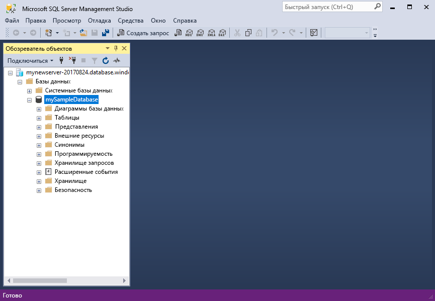

# <a name="quickstart-use-sql-server-management-studio-to-connect-and-query-an-azure-sql-database"></a>Краткое руководство. Подключение к базе данных SQL Azure и создание запросов к ней с помощью SQL Server Management Studio

Из этого краткого руководства вы узнаете, как использовать [SQL Server Management Studio][ssms-install-latest-84g] (SSMS) для подключения к базе данных SQL Azure. А также будете использовать инструкции Transact-SQL для запрашивания, вставки, обновления и удаления данных. Вы можете использовать SSMS для управления любой инфраструктурой SQL — от SQL Server до Базы данных SQL для Microsoft Windows.  

## <a name="prerequisites"></a>Предварительные требования

Для работы с этим учебником необходимы указанные ниже компоненты.

[!INCLUDE [prerequisites-create-db](../../includes/sql-database-connect-query-prerequisites-create-db-includes.md)]

* Настройка правила брандмауэра на уровне сервера. Подробные сведения см. в статье [Краткое руководство. Создание правила брандмауэра на уровне сервера для базы данных SQL с помощью портала Azure](sql-database-get-started-portal-firewall.md).

## <a name="install-the-latest-ssms"></a>Установка последней версии SSMS

Перед началом работы убедитесь, что вы установили последнюю версию [SSMS][ssms-install-latest-84g]. 

## <a name="sql-server-connection-information"></a>Сведения о подключении SQL Server

[!INCLUDE [prerequisites-server-connection-info](../../includes/sql-database-connect-query-prerequisites-server-connection-info-includes.md)]

## <a name="connect-to-your-database"></a>Подключение к базе данных

В SMSS подключитесь к своему серверу Базы данных SQL Azure. 

> [!IMPORTANT]
> Сервер Базы данных SQL Azure прослушивает порт 1433. Чтобы подключиться к серверу Базы данных SQL при включенном корпоративном брандмауэре, необходимо открыть этот порт в брандмауэре.
>

1. Откройте среду SSMS. Отобразится диалоговое окно **Подключение к серверу**.

2. Введите следующие сведения:

   | Параметр      | Рекомендуемое значение    | ОПИСАНИЕ | 
   | ------------ | ------------------ | ----------- | 
   | **Тип сервера** | Ядро СУБД | Обязательное значение. |
   | **Server name** (Имя сервера) | Полное имя сервера | Примерно такое: **mynewserver20170313.database.windows.net**. |
   | **Проверка подлинности** | Проверка подлинности SQL Server | В этом руководстве используется проверка подлинности SQL. |
   | **Имя входа** | Идентификатор пользователя учетной записи администратора сервера | Идентификатор пользователя учетной записи администратора сервера, используемый для создания сервера. |
   | **Пароль** | Пароль для учетной записи администратора сервера | Пароль учетной записи администратора сервера, используемый для создания сервера. |
   ||||

     

3. Выберите **Параметры** в диалоговом окне **Подключение к серверу**. В раскрывающемся меню **Подключение к базе данных** выберите **mySampleDatabase**.

     

4. Нажмите кнопку **Подключиться**. После этого откроется окно обозревателя объектов. 

5. Чтобы просмотреть объекты базы данных, разверните узел **Базы данных**, а затем — **mySampleDatabase**.

     

## <a name="query-data"></a>Запрос данных

Запустите следующий код Transact-SQL [SELECT](https://msdn.microsoft.com/library/ms189499.aspx), чтобы запросить за категорией 20 основных продуктов.

1. В обозревателе объектов щелкните правой кнопкой мыши **mySampleDatabase** и выберите **Новый запрос**. После этого откроется новое окно запроса, подключенное к базе данных.

2. В окне запроса вставьте следующий SQL-запрос.

   ```sql
   SELECT pc.Name as CategoryName, p.name as ProductName
   FROM [SalesLT].[ProductCategory] pc
   JOIN [SalesLT].[Product] p
   ON pc.productcategoryid = p.productcategoryid;
   ```

3. На панели инструментов выберите **Выполнить**, чтобы извлечь данные из таблиц `Product` и `ProductCategory`.

    

## <a name="insert-data"></a>Добавление данных

Запустите следующий код Transact-SQL [INSERT](https://msdn.microsoft.com/library/ms174335.aspx), чтобы добавить новый продукт в таблицу `SalesLT.Product`.

1. Замените предыдущий запрос следующим содержимым.

   ```sql
   INSERT INTO [SalesLT].[Product]
           ( [Name]
           , [ProductNumber]
           , [Color]
           , [ProductCategoryID]
           , [StandardCost]
           , [ListPrice]
           , [SellStartDate] )
     VALUES
           ('myNewProduct'
           ,123456789
           ,'NewColor'
           ,1
           ,100
           ,100
           ,GETDATE() );
   ```

2. Щелкните **Выполнить**, чтобы вставить новую строку в таблицу `Product`. В области **Сообщения** отображается текст: **(1 затронутая строка)**

## <a name="view-the-result"></a>Просмотр результата

1. Замените предыдущий запрос следующим содержимым.

   ```sql
   SELECT * FROM [SalesLT].[Product] 
   WHERE Name='myNewProduct' 

2. Select **Execute**. The following result appears. 

   

 
## Update data

Run this [UPDATE](https://msdn.microsoft.com/library/ms177523.aspx) Transact-SQL code to modify your new product.

1. Replace the previous query with this one.

   ```sql
   UPDATE [SalesLT].[Product]
   SET [ListPrice] = 125
   WHERE Name = 'myNewProduct';
   ```

2. Щелкните **Выполнить**, чтобы обновить указанную строку в таблице `Product`. В области **Сообщения** отображается текст: **(1 затронутая строка)**

## <a name="delete-data"></a>Удаление данных

Запустите код Transact-SQL [DELETE](https://msdn.microsoft.com/library/ms189835.aspx), чтобы удалить новый продукт.

1. Замените предыдущий запрос следующим содержимым.

   ```sql
   DELETE FROM [SalesLT].[Product]
   WHERE Name = 'myNewProduct';
   ```

2. Щелкните **Выполнить**, чтобы удалить указанную строку в таблице `Product`. В области **Сообщения** отображается текст: **(1 затронутая строка)**

## <a name="next-steps"></a>Дополнительная информация

- Дополнительные сведения об использовании SSMS см. в [этой статье](https://msdn.microsoft.com/library/ms174173.aspx).
- Чтобы подключиться и выполнять запросы при помощи портала Azure, прочитайте статью [Портал Azure. Использование редактора SQL-запросов для подключения к данным и их запроса](sql-database-connect-query-portal.md).
- См. дополнительные сведения о [подключении и создании запросов с помощью Visual Studio Code](sql-database-connect-query-vscode.md).
- См. дополнительные сведения о [подключении и создании запросов с помощью .NET](sql-database-connect-query-dotnet.md).
- См. дополнительные сведения о [подключении и создании запросов с помощью PHP](sql-database-connect-query-php.md).
- См. дополнительные сведения о [подключении и создании запросов с помощью Node.js](sql-database-connect-query-nodejs.md).
- См. дополнительные сведения о [подключении и создании запросов с помощью Java](sql-database-connect-query-java.md).
- См. дополнительные сведения о [подключении и создании запросов с помощью Python](sql-database-connect-query-python.md).
- См. дополнительные сведения о [подключении и создании запросов с помощью Ruby](sql-database-connect-query-ruby.md).


<!-- Article link references. -->

[ssms-install-latest-84g]: https://docs.microsoft.com/sql/ssms/sql-server-management-studio-ssms

