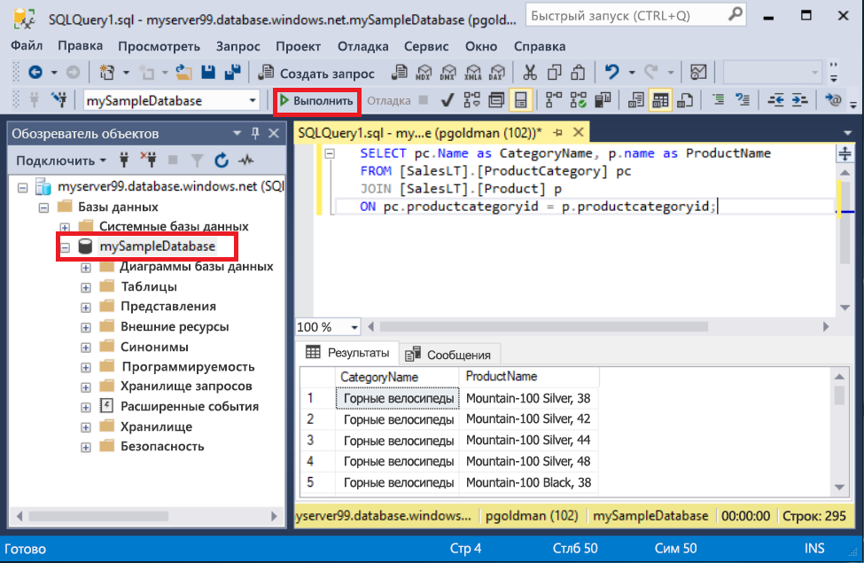
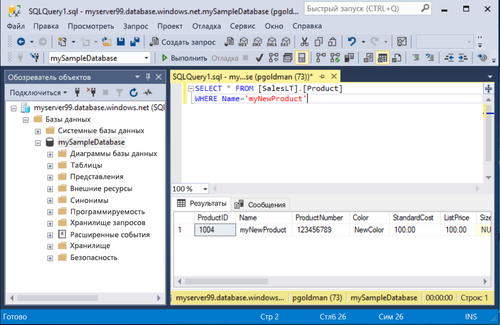

# <a name="quickstart-use-sql-server-management-studio-to-connect-and-query-an-azure-sql-database"></a>Краткое руководство. Подключение к базе данных SQL Azure и создание запросов к ней с помощью SQL Server Management Studio

Из этого краткого руководства вы узнаете, как использовать [SQL Server Management Studio][ssms-install-latest-84g] (SSMS) для подключения к базе данных SQL Azure. А также будете использовать инструкции Transact-SQL для запрашивания, вставки, обновления и удаления данных. Вы можете использовать SSMS для управления любой инфраструктурой SQL — от SQL Server до Базы данных SQL для Microsoft Windows.  

## <a name="prerequisites"></a>Предварительные требования

- База данных SQL Azure. Для создания и настройки базы данных в службе "База данных SQL Azure" можно использовать одно из этих кратких руководств.

  || Отдельная база данных | Управляемый экземпляр |
  |:--- |:--- |:---|
  | Создание| [Портал](sql-database-single-database-get-started.md) | [Портал](sql-database-managed-instance-get-started.md) |
  || [ИНТЕРФЕЙС КОМАНДНОЙ СТРОКИ](scripts/sql-database-create-and-configure-database-cli.md) | [ИНТЕРФЕЙС КОМАНДНОЙ СТРОКИ](https://medium.com/azure-sqldb-managed-instance/working-with-sql-managed-instance-using-azure-cli-611795fe0b44) |
  || [PowerShell](scripts/sql-database-create-and-configure-database-powershell.md) | [PowerShell](scripts/sql-database-create-configure-managed-instance-powershell.md) |
  | Настройка | [Правило брандмауэра IP-адресов на уровне сервера](sql-database-server-level-firewall-rule.md)| [Подключение из виртуальной машины](sql-database-managed-instance-configure-vm.md)|
  |||[Подключение "точка — сеть"](sql-database-managed-instance-configure-p2s.md)
  |Загрузка данных|База данных Adventure Works, загруженная для краткого руководства|[Восстановление базы данных Wide World Importers](sql-database-managed-instance-get-started-restore.md)
  |||Восстановление или импорт Adventure Works из файла [BACPAC](sql-database-import.md), размещенного на [GitHub](https://github.com/Microsoft/sql-server-samples/tree/master/samples/databases/adventure-works)|
  |||

  > [!IMPORTANT]
  > Скрипты в этой статье предназначены для использования базы данных Adventure Works. Используя управляемый экземпляр, необходимо импортировать базу данных Adventure Works в базу данных экземпляра или изменить скрипты в этой статье для использования базы данных Wide World Importers.

## <a name="install-the-latest-ssms"></a>Установка последней версии SSMS

Перед началом работы убедитесь, что вы установили последнюю версию [SSMS][ssms-install-latest-84g].

## <a name="get-sql-server-connection-information"></a>Получение сведений о подключении к SQL Server

Получите сведения, необходимые для подключения к базе данных SQL Azure. Для дальнейших действий вам понадобится полное имя сервера или имя узла, имя базы данных и данные для входа.

1. Войдите на [портале Azure](https://portal.azure.com/).

2. Перейдите на страницу **Базы данных SQL** или **Управляемые экземпляры SQL**.

3. На странице **Обзор** просмотрите полное имя сервера рядом с полем **Имя сервера** для отдельной базы данных или полное имя сервера рядом с полем **Узел** для управляемого экземпляра. Чтобы скопировать имя сервера или имя узла, наведите на него указатель мыши и щелкните значок **копирования**.

## <a name="connect-to-your-database"></a>Подключение к базе данных

В SMSS подключитесь к своему серверу Базы данных SQL Azure.

> [!IMPORTANT]
> Сервер Базы данных SQL Azure прослушивает порт 1433. Чтобы подключиться к серверу Базы данных SQL при включенном корпоративном брандмауэре, необходимо открыть этот порт в брандмауэре.
>

1. Откройте среду SSMS. Отобразится диалоговое окно **Подключение к серверу**.

2. Введите следующие сведения:

   | Параметр      | Рекомендуемое значение    | ОПИСАНИЕ |
   | ------------ | ------------------ | ----------- |
   | **Тип сервера** | Ядро СУБД | Обязательное значение. |
   | **Server name** (Имя сервера) | Полное имя сервера | Примерно такое: **mynewserver20170313.database.windows.net**. |
   | **Проверка подлинности** | Проверка подлинности SQL Server | В этом руководстве используется проверка подлинности SQL. |
   | **Имя входа** | Идентификатор пользователя учетной записи администратора сервера | Идентификатор пользователя учетной записи администратора сервера, используемый для создания сервера. |
   | **Пароль** | Пароль для учетной записи администратора сервера | Пароль учетной записи администратора сервера, используемый для создания сервера. |
   ||||

     

3. Выберите **Параметры** в диалоговом окне **Подключение к серверу**. В раскрывающемся меню **Подключение к базе данных** выберите **mySampleDatabase**.

     

4. Нажмите кнопку **Подключиться**. После этого откроется окно обозревателя объектов.

5. Чтобы просмотреть объекты базы данных, разверните узел **Базы данных**, а затем — **mySampleDatabase**.

     

## <a name="query-data"></a>Запрос данных

Запустите следующий код Transact-SQL [SELECT](https://msdn.microsoft.com/library/ms189499.aspx), чтобы запросить за категорией 20 основных продуктов.

1. В обозревателе объектов щелкните правой кнопкой мыши **mySampleDatabase** и выберите **Новый запрос**. После этого откроется новое окно запроса, подключенное к базе данных.

2. В окне запроса вставьте следующий SQL-запрос.

   ```sql
   SELECT pc.Name as CategoryName, p.name as ProductName
   FROM [SalesLT].[ProductCategory] pc
   JOIN [SalesLT].[Product] p
   ON pc.productcategoryid = p.productcategoryid;
   ```

3. На панели инструментов выберите **Выполнить**, чтобы извлечь данные из таблиц `Product` и `ProductCategory`.

    

## <a name="insert-data"></a>Добавление данных

Запустите следующий код Transact-SQL [INSERT](https://msdn.microsoft.com/library/ms174335.aspx), чтобы добавить новый продукт в таблицу `SalesLT.Product`.

1. Замените предыдущий запрос следующим содержимым.

   ```sql
   INSERT INTO [SalesLT].[Product]
           ( [Name]
           , [ProductNumber]
           , [Color]
           , [ProductCategoryID]
           , [StandardCost]
           , [ListPrice]
           , [SellStartDate] )
     VALUES
           ('myNewProduct'
           ,123456789
           ,'NewColor'
           ,1
           ,100
           ,100
           ,GETDATE() );
   ```

2. Щелкните **Выполнить**, чтобы вставить новую строку в таблицу `Product`. В области **Сообщения** отображается текст: **(1 затронутая строка)**

## <a name="view-the-result"></a>Просмотр результата

1. Замените предыдущий запрос следующим содержимым.

   ```sql
   SELECT * FROM [SalesLT].[Product]
   WHERE Name='myNewProduct'
   ```

2. Нажмите кнопку **Выполнить**. Отобразится такой результат.

   

## <a name="update-data"></a>Обновление данных

Запустите код Transact-SQL [UPDATE](https://msdn.microsoft.com/library/ms177523.aspx), чтобы обновить новый продукт.

1. Замените предыдущий запрос следующим содержимым.

   ```sql
   UPDATE [SalesLT].[Product]
   SET [ListPrice] = 125
   WHERE Name = 'myNewProduct';
   ```

2. Щелкните **Выполнить**, чтобы обновить указанную строку в таблице `Product`. В области **Сообщения** отображается текст: **(1 затронутая строка)**

## <a name="delete-data"></a>Удаление данных

Запустите код Transact-SQL [DELETE](https://msdn.microsoft.com/library/ms189835.aspx), чтобы удалить новый продукт.

1. Замените предыдущий запрос следующим содержимым.

   ```sql
   DELETE FROM [SalesLT].[Product]
   WHERE Name = 'myNewProduct';
   ```

2. Щелкните **Выполнить**, чтобы удалить указанную строку в таблице `Product`. В области **Сообщения** отображается текст: **(1 затронутая строка)**

## <a name="next-steps"></a>Дополнительная информация

- Дополнительные сведения об использовании SSMS см. в [этой статье](https://msdn.microsoft.com/library/ms174173.aspx).
- Чтобы подключиться и выполнять запросы при помощи портала Azure, прочитайте статью [Портал Azure. Использование редактора SQL-запросов для подключения к данным и их запроса](sql-database-connect-query-portal.md).
- См. дополнительные сведения о [подключении и создании запросов с помощью Visual Studio Code](sql-database-connect-query-vscode.md).
- См. дополнительные сведения о [подключении и создании запросов с помощью .NET](sql-database-connect-query-dotnet.md).
- См. дополнительные сведения о [подключении и создании запросов с помощью PHP](sql-database-connect-query-php.md).
- См. дополнительные сведения о [подключении и создании запросов с помощью Node.js](sql-database-connect-query-nodejs.md).
- См. дополнительные сведения о [подключении и создании запросов с помощью Java](sql-database-connect-query-java.md).
- См. дополнительные сведения о [подключении и создании запросов с помощью Python](sql-database-connect-query-python.md).
- См. дополнительные сведения о [подключении и создании запросов с помощью Ruby](sql-database-connect-query-ruby.md).

<!-- Article link references. -->

[ssms-install-latest-84g]: https://docs.microsoft.com/sql/ssms/sql-server-management-studio-ssms