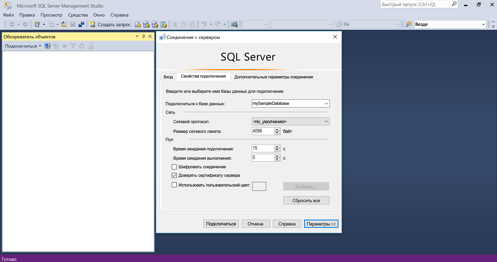

# <a name="quickstart-azure-sql-database-use-sql-server-management-studio-to-connect-and-query-data"></a>Краткое руководство. База данных SQL Azure: подключение к базе данных Azure SQL и создание запросов к ней с помощью SQL Server Management Studio

[SQL Server Management Studio][ssms-install-latest-84g] (SSMS) — это интегрированная среда для управления любой инфраструктурой SQL, от SQL Server до базы данных SQL для Microsoft Windows. В этом кратком руководстве показано, как использовать SSMS для подключения к базе данных Azure SQL, а затем с помощью инструкций Transact-SQL выполнить запрос, вставку, обновление и удаление данных в базе данных. 

## <a name="prerequisites"></a>Предварительные требования

Начальной точкой в руководстве являются ресурсы, созданные в одном из этих кратких руководств:

[!INCLUDE [prerequisites-create-db](../../includes/sql-database-connect-query-prerequisites-create-db-includes.md)]

Это руководство также предусматривает настройку правила брандмауэра на уровне сервера. Краткое руководство, в котором показано, как это сделать, см. в разделе [Правило брандмауэра для логического сервера](sql-database-get-started-portal-firewall.md).

#### <a name="install-the-latest-ssms"></a>Установка последней версии SSMS

Перед началом работы установите последнюю версию [SSMS][ssms-install-latest-84g]. 

## <a name="sql-server-connection-information"></a>Сведения о подключении SQL Server

[!INCLUDE [prerequisites-server-connection-info](../../includes/sql-database-connect-query-prerequisites-server-connection-info-includes.md)]

## <a name="connect-to-your-database"></a>Подключение к базе данных

Используйте SQL Server Management Studio для подключения к серверу базы данных SQL Azure. 

> [!IMPORTANT]
> Логический сервер базы данных SQL Azure прослушивает порт 1433. Чтобы подключиться к логическому серверу базы данных SQL Azure из среды, ограничиваемой корпоративным брандмауэром, этот порт должен быть открыт в брандмауэре.
>

1. Откройте среду SQL Server Management Studio.

2. В диалоговом окне **Подключение к серверу** введите следующие значения.

   | Параметр      | Рекомендуемое значение    | ОПИСАНИЕ | 
   | ------------ | ------------------ | ----------- | 
   | **Тип сервера** | Ядро СУБД | Это обязательное значение. |
   | **Server name** (Имя сервера) | Полное имя сервера | Имя должно быть примерно таким: **mynewserver20170313.database.windows.net**. |
   | **Аутентификация** | Проверка подлинности SQL Server | В рамках работы с этим руководством мы настроили только один тип проверки подлинности — проверку подлинности SQL. |
   | **Имя входа** | Учетная запись администратора сервера | Это учетная запись, указанная при создании сервера. |
   | **Пароль** | Пароль учетной записи администратора сервера | Это пароль, указанный при создании сервера. |
   ||||

     

3. Щелкните **Параметры** в диалоговом окне **Подключение к серверу**. В разделе **Подключение к базе данных** введите **mySampleDatabase**, чтобы подключиться к этой базе данных.

     

4. Щелкните **Подключить**. Откроется окно обозревателя объектов в SSMS. 

     

5. В обозревателе объектов разверните **базы данных**, затем выберите **mySampleDatabase**, чтобы просмотреть объекты в образце базы данных.

## <a name="query-data"></a>Запрос данных

Используйте следующий код, чтобы запросить 20 основных продуктов из категории с помощью инструкции [SELECT](https://msdn.microsoft.com/library/ms189499.aspx) Transact-SQL.

1. В обозревателе объектов щелкните правой кнопкой мыши **mySampleDatabase** и выберите пункт **Новый запрос**. Откроется пустое окно запроса, подключенное к базе данных.
2. В окне запроса введите следующее:

   ```sql
   SELECT pc.Name as CategoryName, p.name as ProductName
   FROM [SalesLT].[ProductCategory] pc
   JOIN [SalesLT].[Product] p
   ON pc.productcategoryid = p.productcategoryid;
   ```

3. На панели инструментов щелкните **Выполнить**, чтобы получить данные из таблиц Product и ProductCategory.

    

## <a name="insert-data"></a>Добавление данных

Используйте указанный ниже код, чтобы вставить новый продукт в таблицу SalesLT.Product с помощью инструкции [INSERT](https://msdn.microsoft.com/library/ms174335.aspx) Transact-SQL.

1. В окне запроса замените предыдущий запрос следующим содержимым:

   ```sql
   INSERT INTO [SalesLT].[Product]
           ( [Name]
           , [ProductNumber]
           , [Color]
           , [ProductCategoryID]
           , [StandardCost]
           , [ListPrice]
           , [SellStartDate]
           )
     VALUES
           ('myNewProduct'
           ,123456789
           ,'NewColor'
           ,1
           ,100
           ,100
           ,GETDATE() );
   ```

2. На панели инструментов щелкните **Выполнить**, чтобы вставить новую строку в таблице Product.

    

## <a name="update-data"></a>Обновление данных

Используйте следующий код, чтобы обновить новый продукт, добавленный ранее, с помощью инструкции [UPDATE](https://msdn.microsoft.com/library/ms177523.aspx) Transact-SQL.

1. В окне запроса замените предыдущий запрос следующим содержимым:

   ```sql
   UPDATE [SalesLT].[Product]
   SET [ListPrice] = 125
   WHERE Name = 'myNewProduct';
   ```

2. На панели инструментов щелкните **Выполнить**, чтобы обновить указанную строку в таблице Product.

    

## <a name="delete-data"></a>Удаление данных

Используйте следующий код, чтобы удалить новый продукт, добавленный ранее, с помощью инструкции [DELETE](https://msdn.microsoft.com/library/ms189835.aspx) Transact-SQL.

1. В окне запроса замените предыдущий запрос следующим содержимым:

   ```sql
   DELETE FROM [SalesLT].[Product]
   WHERE Name = 'myNewProduct';
   ```

2. На панели инструментов щелкните **Выполнить**, чтобы удалить указанную строку из таблицы Product.

    

## <a name="next-steps"></a>Дополнительная информация

- Дополнительные сведения о решении SSMS см. в статье об [использовании SQL Server Management Studio](https://msdn.microsoft.com/library/ms174173.aspx).
- Чтобы подключиться и выполнять запросы при помощи портала Azure, прочитайте статью [Портал Azure. Использование редактора SQL-запросов для подключения к данным и их запроса](sql-database-connect-query-portal.md).
- См. дополнительные сведения о [подключении и создании запросов с помощью Visual Studio Code](sql-database-connect-query-vscode.md).
- См. дополнительные сведения о [подключении и создании запросов с помощью .NET](sql-database-connect-query-dotnet.md).
- См. дополнительные сведения о [подключении и создании запросов с помощью PHP](sql-database-connect-query-php.md).
- См. дополнительные сведения о [подключении и создании запросов с помощью Node.js](sql-database-connect-query-nodejs.md).
- См. дополнительные сведения о [подключении и создании запросов с помощью Java](sql-database-connect-query-java.md).
- См. дополнительные сведения о [подключении и создании запросов с помощью Python](sql-database-connect-query-python.md).
- См. дополнительные сведения о [подключении и создании запросов с помощью Ruby](sql-database-connect-query-ruby.md).


<!-- Article link references. -->

[ssms-install-latest-84g]: https://docs.microsoft.com/sql/ssms/sql-server-management-studio-ssms

