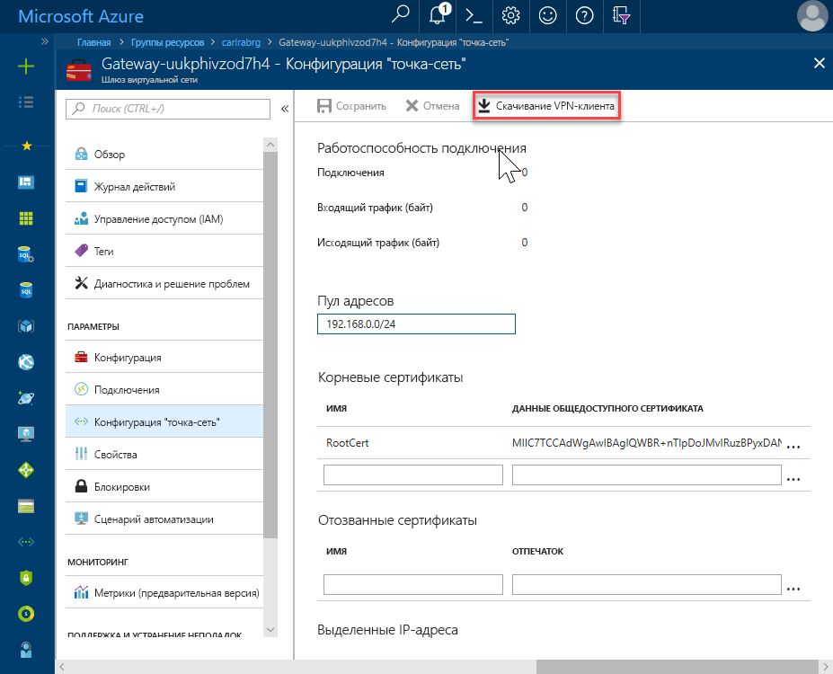
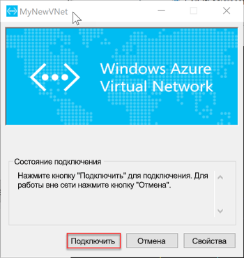

# <a name="quickstart-configure-a-point-to-site-connection-to-an-azure-sql-database-managed-instance-from-on-premises"></a>Краткое руководство. Настройка соединения "точка-сайт" с помощью управляемого экземпляра базы данных Azure SQL Database

В этом кратком руководстве показано, как подключиться к Управляемому экземпляру Базы данных SQL Azure в [SQL Server Management Studio](https://docs.microsoft.com/sql/ssms/sql-server-management-studio-ssms) (SSMS) с локального клиентского компьютера через подключение "точка — сеть". См. сведения о [подключениях "точка — сеть"](../vpn-gateway/point-to-site-about.md).

## <a name="prerequisites"></a>Предварительные требования

В этом кратком руководстве:

- В качестве начальной точки используются ресурсы, созданные в руководстве по [созданию управляемого экземпляра](sql-database-managed-instance-get-started.md).
- На локальном клиентском компьютере требуется PowerShell 5.1 и Azure PowerShell 5.4.2 или более поздней версии. При необходимости ознакомьтесь с инструкциями по [установке модуля PowerShell для Azure](https://docs.microsoft.com/powershell/azure/install-azurerm-ps?view=azurermps-6.13.0#install-the-azure-powershell-module).
- На локальном клиентском компьютере требуется последняя версия [SQL Server Management Studio](https://docs.microsoft.com/sql/ssms/sql-server-management-studio-ssms) (SSMS).

## <a name="attach-a-vpn-gateway-to-your-managed-instance-virtual-network"></a>Подключение VPN-шлюза к виртуальной сети Управляемого экземпляра

1. Откройте PowerShell на локальном клиентском компьютере.
2. Скопируйте этот сценарий PowerShell. Этот сценарий подключает VPN-шлюз к виртуальной сети Управляемого экземпляра, созданной в кратком руководстве [Создание Управляемого экземпляра SQL Azure](sql-database-managed-instance-get-started.md). Скрипт выполняет следующее:

   - Создает и устанавливает сертификаты на клиентском компьютере.
   - Вычисляет будущий диапазон IP-адресов подсети VPN-шлюза.
   - Создает подсеть шлюза.
   - Развертывает шаблон Azure Resource Manager, который присоединяет VPN-шлюз к подсети VPN.

     ```powershell
     $scriptUrlBase = 'https://raw.githubusercontent.com/Microsoft/sql-server-samples/master/samples/manage/azure-sql-db-managed-instance/attach-vpn-gateway'

     $parameters = @{
       subscriptionId = '<subscriptionId>'
       resourceGroupName = '<resourceGroupName>'
       virtualNetworkName = '<virtualNetworkName>'
       certificateNamePrefix  = '<certificateNamePrefix>'
       }

     Invoke-Command -ScriptBlock ([Scriptblock]::Create((iwr ($scriptUrlBase+'/attachVPNGateway.ps1?t='+ [DateTime]::Now.Ticks)).Content)) -ArgumentList $parameters, $scriptUrlBase
     ```

3. Вставьте сценарий в окне PowerShell и укажите необходимые параметры. Значения для `<subscriptionId>`, `<resourceGroup>` и `<virtualNetworkName>` должны соответствовать тем, которые используются в кратком руководстве по [созданию управляемого экземпляра SQL Azure](sql-database-managed-instance-get-started.md). В качестве значения для `<certificateNamePrefix>` можно указать строку на ваш выбор.

4. Выполните следующий сценарий PowerShell.

## <a name="create-a-vpn-connection-to-your-managed-instance"></a>Создание VPN-подключения к Управляемому экземпляру

1. Войдите на [портале Azure](https://portal.azure.com/).
2. Откройте группу ресурсов, в которой вы создали шлюз виртуальной сети, а затем откройте ресурс шлюза виртуальной сети.
3. Щелкните **Конфигурация "точка — сеть"**, а затем — **Скачивание VPN-клиента**.

      
4. На локальном клиентском компьютере извлеките файлы из ZIP-файла, а затем откройте извлеченную папку.
5. Откройте папку WindowsAmd64, а затем файл **VpnClientSetupAmd64.exe**.
6. Если появится сообщение **Windows protected your PC** (Система Windows защитила ваш компьютер), щелкните **Дополнительно**, а затем **Выполнить в любом случае**.

    \
7. Чтобы продолжить, выберите **Да** в диалоговом окне контроля учетных записей.
8. В диалоговом окне с указанием на вашу виртуальную сеть выберите **Да** для установки VPN-клиента.

## <a name="connect-to-the-vpn-connection"></a>Установка соединения с VPN-подключением

1. Перейдите к VPN-подключениям на локальном клиентском компьютере и выберите виртуальную сеть управляемого экземпляра для подключения к этой виртуальной сети. На следующем рисунке такая виртуальная сеть называется **MyNewVNet**.

      
2. Нажмите кнопку **Подключиться**.
3. В диалоговом окне выберите **Подключиться**.

      
4. При появлении запроса о том, что диспетчеру подключений требуется более высокий уровень привилегий, чтобы обновить таблицу маршрутов, выберите **Продолжить**.
5. Чтобы продолжить, выберите **Да** в диалоговом окне контроля учетных записей.

   Вы установили VPN-подключение к виртуальной сети управляемого экземпляра.

      


## <a name="use-ssms-to-connect-to-the-managed-instance"></a>Подключение к Управляемому экземпляру с использованием SSMS

1. На локальном клиентском компьютере откройте SQL Server Management Studio (SSMS).
2. В диалоговом окне **Подключение к серверу** в поле **Имя сервера** введите полное **имя узла** для Управляемого экземпляра. 
1. Выберите **Проверка подлинности SQL Server**, укажите имя пользователя и пароль, а затем нажмите кнопку **Подключиться**.

      

После подключения можно будет просматривать системные и пользовательские базы данных в узле "Базы данных". Также можно просматривать различные объекты в узлах безопасности, серверных объектов, репликации, управления, агента SQL Server и XEvent Profiler.

## <a name="next-steps"></a>Дополнительная информация

- Краткое руководство по подключению с виртуальной машины Azure см. в статье о [настройке подключения "точка — сеть"](sql-database-managed-instance-configure-p2s.md).
- Обзор вариантов подключения для приложений см. в статье [Подключение приложения к Управляемому экземпляру Базы данных SQL](sql-database-managed-instance-connect-app.md).
- Чтобы восстановить имеющуюся базу данных SQL Server из локальной среды в управляемом экземпляре, можно использовать [Azure Database Migration Service для миграции](../dms/tutorial-sql-server-to-managed-instance.md) или [команду T-SQL RESTORE](sql-database-managed-instance-get-started-restore.md) для восстановления из файла резервной копии базы данных.
