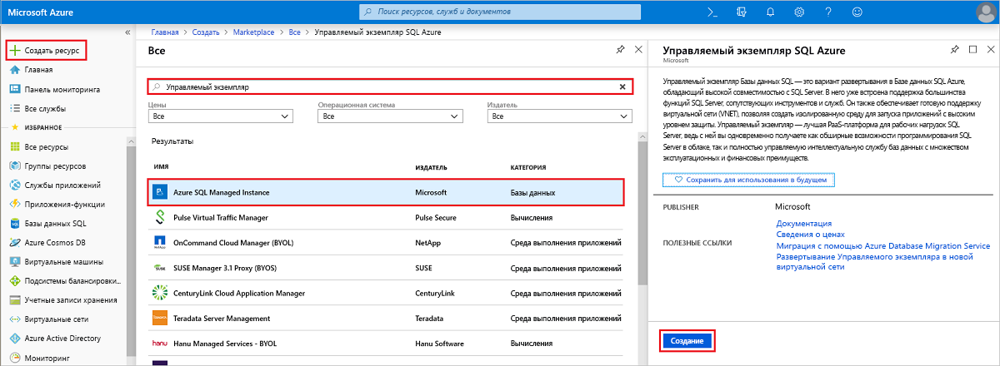
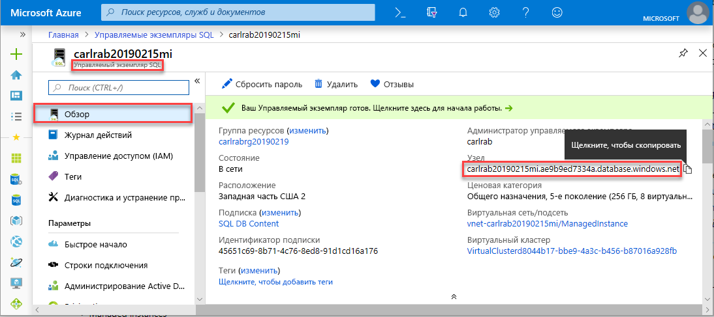

# Краткое руководство. Создание Управляемого экземпляра Базы данных SQL Azure

В этом кратком руководстве описано создание [Управляемого экземпляра](sql-database-managed-instance.md) Базы данных SQL Azure на портале Azure. 

Если у вас еще нет подписки Azure, создайте [бесплатную](https://azure.microsoft.com/free/) учетную запись Azure, прежде чем начинать работу.

## Вход на портал Azure

Войдите на [портале Azure](https://portal.azure.com/).

## Создание управляемого экземпляра

Ниже показано, как создать Управляемый экземпляр.

1. Щелкните **Создать ресурс** в верхнем левом углу окна портала Azure.
2. Найдите **Управляемый экземпляр**, а затем выберите **Управляемый экземпляр SQL Azure** .
3. Нажмите кнопку **Создать**.

   

4. Укажите запрошенные сведения в форме управляемого экземпляра, используя данные в таблице ниже.

   | Параметр| Рекомендуемое значение | Описание |
   | ------ | --------------- | ----------- |
   | **Подписка** | Ваша подписка | Подписка, в которой есть разрешение на создание ресурсов |
   |**Имя управляемого экземпляра**|Любое допустимое имя|Сведения о допустимых именах см. в статье [Соглашения об именовании](https://docs.microsoft.com/azure/architecture/best-practices/naming-conventions).|
   |**Имя для входа администратора управляемого экземпляра**|Любое допустимое имя пользователя|Сведения о допустимых именах см. в статье [Соглашения об именовании](https://docs.microsoft.com/azure/architecture/best-practices/naming-conventions). Не используйте serveradmin. Это имя зарезервировано для роли уровня сервера.| 
   |**Пароль**|Любой допустимый пароль|Пароль должен включать минимум 16 символов и соответствовать [определенным требованиям к сложности](../virtual-machines/windows/faq.md#what-are-the-password-requirements-when-creating-a-vm).|
   |**Группа ресурсов**|Новая или существующая группа ресурсов|Допустимые имена групп ресурсов см. в статье о [правилах и ограничениях именования](https://docs.microsoft.com/azure/architecture/best-practices/naming-conventions).|
   |**Местоположение.**|Расположение, в котором хотите создать Управляемый экземпляр|Дополнительные сведения о регионах Azure см. [здесь](https://azure.microsoft.com/regions/).|
   |**Виртуальная сеть**|Выберите **Создать новую виртуальную сеть** или виртуальную сеть, созданную ранее в группе ресурсов, которая уже использовалась в этой форме| Чтобы настроить виртуальную сеть для Управляемого экземпляра с пользовательскими параметрами, см.раздел [Configure SQL Managed Instance virtual network environment template](https://github.com/Azure/azure-quickstart-templates/tree/master/101-sql-managed-instance-azure-environment) (Настройка шаблона среды виртуальной сети Управляемого экземпляра SQL) в Github. Дополнительные сведения о требованиях к настройке сетевой среды для Управляемого экземпляра см. в разделе [Настройка виртуальной сети для Управляемого экземпляра Базы данных SQL Azure](sql-database-managed-instance-vnet-configuration.md) |

   

5. Щелкните поле **Ценовая категория**, чтобы выбрать размер вычислительных ресурсов и ресурсов хранения, а также просмотреть варианты ценовой категории. Ценовая категория общего назначения с 32 ГБ памяти и 16 виртуальными ядрами — значение по умолчанию.
6. Укажите нужный объем хранилища и количество виртуальных ядер, используя ползунки или текстовые поля. 
7. По завершении нажмите кнопку **Применить** для сохранения выбранных параметров.  
8. Нажмите кнопку **Создать**, чтобы развернуть управляемый экземпляр.
9. Щелкните значок **уведомлений**, чтобы просмотреть состояние развертывания.

    

10. Щелкните **Deployment in progress** (Развертывание в процессе выполнения), чтобы открыть окно управляемого экземпляра для дальнейшего мониторинга хода выполнения развертывания. 

> [!IMPORTANT]
> Первый экземпляр в подсети обычно развертывается намного дольше, чем последующие экземпляры. Не стоит из-за этого отменять развертывание, Создание второго Управляемого экземпляра в подсети занимает всего пару минут.

## Проверка ресурсов и получение полного имени сервера

После успешного завершения развертывания, проверьте созданные ресурсы и получите полное имя сервера для использования в последующих кратких руководствах.

1. Откройте группу ресурсов для Управляемого экземпляра и просмотрите его ресурсы, которые были созданы для вас в кратком руководстве [Создание Управляемого экземпляра](sql-database-managed-instance-get-started.md).

   Откройте ресурс Управляемого экземпляра на портале Azure.

2. Щелкните ваш Управляемый экземпляр.
3. На вкладке **Обзор** найдите свойства **Узла** и скопируйте полный адрес узла для Управляемого экземпляра.

   

   Название похоже на это —: **your_machine_name.neu15011648751ff.database.windows.net**.

## Дополнительная информация

- Дополнительные сведения о подключении к Управляемому экземпляру, см. в.
  - Обзор вариантов подключения см. в статье [Подключение приложения к Управляемому экземпляру Базы данных SQL](sql-database-managed-instance-connect-app.md).
  - Краткое руководство по подключению к Управляемому экземпляру с виртуальной машины Azure см. в статье [Configure Azure VM to connect to an Azure SQL Database Managed Instance](sql-database-managed-instance-configure-vm.md) (Настройка виртуальной машине Azure для подключения к Управляемому экземпляру Базы данных SQL Azure).
  - Краткое руководство по подключению к Управляемому экземпляру с локального клиентского компьютера с помощью подключения "точка — сеть" см. в статье [Настройка подключения "точка — сеть" к Управляемому экземпляру Базы данных SQL Azure с локального компьютера](sql-database-managed-instance-configure-p2s.md).
- Чтобы восстановить имеющуюся базу данных SQL Server из локальной среды в Управляемый экземпляр, можно использовать [Azure Database Migration Service для миграции](../dms/tutorial-sql-server-to-managed-instance.md) или [команду T-SQL RESTORE](sql-database-managed-instance-get-started-restore.md) для восстановления из файла резервной копии базы данных.
- Сведения о расширенном мониторинге производительности для управляемого экземпляра базы данных с использованием встроенных средств анализа проблем см. в статье [Мониторинг базы данных SQL Azure с помощью решения "Аналитика SQL Azure" (предварительная версия)](../log-analytics/log-analytics-azure-sql.md).
