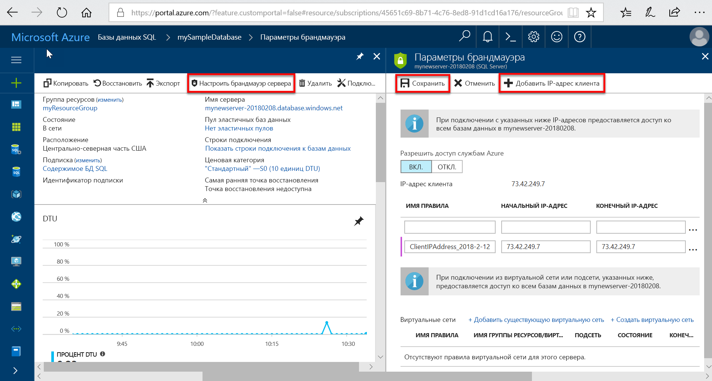

# Краткое руководство. Создание правила брандмауэра на уровне сервера для Базы данных SQL Azure с помощью портала Azure

В этом кратком руководстве описано создание на портале Azure правила брандмауэра на уровне сервера для Базы данных SQL Azure, чтобы получить возможность подключаться к ней с локального ресурса.

## Предварительные требования

В этом кратком руководстве в качестве начальной точки используются ресурсы, созданные в статье о [создании отдельной базы данных с помощью портала Azure](sql-database-single-database-get-started.md).

## Вход на портал Azure

Войдите на [портале Azure](https://portal.azure.com/).

## Создание правила брандмауэра IP-адресов на уровне сервера

Служба Базы данных SQL создает брандмауэр на уровне сервера базы данных для отдельных баз данных и тех, которые входят в состав пула. Если вы не создадите правило брандмауэра IP-адресов для открытия брандмауэра, этот брандмауэр не позволит клиентским приложениям подключиться к серверу или к любым отдельным базам данных или тем, которые входят в состав пула. Для подключения с IP-адреса за пределами Azure создайте правило брандмауэра для конкретного IP-адреса или диапазона адресов, к которым вы хотите подключаться. Дополнительные сведения о правилах брандмауэра IP-адресов на уровне сервера и базы данных см. в разделе статьи [Правила брандмауэра службы "База данных SQL Azure" и "Хранилище данных SQL"](sql-database-firewall-configure.md).

> [!NOTE]
> База данных SQL обменивается данными через порт 1433. Если вы пытаетесь подключиться из корпоративной сети, то сетевой брандмауэр может запретить исходящий трафик через порт 1433. В таком случае вы не сможете подключиться к серверу Базы данных SQL Azure, пока ваш ИТ-отдел не откроет порт 1433.
> [!IMPORTANT]
> Правило брандмауэра 0.0.0.0 позволяет всем службам Azure пропустить правило брандмауэра уровня сервера и пытаться подключиться к отдельной базе данных или базе данных в составе пула через сервер. Дополнительные сведения об использовании правил виртуальной сети см. в разделе [Правила виртуальной сети как альтернатива правилам фильтрации IP-адресов](sql-database-firewall-configure.md#virtual-network-rules-as-alternatives-to-ip-rules).

Выполните следующие действия, чтобы создать правило брандмауэра IP-адресов уровня сервера Базы данных SQL для IP-адреса вашего клиента и разрешить внешнее подключение через брандмауэр Базы данных SQL только с вашего IP-адреса.

1. По завершении развертывания [Предварительных требований к базе данных SQL Azure](#prerequisites) в меню слева щелкните раздел **Базы данных SQL**, а затем выберите **mySampleDatabase** на странице **Базы данных SQL**. После этого откроется страница обзора базы данных, где будет указано полное имя сервера (например, **mynewserver-20170824.database.windows.net**) и предоставлены параметры для дальнейшей настройки.

2. Скопируйте полное имя сервера, которое понадобится вам при роботе с последующими руководствами для подключения к серверу и связанным базам данных.

   

3. На панели инструментов щелкните **Настройка брандмауэра для сервера**. Для сервера базы данных откроется страница **Параметры брандмауэра**.

   

4. На панели инструментов выберите **Добавить IP-адрес клиента**, чтобы добавить текущий IP-адрес в новое правило брандмауэра IP-адресов на уровне сервера. С использованием правила брандмауэра IP-адресов на уровне сервера вы можете открыть порт 1433 для одного IP-адреса или диапазона IP-адресов.

   > [!IMPORTANT]
   > По умолчанию доступ через брандмауэр базы данных SQL включен для всех служб Azure. На этой странице щелкните **ВЫКЛ**, чтобы отключить доступ для всех служб Azure.
   >

5. Щелкните **Сохранить**. Для текущего IP-адреса будет создано правило брандмауэра IP-адресов на уровне сервера, с помощью которого можно открыть порт 1433 сервера Базы данных SQL.

6. Закройте страницу **Параметры брандмауэра**.

Теперь можно подключиться с этого IP-адреса к серверу Базы данных SQL и его базам данных с помощью SQL Server Management Studio или другого средства по своему усмотрению, используя учетную запись администратора сервера, созданную ранее.

## Очистка ресурсов

Сохраните эти ресурсы, если вы планируете перейти к [дальнейшим действиям](#next-steps) и узнать о различных методах подключения к базе данных и отправки запросов к ней. Если вы все-таки решите удалить ресурсы, созданные в этом кратком руководстве, выполните следующие действия.

1. На портале Azure в меню слева щелкните **Группы ресурсов**, а затем выберите **myResourceGroup**.
2. На странице группы ресурсов щелкните **Удалить**, в текстовом поле введите **myResourceGroup** и выберите **Удалить**.

## Дополнительная информация

- Теперь, когда у вас есть база данных, вы можете [подключиться и создать запрос](sql-database-connect-query.md), используя одно из привычных средств или языков, в том числе
  - [подключиться и создать запрос с помощью SQL Server Management Studio](sql-database-connect-query-ssms.md);
  - [подключиться и создать запрос с помощью Azure Data Studio](/sql/azure-data-studio/quickstart-sql-database?toc=/azure/sql-database/toc.json).
- Научитесь разрабатывать базы данных, создавать таблицы и вставлять данные при помощи одного из следующих руководств:
  - [Руководство. Разработка первой базы данных SQL Azure с использованием SSMS](sql-database-design-first-database.md)
  - [Руководство. Проектирование базы данных SQL Azure и подключение к ней с помощью C# и ADO.NET](sql-database-design-first-database-csharp.md)
