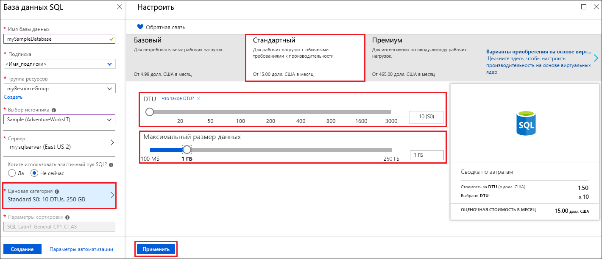
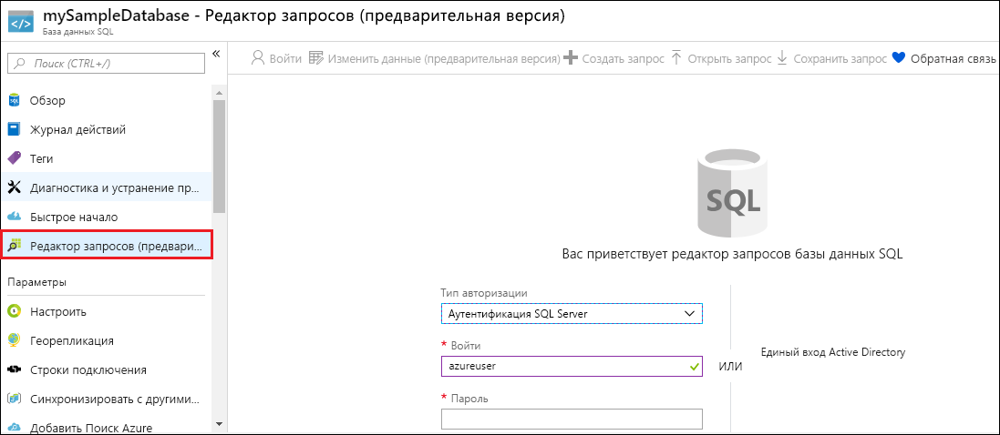
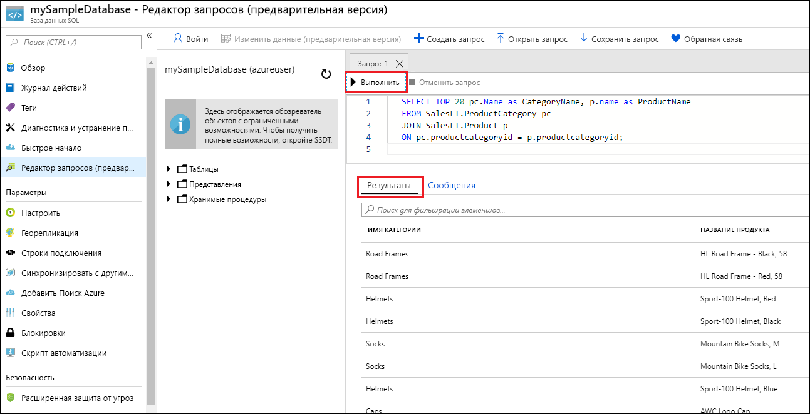

# <a name="quickstart-create-a-single-database-in-azure-sql-database-using-the-azure-portal"></a>Краткое руководство. Создание отдельной базы данных в Базе данных SQL с помощью портала Azure

Создание [отдельной базы данных](sql-database-single-database.md) — это самый быстрый и простой вариант развертывания для создания базы данных в Базе данных SQL Azure. В этом кратком руководстве описано, как создать отдельную базу данных и отправить к ней запросы с помощью портала Azure.

Если у вас еще нет подписки Azure, [создайте бесплатную учетную запись](https://azure.microsoft.com/free/).

Для выполнения всех шагов в этом кратком руководстве войдите на [портал Azure](https://portal.azure.com/).

## <a name="create-a-single-database"></a>Создание отдельной базы данных

Отдельная база данных имеет заданный набор ресурсов вычислений, памяти, операций ввода-вывода и хранения и доступна в [двух моделях приобретения](sql-database-purchase-models.md). При создании отдельной базы данных можете также определить [Сервер Базы данных SQL](sql-database-servers.md), чтобы управлять им и разместить его в [группе ресурсов Azure](../azure-resource-manager/resource-group-overview.md) в указанном регионе.

Чтобы создать базу данных, содержащую образец данных AdventureWorksLT, выполните следующие действия.

1. Щелкните **Создать ресурс** в верхнем левом углу окна портала Azure.
2. Выберите **Базы данных** и **База данных SQL**.
3. В форме **Создание Базы данных SQL** введите или выберите следующие значения:

   - **Имя базы данных**. Введите *mySampleDatabase*.
   - **Подписка**: Раскройте раскрывающийся список и выберите правильную подписку, если она не отобразится автоматически.
   - **Группа ресурсов.** Выберите **Создать**, введите *myResourceGroup* и щелкните **ОК**.
   - **Выберите источник**. Раскройте раскрывающийся список и выберите значение **Пример (AdventureWorksLT)**.

     > [!IMPORTANT]
     > Не забудьте выбрать данные **Пример (AdventureWorksLT)**, чтобы изучить это руководство и другие краткие руководства по Базе данных SQL Azure, в которых используются эти данные.
  
   

4. В разделе **Сервер** выберите **Создать**.
5. В форме **Новый сервер** введите или выберите следующие значения.

   - **Имя сервера**. Введите *mysqlserver*.
   - **Учетные данные администратора сервера для входа**. Введите *azureuser*.
   - **Пароль**. Введите *Azure1234567*.
   - **Подтверждение пароля**. Повторите ввод пароля.
   - **Расположение.** Раскройте раскрывающийся список и выберите любое действительное расположение.  

   > [!IMPORTANT]
   > Запомните или запишите имя входа и пароль администратора сервера, чтобы можно было войти на сервер и в базы данных для выполнения действий, описанных в этом и других кратких руководствах. Если вы забыли имя входа или пароль, получить имя входа или сбросить пароль можно на странице **сервера SQL server**. Чтобы открыть страницу **сервера SQL**, выберите имя сервера на странице **Обзор** для базы данных после создания базы данных.

    

6. Щелкните **Выбрать**.
7. В форме **База данных SQL** выберите **Ценовую категорию**. Изучите доступные ресурсы для каждого уровня служб (число DTU и объем хранилища).

   > [!NOTE]
   > В этом кратком руководстве используется [модель приобретения на основе DTU](sql-database-service-tiers-dtu.md). Также доступна [модель приобретения на основе числа виртуальных ядер](sql-database-service-tiers-vcore.md).
   > [!IMPORTANT]
   > В настоящее время на уровне Premium предоставляется более 1 ТБ хранилища, за исключением следующих регионов: Восточный Китай, Северный Китай, Центральная Германия, Северо-Восточная Германия, центрально-западная часть США, регионы US DoD и центральная часть для государственных организаций США. В этих регионах максимальный объем хранилища категории "Премиум" ограничен 1 ТБ.  Дополнительные сведения см. в разделе [о действующих ограничениях для P11-P15](sql-database-single-database-scale.md#dtu-based-purchasing-model-limitations-of-p11-and-p15-when-the-maximum-size-greater-than-1-tb).  

8. Для работы с этим кратким руководством укажите уровень служб **Стандартный**, а затем с помощью ползунка выберите **10 DTU (S0)** и **1** ГБ хранилища.
9. Нажмите кнопку **Применить**.  

   

10. В форме **База данных SQL** щелкните **Создать**, чтобы развернуть и подготовить группу ресурсов, сервер и базу данных.

    Развертывание займет несколько минут. Вы можете выбрать **Уведомления** на панели инструментов, чтобы отслеживать процесс развертывания.

    

## <a name="query-the-database"></a>Выполнение запросов к базе данных

Завершив создание базы данных, воспользуйтесь встроенным средством запросов на портале Azure, чтобы подключиться к этой базе данных и выполнить запрос данных.

1. На странице **База данных SQL** для этой базы данных найдите и выберите элемент **Редактор запросов (предварительная версия)** в меню слева.

   

2. Введите учетные данные и щелкните **ОК**.
3. Введите следующий запрос в области **Редактор запросов**.

   ```sql
   SELECT TOP 20 pc.Name as CategoryName, p.name as ProductName
   FROM SalesLT.ProductCategory pc
   JOIN SalesLT.Product p
   ON pc.productcategoryid = p.productcategoryid;
   ```

4. Щелкните **Выполнить** и просмотрите результаты запроса в области **Результаты**.

   

5. Закройте страницу **редактора запросов** и щелкните **ОК**, когда увидите запрос на отмену несохраненных изменений.

## <a name="clean-up-resources"></a>Очистка ресурсов

Сохраните эту группу ресурсов, сервер базы данных и отдельную базу данных, чтобы перейти к [дальнейшим действиям](#next-steps). Далее показано, как установить подключение и выполнить запрос к базе данных с помощью разных методов.

Когда вы завершите работу с этими ресурсами, удалите их следующим образом.

1. На портале Azure в меню слева щелкните **Группы ресурсов**, а затем выберите **myResourceGroup**.
2. На странице группы ресурсов щелкните **Удалить группу ресурсов**.
3. Введите *myResourceGroup* в поле и щелкните **Удалить**.

## <a name="next-steps"></a>Дополнительная информация

- Создайте правило брандмауэра на уровне сервера, чтобы подключиться к отдельной базе данных с помощью локальных или удаленных средств. Подробные сведения см. в разделе [Создание правила брандмауэра на уровне сервера](sql-database-server-level-firewall-rule.md).
- Создав правило брандмауэра на уровне сервера, вы сможете [устанавливать подключение и выполнять запросы к базе данных](sql-database-connect-query.md) с помощью разных средств и языков.
  - [подключиться и создать запрос с помощью SQL Server Management Studio](sql-database-connect-query-ssms.md);
  - [подключиться и создать запрос с помощью Azure Data Studio](https://docs.microsoft.com/sql/azure-data-studio/quickstart-sql-database?toc=/azure/sql-database/toc.json).
- Чтобы создать отдельную базу данных с помощью Azure CLI, ознакомьтесь с [примерами сценариев Azure CLI](sql-database-cli-samples.md).
- Чтобы создать отдельную базу данных с помощью Azure PowerShell, ознакомьтесь с [примерами сценариев Azure PowerShell](sql-database-powershell-samples.md).
