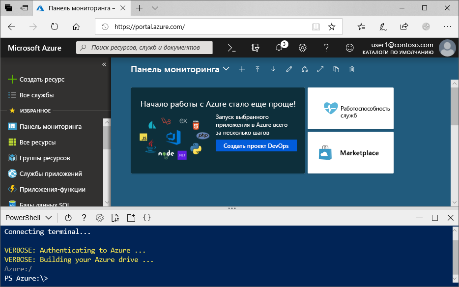
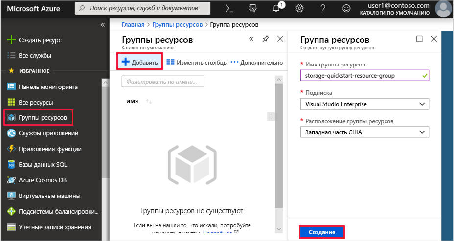
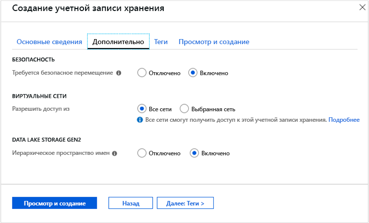

# <a name="quickstart-create-an-azure-data-lake-storage-gen2-storage-account"></a>Краткое руководство. Создание поддерживаемой учетной записи хранения Azure Data Lake Storage 2-го поколения

Azure Data Lake Storage 2-го поколения [поддерживает службу иерархических пространств имен](data-lake-storage-introduction.md), которая предоставляет собственную файловую систему на основе каталогов, предназначенную для работы с распределенной файловой системой Hadoop (HDFS). Доступ к данным Data Lake Storage Gen2 из распределенной файловой системы Hadoop доступен с помощью [драйвера ABFS](data-lake-storage-abfs-driver.md).

В этом кратком руководстве показано, как создать учетную запись с помощью [портала Azure](https://portal.azure.com/), [Azure PowerShell](https://docs.microsoft.com/powershell/azure/overview) или [Azure CLI](https://docs.microsoft.com/cli/azure?view=azure-cli-latest).

## <a name="prerequisites"></a>Предварительные требования

Если у вас еще нет подписки Azure, [создайте бесплатную учетную запись Azure](https://azure.microsoft.com/free/), прежде чем начинать работу. 

|           | Предварительные требования |
|-----------|--------------|
|Microsoft Azure     | Нет         |
|PowerShell | Для работы с этим кратким руководством требуется модуль PowerShell Az.Storage версии **0.7** или более поздней. Чтобы узнать, какая версия используется сейчас, выполните команду `Get-Module -ListAvailable Az.Storage`. Если после выполнения этой команды результаты не отображаются или появится версия, отличная от **0.7**, тогда вам нужно обновить модуль PowerShell. Дополнительные сведения см. в разделе [Обновление модуля PowerShell](#upgrade-your-powershell-module) этого руководства.
|Интерфейс командной строки        | Вы можете войти в Azure и выполнить команды Azure CLI одним из двух способов: <ul><li>Выполнить команды CLI на портале Azure в Azure Cloud Shell. </li><li>Установить CLI и выполнить команды CLI локально.</li></ul>|

При работе в командной строке можно запустить оболочку Azure Cloud или локально установить интерфейс командной строки.

### <a name="use-azure-cloud-shell"></a>Использование Azure Cloud Shell

Azure Cloud Shell — это бесплатная оболочка Bash, которую можно запускать непосредственно на портале Azure. Она включает предварительно установленный интерфейс Azure CLI и настроена для использования с вашей учетной записью. Нажмите кнопку меню **Cloud Shell** в правом верхнем углу окна портала Azure.

[](https://portal.azure.com)

Эта кнопка запускает интерактивную оболочку, с помощью которой можно выполнять действия, описанные в этом кратком руководстве:

[](https://portal.azure.com)

### <a name="install-the-cli-locally"></a>Установка CLI локально

Azure CLI также можно установить и применять локально. Для этого руководства требуется Azure CLI 2.0.38 или более поздней версии. Чтобы узнать версию, выполните команду `az --version`. Если вам необходимо выполнить установку или обновление, см. статью [Установка Azure CLI](/cli/azure/install-azure-cli).

## <a name="create-a-storage-account-with-azure-data-lake-storage-gen2-enabled"></a>Создание учетной записи хранения с поддержкой Azure Data Lake Storage 2-го поколения

Прежде чем создать учетную запись, сначала создайте группу ресурсов, которая будет исполнять роль логического контейнера для хранения учетных записей или других ресурсов Azure, которые вы создаете. Если нужно очистить ресурсы, созданные при работе с этим кратким руководством, можно просто удалить группу ресурсов. При этом удаляется связанная учетная запись хранения и другие ресурсы, связанные с этой группой ресурсов. Дополнительные сведения о группах ресурсов см. в статье [Обзор Azure Resource Manager](../../azure-resource-manager/resource-group-overview.md).

> [!NOTE]
> Чтобы воспользоваться преимуществами функций Data Lake Storage Gen2, необходимо создать новые учетные записи хранения типа **StorageV2 (общего назначения V2)**.  

Дополнительные сведения об учетных записях хранения см. в статье [Общие сведения об учетной записи хранения](../common/storage-account-overview.md).

Помните о следующих правилах при назначении имени учетной записи хранения.

- Имя учетной записи хранения должно содержать от 3 до 24 символов и состоять только из цифр и строчных букв.
- Имя учетной записи хранения должно быть уникальным в Azure. Две учетные записи хранения не могут иметь одно имя.

## <a name="create-an-account-using-the-azure-portal"></a>Создание учетной записи с использованием портала Azure

Войдите на [портал Azure](https://portal.azure.com).

### <a name="create-a-resource-group"></a>Создание группы ресурсов

Чтобы создать группу ресурсов на портале Azure, сделайте следующее:

1. На портале Azure разверните меню слева, чтобы открыть меню служб, и выберите **Resource Groups** (Группы ресурсов).
2. Нажмите кнопку **Add** (Добавить), чтобы добавить новую группу ресурсов.
3. Введите имя для группы ресурсов.
4. Выберите подписку, в которой нужно создать группу ресурсов.
5. Выберите расположение группы ресурсов.
6. Нажмите кнопку **Создать** .  

   

### <a name="create-a-general-purpose-v2-storage-account"></a>Создание учетной записи хранения общего назначения v2

Чтобы создать учетную запись хранения общего назначения версии 2 на портале Azure, сделайте следующее:

> [!NOTE]
> Иерархическое пространство имен сейчас доступно во всех общедоступных регионах. В настоящее время оно недоступно в национальных облаках.

1. На портале Azure разверните меню слева, чтобы открыть меню служб, и выберите **Все службы**. Прокрутите вниз до пункта **Хранилище** и выберите **Учетные записи хранения**. В появившемся окне **Учетные записи хранения** выберите **добавить**.
2. Выберите **подписку** и **группу ресурсов**, созданные ранее.
3. Выберите имя для своей учетной записи хранения.
4. Задайте параметру **Расположение** значение **Западный регион США 2**.
5. Оставьте значения по умолчанию в следующих полях: **Производительность**, **Тип учетной записи**, **Репликация**, **Уровень доступа**.
6. Выберите подписку, в которой нужно создать учетную запись хранения.
7. Выберите **Далее: Дополнительно >**.
8. Оставьте значения по умолчанию в полях **Безопасность** и **Виртуальные сети**.
9. В разделе **Data Lake Storage Gen2 (предварительная версия)** установите **иерархическому пространству имен** параметр **Включить**.
10. Щелкните **Review + Create** (Просмотр и создание), чтобы создать учетную запись хранения.

    

Теперь учетная запись хранилища создана с помощью портала.

### <a name="clean-up-resources"></a>Очистка ресурсов

Чтобы удалить группу ресурсов с помощью портала Azure, сделайте следующее:

1. На портале Azure разверните меню слева, чтобы открыть меню служб, и выберите **Resource Groups** (Группы ресурсов), чтобы просмотреть список групп ресурсов.
2. Найдите группу ресурсов, которую нужно удалить, и щелкните правой кнопкой мыши кнопку **More** (Дополнительно) (**...**) справа от списка.
3. Выберите **Удалить группу ресурсов** и подтвердите выбор.

## <a name="create-an-account-using-powershell"></a>Создание учетной записи с помощью PowerShell

Сначала установите последнюю версию модуля [PowerShellGet](https://docs.microsoft.com/powershell/gallery/installing-psget).

Затем обновите модуль PowerShell, войдите в подписку Azure, создайте группу ресурсов, а затем — учетную запись хранения.

### <a name="upgrade-your-powershell-module"></a>Обновление модуля powershell

[!INCLUDE [updated-for-az](../../../includes/updated-for-az.md)]

Для взаимодействия с Data Lake Storage 2-го поколения с помощью PowerShell вам требуется установить модуль Az.Storage версии **0.7** или более поздней.

Сначала откройте сеанс PowerShell с повышенными разрешениями.

Установка модуля Az.Storage

```powershell
Install-Module Az.Storage -Repository PSGallery -RequiredVersion 0.7.0 -AllowPrerelease -AllowClobber -Force
```

> [!NOTE]
> Модули Azure PowerShell Az — это предпочтительные модули для работы со службами Azure в PowerShell. Дополнительные сведения см. в статье [Знакомство с новым модулем Az для Azure PowerShell](https://docs.microsoft.com/powershell/azure/new-azureps-module-az).

### <a name="log-in-to-your-azure-subscription"></a>Вход в подписку Azure

Чтобы выполнить проверку подлинности, используйте команду `Login-AzAccount` и следуйте инструкциям на экране.

```powershell
Login-AzAccount
```

### <a name="create-a-resource-group"></a>Создание группы ресурсов

Чтобы создать группу ресурсов с помощью PowerShell, выполните команду [New-AzResourceGroup](/powershell/module/az.resources/new-azresourcegroup). 

> [!NOTE]
> Иерархическое пространство имен сейчас доступно во всех общедоступных регионах. В настоящее время оно недоступно в национальных облаках.

```powershell
# put resource group in a variable so you can use the same group name going forward,
# without hardcoding it repeatedly
$resourceGroup = "storage-quickstart-resource-group"
$location = "westus2"
New-AzResourceGroup -Name $resourceGroup -Location $location
```

### <a name="create-a-general-purpose-v2-storage-account"></a>Создание учетной записи хранения общего назначения v2

Чтобы создать учетную запись хранения общего назначения версии 2 с локально избыточным хранилищем (LRS) с помощью PowerShell, используйте команду [New-AzStorageAccount](/powershell/module/az.storage/New-azStorageAccount).

```powershell
$location = "westus2"

New-AzStorageAccount -ResourceGroupName $resourceGroup `
  -Name "storagequickstart" `
  -Location $location `
  -SkuName Standard_LRS `
  -Kind StorageV2 `
  -EnableHierarchicalNamespace $True
```

### <a name="clean-up-resources"></a>Очистка ресурсов

Чтобы удалить группу ресурсов и связанные с ней ресурсы, включая новую учетную запись хранения, используйте команду [Remove-AzResourceGroup](/powershell/module/az.resources/remove-azresourcegroup): 

```powershell
Remove-AzResourceGroup -Name $resourceGroup
```

## <a name="create-an-account-using-azure-cli"></a>Создание учетной записи с помощью Azure CLI

Чтобы запустить Azure Cloud Shell, войдите на [портал Azure](https://portal.azure.com).

Если вы хотите войти в локальную установку CLI, выполните команду входа:

```cli
az login
```

### <a name="add-the-cli-extension-for-azure-data-lake-gen-2"></a>Добавление расширения CLI для Azure Data Lake 2-го поколения

Чтобы взаимодействовать с Data Lake Storage 2-го поколения через CLI, добавьте расширение в оболочку.

Для этого с помощью Cloud Shell или локальный оболочки введите следующую команду: `az extension add --name storage-preview`

### <a name="create-a-resource-group"></a>Создание группы ресурсов

Чтобы создать группу ресурсов с помощью Azure CLI, используйте команду [az group create](/cli/azure/group#az_group_create).

```azurecli-interactive
az group create `
    --name storage-quickstart-resource-group `
    --location westus2
```

> [!NOTE]
> > Иерархическое пространство имен сейчас доступно во всех общедоступных регионах. В настоящее время оно недоступно в национальных облаках.

### <a name="create-a-general-purpose-v2-storage-account"></a>Создание учетной записи хранения общего назначения v2

Чтобы создать учетную запись хранения общего назначения версии 2 с локально избыточным хранилищем с помощью Azure CLI, примените команду [az storage account create](/cli/azure/storage/account#az_storage_account_create).

```azurecli-interactive
az storage account create `
    --name storagequickstart `
    --resource-group storage-quickstart-resource-group `
    --location westus2 `
    --sku Standard_LRS `
    --kind StorageV2 `
    --hierarchical-namespace true
```

### <a name="clean-up-resources"></a>Очистка ресурсов

Чтобы удалить группу ресурсов и связанные с ней ресурсы, включая новую учетную запись хранения, используйте команду [az group delete](/cli/azure/group#az_group_delete).

```azurecli-interactive
az group delete --name myResourceGroup
```

## <a name="next-steps"></a>Дополнительная информация

В этом кратком руководстве вы создали учетную запись хранения с поддержкой Data Lake Storage 2-го поколения. Сведения об отправке и скачивании больших двоичных объектов в учетную запись хранения и из нее см. в следующей статье.

* [Передача данных с помощью AzCopy версии 10 (предварительная версия)](https://docs.microsoft.com/azure/storage/common/storage-use-azcopy-v10?toc=%2fazure%2fstorage%2fblobs%2ftoc.json)
